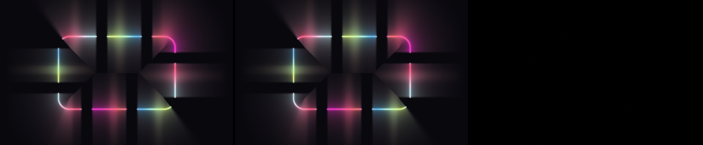
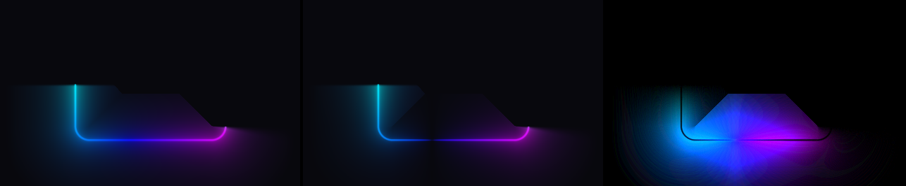
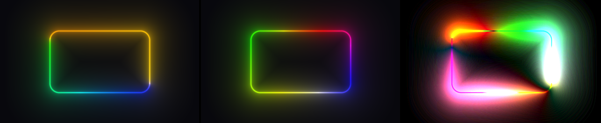
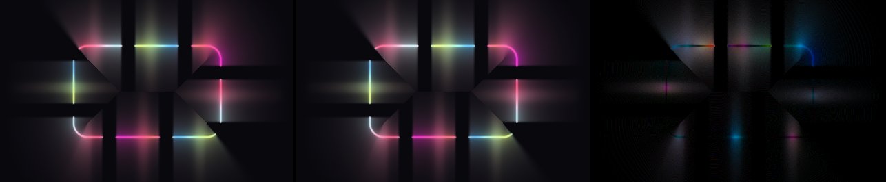

# `improve_perf_by_emission_prepass` vs `main`: visual and performance comparison

What a host actually sees if this branch is merged, measured frame-by-frame
against `main`.

Its sibling [`emission-prepass-comparison.md`](emission-prepass-comparison.md)
deliberately isolates the pre-pass commit from its immediate parent, so it
excludes the colour-stop alpha and stop-sorting work. This document is the
other half: the **whole** branch against `main`, which is the diff a merge
actually lands.

## 1. What is being compared

| side | commit | |
| ---- | ------ | - |
| `main` | `64d530a` | "Merge pull request #44 from kudo1902/improve_droplets_v2" |
| branch | `a2264af` | `improve_perf_by_emission_prepass`, with `main` already merged in |

Six non-merge commits separate them, and they fall into three groups. The
groups matter, because two of them change the picture and one does not:

| group | commits | changes pixels? |
| ----- | ------- | --------------- |
| **Colour-stop alpha** as an emission scale | `ec9fc87` | **yes** |
| **Colour-stop sorting** at bake time | `9d9d090` | **yes** |
| **Emission pre-pass** + pass refactor + docs | `0034532`, `ee3b5c2`, `d4e75f4`, `52411e0` | no (±1 LSB) |

Everything else the branch touches - `docs/`, `CLAUDE.md`, `README.md`, the
`Framebuffer` format parameters, the `BaseRenderer` viewport contract - is
either documentation or an API widening with no default-path behaviour change.

## 2. Method

Both sides were built from the same tree layout in separate git worktrees, with
an identical harness injected into `demo/src/main.cpp`. The harness:

- builds each scene from one shared `BaseConfig` - 640x400 rect at
  `cornerRadius 60`, centred in a 1280x800 framebuffer, only the neon layer
  enabled, wireframe / droplets / lens-flare off;
- **pauses the clock and sets it to an explicit time**, so `uTime` is identical
  on both sides rather than following wall-clock;
- renders through `OffscreenCapture` at an explicit size, never the window
  backbuffer, so the dump is DPI- and platform-independent
  (see [`capture-util.h`](../lib/include/util/capture-util.h));
- for the timings, renders into the same offscreen target with `glFinish`
  inside the timed region, so the number is GPU time and not command
  submission.

Frame dumps are RGB PNGs compared byte-for-byte. Timings are the mean of 210
frames after a 30-frame warmup, at 1920x1080. The timing pass was run twice per
side; the runs agree to within 4%.

The harness is scaffolding and is not in the tree - it lived only in the two
throwaway worktrees.

## 3. Visual comparison

Nine scenes, plus four controls in section 3.4. In every image below the panels
are **left: `main`, middle: branch, right: |difference| amplified 8x**. A black
right-hand panel means the two sides agree.

| # | scene | differing pixels | % of frame | max channel delta | mean delta |
| - | ----- | ---------------- | ---------- | ----------------- | ---------- |
| 01 | 1 full arc, default stops | 9,200 | 0.90% | **1** | 0.003 |
| 02 | partial arc + 1 segment with own stops | 3,389 | 0.33% | **1** | 0.001 |
| 03 | 8 arcs + 8 segments | 5,074 | 0.50% | **1** | 0.002 |
| 04 | base stops with **alpha** 1/0/1/0 | 899,828 | 87.87% | **232** | 8.68 |
| 05 | 4 base stops authored **out of order** | 942,677 | 92.06% | **229** | 11.23 |
| 06 | arc with own stops, middle stop **alpha 0** | 408,272 | 39.87% | **197** | 3.33 |
| 07 | hue rotation, clock frozen at t = 1.3s | 9,559 | 0.93% | **1** | 0.003 |
| 08 | half-res: partial arc + 1 segment | 3,508 | 0.34% | **1** | 0.001 |
| 09 | half-res: 8 arcs + 8 segments | 5,059 | 0.49% | **1** | 0.002 |

Read the table as two blocks. Scenes 01-03 and 07-09 are the **pre-pass** on
its own: max delta 1, on under 1% of pixels. Scenes 04-06 are the **alpha and
sorting** commits, and they are meant to differ.

### 3.1 Scenes that are meant to be identical (01, 02, 03, 07, 08, 09)

*Scene 03 - the heaviest gather on either side. The difference panel is black.*

A single LSB on a fraction of a percent of pixels, from two benign sources:

- the emission table stores the per-sample terms as `RGBA16F` rather than
  keeping them in full-precision registers;
- the sample's perimeter position is now `floor(gl_FragCoord.x) * invN` instead
  of an accumulated `si += dti` chain across 128 iterations. The direct form is
  the *more* accurate of the two.

Scene 07 confirms the same holds once `uTime` is in play, and 08/09 confirm it
for the half-res `NeonOptimizedRenderer`, which carries its own fork of the
shader and the pre-pass.

The other five panels in this group, same layout, all with a black difference
column:
[01](images/branch-vs-main/01-full-arc.png) -
[02](images/branch-vs-main/02-partial-arc-segment.png) -
[07](images/branch-vs-main/07-hue-rotation.png) -
[08](images/branch-vs-main/08-halfres-partial-arc-segment.png) -
[09](images/branch-vs-main/09-halfres-eight-arcs-eight-segments.png).

### 3.2 Colour-stop alpha now attenuates the emission (scenes 04, 06)

*Scene 04 - stops at 0.00/0.25/0.50/0.75 with alpha 1/0/1/0.*

On `main` the LUT bake drops the alpha channel: `SampleRing` returns a
`glm::vec3` and the whole ring renders at full brightness. On the branch alpha
is baked into the LUT and multiplied into the emission **magnitude**, so it
attenuates filament, halo and bloom together - the ring goes dark at the
alpha-0 stops and the background shows through instead of being occluded by a
black tube.

*Scene 06 - one arc, its own three stops, the middle one at alpha 0. On the
branch the arc splits into two lit ends with a genuinely dark centre.*

This is a **behaviour change, not a bug fix that is invisible**: any host that
was passing alpha < 1 in a colour stop and relying on it being ignored will
see its ring dim after the merge. `ColorStop::color.a` is documented on the
branch as an emission scale with a default of 1, so a host that never touched
alpha is unaffected.

### 3.3 Out-of-order stops now render correctly (scene 05)

*Scene 05 - four stops authored in the order 0.75, 0.00, 0.50, 0.25.*

`SampleRing` walks the ring assuming ascending positions. `main` trusts the
caller and renders a silently wrong gradient - here it never reaches two of the
four colours and reads as a yellow-green ring. The branch runs the stops
through `SortStops` once per LUT bake, and the same four stops render as the
intended four-colour ring.

Nothing in `NeonConfig` enforces ordering, the debug UI lets a stop be dragged
past its neighbour, and a `ColorStopField::POSITION` animation can drive two
stops through each other mid-playback, so this is reachable without the host
doing anything unusual. A host that had hand-sorted its stops sees no change.

### 3.4 Isolating the two causes

Scenes 04-06 each change one input away from the `main` default. Re-running
them with that one input neutralised - and nothing else touched - shows each
difference has exactly one cause:

| # | control scene | differing pixels | max channel delta |
| - | ------------- | ---------------- | ----------------- |
| 10 | scene 04's stop positions, every alpha forced to **1** | 0.43% | **1** |
| 11 | scene 05's exact stops, authored **ascending** | 0.31% | **1** |
| 12 | scene 06 with the middle stop's alpha raised to **1** | 0.10% | **1** |
| 13 | unsorted stops **and** a segment with unsorted own stops, every alpha 1 | 85.60% | **227** |

Rows 10 and 12 collapse to the ±1 LSB of the pre-pass, so **alpha is the sole
cause** of scenes 04 and 06. Row 11 does the same for scene 05, so **ordering
is the sole cause** there.

Row 13 is the one to read carefully: every alpha is 1 and the frame still
differs on 86% of pixels. **Neutralising alpha alone is not enough** - the two
changes are independent, and a host has to satisfy both conditions (alpha = 1
everywhere *and* stops authored in ascending order, including per-segment and
per-arc stops) before the branch is a visual no-op.

This matches the shader diff, which contains exactly two functional changes and
nothing else: the gather body replaced by two `texelFetch`es, and `baseAlphaPt`
/ `aA` / `sA` multiplied into `emitCover` and `segCoverPt`. Everything from the
one-sided cut down through the tone map and the premultiplied output is
byte-identical between the two sides. Sorting is a CPU-side change confined to
the LUT bakes.

> The frames' own **alpha channel** matches on every scene, but that is not
> evidence of anything: the harness clears the backdrop to alpha 1 and the neon
> composites with `GL_ONE, GL_ONE_MINUS_SRC_ALPHA`, so the destination alpha
> resolves to 1 whatever the source alpha was. Stop alpha *does* reach the
> shader's output alpha (`alpha = peak(result)`), so a host compositing the
> effect over a transparent target will see that change too.

### 3.5 The one case where "no alpha, sorted stops" still differs

Everything above ran with the emission table in `RGBA16F`, which this machine
supports. Where the driver refuses float colour-renderability the renderers
fall back to `RGBA8` - and that is a real path for the project's stated edge
targets, since GLES 3.0 only exposes float colour buffers through
`EXT_color_buffer_half_float` / `EXT_color_buffer_float`.

Forcing that path (emission target allocated `RGBA8`, everything else
untouched) and re-running the *already-agreeing* scenes against `main`:

| # | scene | peak `intensity` / `boost` | differing bytes | max channel delta |
| - | ----- | -------------------------- | --------------- | ----------------- |
| 01 | 1 full arc | 1.0 / - | 0.09% | **1** |
| 11 | 4 sorted stops | 1.0 / - | 0.09% | **1** |
| 10 | 4 stops, alpha 1 | 1.0 / - | 1.66% | **1** |
| 07 | hue rotation | 1.0 / - | 2.74% | **2** |
| 12 | arc with own stops | **1.2** / - | 18.99% | **31** |
| 02 | partial arc + 1 segment | 1.0 / **2.5** | 4.33% | **82** |
| 03 | 8 arcs + 8 segments | **1.3** / **1.5** | 46.21% | **24** |
| 08 | half-res, partial arc + segment | 1.0 / **2.5** | 4.37% | **77** |
| 09 | half-res, 8 arcs + 8 segments | **1.3** / **1.5** | 46.98% | **32** |

*Scene 03 with the emission table forced to `RGBA8` - left `main`, middle
branch, right |difference| x8. Compare with the black difference panel in 3.1.*

The split is exactly where the format predicts. Row 0 of the table holds
`baseColI * arcW` with `arcW = mask * Arc::intensity`, and row 1 holds
`SUM(segColour * bell)` with `bell` peaking at `SegmentBoost::boost` - both
exceed 1.0 in ordinary use and an 8-bit target clamps them. Every scene whose
peak intensity and boost are both <= 1.0 stays within 1-2 LSB; every scene that
goes above 1.0 diverges visibly.

Diffing branch-`RGBA16F` against branch-`RGBA8` directly gives 4.43% / max 82
and 46.26% / max 24 for scenes 02 and 03 - within noise of the numbers above,
confirming the storage format is the whole cause and not something in the
gather.

So the honest statement of the equivalence is: with alpha = 1 everywhere and
stops in ascending order, the branch matches `main` to within 1 LSB **provided
the emission table gets `RGBA16F`**. On the `RGBA8` fallback the match holds
only while `Arc::intensity <= 1` and `SegmentBoost::boost <= 1`.

## 4. Performance

1920x1080 framebuffer, 960x540 rect, mean of 210 frames after 30 warmup
frames, `glFinish` inside the timed region.

| case | `main` | branch | speed-up |
| ---- | ------ | ------ | -------- |
| full-res, 1 arc | 10.19 ms | **3.35 ms** | 3.0x |
| full-res, 1 arc + 1 segment | 13.75 ms | **3.36 ms** | 4.1x |
| full-res, 8 arcs + 8 segments | 60.51 ms | **3.73 ms** | **16.2x** |
| half-res, 1 arc + 1 segment | 1.60 ms | **0.59 ms** | 2.7x |
| half-res, 8 arcs + 8 segments | 6.79 ms | **0.69 ms** | 9.8x |

The shape of the win matters more than any single row. On `main` the cost rises
with scene complexity - 10.2 ms to 60.5 ms, a 5.9x spread - because the gather
loop re-ran the arc winner-take-all over `uArcCount` and the segment loop over
`uSegmentCount` **inside every screen fragment**, for all 128 samples. On the
branch the same span is 3.35 ms to 3.73 ms, a **1.1x spread**: per-fragment
cost has stopped scaling with the number of arcs and segments.

That is the whole point of the pre-pass. The per-sample work is a pure function
of `(si, uTime, config)`, so it is baked once per frame into a
`NEON_MAX_LOOP_SAMPLES x 2` table and the gather reads it with two
`texelFetch`es. See [`emission-prepass.md`](emission-prepass.md) for the packing
and the invariant that keeps the split honest.

Practical reading: on `main`, 8 arcs + 8 segments at 1080p cannot hold 60 fps on
this machine (60.5 ms is ~16 fps) even at half resolution plus a full-res
composite (6.8 ms is fine, but the full-res path is not). On the branch the same
scene costs 3.7 ms full-res.

### Memory

The branch adds one `NEON_MAX_LOOP_SAMPLES x 2` `RGBA16F` render target per
neon renderer: 128 x 2 x 8 bytes = **2 KB**, plus its FBO object. With both
neon renderers registered that is 4 KB. Nothing else in the branch allocates.

## 5. What did not change

- **The two neon renderers still agree with each other.** Rendering the same
  scene through `NeonRenderer` and through `NeonOptimizedRenderer` at
  `resolutionScale 1.0` / 128 samples differs by max delta 1 - one LSB from the
  blit, nothing structural. The half-res fork carries the pre-pass correctly.
- **No API or ABI break.** `Config` is source-compatible between the two sides:
  the only `config.h` change on the branch is documentation plus a reworded
  comment on `ColorStop::color`. The identical harness compiled unmodified
  against both.
- **The C ABI surface is unchanged**, so an existing P-Invoke / ctypes host
  keeps working. It does not gain accessors for anything either.

## 6. Caveats

- Every number here is from one macOS arm64 machine. The *ratios* should hold
  anywhere the old shader was ALU-bound, which is the case that motivated the
  change, but absolute milliseconds will not transfer.
- The emission target asks for `RGBA16F` and falls back to `RGBA8` where the
  driver refuses float colour-renderability. This machine got `RGBA16F`;
  section 3.5 forces the fallback and measures it separately.
- Scenes 04-06 are constructed to isolate the alpha and sorting commits. A host
  that never sets stop alpha below 1 and always authors stops in ascending
  order sees only the ±1 LSB of scenes 01-03.
- Two pre-existing rendering artefacts are visible in several of these frames -
  the hard-edged silhouette where a partial arc's glow ends, and the
  medial-axis creases inside the rect. Both are on `main` as well as the
  branch, which is why they do not show up in the difference panels. They are
  not part of this comparison.
