# The per-piece glow coverage: before and after

What changed when the neon glow stopped taking its brightness from one
coverage for the whole ring, and when the filament stopped taking its colour
from the gathered hue. The defects are V15 to V22 in
[`review-findings.md`](review-findings.md), which records their mechanisms,
the fixes, the ground-truth measurements and the timings. V22 came last: each
piece's glow now runs over the stretch of it the arcs light, so an arc's two
ends look alike wherever they fall. This document shows
what that looks like in 15 captured scenes and two time strips, then in every
neon animation preset the demo ships, run on the demo's own startup scene
(section 6).

**Result: the three defects V14 introduced are gone.** An alpha-0 stretch now
goes dark instead of keeping its halo and bloom. Unlit edges no longer glow in
their own outline. Moving lights no longer flicker as they cross gather
samples. Thin shapes and low sample counts no longer corrupt the filament's
colour. **A fully lit ring changes in exactly one way, and only on the line:**
the filament shows the ring's own colour at full saturation instead of a blur
of it. That touches 1 to 3% of pixels in every scene, all within the filament
band. The glow of a fully lit ring is unchanged, and V20's tone-map streaks are
deliberately still there. The same holds across the demo's 17 neon presets: the
ten on a fully lit ring change only on the line, and the seven that move a
segment or draw a partial arc change in the ways the isolated scenes show.

## 1. What is being compared

| side | tree | |
| ---- | ---- | - |
| before | `99b3b89` | `main`: "Merge pull request #58 from kudo1902/add_clipping_area_for_spotlight" |
| after | `fix/neon-glow-coverage` | per-piece glow coverage over each piece's lit extent, cell-mean emission weights with alpha, pointwise filament colour, symmetric arc-seam slack |

## 2. Method

A standalone harness. It is scaffolding and is not checked in: it lived in a
scratch directory and linked the built static library directly, once against
each tree. The "before" library came from a detached worktree of `main`, so the
branch's working tree was never stashed or rebuilt for it:

```bash
git worktree add --detach ../base 99b3b89
cmake -S ../base -B ../base/build -G Ninja
cmake --build ../base/build --target edge-lighting glad
# the same render.cpp, compiled twice with -DTAG="base" / -DTAG="fix",
# each against its own tree's build/lib/libedge-lighting.a and build/lib/generated
```

Every case starts from the harness at the top of `review-findings.md`: a
600x400 rect at (200, 200), `cornerRadius` 40, CCW, the neon layer alone,
`colorTransitionDuration` 0 and `hueRotationRate` 0 so a single frame is final
and deterministic. Each case changes what its subtitle says. Captures are
1000x800 unless the rect needs more room (1400x900 for the 1200 px rects,
1920x1080 for V14's scene), drawn through `OffscreenCapture` over transparent
black.

Each sheet reads left to right as **before / after / difference x8**. The
difference is the largest per-channel change at each pixel, times 8 and
clamped, so one level of change is visibly grey and 32 levels is white. The
top row is the whole frame, scaled down; the yellow box marks the region the
bottom row shows magnified, nearest-neighbour, so one block is one pixel. The
last line gives the change over the whole frame and over the box.

The two time strips are built differently: the light is moved 1/8 of a gather
sample spacing per frame for 64 frames, and one row of pixels a few px outside
the lit edge is taken from each frame and stacked, time running down. A
renderer that is steady in time draws a clean diagonal track. One that flickers
draws bands or dots.

The images and numbers here are from Release builds of both trees at the
branch's final state. An earlier round used the branch's Debug build, and all
17 captures re-rendered in Release came out byte-identical to it, so the
CPU-side bakes do not differ between the two. Section 6 has its own method.

## 3. Overview

Every single-frame case, before (red frame) and after (green frame):

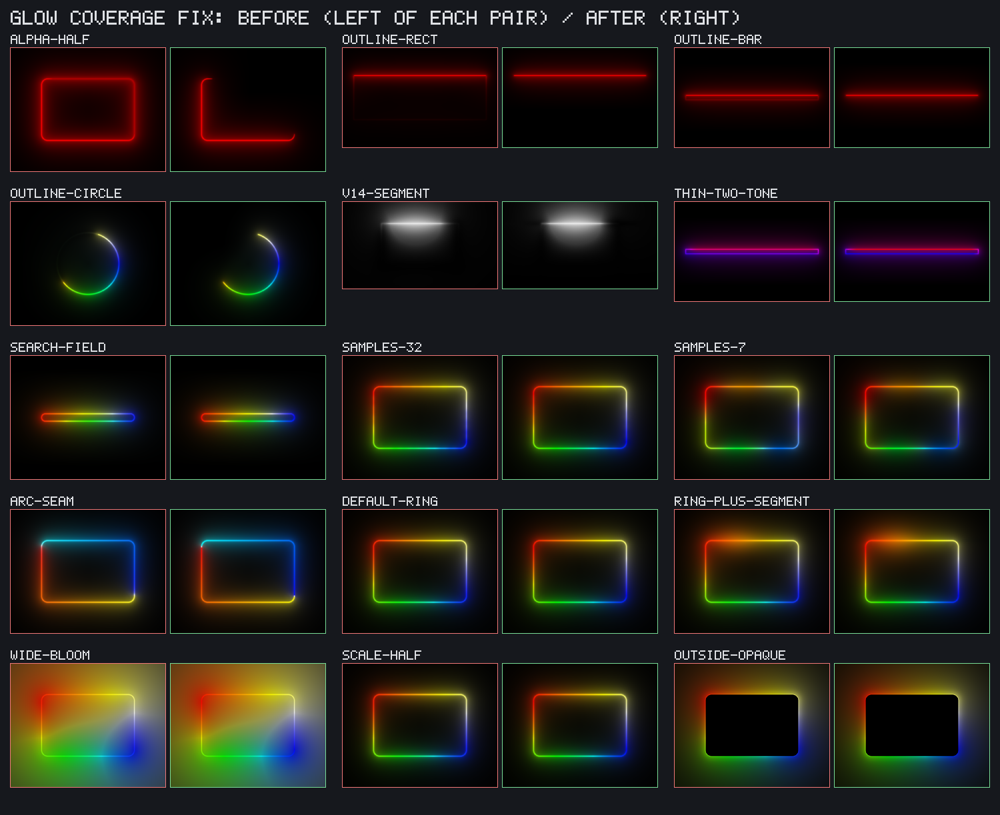

## 4. The defects

### 4.1 Colour-stop alpha (V15)

The right and top edges are authored at alpha 0. The contract in `config.h`
and `effect-reference.md` is that alpha attenuates "the filament, halo and
bloom together". Before, only the filament core went; the halo and bloom over
the transparent half were identical to the opaque half's from 12 px out.

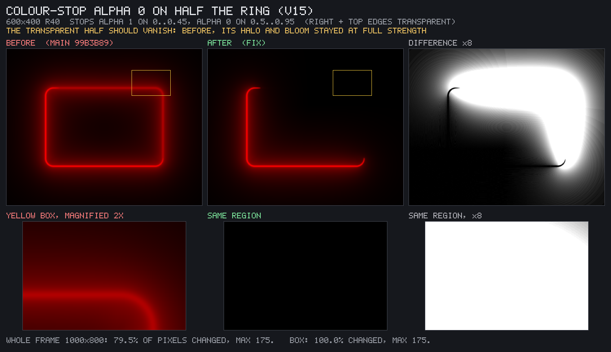

### 4.2 Unlit edges glowing in their own outline (V16)

One arc lights only the top edge. Before, every unlit edge carried a ridge of
light exactly on its own line - a faint outline of the whole tube. It grows
with the rect's aspect ratio: +6 to +9 levels on 600x400, up to +20 on
1200x400, +44 on a 1200x40 bar.

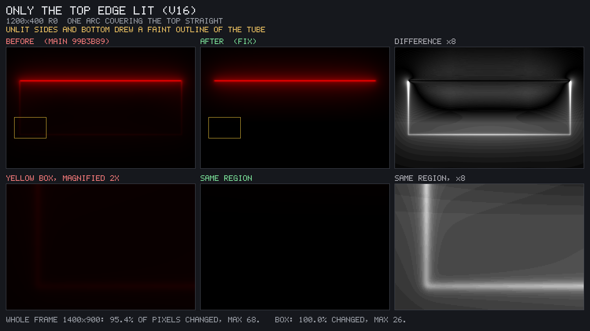

On the thin bar the ring-wide mean also diluted the lit edge by the dark one
across from it, which the ridge partly hid. After, at the same distance from
the lit line, the glow reads 75 above it and 74 on the unlit bottom edge 39 px
below; before it was 73 and 117.

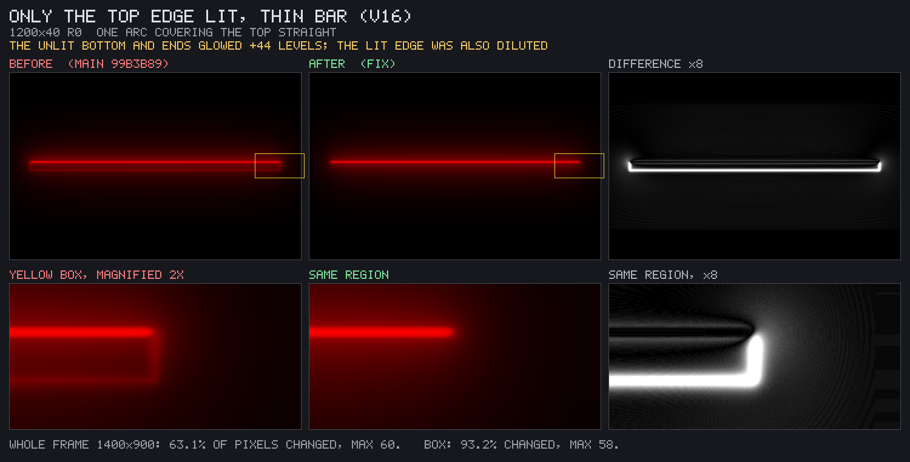

The same on a circle, where the unlit part of the ring drew a ghost arc. Both
of this arc's ends fall inside corner pieces, and both now close with the same
cap (V22) where the glow used to run on round the circle past them:

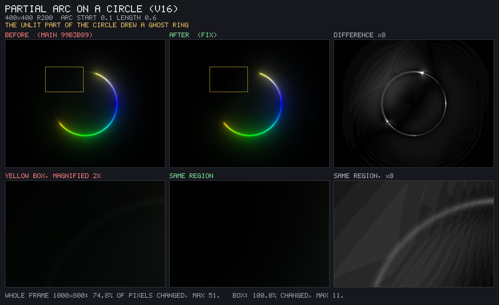

V14's own scene - the report that introduced the ring-wide mean. Before, the
whole rect outline glowed faintly (the two vertical streaks in the difference
panel are the sides losing it). Otherwise the glow keeps V14's look on
purpose: a dome that feathers off past the segment's ends and goes dark at a
distance, now with a crisper line end. A first version of this fix did not -
it filled the frame with a grey haze and trailed glow along the edge to the
corner - and was changed on review; the candidates and the one thing the
chosen look costs (a faint streak, 2 to 7 levels, beside the unlit stretch
just past a segment's end) are under "The segments' feathering" in
`review-findings.md`.

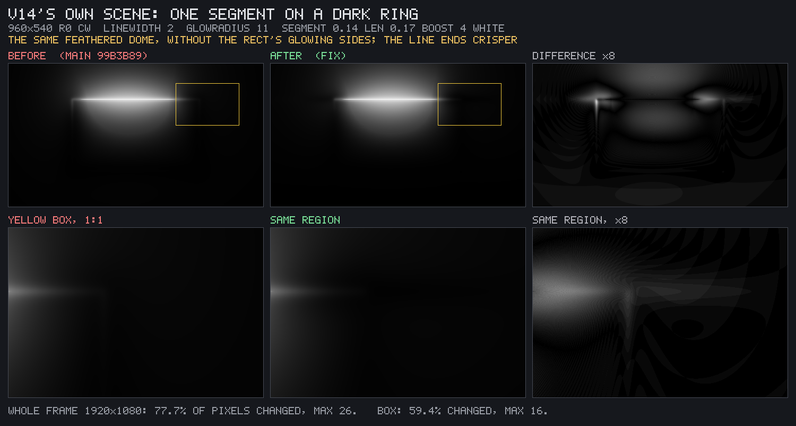

A tracer on a lit ring, the most common animated configuration. The ring's own
glow is unchanged. The segment's glow now stays near the segment: up to 10
levels brighter near it and a few levels dimmer far from it. Before, it
lit every piece's field at the ring-wide mean. No crease: the largest
adjacent-pixel step more than 12 px off the line is 4 levels in both builds.

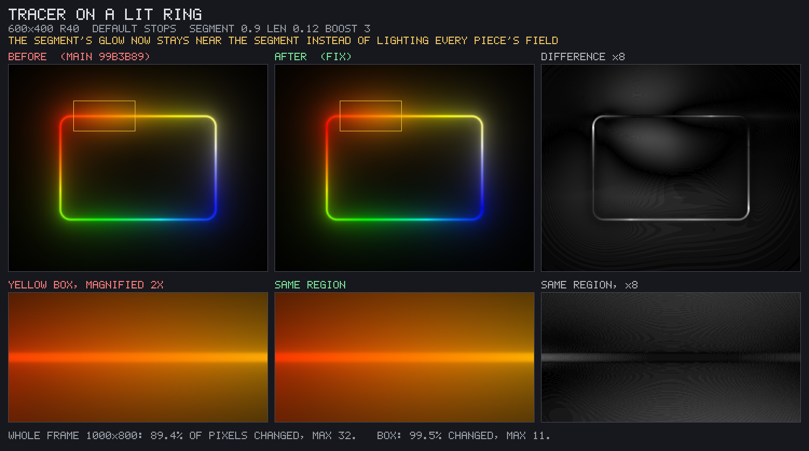

### 4.3 Moving lights flickering (V17)

A 200 px arc rotating, sampled 12 px outside the top edge. Before, the glow at
the arc's TAIL stepped every time the tail crossed a gather sample - the stair
steps down the right-hand edge of the band - by up to 21 levels. After, the
edge is a straight diagonal, and both edges are sharper, since the glow now
ends where the arc does (V22). At 0.5 rev/s a spinner crosses 64 samples a
second, so this was a 64 Hz shimmer.

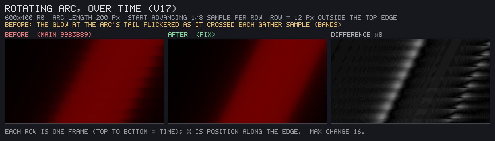

A 10 px segment on a dark ring, 10 px outside. Before, its glow was only
visible when the segment sat on a gather sample - a dotted track, swinging
between 6 and 86. After, it is a continuous line with a residual 2-level
ripple. The glow is dimmer than the brightest "before" dots, and that is
correct - a 10 px light emits less than the 300 px one the old pointwise read
treated it as.

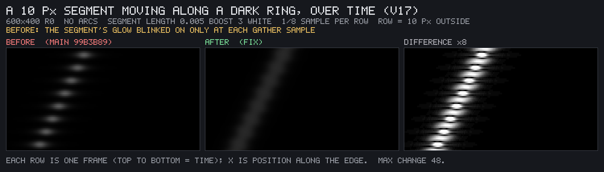

### 4.4 The filament's colour (V18, V19)

A thin bar, red along the top and blue along the bottom. Before, each line took
a third of the opposite edge's colour through the Euclidean gather weight: the
top line was (241, 0, 127), pink. After, (245, 0, 13). The remaining blue is the
halo's share of that pixel, which keeps the far edge's light on purpose.

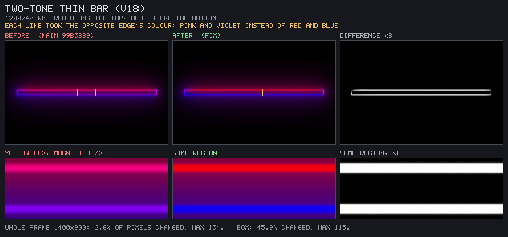

The same mechanism on a realistic shape: a 600x48 search-field pill with the
default rainbow. Less dramatic, and more typical. The lines were washed toward
the far edge's colour and now show the ring's own gradient; the bottom line's
green-to-cyan is the most visible part of the change.

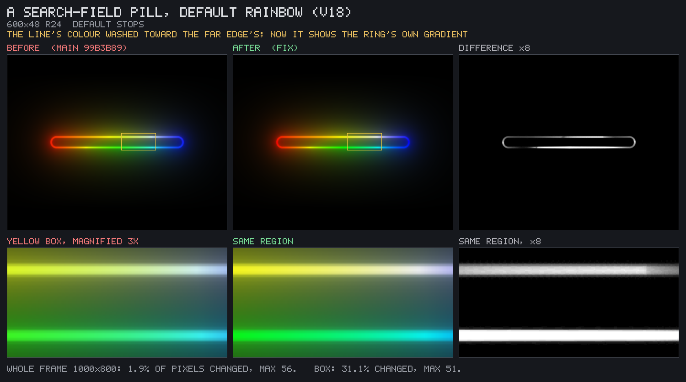

Two arcs with their own stops meeting at the bottom-right. Before, the gathered
hue smeared yellow 25 px into the blue arc and held white for 10 px. After, the
line crossfades over about 16 px through white, driven by the two arcs' own
overlapping end feathers. The glow around the seam changes colour slightly
too, which is most of the 35% of pixels that move.

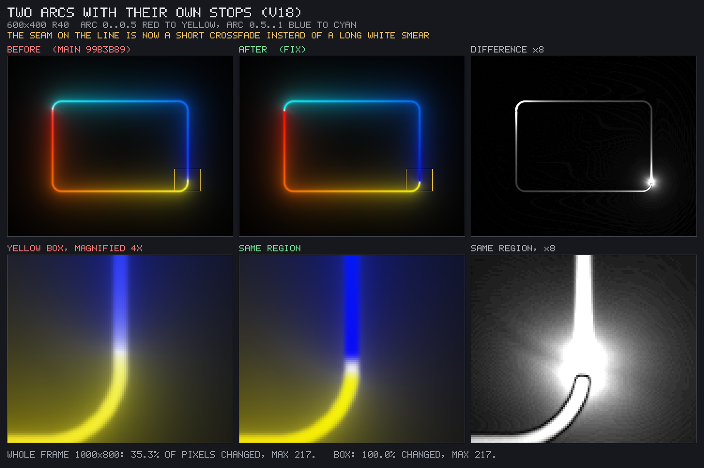

At `numSamples` 32 the gathered hue snapped toward the nearest sample, so the
line's gradient ran in 60 px plateaus - the periodic beads in the magnified
difference. After, the line tracks the 128-sample gradient to one level.

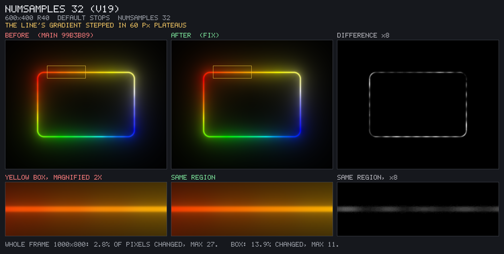

At 7 samples the line was blotchy, most visibly in the blues at the bottom-right
corner. After, it shows the true gradient. The GLOW still takes its colour from
the samples and is still coarse at this count - that is the remaining half of
V9, and what the `numSamples` documentation now says instead of "a grainier
halo".

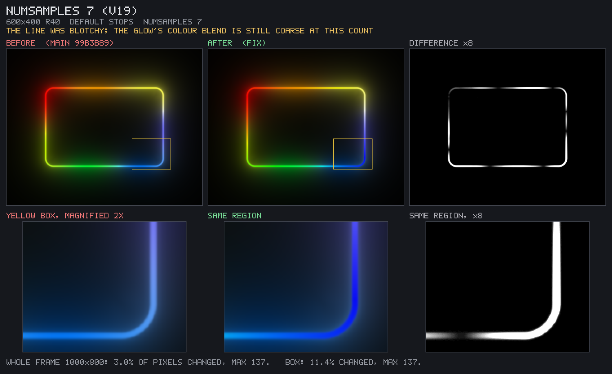

## 5. Regression checks

These are configurations the fix should leave alone apart from the filament's
colour. Each difference panel should show the line and nothing else.

The default config. The change is the line only, and it is the line reading
its own colour: at the blue stop it was (21, 35, 244) and is now (2, 4, 245).

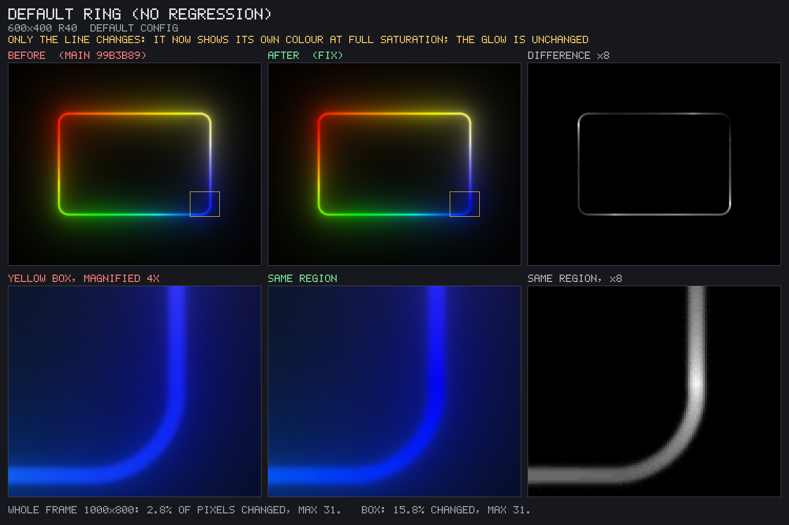

A strong bloom. The glow is unchanged to the level, including the straight
streaks through it where two colour channels tie. That is V20, left open
deliberately: every smooth replacement for the tone map's peak shifts the look
of white and warm glows that have no streak.

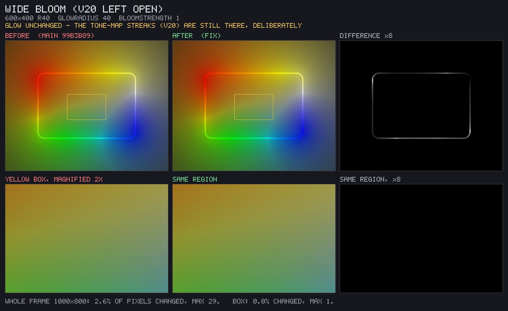

`resolutionScale` 0.5. The scaled path runs the same shader and takes the same
fixes; its glow is unchanged.

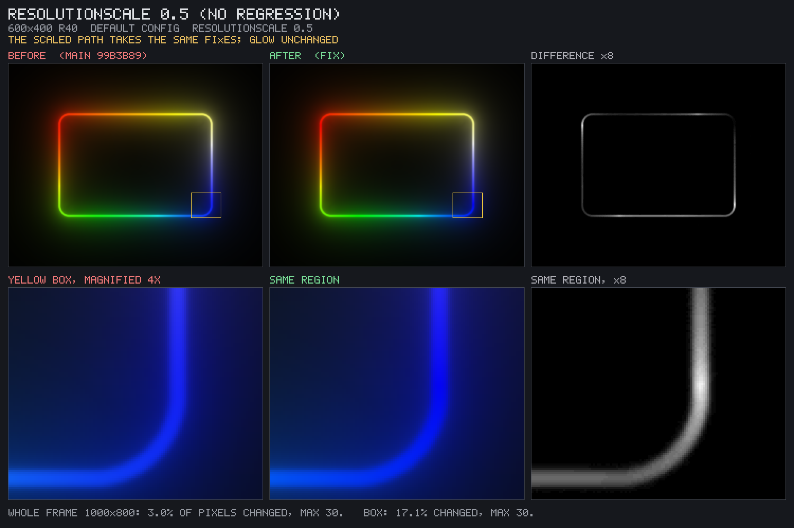

`GlowSide::OUTSIDE` over an `OpaqueMode::INSIDE` fill - the edge work
`glow-side-comparison.md` documents. The cut, the fill and the glow are
untouched.

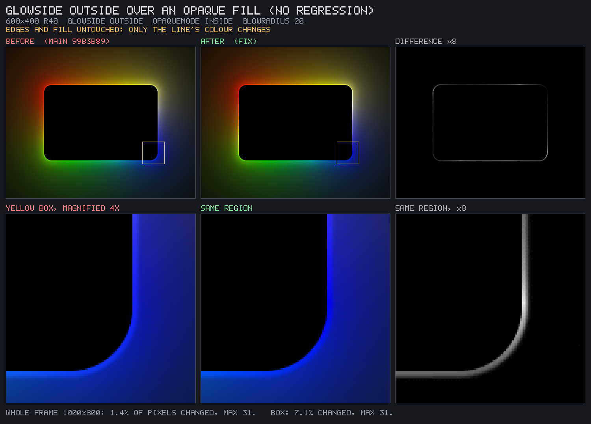

## 6. The demo's animation presets

Sections 4 and 5 isolate one defect or one configuration per scene. This
section goes the other way: what someone running the demo sees. Every neon
preset in `demo/src/animation-presets.h` was run on the demo's startup scene -
a 960x540 rect with square corners in a 1920x1080 frame, the default rainbow
rotating at 0.5, every other neon field at its default - and captured at 48
evenly spaced times across one period, or across the whole of a one-shot. Both
builds were stepped through the same times, so each frame pair is the same
config. That is 17 presets; the four lens-flare presets animate only the flare
and leave the neon config untouched.

In this section "on the line" means within 6 px of the perimeter: the filament,
and also V16's ghost ridge, which sat exactly on the unlit edges' own line.
Everything else is "off the line", the glow. "Glow brightness" is the sum of
each off-the-line pixel's brightest channel, one number per frame, drawn as a
curve at the bottom of each sheet with its y axis zoomed to the range.

Each sheet shows four of the 48 frames as before / after / difference x8. The
difference panel is shrunk with a MAX filter rather than an average, so a
one-pixel change stays visible. Below the four frames are a 1:1 crop where
the glow changed most in total and a 2x crop around the single largest change
off the line.

The frame each preset changed most in, before (red frame) and after (green
frame):

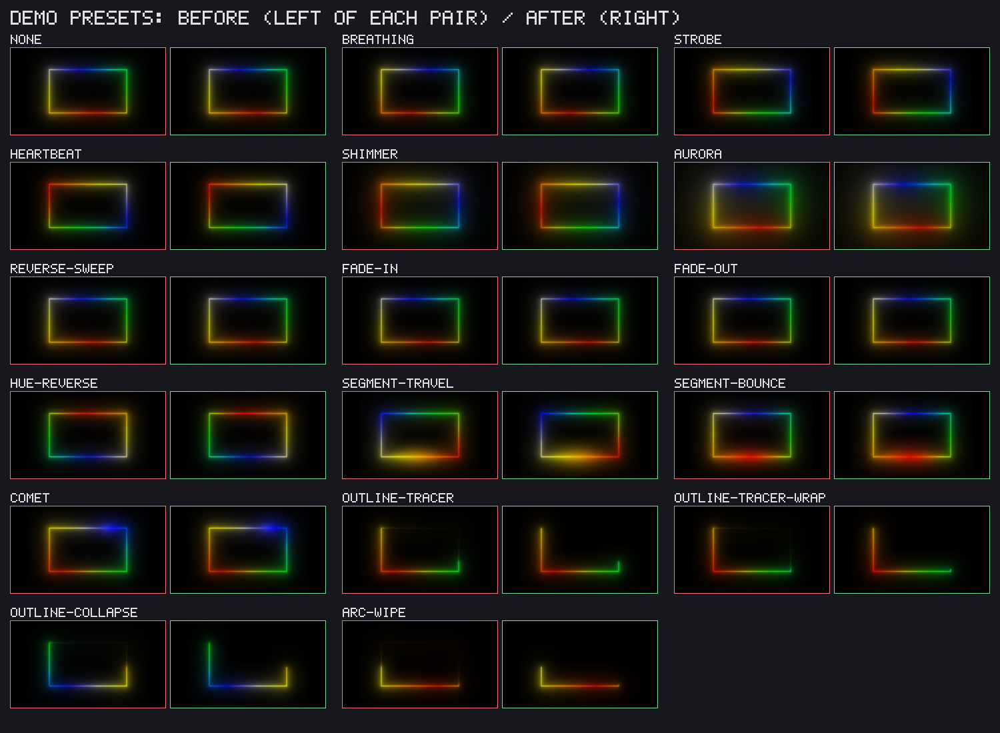

### 6.1 On a fully lit ring: the line only

Ten presets animate intensity, glow radius, bloom or hue on a fully lit ring:
the demo's default with no preset, Breathing, Strobe, Heartbeat, Shimmer,
Aurora, Reverse sweep, Fade in, Fade out and Hue reverse. **In all 480 of their
frames the glow moved by at most 1 level.** The line changes by up to 35, the
same filament-colour change as `default-ring`. Aurora drives `glowRadius` up to
24 and `bloomStrength` to 0.7, so the wide-glow end is covered too. Their
brightness curves lie on top of each other, so these ten get one sheet between
them rather than one each:

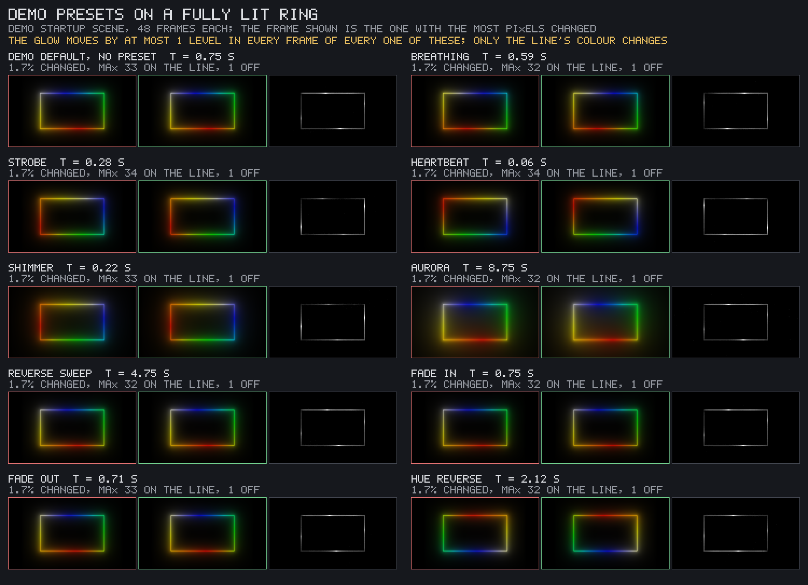

### 6.2 Segment presets: the same look, redistributed slightly

Segment travel, Segment bounce and Comet move one segment around the lit ring.
The glow reads the same. What changes is a smooth redistribution through the
glow around the segment: pixels get both brighter (by up to 13 levels) and
dimmer (by up to 11), and the frame's total glow brightness is the same to
0.3% (after / before 0.999, 1.002 and 1.003). This is the look chosen under "The segments'
feathering" in `review-findings.md`: `main`'s dome, with the segment's light
kept closer to the segment instead of spread over every piece at the ring-wide
mean.

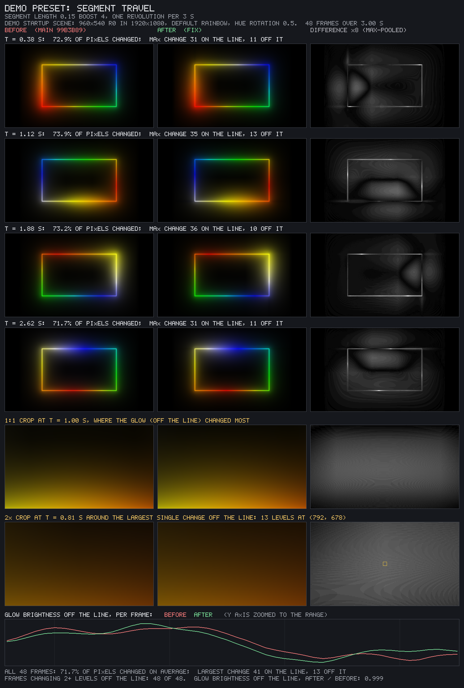

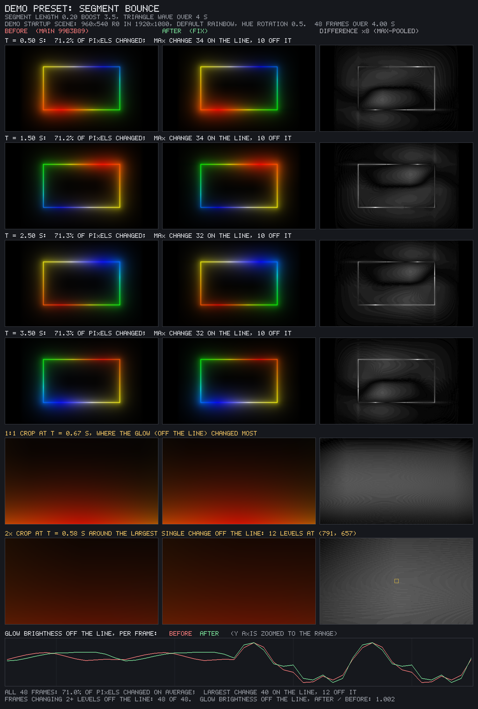

The brightness curves are smooth in both builds. These lights span roughly 6
(Comet) to 26 (Segment bounce) gather-sample spacings, far more than the
light near one spacing whose ticking V17 describes (`tracer-strip`). Comet's
curve swings a little wider in the fix as it passes from the long edges to the
short ones.

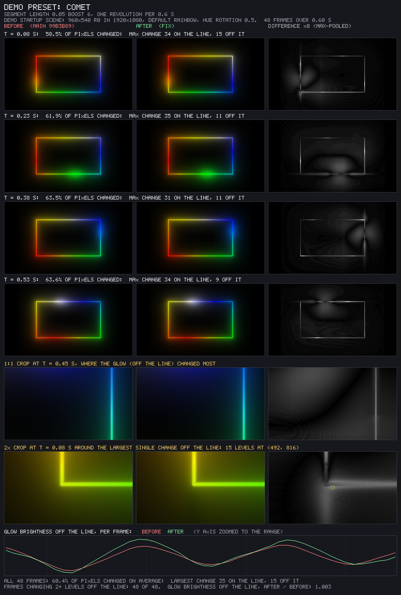

### 6.3 Arc presets: no ghost outline, no glow past either end

Outline tracer, Outline tracer (wrap), Outline collapse and Arc wipe draw a
partial arc. Before, while the arc was partly drawn, the unlit part of the rect
glowed in its own outline, and the lit arc's glow ran on past its ends -
around a corner, or down the unlit rest of an edge. After, both are dark, and
the glow closes round each end of the arc with the same cap whether the end
sits on a corner or in the middle of an edge. That is V16 and V22 in the
demo's most-used animations. Almost all of the change is dimming: the largest
changes off the line are 45, 44, 75 and 43 levels darker, and nothing gets
brighter by more than 11. The frames' glow is 1.3% to 7.0% dimmer overall
(after / before 0.987 to 0.930), and that missing light is the ghost outline
and the trails. Once the arc has closed the ring the frames match to within 1
level off the line (Outline tracer (wrap) from 1.25 s). While it still leaves a
gap of a few px - 6 px for Outline tracer at 1.75 s - the glow now dips at the
gap, by up to 13 levels, where it used to be filled in across it.

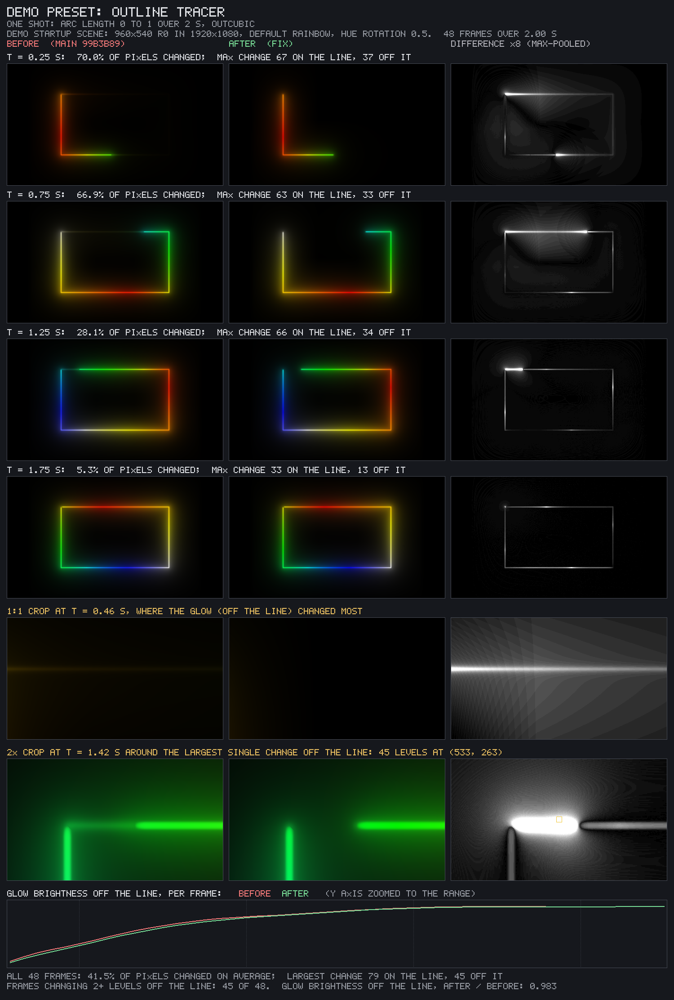

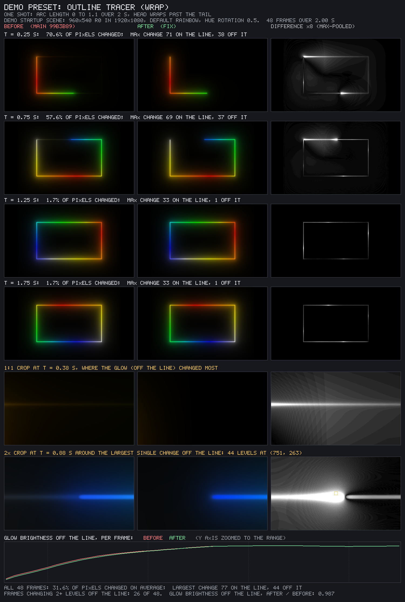

Outline collapse's largest change, 75 levels, is its last captured frame. The
one-shot's elapsed time is accumulated in float, so there it falls a hair short
of the end and the arc is 1.3e-6 of the perimeter long. Before, that sliver
was lit like a whole gather sample: a red spot at the corner for one frame,
before the next update clamps the length to 0. After, it emits what a sliver
that short does, next to nothing. This is V17's sub-sample light at the end of
a one-shot. Static, `main` draws a peak of 106 for an arc 1e-4 long and the fix
draws 7. At exactly 0 both are dark.

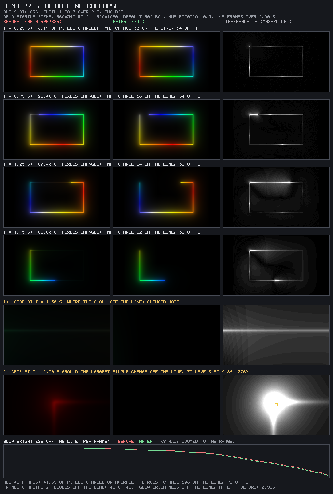

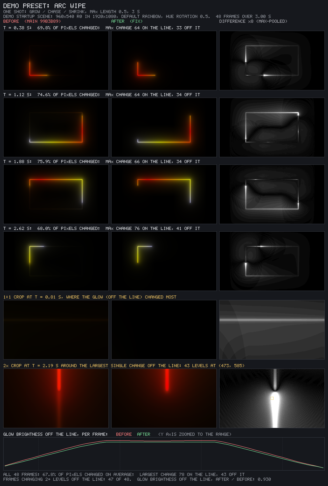

### 6.4 Numbers

Over all 48 frames of each preset. "Changed" is the mean over frames of the
share of pixels changed by at least one level. Strobe's is low because half its
frames are dark in both builds.

| preset | changed px | max on the line | max off it | frames 2+ off it | glow brightness after / before |
| ------ | ---------- | --------------- | ---------- | ---------------- | ------------------------------ |
| no preset | 1.68% | 35 | 1 | 0 / 48 | 1.000 |
| Breathing | 1.65% | 35 | 1 | 0 / 48 | 1.000 |
| Strobe | 0.73% | 35 | 1 | 0 / 48 | 1.000 |
| Heartbeat | 1.62% | 34 | 1 | 0 / 48 | 1.000 |
| Shimmer | 1.65% | 35 | 1 | 0 / 48 | 1.000 |
| Aurora | 1.62% | 34 | 1 | 0 / 48 | 1.000 |
| Reverse sweep | 1.68% | 34 | 1 | 0 / 48 | 1.000 |
| Fade in | 1.65% | 34 | 1 | 0 / 48 | 1.000 |
| Fade out | 1.61% | 35 | 1 | 0 / 48 | 1.000 |
| Hue reverse | 1.68% | 34 | 1 | 0 / 48 | 1.000 |
| Segment travel | 71.65% | 41 | 13 | 48 / 48 | 0.999 |
| Segment bounce | 70.98% | 40 | 12 | 48 / 48 | 1.002 |
| Comet | 60.41% | 35 | 15 | 48 / 48 | 1.003 |
| Outline tracer | 41.45% | 79 | 45 | 45 / 48 | 0.983 |
| Outline tracer (wrap) | 31.57% | 77 | 44 | 26 / 48 | 0.987 |
| Outline collapse | 41.56% | 106 | 75 | 46 / 48 | 0.983 |
| Arc wipe | 67.83% | 78 | 43 | 47 / 48 | 0.930 |

## 7. Numbers

Change over the whole frame, before to after. "Changed" counts pixels whose
largest per-channel difference is at least one level. For the strips the frame
is the 480x64 strip itself.

| case | changed px | max | mean |
| ---- | ---------- | --- | ---- |
| `alpha-half` | 79.47% | 175 | 21.07 |
| `outline-rect` | 95.35% | 68 | 5.10 |
| `outline-bar` | 63.12% | 60 | 1.59 |
| `outline-circle` | 74.80% | 51 | 1.53 |
| `v14-segment` | 77.66% | 26 | 1.92 |
| `ring-plus-segment` | 89.36% | 32 | 2.44 |
| `spinner-strip` | 96.28% | 16 | 3.07 |
| `tracer-strip` | 29.54% | 48 | 2.36 |
| `thin-two-tone` | 2.63% | 134 | 1.49 |
| `search-field` | 1.90% | 56 | 0.27 |
| `arc-seam` | 35.26% | 217 | 0.87 |
| `samples-32` | 2.79% | 27 | 0.20 |
| `samples-7` | 2.98% | 137 | 0.64 |
| `default-ring` | 2.79% | 31 | 0.20 |
| `wide-bloom` | 2.62% | 29 | 0.17 |
| `scale-half` | 3.04% | 30 | 0.20 |
| `outside-opaque` | 1.37% | 31 | 0.09 |

They fall into three groups:

- **Partly lit scenes** (the first eight) change almost everywhere, because the
  glow's coverage changed everywhere. That was the fix, and section 4 is what
  it looks like.
- **Colour-on-the-line scenes** change in 2 to 3% of pixels - the filament
  band - by up to 137 levels where the gathered colour was far off.
  `arc-seam` sits between the two groups: its seam's glow shifts colour as
  well.
- **Fully lit scenes** change in the same 1.4 to 3% band by at most 31
  levels. More than 12 px from the line, at most 27 pixels of 800,000 moved,
  each by 1 level, from the gather's new summation order.

## 8. What did not change, deliberately

- **V20's tone-map streaks** (section 5, `wide-bloom`). A look decision, not a
  repair; the analysis is in `review-findings.md`.
- **The glow's colour blend** still comes from the gather samples, so the glow
  keeps the far edge's light (`thin-two-tone`, 12 px out) and is still coarse
  at very low sample counts (`samples-7`). The first is physically right; the
  second is V9's remaining half.
- **A light shorter than one sample spacing** still ripples by about 2 levels
  as it moves (`tracer-strip`), where it used to blink.
- **A segment's glow keeps V14's feathered falloff** (`v14-segment`), by
  choice, at the cost of a faint streak beside the unlit stretch just past its
  end.
