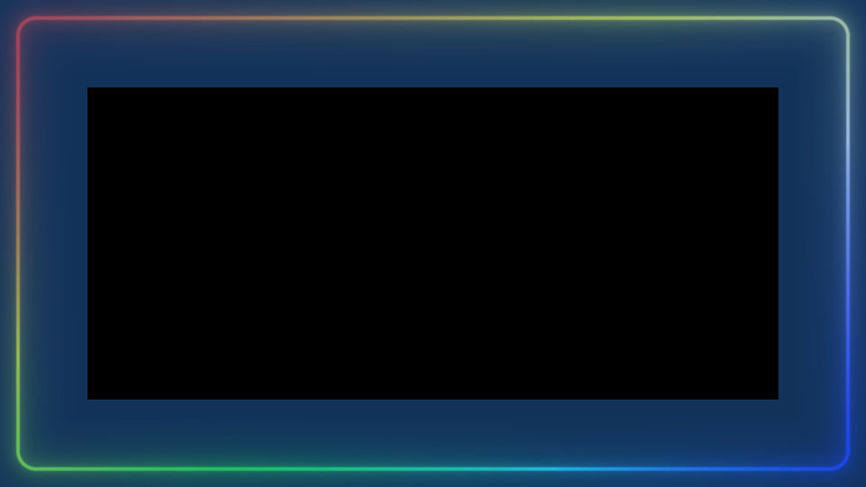
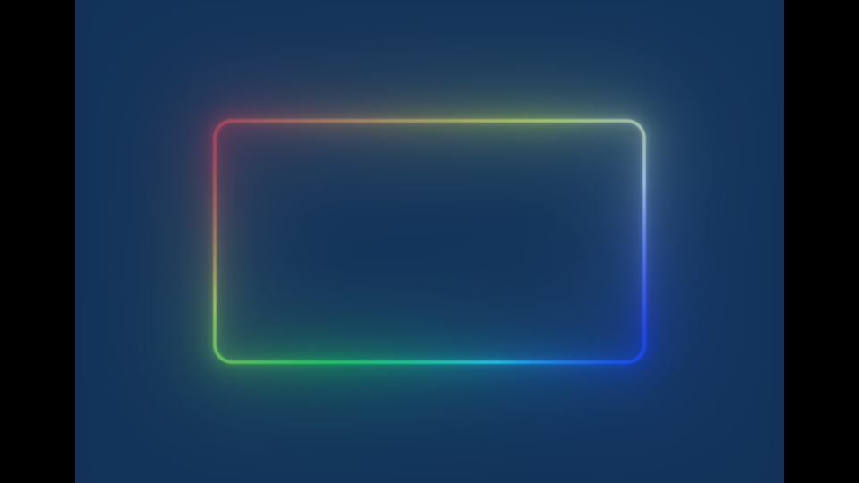
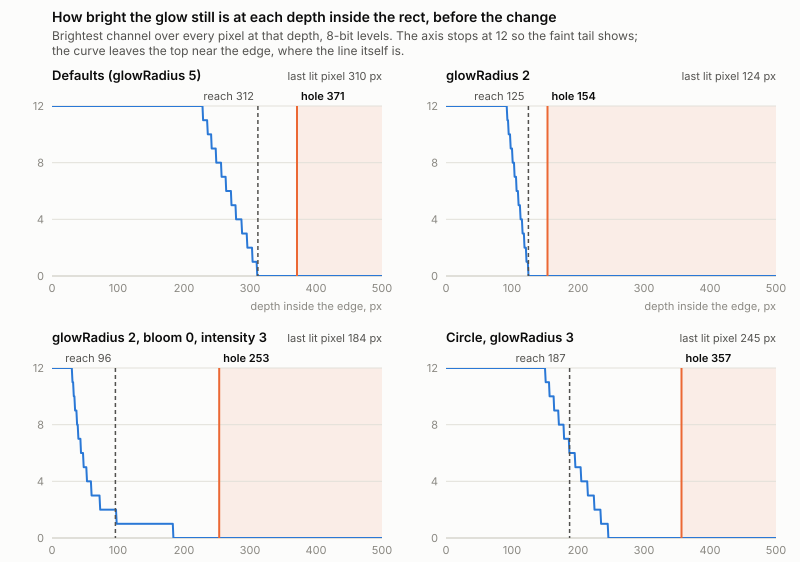
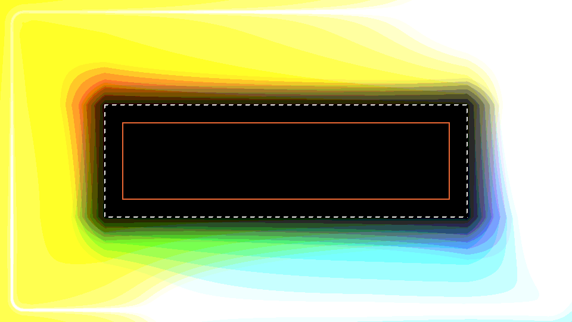
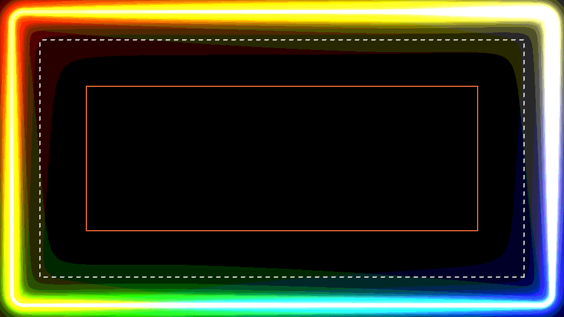
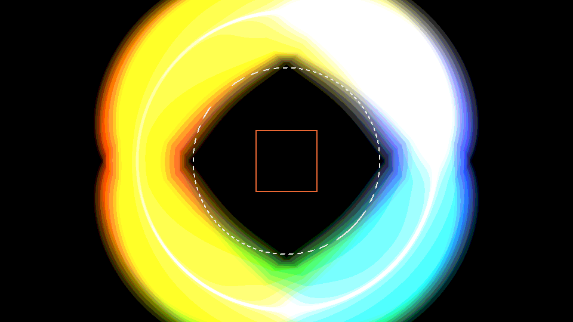
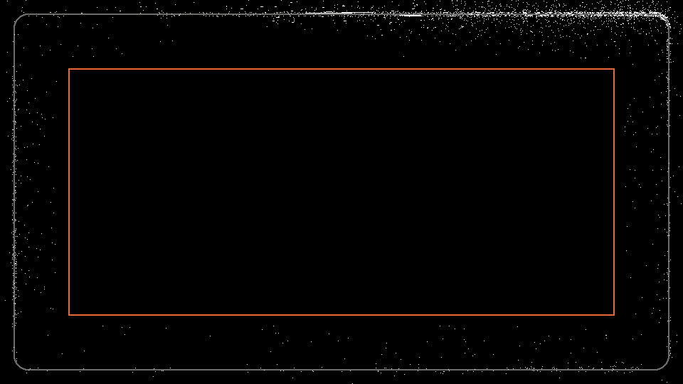
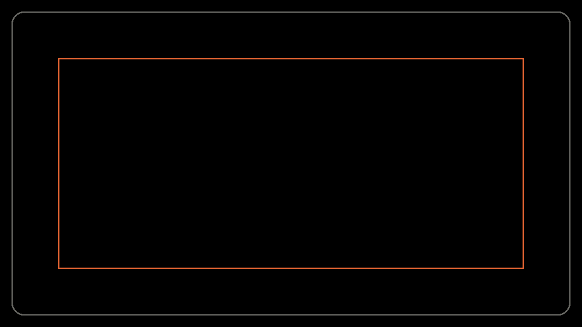
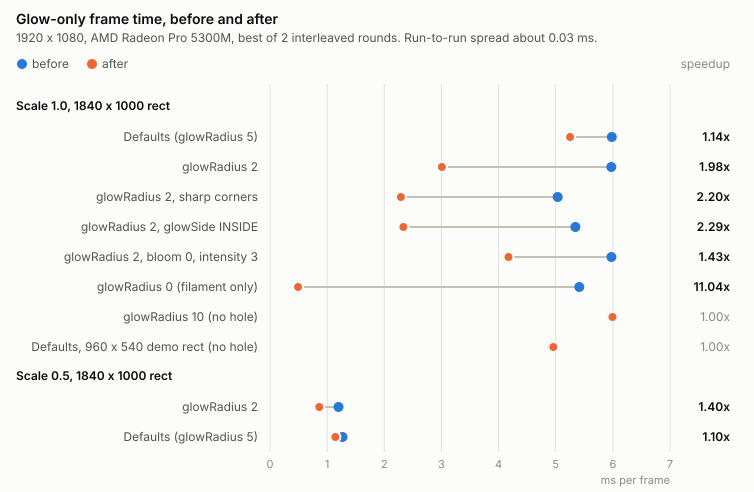

# The glow quad's interior hole: before and after

What changed when the neon's draw quad started bounding its own interior, with
no cutoff set, at the depth past which the glow cannot write a pixel - and why
that depth is not simply the glow's reach.

**Result: on a rect larger than about twice the glow's reach, the glow pass no
longer shades the interior it writes zeros to.** A screen-sized rect renders
1.14x faster at the default glow, ~2x at `glowRadius` 2 and 11x with the
filament alone. No pixel the hole removes was ever lit, so the picture is
unchanged - every remaining difference is 1 level, from drawing the quad as
strips instead of two triangles, and configs that get no hole are byte-identical
to before.

Code: `GetGlowInnerReach`, `GetGlowEmissionBound` and `GetGlowInvisibleLevel` in
`lib/src/renderer/neon-renderer.cpp`, consumed by `setupGeometry` (the hole) and
`setupRingGeometry` (the scaled path's blit). No shader changed.

## 1. The report

> Without inside/outside cutoffs the render time is quite large, even when a
> cutoff much bigger than the visible neon area makes it fast.

Both halves were right. The glow quad is the rect grown by the glow's reach,

    reach = glowRadius * 48 * (1 + bloomStrength * intensity)

and until now it had a hole in it only when something bounded the glow from the
inside: `GlowSide::OUTSIDE`, or an enabled `insideCutoff`. With neither, every
pixel inside the rect ran the full `neon.frag` - the perimeter gather loop
included, which is ~95% of the layer's cost at scale 1.0 - and on a rect that
fills the screen the interior is most of the frame. An inside cutoff placed past
the visible glow changed nothing on screen and cut the hole, which is why it was
fast.

The outside never had this problem. The quad stops at `reach` past the edge, and
`neon.frag` fades the emission to zero over the last 20% of that margin, so the
exterior was always bounded - by design, and visibly (the fade is part of how the
bloom's tail ends). The interior had no bound at all.

| | outside the edge | inside the edge |
| --- | --- | --- |
| before | quad ends at `reach`, shader fades to 0 over its last 20% | none: shaded to the centre |
| after | unchanged | quad holed at `GetGlowInnerReach`, no fade |
| changes the picture | yes, the fade shapes the bloom's tail | no: nothing in the hole was lit |

## 2. What changed

The pictures below are the frame the probe rendered - a 1840 x 1000 rect in a
1920 x 1080 frame - with every pixel the glow pass shades washed blue. Black is
what it skips.

| before, `glowRadius` 2: 100% of the frame | after, `glowRadius` 2: 48.9% |
| :-: | :-: |
|  |  |

| after, defaults (`glowRadius` 5): 86.3% | after, the demo's 960 x 540 rect: no hole |
| :-: | :-: |
|  |  |

The hole is cut the way an inside cutoff's always was: the largest axis-aligned
box inside the inward offset of the rounded rect, so its corners clear the
corner arcs. It combines with the existing bounds the way the shader's discards
do - the nearer of the inside cutoff and the glow's own depth wins, and under
`GlowSide::OUTSIDE` the cut is nearer than either. A hole with no extent on
either axis draws the plain two-triangle quad, byte for byte the old geometry:
the depth routinely lands between the two half-extents (at the defaults, 312 px
against an 800 x 600 rect's 300 and 400), and two strips meeting at the middle
would cost interpolation noise for no fill saved.

On the scaled path (`resolutionScale` below 1.0) the same depth holes pass 1's
quad, bounds the blit's inner band - plus the bilinear footprint, as its outer
band already was - and, through `mGlowHole`, the gather pass.

## 3. Why the hole is not at `reach`

The obvious place for the hole is `reach`, mirroring the outside. Past it the
filament is an exact zero (its pedestal), and so is every straight's bloom
(each straight's bloom is pedestalled at `reach` and falls monotonically with
distance from its line). Two terms are not:

- **The halo**, which has no pedestal at all. `neon-tuning.h` calls its 1/a^2
  tail invisible at `reach`, which holds at intensity 1. But `reach` grows with
  `bloomStrength * intensity`, so at bloom 0 it stops growing while the halo
  keeps brightening: at intensity 3 the interior is lit to 1.9x `reach`.
- **The corner arcs' bloom.** The four arcs share ONE pedestal, exact for a
  fragment outside an arc. On the concave side `arcTangentSegment` develops the
  arc at the fragment's own radius, the pedestal comes out too small, and a
  circle's interior stays lit to 1.3x `reach`.

The chart measures it: the brightest channel over every pixel at each depth,
from the BEFORE render, which still drew the whole interior. The dashed line is
`reach`; the orange line and the shaded band are where the new hole starts.

The same renders with every level multiplied by 40, so a pixel at 1/255 shows.
Dashed: `reach`. Orange: the hole's actual box, read back from the glow pass's
vertex buffer.

| defaults | `glowRadius` 2, bloom 0, intensity 3 | circle, `glowRadius` 3 |
| :-: | :-: | :-: |
|  |  |  |

A hole at `reach` would have cut into the middle and right pictures - a hard
edge at 1-6 levels. Adding a fade inside, as the outside has, would have fixed
the edge by changing those pixels. The hole is placed past them instead.

## 4. The bound

`GetGlowInnerReach` finds the smallest depth D, at or past `reach`, where an
upper bound on everything the glow can still write there falls under half an
8-bit level. Every piece of it holds for any fragment at least D inside the
edge, which is every fragment the hole can contain.

**The threshold** (`GetGlowInvisibleLevel`). The grade is
`(x / (x + 0.6))^0.85`; inverted at 0.5 / 255 it gives x = 3.9e-4. Below that the
RGBA8 target stores 0 and the premultiplied blend leaves the destination
exactly as it was. The shader's alpha is its brightest channel, so it rounds to
0 with them.

**The emission** (`GetGlowEmissionBound`). `neon.frag` multiplies its summed
halo and bloom by emitGlow plus the per-piece corrections, which together come
to each piece's own coverage times its term. Both hues are at most 1 per channel,
an arc's coverage is at most the brightest arc's intensity A, a segment's at
most the summed boosts S, so the multiplier is at most

    intensity * A + S * max(A, min(S, 1))

**The straights.** No segment is brighter than its whole line,
2 kh^2 / (a^2 + kh^2), and every line is at least D away. Two lines facing each
other sum highest where one is as near as it can be, so each pair is at most
the near one at D plus the far one at the rect's width (or height) less D.

**The corner arcs.** `arcTangentSegment` weights each arc r / lam over a span
lam * pi / 2, so lam cancels: its halo is at most pi r kh^2 / (2 c^3) and its
bloom at most pi r bw / (2 c^2), with c measured from the arc - at least D away -
and the bloom less the shader's shared pedestal.

Everything else in the sum - the bloom's renormalisation, the pedestal, the
glow gate - is computed exactly as `neon.frag` computes it from `reach`. Every
term falls with depth, so a bisection finds the crossing. If it is never
reached before the rect's middle there is no hole.

Lengths enter only as ratios, so one full-res solve serves every resolution
scale; the scale only moves `reach` itself (the filament's Nyquist floor widens
it below 1.0).

**Loose by design.** All four arcs are taken at D and both near lines at D,
which a single fragment never sees at once. At the defaults the hole starts at
371 px against a last lit pixel at 310: about 20% of the possible saving left
on the table, in exchange for a bound with no measured exception. Circles and
large corner radii are where it is loosest (the circle above: hole at 357 px,
last lit pixel at 245).

**It moves with the arcs and the segments.** Arc intensity and segment boost
were never inputs to the quad, so `OnConfigChanged` now rebuilds it when the
emission bound changes - gated on that one number, not on the two lists, so a
segment travelling round the ring rebuilds nothing. Measured: adding a 1.5
boost moved the hole edge from 154 to 232 px in, and an arc intensity of 1.6
moved it to 292, on a warm effect exactly as on a fresh one (byte-identical
renders).

## 5. What it changes in the picture: nothing

Rendered against the unmodified library on the same GPU, 26 scenes at 1920 x
1080 - both resolution paths, every `glowSide`, cutoffs on and off, arcs,
segments, circles, sharp corners, `glowRadius` 0 to 10. In every scene, **no
pixel inside the new hole was non-zero before**. A selection:

| scene | hole starts | pixels in hole | lit in hole before | max diff | pixels differing |
| --- | ---: | ---: | ---: | ---: | ---: |
| defaults, 960 x 540 demo rect | no hole | 0 | - | 0 | 0 |
| defaults | 371 px | 283,284 | 0 | 1 | 1,620 |
| `glowRadius` 2 | 154 px | 1,060,144 | 0 | 1 | 3,528 |
| `glowRadius` 2, bloom 0, intensity 3 | 253 px | 658,996 | 0 | 1 | 1,304 |
| `glowRadius` 2, segment boost 2 | 253 px | 658,996 | 0 | 1 | 3,245 |
| circle, `glowRadius` 3 | 357 px | 40,804 | 0 | 1 | 1,638 |
| `glowRadius` 2, `GlowSide::INSIDE` | 154 px | 1,060,144 | 0 | 1 | 480 |
| `glowRadius` 2, inside cutoff at 400 | 154 px | 1,060,144 | 0 | 1 | 1,217 |
| `glowRadius` 0 (filament only) | 19 px | 1,733,524 | 0 | 1 | 3,823 |
| `glowRadius` 10 | no hole | 0 | - | 0 | 0 |
| intensity 3, arc intensity 2, bloom 0 | no hole | 0 | - | 0 | 0 |
| defaults, scale 0.5 | 371 px | 283,284 | 0 | 1 | 17,225 |
| `glowRadius` 2, scale 0.25 | 154 px | 1,060,144 | 0 | 1 | 9,971 |

The 1-level differences are not the hole. They sit around the line, not at the
hole's edge, and lean darker just outside the line and brighter just inside it -
the signature of the interpolated position moving by a fraction of an ulp across
a steep profile when the quad becomes eight triangles instead of two. The test
that separates the two explanations: render the OLD library with an inside
cutoff that cuts the identical hole (softness 0 at 150.314819 px, which lands on
the same vertex floats). It matches the new library, with no cutoff, **byte for
byte**:

| new vs before: 3,528 pixels differ, max 1 | new vs before + equivalent cutoff: 0 differ |
| :-: | :-: |
|  |  |

White: any channel differs. Grey: the rect's edge. Orange: the hole. The same
interpolation noise is what an inside cutoff has always cost, and on the scaled
path the gather pass's quad changes shape too, which spreads it over more pixels
at the same 1 level.

`neon-scale-check check` passes with a table identical to the unmodified
library's on the same GPU, and `neon-scale-check partition` passes: 1000 random
configs, 0 pixels drawn by both the blit and the ring, 0 by neither.

## 6. What it buys

Glow-only frame, 1920 x 1080, a 1840 x 1000 rect unless stated, AMD Radeon Pro
5300M, best of 2 interleaved rounds (run-to-run spread about 0.03 ms at 1.0):

| config | before | after | |
| --- | ---: | ---: | ---: |
| Defaults (`glowRadius` 5) | 5.98 ms | 5.25 ms | 1.14x |
| `glowRadius` 2 | 5.97 ms | 3.01 ms | 1.98x |
| `glowRadius` 2, sharp corners | 5.04 ms | 2.29 ms | 2.20x |
| `glowRadius` 2, `GlowSide::INSIDE` | 5.34 ms | 2.33 ms | 2.29x |
| `glowRadius` 2, bloom 0, intensity 3 | 5.97 ms | 4.17 ms | 1.43x |
| `glowRadius` 0 (filament only) | 5.41 ms | 0.49 ms | 11.04x |
| `glowRadius` 10 (no hole) | 5.98 ms | 5.99 ms | 1.00x |
| Defaults, 960 x 540 demo rect (no hole) | 4.94 ms | 4.96 ms | 1.00x |
| `glowRadius` 2, scale 0.5 | 1.20 ms | 0.86 ms | 1.40x |
| Defaults, scale 0.5 | 1.27 ms | 1.15 ms | 1.10x |

The Intel UHD 630 in the same machine shows the same ratios on its own, slower
scale: 37.6 -> 18.5 ms at `glowRadius` 2, 34.2 -> 3.0 ms with the filament alone,
37.6 -> 32.7 ms at the defaults. The saving tracks the fraction of the frame the
hole removes, so it grows with the rect and shrinks with `glowRadius`; below
scale 1.0 it is smaller because the loop no longer runs per pixel there
(`neon-resolution-scale-plan.md` section 13) and what the hole saves is shading
and blit fill.

## 7. When it does nothing

- **The rect is smaller than about twice the glow's depth.** The demo's
  half-viewport rect at the default glow (reach 312 px, half-height 270) is
  genuinely lit to its middle - section 3's first panel, on a smaller rect. Its
  quad is unchanged.
- **The emission is bright enough to light the middle.** Intensity 3 with an arc
  at intensity 2 and bloom 0, or a segment boost of 4: the halo really is lit
  nearly to the centre, and the bound says so.
- **Something already bounds it closer.** `GlowSide::OUTSIDE`, or an inside
  cutoff nearer the edge than the glow's depth, already cut a deeper hole and
  still do.

A cutoff can still be faster than this. One placed inside the glow's faint tail
cuts more of the interior, but it does so by removing light that is there - a
few levels, but not zero. This change only removes what was never lit.

## 8. Keeping it in step

The bound is a CPU mirror of `neon.frag`'s halo and bloom terms, the same way
`GetFilamentExtent` mirrors the filament. Change any of these and
`GetGlowInnerReach` has to follow, or the hole clips a faint tail:

- the halo or bloom gains (`HALO_GAIN`, `HALO_NORM_FACTOR`, `BLOOM_NORM_FACTOR`),
  the grade (`TONE_MAP_SHOULDER`, `GAMMA_EXPONENT`), `BLOOM_REACH_TO_GLOW`;
- the pedestals - the straights' per-piece one or the arcs' shared one - and the
  bloom's renormalisation;
- `arcTangentSegment`'s weight or span;
- anything that lets the emission exceed `intensity * A + S * max(A, min(S, 1))`:
  a hue above 1 in a channel, a new source of light in emitGlow.

Section 5's check is the regression test for it: render the interior without a
hole and confirm nothing inside the hole was lit.

## 9. Method

A throwaway program linked against two builds of the library - the unmodified
tree and this change, each in its own Release build directory - with a hidden
GLFW window and an `OffscreenCapture` at 1920 x 1080, cleared to opaque black so
the stored RGB is the glow itself. The hole was read back from the glow pass's
own vertex buffer (`glGetBufferSubData` on it after the frame), not recomputed,
and the shaded-region pictures rasterise those triangles. Timings are 5 runs of
40 frames between `glFinish`, minimum taken, per process; the two libraries
were run alternately and only rounds on the same GPU compared, since this
machine moves between its AMD Radeon Pro 5300M and Intel UHD 630 per process.
The pictures are 2x-downsampled (box filter; max filter for the x40 and
difference images, so single pixels survive). The charts are drawn from
`images/glow-inner-reach/profiles.csv` and `profiles-markers.csv`. The program
itself is not checked in.
