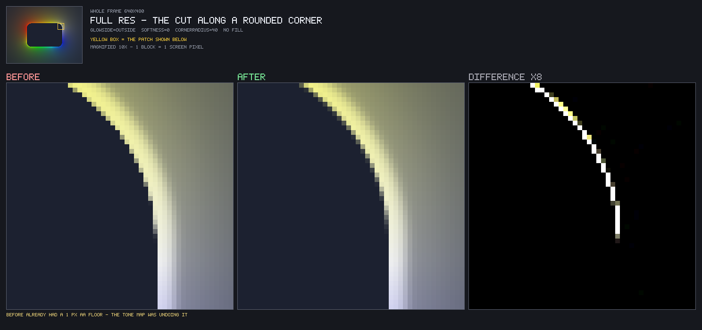
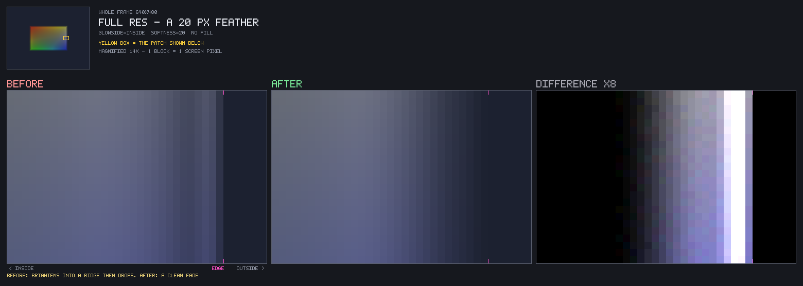
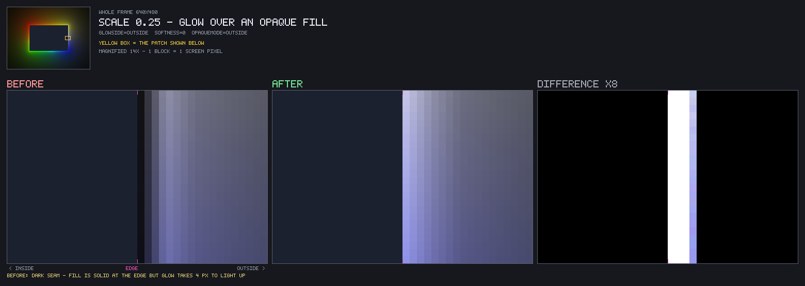
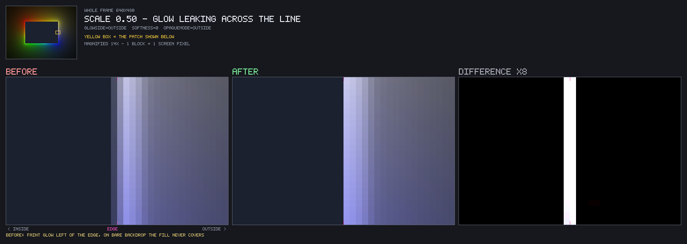
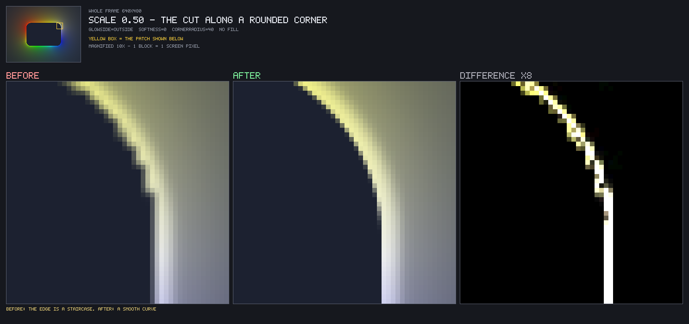
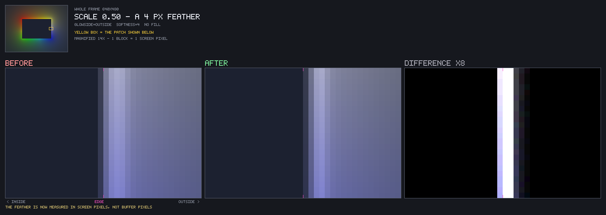
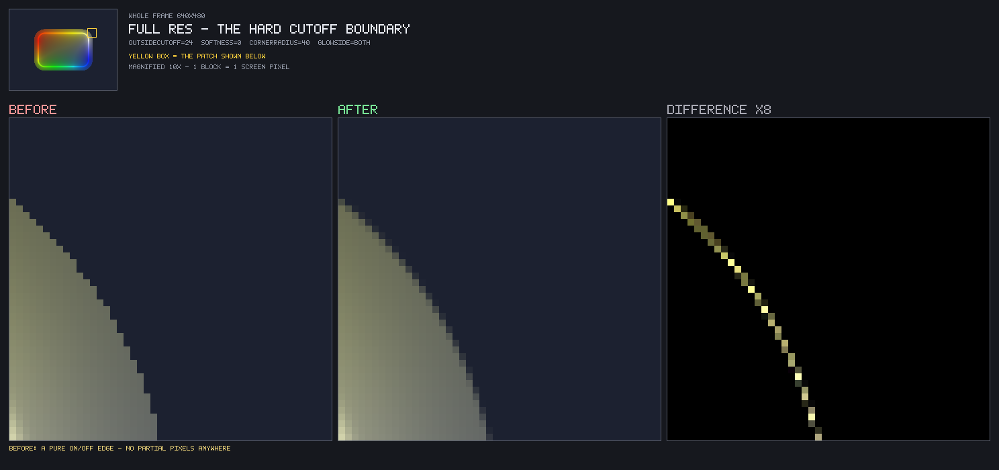

# The glow-side and cutoff edges: before and after

What changed when the one-sided cut and the hard cutoff stopped being applied to
the linear emission and became coverage, when the cut moved off the reduced-
resolution buffer and onto the destination, and when the draw quad started
honouring the culls that bound it.

[`corner-crease-and-filament-nyquist.md`](corner-crease-and-filament-nyquist.md)
is the analytic-emission equivalent of this document: the same shape of
argument, offscreen probes and all, applied to the halo and bloom instead of to
the edges that bound them. The four defects below came out of a review of
`b3c6b1e` and were fixed in the same pass, so they are recorded here rather than
in [`review-findings.md`](review-findings.md), which tracks OPEN ones.

**Result: every edge the neon layer draws is now antialiased, the reduced-
resolution paths agree with full resolution to within a few levels instead of
tens, and `GlowSide::BOTH` at `resolutionScale 1.0` - the default - is
bit-identical to where it started.** The cost is that two tuned parameters move:
`glowSideSoftness` reads dimmer and wider, and `Cutoff::softness` feathers over
half the span it used to.

## 1. What is being compared

| side | commit | |
| ---- | ------ | - |
| before | `b3c6b1e` | "Enhance glow side handling: refine softness parameters and improve one-sided cut antialiasing" |
| after | working tree | four changes, below |

The "before" side is not a strawman. `b3c6b1e` had already added a one-pixel
antialiasing floor to the one-sided cut; the staircases in section 3 are what
shipped **with** that floor in place, because the floor was applied where the
tone map could undo it.

Four defects, in the order they were fixed:

| # | defect | fix |
| - | ------ | --- |
| 1 | the one-sided cut multiplied the LINEAR emission, upstream of the Reinhard tone map, which handed most of the ramp straight back | apply it to the GRADED output, as coverage |
| 2 | below `resolutionScale 1.0` the cut was made in buffer pixels and the bilinear blit smeared it across the line | `neon-blit.frag` applies it at destination resolution; `neon.frag` culls `BLIT_SIDE_GUARD_PX` past it so the filter has lit texels to rebuild from |
| 3 | the hard cutoff boundary had no coverage at all at full resolution, and its ramp spanned 2x the stated softness | one-destination-pixel floor at every scale, halved to the stated width, applied below the grade |
| 4 | the draw quad ignored `glowSide` and `insideCutoff`, so a culled half-plane was rasterised and discarded | cap the margin under `INSIDE`; cut a ring for `OUTSIDE` and for an enabled `insideCutoff` |

## 2. Method

A standalone harness, compiled twice against the same tree at two commits. It is
scaffolding and is not checked in - it lived in a scratch directory and linked
the built static library directly:

```bash
# render the "before" side, then restore
git stash push
cmake --build build
clang++ -std=c++17 -O2 compare-visual.cpp \
  -I lib/include -I build/lib/generated -I external/include \
  build/lib/libedge-lighting.a build/libglad.a \
  -L external/lib/arm64 -lglfw.3 -framework OpenGL -framework Cocoa \
  -o cv && ./cv write
git stash pop && cmake --build build   # then rebuild the harness and ./cv compose
```

The harness:

- renders through `OffscreenCapture` at an explicit 640x480, never the window
  backbuffer, so the dump is DPI- and platform-independent (see
  [`capture-util.h`](../lib/include/util/capture-util.h));
- **freezes `hueRotationRate` at zero** and ticks the clock once with
  `Update(0.0f)`, so neither run can drift;
- clears to a blue-grey `0.11, 0.13, 0.19` rather than black, so "glow over bare
  backdrop the fill never covers" is distinguishable from both the black fill
  and the glow - the same trap
  [`neon-unification-comparison.md`](neon-unification-comparison.md) documents
  for its `opaque_fill` scene;
- compares raw RGBA byte-wise, never through a PNG decoder.

**Sub-pixel behaviour is measured by moving the GEOMETRY, not by supersampling.**
Stepping `geometry.width` in 1/8 px and reading the single pixel that straddles
the edge walks a coverage ramp across one pixel, which is exactly what an
antialiasing claim is about. Every 8-value row below is one such sweep.

## 3. The one-sided cut

### 3.1 Coverage was being undone by the tone map

The filament core runs `FILAMENT_GAIN` times the Reinhard shoulder, so
`peak / (peak + TONE_MAP_SHOULDER)` maps a half-covered pixel to 94% of a fully
covered one. Sub-pixel sweep of the rect edge, `glowSide = OUTSIDE`,
`glowSideSoftness 0`, full resolution, with `black-rect.frag`'s own `d == 0`
edge rendered beside it as a reference:

| straddle `d` | before | after | opaque fill | true 1 px box filter |
| ------------ | ------ | ----- | ----------- | -------------------- |
| +0.500 | 239 | 239 | 255 | 239 |
| +0.375 | 238 | 229 | 223 | 209 |
| +0.250 | 236 | 202 | 191 | 179 |
| +0.125 | 233 | 163 | 159 | 149 |
|  0.000 | **225** | **120** | **128** | **120** |
| -0.125 | 211 | 76 | 96 | 90 |
| -0.250 | 180 | 37 | 64 | 60 |
| -0.375 | 104 | 10 | 32 | 30 |

At exactly half coverage the fill renders 50% and the glow used to render 94%.
The supports already coincided - that is what `b3c6b1e` fixed - but the ramps
did not, so the glow still stair-stepped beside a fill that did not.

The residual gap to the linear reference in the shoulders is smoothstep against
box filter, which `black-rect.frag` already prices at "~0.09 coverage on the
single boundary pixel, which is not resolvable"; measured here at 0.082.



**How to read these.** Top left is the whole 640x480 frame at 1/4 size, with a
yellow box marking the patch the three panels below are showing. Those panels
are the same patch from the old build, the new build, and their difference
amplified 8x, magnified 10-14x so one block is one screen pixel. On the
straight-edge crops a magenta tick marks the rect edge (`d = 0`) with the rect's
interior to its left. At 1:1 everything here is a one- to four-pixel feature,
which is exactly why it needs the magnification: these defects are invisible in
a screenshot and obvious on a moving gradient.

Above: `OUTSIDE`, `cornerRadius 40`, full resolution. 66 px changed in the crop,
worst 131. The staircase in the before panel is the table above it - four pixels
of almost nothing followed by a cliff.

### 3.2 Alpha had the same bug

`alpha` is `peak(result)` taken immediately after the cut, so a half-covered
pixel used to occlude the background at 0.94 instead of 0.5. That is a
compositing error rather than a look preference, and a host blending this layer
over video sees it - the same class of defect as the spotlight's literal alpha 0
described in [`spotlight-renderer.md`](spotlight-renderer.md).

### 3.3 The feather was not monotonic

The tone map re-lifted the middle of a feather harder than its ends, so a ramp
the caller asked for did not read as a ramp. First four pixels, `OUTSIDE`,
`glowSideSoftness 4`, full resolution:

| | | | | |
| - | - | - | - | - |
| before | 179 | 215 | 212 | 186 |
| after | 37 | 117 | 184 | 186 |

The "feather" brightened for two pixels before it faded. `INSIDE` at softness 20
- the maximum both demo UIs expose - read 30, 65, 73, 61, 49, 46, 49, 54 going
inward, a smear with a ridge in it; it now reads 2, 7, 13, 19, 23, 26, 31, 37.



445 px changed in the crop, worst 52. The bright band hugging the edge in the
before panel is the ridge - a feather that gets brighter on its way out.

## 4. The reduced-resolution path

This is where the defects were largest, because the blit multiplies them by
`1 / resolutionScale`.

### 4.1 The cut washed across the line

A buffer texel whose centre is lit is bilinear-smeared over `1 / scale`
destination pixels **in both directions**, so wherever the cut was placed inside
the buffer, some of it landed on the dark side. Zeroing the cut's back-reach
held that down and only halved it. Peak values at pixel centres crossing the
right edge, `OUTSIDE`, softness 0 - the `d = -0.5` column is on the dark side of
the line, over backdrop an `OpaqueMode::OUTSIDE` fill never covers:

| scale | `d = -0.5` | +0.5 | +1.5 | +2.5 | +3.5 |
| ----- | ---------- | ---- | ---- | ---- | ---- |
| 1.00 (reference) | 0 | 239 | 233 | 218 | 186 |
| 0.50 before | **59** | 178 | 229 | 212 | 186 |
| 0.50 after | **0** | **237** | 229 | 212 | 186 |
| 0.25 before | 0 | **21** | 62 | 103 | 145 |
| 0.25 after | 0 | **230** | 211 | 193 | 174 |

Two separate defects are visible in that table. The leak is the 59. The other is
the `0.25 before` row: the fill goes solid at `d = 0` while the glow was still
climbing out of the reconstruction and did not reach full brightness for four
destination pixels, leaving a dark seam between the two.



`scale 0.25`. 96 px changed in the crop, worst **210**. The dark band down the
boundary in the before panel is that seam: the fill is already solid there, and
the glow has not arrived.



`scale 0.50`. 50 px changed, worst 60. Subtler, and the one the numbers made
sound worse than it looks: the faint column just left of the magenta edge tick
in the before panel is the 59/255 leak, sitting on bare backdrop.

The fix is that `neon-blit.frag` applies the cut, because that pass runs full-res
on the caller's framebuffer and `fwidth(d)` there is one **destination** pixel.
`neon.frag` culls `BLIT_SIDE_GUARD_PX` past the cut rather than at it, so the
blit reconstructs the boundary from lit texels instead of from black - without
the guard band the leak is simply traded for a dark seam, measured at 178
against the direct path's 239.



`OUTSIDE`, `cornerRadius 40`, `scale 0.50`, no fill. 183 px changed, worst 140.

### 4.2 The softness had lost its bottom range

Sized in buffer pixels, `glowSideSoftness` stopped meaning anything below one
buffer texel. At `scale 0.25`, softness 0, 2 and 4 rendered **byte-identical**.
First lit pixel at softness 4:

| scale | before | after |
| ----- | ------ | ----- |
| 1.00 | 37 | 37 |
| 0.50 | 129 | 37 |
| 0.25 | 103 | 36 |

Measured at the destination the parameter is scale-invariant.



144 px changed, worst 77.

## 5. The hard cutoff boundary

The sibling edge, and the one left untouched by `b3c6b1e`. Same sweep, full
resolution, `outsideCutoff` softness 0, against a full-brightness 132 at that
distance:

| | | | | | | | | |
| - | - | - | - | - | - | - | - | - |
| no floor, above grade | 0 | 0 | 0 | 0 | 0 | 132 | 132 | 132 |
| floor, above grade | 0 | 15 | 41 | 68 | 91 | 109 | 122 | 129 |
| floor, below grade | 0 | 6 | 21 | 42 | 66 | 90 | 111 | 126 |

**The split is the opposite of the one-sided cut's.** Here the floor removes the
staircase and the placement then corrects a brightness bias - 69% of full at half
coverage down to 50%. The tone map is only violent where
`peak >> TONE_MAP_SHOULDER`, and a band edge is by construction the dim end of
the glow. The last row is an exact smoothstep.



52 px changed, worst 36. The before panel is the top row of the table: a pure
binary edge, invisible on the axis-aligned straights and a staircase everywhere
the boundary curves.

The ramp also stopped doubling. `smoothstep(-w, w, x)` spans `2w`, so a softness
of S px feathered over 2S - the identical bug `black-rect.frag` found in its own
two ramps and fixed, still live in `neon.frag` afterwards, with the two drawn on
top of each other at a shared boundary. `CUTOFF_SOFT_FLOOR_PX` moved 0.5 -> 1.0
to keep the scaled path's ramp unchanged: it was a half width pretending to be a
width, and the placement table in
[`neon-tuning.h`](../lib/include/renderer/neon-tuning.h) was measured against the
1.0 buffer px it actually produced.

## 6. The draw quad

`glowSide` and `insideCutoff` bound the emission from one side, and the quad
ignored both, so a culled half-plane was rasterised and discarded a fragment at
a time. The fix caps the margin under `INSIDE`, whose lit region is exactly a
quad, and cuts a ring for `OUTSIDE` and for an enabled `insideCutoff`, whose lit
regions are annuli - the same four-strip construction with the same corner inset
that `setupFillGeometry` has always used to bound the opaque fill.

This changes **which fragments are rasterised, never what they shade to**, so it
is verified differently: 216 scenes (4 geometries including a near-circle and a
60x40 rect, x 3 glow sides x 3 cutoff depths x 3 scales x 2 glow radii), compared
channel by channel rather than by hash.

```
216 scenes compared
  scenes with any differing pixel : 171
  total differing pixels          : 66852  (of 66355200)
  WORST CHANNEL DELTA ANYWHERE    : 1
```

Every difference is a single 8-bit level, at the seams where the triangle
decomposition changed - different diagonals put primitive edges in different
places, which moves derivative quads by an LSB. A hash calls that "different";
it is not visible.

Measured at 1920x1320, three runs per side, min of 7 x 80 frames:

| scene | before | after | |
| ----- | ------ | ----- | - |
| 400x300 rect, `INSIDE` | 0.371-0.396 | 0.298-0.310 | **1.25x** |
| 1600x1100, `OUTSIDE` | 1.862-1.886 | 1.731-1.815 | **1.06x** |
| 1600x1100, `insideCutoff 30` | 2.233-2.363 | 2.179-2.250 | **1.03x** |
| 400x300, `BOTH` (control) | 5.234-5.427 | 5.244-5.455 | 1.00x |
| 1600x1100, `BOTH` (control) | 5.493-5.599 | 5.495-5.559 | 1.00x |

The gains are modest and the reason is worth recording: **the discards fire
early**, right after the SDF and before the 128-sample gather, so a discarded
fragment was already cheap. The quad bound saves the invocation and the SDF, not
the gather. `INSIDE` wins most because it is the case where the culled region is
nearly the whole viewport.

Two controls at exactly 1.00x are what make the other three readable. A single
early run had the `insideCutoff` case at 1.977 ms, which made the ring look like
a 10% regression and nearly had it removed; three runs showed that sample was an
outlier. At this effect size one bad sample flips the sign.

### 6.1 The defect this found

The first version of the quad change rendered `glowSide = INSIDE` with 48,131
pixels of lit interior holed out, leaving a 12 px frame of glow around the inside
of the edge. The geometry was right; **`setupGeometry`'s dirty gate was not**. It
did not list `glowSide` or `insideCutoff`, because until this change the quad
never depended on them - so switching from `BOTH + insideCutoff 8` to `INSIDE`
with no cutoff kept the ring built for the first config and rendered the second
through it.

Not under-drawing: drawing the **previous** config's bound. The same shape of
mistake as adding a field to a `Config` struct and not to its `operator==`, which
`AGENTS.md` already warns about - and only a byte-comparison catches it, because
it needs two configs in sequence to appear at all.

## 7. What did not change

| case | scenes | result |
| ---- | ------ | ------ |
| `GlowSide::BOTH`, both scales, through the tone-map change | 16 | byte-identical |
| every glow side at `resolutionScale 1.0`, through the blit change | 24 | byte-identical |
| `GlowSide::BOTH` at `resolutionScale 0.5`, through the blit change | 8 | byte-identical |
| both cutoffs disabled, through the cutoff change | 16 | byte-identical |

The default `Config()` has `glowSide = BOTH` and both cutoffs disabled, so the
default look is untouched by all four changes.

Two further things measured and found free:

- the unconditional `fwidth` the cut needs on the direct path: 4.819 / 5.348 ms
  against 5.199 / 5.278 ms with the derivative replaced by a constant, at
  1920x1320 - one distribution, not two;
- the blit's new SDF, which is skipped for `GlowSide::BOTH` by a branch on a
  **uniform** (legal control flow for a derivative to sit inside, unlike the
  early returns `black-rect.frag` warns about, which sat above one). Scaled
  `BOTH` runs 1.255 ms branched against 1.396 ms with the SDF hoisted
  unconditionally - back to what the pass cost before it grew a cut at all.

## 8. What callers have to retune

Two parameters change meaning for anyone who had tuned them:

- **`NeonConfig::glowSideSoftness`** reads dimmer and wider. The feather now
  fades the layer instead of dimming emission into the tone map, which is what
  makes it monotonic.
- **`Cutoff::softness`** feathers over half the span it used to, because the ramp
  stopped doubling. It is now the width the field says it is, matching
  `opaqueSoftness`, which was corrected the same way earlier.

Both are stated at their declarations in
[`config.h`](../lib/include/core/config.h). `glowSideSoftness` had already moved
once in `b3c6b1e` (centred on the line and spanning 2x, to anchored at it and
spanning 1x); this is its second move and, with the units now tied to the
destination pixel at every resolution scale, the one that makes the number mean
what it says.

## 9. Conclusion

Every edge the neon layer draws - the one-sided cut, both cutoff boundaries - is
now coverage applied to the graded output, floored at one destination pixel, and
stated in the width the config field promises. The reduced-resolution paths
reconstruct those edges at the destination rather than inside the buffer, which
takes the first lit pixel at `scale 0.25` from 21 to 230 against a full-res 239.
The quad no longer rasterises half-planes it will discard.

The default configuration is bit-identical throughout.
