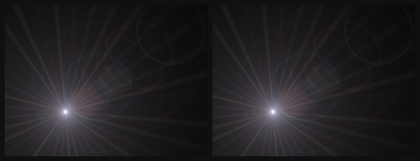
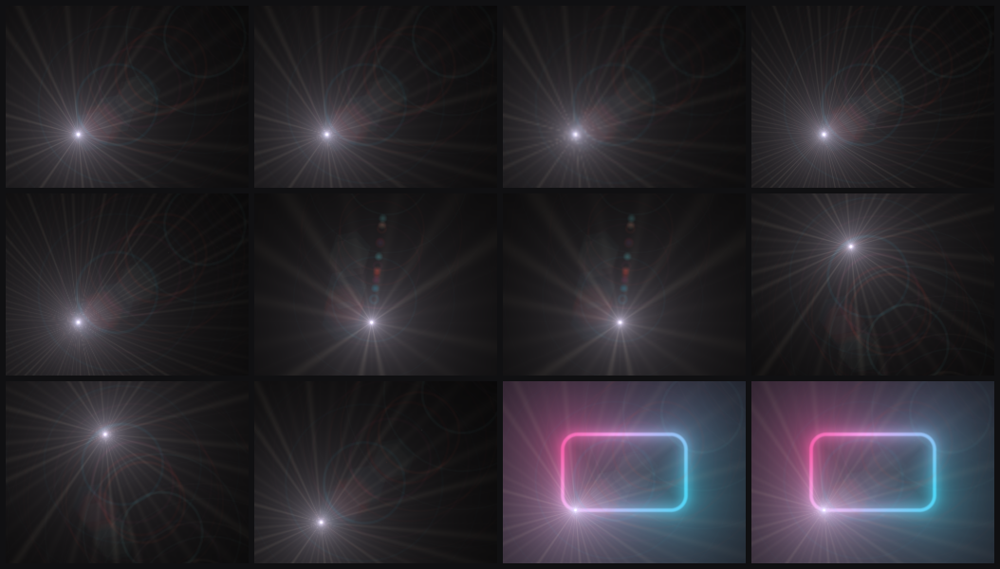
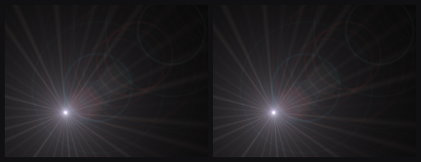
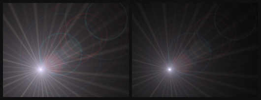

# Unifying the lens flare renderers: visual parity

Evidence that folding `LensFlareOptimizedRenderer` into `LensFlareRenderer` as a
resolution scale changed no pixels that were not meant to change.

Sibling of [`neon-unification-comparison.md`](neon-unification-comparison.md),
which did the same for the neon pair. This was the last forked renderer pair in
the tree; there are none left.

**Result: twelve of twelve scenes are byte-for-byte identical.** The only
behaviour that moved is two things that were broken before and are not now, both
measured in section 4.

## 1. What is being compared

| side | commit | |
| ---- | ------ | - |
| pre-merge | `99f494a` | "update demo with new capis" - two flare renderers |
| merged | working tree | one renderer at `LensFlareConfig::resolutionScale` |

| intent | pre-merge | merged |
| ------ | --------- | ------ |
| full resolution | `LensFlareRenderer` | `LensFlareRenderer`, `resolutionScale 1.0` |
| reduced resolution | `LensFlareOptimizedRenderer` | `LensFlareRenderer`, `resolutionScale < 1.0` |
| perf knob | `Config::optimizedLensFlare` | `LensFlareConfig::resolutionScale` |

This merge was far shallower than the neon one, for two reasons worth recording
because they are why the parity result is so clean:

- **The fragment shader was never forked.** Both renderers already compiled
  `LENS_FLARE_FRAG_SRC`; there was no `lens-flare-optimized.frag`. (`CLAUDE.md`
  claimed otherwise until this merge corrected it.) The optimized renderer's
  only extra shader was the neon's blit, which it already shared.
- **The appearance config was never forked.** `LensFlareConfig` held every
  visual field; `LensFlareOptimizedConfig` held `enable` and `resolutionScale`
  and nothing else.

So the whole behavioural difference between the two `Render` methods was **two
uniforms**: `uResolution` (viewport size vs buffer size) and `uSunPos` (scaled
by the same factor). Everything else - twelve appearance uniforms, the rotation,
the ray-density quantisation - was duplicated verbatim.

That is also why no shader change was needed, where the neon merge had to thread
a `uResolutionScale` into its shader to convert `neon-tuning.h`'s full-res pixel
constants. The flare shader normalises every term by `uResolution`, so it is
scale invariant: handing it the buffer size reproduces the same picture at lower
resolution rather than a differently-shaped one.

## 2. Method

One harness source, compiled twice: with `-DBRANCH`-style `FLARE_FORKED` against
a worktree at the pre-merge commit, and without it against the merged tree. Each
scene is described once, in branch-neutral terms; only the code that writes a
scene into a `Config` is `#ifdef`-ed. A pixel difference is therefore
attributable to the renderers, not to two descriptions of two different pictures.

The harness is scaffolding and is not in the tree - it lived only in the working
tree and a throwaway worktree:

```bash
git worktree add /tmp/premerge <pre-merge-commit> --detach
cmake -S /tmp/premerge -B /tmp/premerge/build -G Ninja && cmake --build /tmp/premerge/build
cmake -S . -B build -G Ninja && cmake --build build
# then compile the harness twice - once against each tree, the older one with
# -DFLARE_FORKED - and compare the two sets of RGBA dumps byte-wise.
```

The harness:

- renders through `OffscreenCapture` at an explicit 512x384, never the window
  backbuffer, so the dump is DPI- and platform-independent
  (see [`capture-util.h`](../lib/include/util/capture-util.h));
- **freezes `rotationRate` at zero**, since `uRotation` is `time *
  rotationRate` and a spinning flare would differ between runs for reasons
  unrelated to the merge;
- ticks the clock exactly once before drawing, identically on both sides;
- registers the neon first and the flare last, matching the demo's order, so
  the compositing scenes exercise the real blend sequence.

## 3. Result

Every RGB byte of all 196,608 pixels per frame, alpha excluded.

| scene | scale | what it exercises | result |
| ----- | ----- | ----------------- | ------ |
| `full` | 1.00 | the direct path | identical |
| `half` | 0.50 | the scaled path | identical |
| `quarter` | 0.25 | a deeper scale | identical |
| `rays_dense` | 1.00 | ray fan at 0.95 density | identical |
| `rays_dense_half` | 0.50 | the same, scaled | identical |
| `ghosts` | 1.00 | wide ghost chain | identical |
| `ghosts_half` | 0.50 | the same, scaled | identical |
| `sun_corner` | 1.00 | sun on a rounded corner | identical |
| `sun_corner_half` | 0.50 | the same, scaled | identical |
| `sun_offset_half` | 0.50 | sun pushed off the edge | identical |
| `over_neon` | 1.00 | flare composited over the neon | identical |
| `over_neon_half` | 0.50 | the same, scaled | identical |

Max channel delta 0, mean delta 0.0000, 0 differing pixels - in every row.

The scenes are not arbitrary. The rays are the highest-frequency thing the flare
draws, so a reduced scale would show there first if it showed anywhere. The
corner and offset scenes exercise `GetSunFragPosition`, whose result is the one
value the scaled path multiplies. The `over_neon` pair checks that the merged
renderer still hands back the blend state the next layer expects.



`full` - left pre-merge, right merged. Max difference 0.



Merged output, in table order.

## 4. What the merge deliberately changed

Two things, both defects before and neither reachable now.

### 4.1 An out-of-range resolution scale is clamped

The old renderer read `optimizedLensFlare.resolutionScale` raw. At `2.0` it
allocated a buffer twice the viewport per axis - four times the fragments - and
downsampled it, which is the exact opposite of what a knob named "resolution
scale" is for. The merged renderer clamps to `(0, 1]`.

| `resolutionScale = 2.0` | mean luma |
| ----------------------- | --------- |
| pre-merge | 33.8161 - supersampled into a 1024x768 buffer |
| merged | 33.7304 - clamped to 1.0 |

The merged figure is exactly the `full` scene's luma, which is the check that
the clamp lands on the direct path rather than somewhere near it.



### 4.2 The flare can no longer be drawn twice

Both renderers shared `Config::lensFlare`, so enabling both drew the same flare
twice, additively. `CLAUDE.md` and the demo UI could only warn about it in
prose. With one renderer the state is not expressible.

| both paths enabled | mean luma |
| ------------------ | --------- |
| pre-merge | 60.9491 - the flare composited over itself |
| merged | 33.7599 - one draw |

The merged figure is exactly the `half` scene's luma. The difference is plainly
visible rather than subtle:



Left: pre-merge, both paths on - washed out, every ray and ghost at roughly
double strength. Right: merged, the same intent, drawn once.

The C ABI keeps the hazard closed too: `EL_RENDERER_LENS_FLARE_OPTIMIZED` is now
a deprecated alias, and both bits are tested through one `if` in
`el_effect_init_with_renderers`, so `EL_RENDERER_LENS_FLARE`, both bits, the
alias alone and `EL_RENDERER_ALL` all register the layer exactly once - verified
at mean luma 50.05234 for all four.

## 5. Conclusion

The renderer merge is visually lossless. Both resolution paths, dense rays, wide
ghost chains, the sun on a corner and off the edge, and compositing over the
neon all reproduce their pre-merge output exactly. The two behaviours that did
move were both bugs: an unclamped scale that could quietly quadruple the
fragment count, and a double-draw that had to be documented because it could not
be prevented.
