# The neon renderer, explained for a newcomer to graphics

This guide is for someone who can read C++ but has not written a renderer
before. It explains, from the ground up, how the neon layer of this library
turns a `Config` into pixels: the graphics ideas it relies on, every
configuration field, every GL object, every render pass with its inputs and
outputs, and what each shader does line by line. It ends with how to change the
code safely.


*What this guide explains: the neon layer at the library's defaults, on a
560 x 280 rect with corner radius 48 in an 800 x 450 frame, hue rotation
frozen. The pale stretch at the top right is not a highlight: the default
gradient blends blue into yellow in RGB, and its midpoint is grey (Part 4.6).*

It is long on purpose. Read Part 1 once, skim Part 2, and keep the rest open as
a map while you read the code. Every claim points at the file that implements
it; when this guide and the code disagree, the code wins (see
[`CLAUDE.md`](../CLAUDE.md): the headers under `lib/include/` are the source of
truth).

**Where this sits among the other docs.** The three neon documents
([`neon-renderer-overview.html`](neon-renderer-overview.html),
[`neon-renderer-explained.html`](neon-renderer-explained.html),
[`neon-renderer-reference.html`](neon-renderer-reference.html)) explain the
shader's design and the reasoning behind each formula. This guide is the
on-ramp to them: it teaches the vocabulary, walks the whole pipeline once in
order, and tells you which of those documents to open for the deep reasons.
[`implementation.md`](implementation.md) is the two-page summary of the
library; [`config-reference.md`](config-reference.md) and
[`effect-reference.md`](effect-reference.md) are per-parameter references.

## Contents

- [Part 0. Conventions used in this guide](#part-0-conventions-used-in-this-guide)
- [Part 1. The graphics you need, tied to this code](#part-1-the-graphics-you-need-tied-to-this-code)
- [Part 2. The library around the neon](#part-2-the-library-around-the-neon)
- [Part 3. What the neon draws, and the model behind it](#part-3-what-the-neon-draws-and-the-model-behind-it)
- [Part 4. Every configuration field](#part-4-every-configuration-field)
- [Part 5. The CPU side: NeonRenderer](#part-5-the-cpu-side-neonrenderer)
- [Part 6. Every pass: inputs, state, outputs](#part-6-every-pass-inputs-state-outputs)
- [Part 7. The shaders, line by line](#part-7-the-shaders-line-by-line)
- [Part 8. The reduced-resolution path in depth](#part-8-the-reduced-resolution-path-in-depth)
- [Part 9. Working on the neon](#part-9-working-on-the-neon)
- [Glossary](#glossary)

---

## Part 0. Conventions used in this guide

**Files.** `neon-renderer.cpp` means `lib/src/renderer/neon-renderer.cpp`;
`neon-renderer.h` is `lib/include/renderer/neon-renderer.h`; `neon.frag`,
`neon.vert`, `neon-emission.frag`, `neon-blit.frag` and `black-rect.frag` live
in `lib/shaders/`; `neon-tuning.h` is `lib/include/renderer/neon-tuning.h`;
`config.h` is `lib/include/core/config.h`. Line numbers are deliberately left
out: they move with every commit. Search for the function or constant name.

**Units.** Three pixel units appear everywhere, and confusing them is the most
common mistake in this code:

| Unit | Meaning |
| ---- | ------- |
| **full-res px** | One pixel of the framebuffer the host asked us to draw into (the "destination"). Every `Config` length is in full-res px. |
| **scaled px** | Full-res px multiplied by `NeonConfig::resolutionScale`. Below scale 1.0 the neon shades into a smaller buffer, and every pixel-valued uniform it uploads is in this unit. At scale 1.0 the two are the same. |
| **perimeter fraction** | A position or length along the rectangle's outline, as a fraction of its total length: 0 to 1 walks once around. Arcs and segments are authored in this unit. |

**Spaces.** "Rect-local" means coordinates with the origin at the rectangle's
centre, +x right and **+y up**. "App coordinates" are the host's: origin at the
top-left of the viewport, +y **down**. Part 1.3 explains the conversions.

**Scale 1.0 vs below.** "The direct path" is `resolutionScale == 1.0`; "the
scaled path" or "the reduced path" is anything below it. Part 8 is entirely
about the second.

**Figures.** Every image in this guide is rendered by the library itself,
offscreen, by [`tools/neon-guide-figures`](../tools/neon-guide-figures/README.md):
a fixed config, time frozen, so a rerun on the same GPU writes the same bytes.
The pass figures in Parts 5, 6 and 8 are the renderer's real intermediate
buffers, read back between its draws (Part 9.2 says how). When the look
changes, regenerate them rather than editing them by hand.

---

## Part 1. The graphics you need, tied to this code

Each section explains one idea in general terms, then says exactly where this
code uses it. If you already know OpenGL, skim the "In this code" paragraphs.

### 1.1 The GPU pipeline in one picture

A GPU draws triangles. Everything else is built on that. One **draw call**
(here `glDrawArrays`, wrapped by `VertexArray::DrawArrays`) sends a list of
vertices through a fixed sequence of stages:

```
 CPU (C++)                                   GPU
 ---------                                   ---
 vertex buffer  --->  [vertex shader]  runs once per vertex:
 (positions)          computes where the vertex lands on screen (gl_Position)
                            |
                            v
                      [rasterizer]  fixed-function: finds every pixel each
                      triangle covers, and interpolates the vertex shader's
                      outputs ("varyings") across the triangle
                            |
                            v
 uniforms,      --->  [fragment shader]  runs once per covered pixel
 textures,            ("fragment"): computes that pixel's colour
 uniform buffers            |
                            v
                      [blending]  fixed-function: combines the new colour with
                      what is already in the framebuffer, using the blend
                      function the CPU chose (glBlendFunc)
                            |
                            v
                      framebuffer (the image being drawn: the window, or an
                      offscreen texture)
```

The two programmable stages are small programs written in **GLSL**, compiled
at runtime by the GPU driver. A **vertex shader** plus a **fragment shader**
linked together is a **program** (`ShaderProgram` in this code).

Two facts about the fragment shader drive the whole design of the neon:

- It runs **in parallel**, once per pixel, and each invocation cannot see the
  others' results. So per-pixel work must be expressible as "a function of this
  pixel's position and some shared inputs".
- It is where almost all the cost is. A full-screen glow at 1920x1080 is two
  million fragment invocations per frame. Making each one cheaper, or running
  fewer of them, is what every optimisation here is about.

**In this code.** The neon draws a few triangles (one rectangle, or a
rectangle with a hole cut out, built on the CPU) and puts all the visual
complexity in the fragment shader `neon.frag`. There is no mesh of the glowing
tube. Part 3 explains why.

### 1.2 Shader inputs: attributes, varyings, uniforms, samplers, blocks

A shader receives data in a few distinct ways. The names follow a convention
in this repo: `a` prefix for attributes, `v` for varyings, `u` for uniforms.

| Kind | What it is | Changes | Example in this code |
| ---- | ---------- | ------- | -------------------- |
| **attribute** | per-vertex data read from a vertex buffer | per vertex | `aPos` in `neon.vert`: a 2D position |
| **varying** | output of the vertex shader, interpolated across the triangle, input to the fragment shader | per fragment | `vPos`: the same position, interpolated, so every fragment knows where it is |
| **uniform** | a single value set from the CPU before a draw | per draw | `uLineWidth`, `uGlowRadius`, `uMVP` |
| **sampler** | a handle to a texture the shader can read | per draw | `uGradientLUT`, `uEmission` |
| **uniform block (UBO)** | a struct of values, usually arrays, stored in a GPU buffer and bound by index | per draw | `LoopSamplesBlock`, `SegmentBlock`, `ArcBlock` |

The CPU sets a uniform with `glUniform*` while the program is in use; in this
code that is `ShaderProgram::SetUniform(name, value)`, which also caches the
uniform's location and skips the GL call when the value has not changed.

**Outputs.** A fragment shader writes one or more `out vec4` variables. One
output goes to the framebuffer's single colour attachment; several outputs
(with `layout(location = N)`) go to several attachments at once. This is
called **multiple render targets (MRT)**. The neon's gather pass uses it
(`oGather`, `oGatherSeg`; Part 6).

### 1.3 Coordinate spaces and the MVP matrix

The GPU wants each vertex's position in **normalised device coordinates
(NDC)**: x and y from -1 to +1 across the viewport, +y up. Nobody wants to
author geometry in NDC, so the vertex shader multiplies the vertex position by
a matrix, conventionally called the **MVP** (model-view-projection). For 2D
work like this, the MVP is just "translate, then map a pixel rectangle onto
-1..+1", built with `glm::translate` and `glm::ortho`.

The neon uses four spaces (see also [`coordinate-system.md`](coordinate-system.md)):

```
 App coords                 GL window coords          Rect-local            NDC
 (Config, host UI)          (gl_FragCoord, viewport)   (vertices, vPos)      (gl_Position)

 (0,0)----------> +x        +y ^                       +y ^                  +1 ^
   |   +----+                  |   +----+                 |  +--+              |
   |   |rect|                  |   |rect|              ---+--|--+-->+x     -1 -+- +1
   v   +----+                  |   +----+                 |  +--+              |
  +y                     (0,0) +----------> +x       origin = rect centre   -1 v
```

The conversions, in the order the code applies them (`NeonRenderer::Render`):

```
centerFull.x = position.x + width/2                      // rect centre, GL window x
centerFull.y = viewportHeight - position.y - height/2    // y is FLIPPED (app y-down -> GL y-up)
mvp = ortho(0, viewportW, 0, viewportH) * translate(centerFull)
gl_Position = mvp * vec4(rectLocalVertex, 0, 1)
```

So a vertex at rect-local `(0, 0)` lands on the rectangle's centre, and a
vertex at `(width/2, 0)` lands on its right edge. `vPos`, the interpolated
rect-local position, is what `neon.frag` measures everything from.

`gl_FragCoord` is the other position a fragment shader can read: the pixel's
centre in **GL window coordinates** (origin bottom-left, `+0.5` at pixel
centres). `black-rect.frag` and `neon-blit.frag` use it instead of `vPos`,
which is why they receive the rect centre as `uRectCenter` in that space.

**Worked example.** Viewport 1280x720, rect at app position (320, 180), size
640x360. Then `centerFull = (320 + 320, 720 - 180 - 180) = (640, 360)`: the
rect is centred on screen. The rect's top edge in app coords is y = 180; in
rect-local coords it is y = +180 (up is positive); in GL window coords it is
y = 720 - 180 = 540.

### 1.4 Textures, samplers, filtering and wrap modes

A **texture** is an image in GPU memory. A shader reads it through a
**sampler** at a **texture coordinate** (u, v), each running 0..1 across the
image. Three settings decide what a read returns:

- **Filtering.** `GL_NEAREST` returns the single texel the coordinate falls in.
  `GL_LINEAR` blends the four nearest texels by distance (**bilinear
  filtering**). Linear filtering is how a 256-texel colour strip becomes a
  smooth gradient, and how a half-resolution image is upscaled smoothly.
- **Wrap mode.** What happens outside 0..1. `GL_REPEAT` wraps around (u = 1.1
  reads the same as u = 0.1); `GL_CLAMP_TO_EDGE` repeats the edge texel.
- **Format.** How each texel is stored. `GL_RGBA8` is four 8-bit channels,
  values 0..1 in steps of 1/255. `GL_RGBA16F` is four 16-bit floats: more
  precision, values above 1 allowed, twice the memory, and not renderable on
  every GLES 3.0 device without an extension.

GLSL offers three ways to read:

| Call | What it does | Used for |
| ---- | ------------ | -------- |
| `texture(s, uv)` | filtered read; the GPU picks the mip level from screen-space derivatives | colour LUTs |
| `textureLod(s, uv, 0.0)` | filtered read from level 0, no derivatives needed | the gather buffer, read in non-uniform control flow (see 1.10) |
| `texelFetch(s, ivec2(x, y), 0)` | exact texel by integer index, no filtering | the emission table, where neighbouring texels are unrelated data |

**In this code.** Look-up tables (LUTs) are textures baked on the CPU:

| Texture | Size | Format | Filter | Wrap (u) | Holds |
| ------- | ---- | ------ | ------ | -------- | ----- |
| `uGradientLUT` | `gradientLutSize` x 1 (256 by default) | RGBA8 | LINEAR | REPEAT | the colour ring: the main gradient around the perimeter |
| `uSegmentLUT` | 128 x 8 | RGBA8 | LINEAR | CLAMP | one row per travelling segment with its own colours |
| `uArcLUT` | 128 x 8 | RGBA8 | LINEAR | CLAMP | one row per arc with its own colours |
| `uEmission` | 128 x 2 | RGBA16F (RGBA8 fallback) | NEAREST | CLAMP | per-sample colour and weight, rebaked by a pre-pass |
| `uGather`, `uGatherSeg` | depends on the rect | RGBA16F (RGBA8 fallback) | LINEAR | CLAMP | the gather's results, below scale 1.0 only |
| `uSource` (blit) | the reduced buffer | RGBA8 | LINEAR | CLAMP | the glow shaded at reduced resolution |

The colour ring uses `REPEAT` so that rotating the hue is a single addition
to u (u past 1 wraps). The atlases use `CLAMP` because an arc's gradient has
two ends that must not bleed into each other. LUTs are always RGBA8 because
float textures are not universally supported on the embedded GPUs this
library targets.

### 1.5 Uniform buffers and std140

A plain uniform holds one value. When a shader needs an array (128 perimeter
points, up to 8 arcs), the portable way is a **uniform block**: a GLSL struct
backed by a GPU buffer. The CPU fills a byte buffer laid out by the **std140**
rules (every `vec4` on a 16-byte boundary; an `int` followed by an array is
padded to 16 bytes), uploads it with `glBufferData`, and binds it to a numbered
**binding point** with `glBindBufferBase`. The program is told which binding
point each block reads with `glUniformBlockBinding`.

**In this code.** `UniformBuffer` wraps the buffer (`SetData` skips the upload
when the bytes are unchanged, `BindBase(n)` binds it);
`ShaderProgram::SetUniformBlockBinding` ties a block name to a point. The neon
uses three blocks:

| Block | Binding | C++ mirror | std140 layout |
| ----- | ------- | ---------- | ------------- |
| `SegmentBlock` | 0 | `SegmentBlockData` | `int uSegmentCount` (padded to 16 B), `vec4 uSegments[8]`: 144 bytes |
| `LoopSamplesBlock` | 1 | `LoopSamplesBlockData` | `vec4 uLoopSamples[128]`: 2048 bytes |
| `ArcBlock` | 2 | `ArcBlockData` | `int uArcCount` (padded), `vec4 uArcs[8]`: 144 bytes |

Each C++ mirror has a `static_assert` on its size, so a layout mistake fails
the build instead of corrupting the shader's view of the data.

**A hard rule of this repo:** never declare a bare uniform array
(`uniform vec4 uFoo[8];`). It works on desktop GL, so testing will not catch
it, but it is not available on the restricted GL targets this library ships
to. Arrays go in a std140 block, sized by a constant from a tuning header.

### 1.6 Framebuffers, render targets and offscreen rendering

A **framebuffer** is "where draws go". The window has a default one (id 0).
A **framebuffer object (FBO)** is one you create, with one or more textures
attached as its colour outputs. Drawing into an FBO and then reading its
texture in a later pass is **render-to-texture**: the basic tool of any
multi-pass effect.

Things to know:

- **Viewport.** `glViewport(x, y, w, h)` maps NDC onto a pixel rectangle of the
  bound framebuffer. Switching to a 640x360 FBO without setting a 640x360
  viewport draws garbage. `Framebuffer::Bind()` sets both.
- **Restore what you were handed.** A renderer that switches to its own FBO
  must switch back to whatever was bound before, which is not necessarily the
  window (a frame capture binds a real FBO). The code captures it with
  `RenderTargetState::Capture()` / `Framebuffer::GetBoundId()` and restores it
  afterwards, never with `BindDefault()`.
- **Completeness.** A framebuffer is only usable if the driver accepts its
  attachments' formats (`glCheckFramebufferStatus`). RGBA8 is always accepted;
  RGBA16F needs an extension on GLES 3.0. `Framebuffer::Resize` returns false
  when the driver refuses, and the neon then tries the next format in a list.
- **Clearing.** `Framebuffer::ClearBuffer()` uses `glClearBufferfv`, which does
  not touch the global clear-colour state. A clear respects the scissor box,
  which is why offscreen passes disable the host's scissor
  (`GLUtils::NoScissorScope`).

**In this code.** The neon owns three FBOs: the emission table (always), and
below scale 1.0 the gather buffer and the reduced colour buffer (Part 5.1).

### 1.7 Blending and premultiplied alpha

Blending decides how a fragment's colour combines with the framebuffer pixel
it lands on. With `glBlendFunc(src, dst)` the hardware computes
`final = src * fragmentColour + dst * framebufferColour`.

The neon writes **premultiplied alpha**: its colour output is already
multiplied by its coverage, and alpha is that coverage. It blends with
`glBlendFunc(GL_ONE, GL_ONE_MINUS_SRC_ALPHA)`:

```
final.rgb = fragment.rgb + framebuffer.rgb * (1 - fragment.a)
```

That reads as "add my light, and hide what is behind me in proportion to how
opaque I am". Three reasons it is used here:

1. **Bilinear filtering stays correct.** Averaging premultiplied pixels gives
   the right answer; averaging straight-alpha pixels leaves dark fringes where
   a transparent black texel is averaged with a coloured one. The reduced path
   upsamples a premultiplied buffer, so this matters.
2. **It composites over real content.** The neon's alpha is the brightest
   channel of the graded colour, so the bright core occludes the
   background while the faint glow is nearly additive. A host blending the
   layer over video depends on half coverage reading as alpha 0.5.
3. **Masks are simple.** Fading the layer out at an edge is one multiply of
   the whole `vec4`.

Two exceptions in the neon: passes that write **data** rather than colour (the
emission table, the gather buffer) and the reduced colour buffer's first write
draw with blending **disabled**, so values are stored as computed.

Note: the library sets blend state itself (each renderer enables `GL_BLEND`
and picks its function, and leaves `GL_SRC_ALPHA, GL_ONE_MINUS_SRC_ALPHA`
behind), but it never sets the blend *equation*. The host must leave it at
`GL_FUNC_ADD` (Part 2.3).

### 1.8 Signed distance fields

A **signed distance field (SDF)** is a function that returns, for any point,
the distance to a shape's outline: negative inside, zero on the outline,
positive outside. For a rounded rectangle there is an exact six-line formula,
used by every neon shader:

```glsl
float sdRoundBox(vec2 p, vec2 b, float r)   // b = half size, r = corner radius
{
    vec2 q = abs(p) - b + r;                 // fold into one quadrant, shrink by r
    return min(max(q.x, q.y), 0.0)           // inside: distance to the nearest edge
         + length(max(q, 0.0))               // outside: distance to the corner box
         - r;                                // grow back by r, which rounds the corners
}
```

Why it matters: the distance `d` of a pixel from the outline is exactly what
decides how bright a glow is there. Every contour of constant `d` is itself a
rounded rectangle (inside, its corner radius shrinks by the depth and reaches
0 at `d = -r`), so corners need no special handling: a glow 40 px wide
follows the corner curve at the right width automatically. With an SDF, "draw
a soft line" becomes "make brightness a function of `|d|`".

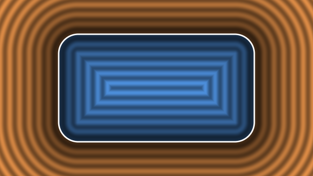

*`sdRoundBox` for a 400 x 220 rect with radius 40: blue inside, orange outside,
one band per 20 px of distance, white where `d = 0`. Outside, every band is a
rounded rectangle with a growing radius; inside, the radius shrinks with depth
and the bands turn sharp-cornered past 40 px.*

### 1.9 Tone mapping and gamma

Physically motivated light values can be far above 1.0 (the neon's filament
core is multiplied by 12). A framebuffer stores 0..1. **Tone mapping** is the
curve that compresses unbounded values into 0..1 while keeping the
relationship between dim values. The neon uses a Reinhard curve on the
brightest channel:

```
peak   = max(r, g, b)
result = result * (peak / (peak + 0.6)) / peak     // scale all channels by the same factor
result = pow(result, 0.85)                         // a mild gamma lift
```

Scaling all three channels by the same factor keeps the hue: a saturated
orange stays orange instead of washing out to peach, which is what a
per-channel curve would do. It also means the filament does **not** turn
white, however far above 1.0 its gain of 12 drives it: the curve flattens its
brightness and leaves its hue alone. Only the final `pow(..., 0.85)` lifts the
smaller channels a little (a cyan core's red channel leaves the map at 0.14
and the lift at 0.19, next to a green of 0.79). A line reads white only where its colour is pale
to begin with.

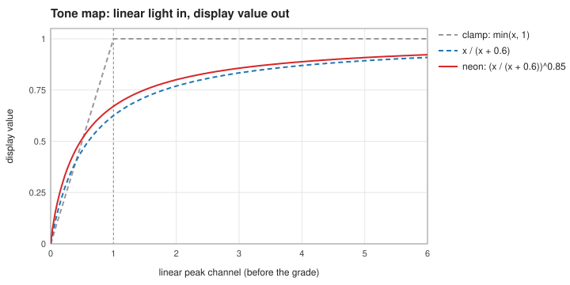

*The curve the grade applies to the brightest channel. A clamp (grey) throws
away everything above 1.0; `x / (x + 0.6)` (blue) keeps squeezing it toward 1
without reaching it, so a filament at 12 and a glow at 0.5 stay apart; the
gamma lift (red) is the final curve.*

### 1.10 Antialiasing, derivatives, and uniform control flow

A hard edge (`d < 0 ? 1 : 0`) staircases. The fix is to fade over about one
pixel. To know how many units "one pixel" is, the shader asks the GPU for the
**screen-space derivative** of `d`: `fwidth(d) = abs(dFdx(d)) + abs(dFdy(d))`,
how much `d` changes between this pixel and its neighbour. Then
`smoothstep(-w, w, d)` with `w` derived from it gives a one-pixel ramp.

Derivatives work because the GPU shades pixels in 2x2 blocks ("quads") and
subtracts neighbours' values. That has a catch: **if some pixels of a quad
have taken a different branch, or have already discarded, the neighbour's
value does not exist and the derivative is undefined.** So:

- Compute every derivative at the top of `main()`, before any `discard` or
  any branch that depends on per-pixel values. `neon.frag` has exactly one
  derivative (`sideAA`, from `fwidth(d)`), computed before every discard.
- A branch on a **uniform** is safe: every pixel in the draw takes the same
  path. The neon branches on uniforms freely (`uSegmentCount > 0`,
  `uCornerRadius > 0.0`, the resolution scale).
- `texture()` also uses derivatives internally (to choose a mip level). Where a
  texture is read after per-pixel branching, use `textureLod(..., 0.0)`.

One more GLSL trap used carefully here: `smoothstep(edge0, edge1, x)` is
**undefined** when `edge0 >= edge1`. A fade that should go from 1 to 0 is
written `1.0 - smoothstep(lo, hi, x)`, never `smoothstep(hi, lo, x)`.

### 1.11 Render passes and tile-based GPUs

A **pass** is a group of draws into one render target. Mobile and embedded
GPUs are mostly **tile-based**: they render the screen in small tiles kept in
fast on-chip memory, and only write a tile out to main memory when the pass
ends. Switching to another render target and back forces a store and a reload
of the whole target, which costs bandwidth.

**In this code.** `NeonRenderer::Render` runs in two phases: first every pass
that draws into its own buffers, then everything that draws onto the caller's
framebuffer, in one unbroken run. That ordering exists for tilers.

### 1.12 Resolution scaling and smoothness

Shading at half resolution and upsampling with bilinear filtering costs a
quarter of the fragments. It works for content that is **smooth** (changes
slowly from pixel to pixel), like a wide glow. It destroys content that is
**sharp**, like a 2 px line, and it blurs any hard edge. The neon's reduced
path is built around this: smooth parts at reduced or even coarser
resolution, sharp parts at full resolution in a thin ring around the line.
Part 8 explains the details, and Part 8.3 shows what a 2 px line looks like
with and without that ring.

---

## Part 2. The library around the neon

### 2.1 How shaders get into the binary

Shaders are not loaded from disk. At **CMake configure time**,
`lib/CMakeLists.txt` reads every file in `lib/shaders/` with `file(READ ...)`
and substitutes it into `lib/shaders/shaders.h.in` with `configure_file`,
producing `build/lib/generated/shaders.h`. Each shader becomes a C++ raw
string, for example `EdgeLighting::ShaderSource::NEON_FRAG_SRC`.

The final source of `neon.frag` is assembled in this order:

```
#version 330 core                  <- @GLSL_VERSION@: "330 core" on macOS, "300 es" elsewhere
[#define NEON_READS_GATHER]        <- only for the variant, spliced in at RUNTIME by WithDefine()
<contents of neon-tuning.h>        <- @NEON_TUNING@: shared constants, verbatim
<contents of neon-common.glsl>     <- @NEON_COMMON@: starts with "precision highp float;"
<contents of neon.frag>
```

`neon-gather.frag` is built the same way, minus the `#define`, with its own
contents last.

- **The tuning header** (`neon-tuning.h`) is plain `#define`s, so it compiles
  identically as C++ and as GLSL. That is how the CPU and the shader share
  constants like `MAX_ARCS` or `GLOW_REACH_RADIUS_FACTOR` without drifting.
  (GLSL ES 3.00 has no `constexpr` and rejects the `f` suffix, hence macros.)
  It is injected into `neon.frag`, `neon-gather.frag`, `neon-emission.frag`
  and `neon-blit.frag`, but not into `black-rect.frag` or `neon.vert`.
- **A shared GLSL chunk.** GLSL has no `#include`, so code two shaders share
  goes in a `.glsl` file injected the same way. `neon-common.glsl` holds the
  gather loop (`gatherPerimeter`) and the declarations it reads; it goes into
  `neon.frag`, which calls the loop inline at scale 1.0, and `neon-gather.frag`,
  which calls it alone below 1.0. One copy, so the two paths cannot drift.
- **Variants.** `neon.frag` is compiled two ways from one source.
  `WithDefine` in `neon-renderer.cpp` inserts `#define NEON_READS_GATHER` right
  after the `#version` line, which must stay first. Part 7.3 lists what each
  program includes.
- **Editing a shader or a tuning header re-runs configure automatically** on
  the next build, because `CMAKE_CONFIGURE_DEPENDS` lists them all.
- **Adding a new shader file** means updating three places: both lists in
  `lib/CMakeLists.txt` and `shaders.h.in`. Do not write an `@NAME@`
  placeholder in a comment in `shaders.h.in`: `configure_file` expands it
  there too.

### 2.2 The orchestrator and one frame

`EdgeLightingEffect` (`lib/include/core/edge-lighting.h`) owns the state and a
list of renderers; it draws nothing itself.

```
host                     EdgeLightingEffect                       NeonRenderer
----                     ------------------                       ------------
SetConfig(cfg) -------> base config = cfg
                        (no-op if cfg == base)
                        refreshActiveConfig() ---- if active changed ---> OnConfigChanged(active)

Update(dt) ------------> clock.Update(dt) -> animations.Update(clockDt)
                        refreshActiveConfig():
                          active = base + every attached animation's overlay
                          if active changed: --------------------------> OnConfigChanged(active)
                        for each renderer: --------------------------> Update(dt, clockTime, active)

Render(w, h) ---------> for each renderer, in layer order: ----------> Render(w, h, clockTime, active)
```

Points that matter for the neon:

- **Base vs active config.** `SetConfig` writes the *base* (what the host
  authored). Attached animations write overlays on top every frame, producing
  the *active* config, which is what renderers see. `GetActiveConfig()` reads
  it back (the demo's sliders show it).
- **`OnConfigChanged` is not per-frame.** It fires only when the active config
  actually changed (every sub-struct has an `operator==` covering all fields).
  An idle effect never calls it; a running animation calls it nearly every
  frame. The renderer then rebuilds only what the changed fields feed.
- **`Update` receives the raw host `dt`**, even while the effect's clock is
  paused. The neon uses it for the colour cross-fade, which therefore keeps
  running when animations are paused.
- **Layer order.** Renderers composite by blending in the order they draw.
  The default order is neon, droplets, lens flare, spotlight, debug
  (`GetDefaultLayerOrder`); a host can reorder with `SetLayerOrder`.

### 2.3 The renderer contract and the host's GL state

Every layer subclasses `BaseRenderer` (`lib/include/renderer/base-renderer.h`):

| Method | When | The neon's job there |
| ------ | ---- | -------------------- |
| `Initialize()` | once | compile the always-needed programs, allocate the emission table, build geometry and LUTs |
| `OnConfigChanged(cfg)` | on a real change | mark what is stale and rebuild it (Part 5.3) |
| `Update(dt, t, cfg)` | every frame | advance the colour cross-fade |
| `Render(w, h, t, cfg)` | every frame | run the pass schedule (Part 5.5) |
| `GetLayer()` | any time | returns `RendererLayer::NEON` |

`AddRenderer` calls `OnConfigChanged` once immediately, so a renderer must
accept it before `Initialize` (the neon stores the config and builds from it
in `Initialize`).

**What the host must provide** (the library assumes it and never sets it):

- the viewport set to `(0, 0, w, h)` for the `w, h` passed to `Render`
  (shaders compare `gl_FragCoord` against uniforms with that origin);
- `GL_CULL_FACE` off (or a winding the geometry survives);
- the colour write mask fully on, including alpha;
- the blend equation `GL_FUNC_ADD`;
- depth test and depth writes off.

Any framebuffer may be bound (the window or an FBO); the neon returns to it
after its offscreen passes. A host scissor box is honoured on the caller's
framebuffer and suspended for the neon's own buffers. The guards
`GLUtils::NoCullScope` and `GLUtils::CompositeStateScope` exist for a host that
wants to force the state above around its `Render` call.

### 2.4 The GL wrappers

Renderer code never calls `glGen*` / `glDelete*` directly. It uses move-only
RAII wrappers in `lib/include/gl/`:

| Wrapper | Wraps | Things a newcomer trips on |
| ------- | ----- | -------------------------- |
| `ShaderProgram` | compile + link (`glCreateShader`, `glLinkProgram`), `glUseProgram`, `glUniform*`, `glUniformBlockBinding` | Call `Use()` before `SetUniform`. A missing uniform (optimised out or misspelt) logs one ERROR line, once. Unchanged values are not re-sent. |
| `VertexArray` | one VAO + one VBO | Creates its GL names in the **constructor**, so a context must be current. Does not unbind after use. The attribute format is set once and remembered by the VAO. |
| `Framebuffer` | FBO + 1-3 colour textures | `Resize` is a no-op when nothing changed, so call it every frame; a format, filter or size change reallocates. `Bind()` also sets the viewport. `Release()` frees memory; never while the FBO is bound mid-pass. |
| `UniformBuffer` | a std140 UBO | `SetData` skips identical bytes; the caller does the std140 packing. |
| `Texture` / `Texture2D` | a 2D texture | Uploads switch the active unit to 0; `BaseLUT::Upload` saves and restores it. |
| `RenderTargetState` (in `framebuffer.h`) | saved framebuffer + viewport | `Capture()` before going offscreen, `Restore()` after. |

`lib/include/util/capture-util.h` (`OffscreenCapture`, `CaptureUtil::Read*`,
`WritePNG`) is how to grab pixels for debugging (Part 9.2).

### 2.5 How animated values reach the neon

`Modulator`s are pure functions of time (`Oscillator`, `Ease`, ...).
`Animation`s own modulators and a play state, and write into a `Config` in
`Apply`. `FieldBoundAnimation` binds modulators to named fields
(`AnimatableField::NEON_INTENSITY`, arc and segment fields, colour stops) at
runtime; `neon-animations.h` has ready-made ones (`IntensityPulse`,
`GlowRadiusBreath`, `SegmentTravel`, `OutlineTracer`, `ArcWipe`, ...). All of
them only ever produce a new active config. The neon cannot tell an animated
value from one the host set: it sees a changed config, rebuilds what that
field feeds, and uploads the uniform. That is why every visual knob is a
`Config` field and nothing is hidden in renderer state.

### 2.6 The C ABI

`lib/capi/` wraps the library in a flat C interface for P/Invoke, ctypes or
cgo. Each `el_effect_set_*` writes a field of a **staging** config held in the
handle (for example `el_effect_set_line_width` writes `neon.lineWidth`), and
`el_effect_update` is the only call that pushes staging into the effect with
`SetConfig`. Part 4 lists the setter for each neon field.

---
## Part 3. What the neon draws, and the model behind it

### 3.1 The picture

The neon layer draws a glowing outline around a rounded rectangle, like a
neon tube bent into that shape. Up close it has three parts, built separately
and added together:

```
        bloom: wide, soft spill (falls off like 1/distance)
     .------------------------------------------------.
    |   halo: tight coloured glow (like 1/distance^2)   |
    |   .----------------------------------------.      |
    |  |  filament: the bright line itself          |     |
    |   '----------------------------------------'      |
     '------------------------------------------------'
   outline of the rect  <--- d = 0 (signed distance)
```

| Layer | Shape across the line | Width set by | Gain |
| ----- | --------------------- | ------------ | ---- |
| **filament** | a bell curve, steep sides | `lineWidth`, `filamentFalloff` | `FILAMENT_GAIN` = 12 |
| **halo** | falls off roughly as 1/distance^2 | `glowRadius` | `HALO_GAIN` = 0.9 |
| **bloom** | falls off roughly as 1/distance | `glowRadius` x 6 | `bloomStrength` |

The filament's gain of 12 puts the line far out on the flat end of the tone
curve (Part 1.9), so it reads at full brightness in its own colour, while the
much dimmer halo and bloom stay on the curve's steep part and keep their
gradation.

| filament only | halo only | halo + bloom | all three |
| :-: | :-: | :-: | :-: |
|  |  |  |  |

*The three layers, one at a time, around the top-left corner of the same rect.
One hue so only brightness differs: `lineWidth` 4, `glowRadius` 8,
`bloomStrength` 0.35. "Filament only" is `glowRadius` 0; "halo only" is
`lineWidth` 0 and `bloomStrength` 0; "halo + bloom" is `lineWidth` 0.*

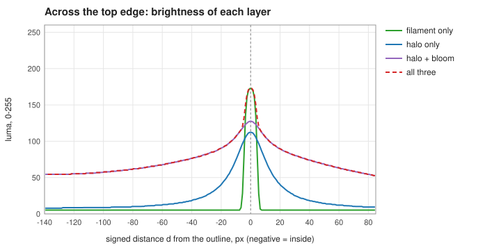

*The same four renders, read down the frame's centre column across the top
edge. The filament is a spike reaching about 7 px either side (its reach,
Part 5.7); the halo is near the background 60 px out; the bloom's
1/distance tail is still above 40% of its peak 140 px inside, where the four
edges' light sums to a floor. The peak of "all three" is not the sum of the
others: the tone map compresses it.*

On top of that:

- **Colour** varies around the outline: a gradient authored as colour stops
  (`colorStops`), optionally rotating over time (`hueRotationRate`).
- **Arcs** decide which stretches of the outline are lit at all, each with its
  own brightness and optionally its own gradient (`arcs`). The default is one
  arc covering the whole outline.
- **Segments** are travelling bright spots added on top (`segmentBoosts`).
- **Glow side** restricts the glow to the inside or the outside of the line
  (`glowSide`), and **cutoffs** cap how far it reaches in each direction
  (`insideCutoff`, `outsideCutoff`).
- An **opaque fill** can paint a solid colour band under the glow
  (`opaqueMode`, `opaqueColor`), for example to black out the screen behind a
  card's edge.

### 3.2 One quad, two measurements

The instinct is to build a mesh of the glowing tube. This renderer does the
opposite. It draws one rectangle large enough to cover everywhere light can
land (the **glow quad**), and the fragment shader answers, for every pixel
inside it, "how bright and what colour am I?" from two numbers:

- **`d`, the signed distance to the outline** (Part 1.8). Decides
  *brightness*: the three layers are functions of `|d|`.
- **`t`, the position along the outline**, from 0 to 1. Decides *colour* and
  *which stretches are lit*: colour stops, arcs and segments are all authored
  in `t`. The shader computes it in `perimeterPosition(vPos)`: find the
  nearest point on the outline, decide which of its eight pieces it is on (four
  straight edges, four corner arcs), and convert to a fraction of the total
  length.

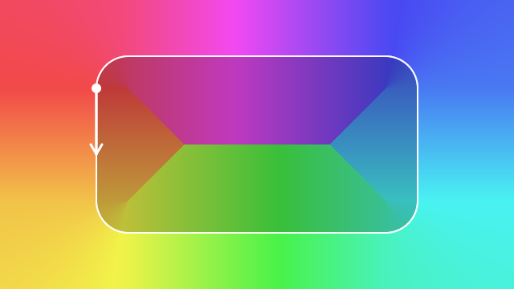

*`t` for every pixel of a 400 x 220 rect, as a hue wheel (red at 0 and 1),
computed with `neon.frag`'s own `perimeterPosition`; the arrow marks `t = 0`
and the default winding. Outside, the corner arcs fan out and `t` is
continuous. Inside, it jumps along the four corner diagonals and the
horizontal centre line, where the nearest edge changes. Anything read at a
pixel's own `t` inherits those seams.*

`t` matches the CPU's `GeometryUtils::GetPointOnRectangle` exactly, which is
what lets an arc authored as "0.25 to 0.5" line up with what is drawn. Where
`t = 0` is, and which way it runs, is set by `RectGeometry::winding`:

```
 COUNTER_CLOCKWISE (default)              CLOCKWISE
 t=0 at the top of the left edge,         t=0 at the left end of the top edge,
 runs down the left side                  runs right along the top

      .----------------.                       *--------------->
   *  |                |                       |                |
   |  |                |                       |                |
   v  '----------------'                       '----------------'
```

| `COUNTER_CLOCKWISE` | `CLOCKWISE` |
| :-: | :-: |
|  |  |

*One arc from `t = 0` to 0.25 with its own stops, red at its head and yellow at
its tail, under each winding.*

### 3.3 Colour: stops, the ring LUT, and the gather

**Stops become a texture.** The CPU turns `colorStops` into a 256-texel strip
(`GradientRingLUT::Bake`): sort the stops, then for each texel blend the two
stops around it in the chosen `blendSpace` (RGB, HSV or HSL). The strip
repeats (texel 255 blends back into texel 0), so the gradient is a closed
loop. The shader never sees the stops, only the strip. Changing a colour
re-bakes the strip; if `colorTransitionDuration > 0` the renderer cross-fades
the old strip into the new one over that many seconds, re-uploading every
frame (`GradientRingLUT::Tick`).

**Why colour is gathered, not looked up.** The obvious approach, read the
strip at the pixel's own `t`, breaks at corners: `t` jumps across the
diagonal from a corner (a pixel just above the diagonal is "nearest" to the
top edge, one just below is "nearest" to the side), so the colour would have a
hard seam along every corner diagonal. Instead each pixel takes a **weighted
average of the colour at `N` points spaced around the whole outline**
(`numSamples`, 128 by default), weighting each point by how close it is:

```
for each perimeter sample i:
    dist2 = |vPos - sample_i|^2
    g     = 1 / (dist2 + kc^2)                 // a Lorentzian ("Cauchy") weight
    colourSum += colour_i * g ;  weightSum += g
colour = colourSum / weightSum
```

This loop is **the gather**. Its result is smooth everywhere, including across
corner diagonals, because nearby samples on both sides contribute. `kc` is
the kernel width: `perimeter x COLOR_BLEND_PERIM_FRAC` (0.0088), so it scales
with the rectangle and a gradient looks the same at any size. It is about
one sample spacing, which prevents the samples from showing as beads.

| colour read at each pixel's own `t` | colour gathered (the real render) |
| :-: | :-: |
|  |  |

*Right: the library's render of three stops with a wide glow (`glowRadius` 24,
`bloomStrength` 1). Left: the same pixels at the same brightness, recoloured
on the CPU from the gradient at each pixel's own `t`. Every seam of the `t`
field (Part 3.2) becomes a hard colour edge; the gather has none.*

| a pixel 18 px outside the top edge | a pixel at the centre |
| :-: | :-: |
| 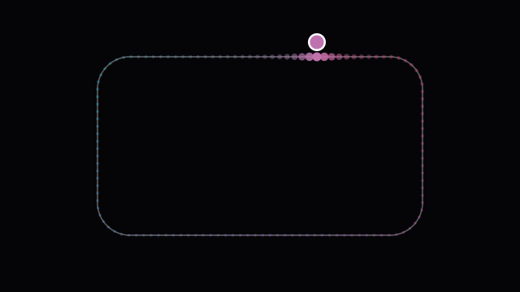 | 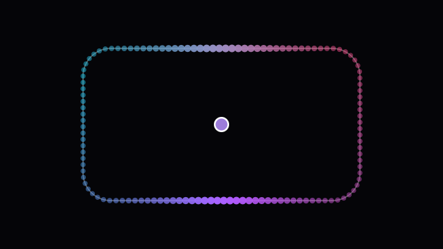 |

*The gather's weights for one pixel (the white ring, filled with the colour it
gathers). Each dot is one of the 128 samples in its own colour, its size and
opacity scaled by `g`. With `kc` about 10 px on this rect, a pixel near the
line averages a handful of samples beside it; at the centre every sample
counts, the top and bottom edges (110 px away) more than the sides (200 px).*

The gather is the expensive part of the whole effect: about 95% of the
fragment shader's cost (`N` iterations per pixel). Two optimisations exist
because of it:

1. **The emission pre-pass** (Part 6, pass 0). What each sample contributes
   (its colour, which arc owns it, how bright it is, which segments boost it)
   does not depend on the pixel. So once per frame a tiny pass computes it for
   all `N` samples into a 128x2 texture (the **emission table**). The gather
   then does two `texelFetch`es per sample instead of searching arcs and
   segments per pixel per sample.
2. **The decoupled gather** below scale 1.0 (Part 8). The gather's result is
   smooth, so it is computed on a coarse grid in a pass of its own and read
   back with a bilinear fetch.

### 3.4 Arcs and segments

**Arcs** (`NeonConfig::arcs`, up to 8) are lit stretches of the outline: from
`start` to `start + length`, as perimeter fractions, wrapping past 1.
Each has an `intensity` and optionally its own `colorStops` laid head to tail
across it (stop position 0 at `start`, 1 at the end). Where arcs overlap, the
one with the largest `coverage x intensity` at a sample owns that sample's
colour (**winner-take-all**). A free arc end fades out over 14 px
(`HEAD_FEATHER_PX`, `TAIL_FEATHER_PX`) inward; an end that touches another arc
fades outward instead, so tiled arcs meet with no visible notch. With no arcs
at all, nothing is lit (only segments can still shine).

| one arc, two free ends | two arcs that tile, each with its own stops |
| :-: | :-: |
|  |  |

*Left: `start` 0.1, `length` 0.35, on the base gradient; both ends feather
inward over 14 px. Right: an arc from 0 to 0.5 (cyan to blue) and one from 0.5
to 1 (orange to red, `intensity` 0.6); where they meet, at `t = 0` and 0.5,
each end feathers outward and the seam shows no notch. The unlit stretch
(left) is lit only by the lit part's glow reaching across it; nothing traces
the unlit outline itself (Part 3.6).*

**Segments** (`segmentBoosts`, plus `preservedSegmentBoosts`, 8 slots
together) are Gaussian bright spots centred at `position` with width `length`
and peak brightness `boost`. They are added on top of the arcs and ignore
`NeonConfig::intensity`, so a segment can shine on a dark stretch. There it is
glow only until `boost x bell` passes 0.5, and only then opens a filament core
of its own (under a lit arc the arc's core is already open). A segment
without its own stops takes the winning arc's colour where an arc covers it,
and the base gradient elsewhere. Animations such as `SegmentTravel` move them
by writing `position` every frame.

| `boost` 0.4 | `boost` 2.0 |
| :-: | :-: |
|  |  |

*An orange segment (`length` 0.12) on the dark half of the ring; one arc lights
`t` 0 to 0.5. Below the 0.5 gate it is glow only; above it, it opens a core of
its own.*

### 3.5 The three light layers, as formulas

All three are **closed-form** (exact formulas, not sums over samples). An
earlier version summed contributions from the 128 samples, which broke a thin
glow into dots; [`neon-renderer-explained.html`](neon-renderer-explained.html)
tells that story.

**Filament** (the line). With `ad = |d|` and `N = 2 x filamentFalloff`:

```
sigma = max(lineWidth / 2, ...floors)       // half width at half brightness
core  = exp2(-(ad / sigma)^N)               // 1 on the line, 0.5 at ad = sigma
```

This is a **generalised Gaussian**: `filamentFalloff` 1 gives a Gaussian,
higher values a flat-topped tube with steep sides, lower values long soft
tails. `lineWidth` is therefore the full width at half brightness. The core is
then "pedestal-subtracted" so it reaches exactly 0 at a computed reach instead
of fading forever (which lets the CPU size the quad exactly).

**Halo and bloom** are the light of a glowing line of finite length, computed
in closed form for each straight edge and each corner arc and summed:

```
haloSegment(a, t1, t2, k)  = k^2/c2 * ( t2/sqrt(c2 + t2^2) - t1/sqrt(c2 + t1^2) ),  c2 = a^2 + k^2
bloomSegment(a, t1, t2, k) = k/c   * ( atan(t2/c) - atan(t1/c) ),                  c  = sqrt(a^2 + k^2)
```

Here `a` is the pixel's perpendicular distance to that piece's line, `t1..t2`
is the piece's extent along it relative to the foot of the perpendicular, and
`k` is the width (`glowRadius` for the halo, `6 x glowRadius` for the bloom).
These are the integrals of a 1/r^3-like and a 1/r^2-like falloff along the
piece, which is why far from the line the halo goes as 1/a^2 and the bloom as
1/a. Summing over the pieces (four straights stopping at the corners' tangent
points, plus four corner arcs "developed" onto their tangents) is what removed
the dark diagonal wedges an older single-edge version had at every corner.
[`corner-crease-and-filament-nyquist.md`](corner-crease-and-filament-nyquist.md)
is the full story, including why the interior of a rect now settles on a
brightness floor instead of fading to black (the sum of four edges' light).

### 3.6 Putting colour and brightness together

Each pixel computes two kinds of coverage, because the layers need different
things:

- **Pointwise coverage** (`emitCover`, `segCoverPt`): how lit the outline is
  *at this pixel's own `t`*, including arc feathers and colour-stop alpha. The
  filament uses it, because the filament is a line and only its own position
  matters.
- **Gathered coverage** (`emitCoverGathered`, `segCoverGathered`): how lit the
  outline is *on average around this pixel*, weighted like the colour. It
  gives the halo and bloom their starting scale. Using the pointwise value
  there made the glow stop with a hard edge along the corner diagonals
  whenever part of the ring was dark.
- **Each piece's own coverage** (`addPieceGlowFix`): the halo and bloom are a
  sum over the outline's eight pieces (four straights, four corner arcs), and
  each piece's light is scaled by how lit THAT piece is near its foot, under
  its own kernel - arcs and segments both - read from the coverage table P0b
  bakes (Part 6), one fetch per piece. The average around the pixel was a stand-in for it, wrong in two
  ways: its kernel is wider than the halo's along the line, so an unlit
  stretch kept enough averaged-in light to draw a thin line along it (V19 in
  [`review-findings.md`](review-findings.md)); and it is dominated by the
  nearest piece, so on a dark line it dropped and dimmed the light reaching
  there from lit edges far away (V20). On a fully lit ring every piece's
  coverage is the average, so the correction is 0 and is skipped. The table
  holds one sheet per piece, and each piece's coverage stops at its own ends:
  a table per perimeter, running the outline on as a straight line past them,
  spilled a little light round every corner (V21).


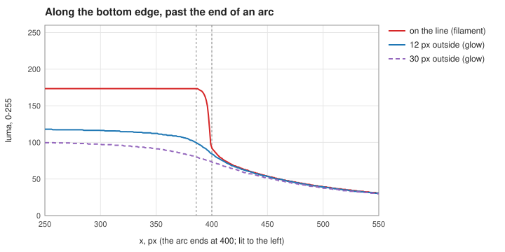

*An arc ending in the middle of the bottom edge (lit to the left), magnified
2x, and the brightness along that edge. On the line the filament, which reads
pointwise coverage, falls to the glow's level within the 14 px feather (the
two dashed lines). The glow 12 and 30 px outside fades over about 100 px
instead: each piece's glow is scaled by its coverage under its own kernel,
which out there is tens of px wide for the halo and six times that for the
bloom. Past that it is the lit part's light reaching across, with nothing
left of the unlit outline itself.*

Then (in `neon.frag`, after the gather):

```
arcCol   = col * intensity                                      // gathered hue x master brightness
emitFil  = arcCol * emitCover         + segCol     * filamentGate
emitGlow = arcCol * emitCoverGathered + segColHue  * gatheredSeg
result   = emitFil  * core  * 12   * lineGate
         + (emitGlow * halo  + haloFix)  * 0.9  * glowGate
         + (emitGlow * bloom + bloomFix) * bloomStrength * glowGate
result   = toneMap(result)                       // Part 1.9
result  *= one-sided cut and cutoff masks        // AFTER the tone map: they are coverage
fragColor = vec4(result, max(result.r, result.g, result.b))   // premultiplied, alpha = peak
```

`gatheredSeg` is `segCoverGathered * max(emitCoverGathered,
min(segCoverGathered, 1))`, the segment's glow magnitude. `haloFix` and
`bloomFix` are the per-piece correction above (`glowFix` in the source, an arc
half coloured by `arcCol` and a segment half by `segColHue`), 0 on a fully lit
ring.

`col` is a pure hue (a weighted mean of colours): all brightness enters
through the coverages. The edge masks are applied after the tone map because
they are coverage: multiplied into the bright linear value before the tone
map, a half-covered filament pixel came back at 94% brightness instead of
50%.

**Colour-stop alpha.** `ColorStop::color.a` is baked into the LUTs' alpha
channel and read pointwise, so it scales the **filament** at that position:
alpha 0.5 halves it, alpha 0 removes it. It does **not** reach the halo or the
bloom: they use the gathered coverage, which the emission table builds without
alpha. Measured on this branch and on `main` alike (600x360 rect, one stop,
glow radius 20, bloom 1.0): the glow reads the same at alpha 1, 0.5 and 0.
This is a known limit recorded as V18 in
[`review-findings.md`](review-findings.md); to dim the glow along part of the
ring, use an arc's `intensity` or gate the ring with arcs instead.

| stops with alpha 0 from `t` 0.4 to 0.6 | the bottom edge where alpha falls, 3x |
| :-: | :-: |
|  |  |

*One cyan colour, alpha 1 up to `t` 0.3, falling to 0 by 0.4, 0 until 0.6, back
to 1 by 0.7. Where alpha is 0 (the bottom right, round the corner and up the
right edge) the sharp core is gone; the softer line left there is the halo,
which still peaks on the outline because it does not see alpha.*

---

## Part 4. Every configuration field

The neon reads `Config::geometry` (a `RectGeometry`), `Config::neon` (a
`NeonConfig`) and one field of `Config::debug`. For each field this part
gives: type and default, units, what it does on screen, how it travels
through the code (which function reads it and what it becomes on the GPU),
which passes it affects, what it marks stale in `OnConfigChanged`, and its C
ABI setter. Pass names (P0, P1, ...) are defined in Part 6; the dirty flags in
Part 5.3.

"x scale" below means the value is multiplied by the clamped
`resolutionScale` before upload. The ring pass (P2c) uploads as if the scale
were 1.0; the fill (P2a) and the blit (P2b) always upload full-res values.

### 4.1 `RectGeometry` (`Config::geometry`)

| Field | Type, default | Units | What it does |
| ----- | ------------- | ----- | ------------ |
| `width`, `height` | float, 800 x 600 | full-res px | Size of the rounded rectangle. Also sets the perimeter length that every perimeter fraction (stops, arcs, segments) is measured along, and the colour kernel `kc`. |
| `position` | vec2, (0, 0) | full-res px, app coords | Top-left corner of the rectangle, origin at the viewport's top-left, +y down. |
| `cornerRadius` | float, 40 | full-res px | Roundness. Clamped at use to `[0, min(width, height)/2]` by `GeometryUtils::GetEffectiveCornerRadius`; the config keeps the raw value. 0 gives sharp corners; the maximum gives a pill. |
| `winding` | `Winding`, `COUNTER_CLOCKWISE` | enum | Which way perimeter position 0 to 1 runs, and where 0 is (Part 3.2). |

**How it travels.** Width, height and corner radius become `uRectSize` and
`uCornerRadius` (x scale in the `neon.frag` programs; unscaled in the fill and
blit). They also place the 128 loop samples (`rebuildLoopSamples`, via
`GetPointOnRectangle`), size every quad, and set the gather resolution
(`GetGatherScale`). `position` never reaches `neon.frag`: everything there is
rect-local. It enters through the MVP translation and as `uRectCenter` in the
fill and the blit. `winding` becomes `uWinding` (read by `perimeterPosition`)
and decides the order of the loop samples.

**Passes.** All drawing passes. Not the emission table (P0), which depends
only on perimeter fractions.

**Dirty.** Any geometry change sets `samplesDirty`, `geometryDirty` and
`fillDirty`. Moving the rect therefore rebuilds the (rect-local, unchanged)
geometry too: harmless, and the sample upload is skipped by the buffer's byte
cache.

**C ABI.** `el_effect_set_geometry(fx, width, height, posX, posY, cornerRadius)`,
`el_effect_set_winding`. Not animatable through `FieldBoundAnimation`.

### 4.2 Master switch and performance knobs

| Field | Type, default | Range | What it does | Travels to | Dirty | C ABI |
| ----- | ------------- | ----- | ------------ | ---------- | ----- | ----- |
| `enable` | bool, `false` | | Draws nothing while false. | `Render` returns at once; `UsesScaledBuffer` releases the reduced buffers | buffer release | `el_effect_set_neon_renderer_enabled` |
| `resolutionScale` | float, 1.0 | clamped to [0.001, 1.0] (`GetClampedResolutionScale`) | 1.0 draws at full resolution; below it the glow is shaded smaller and upscaled, except a full-res ring at the edge (Part 8). | `uResolutionScale`; multiplies every px uniform and the loop samples; picks the pass set and programs | `samplesDirty` (and so `geometryDirty`); buffer release | `el_effect_set_neon_resolution_scale` |
| `numSamples` | int, 128 | clamped to [1, 128] (`GetClampedNumSamples`) | Number of perimeter samples the gather averages. Fewer is cheaper and coarser: against 128, 96 differs by 1/255, 64 by 3/255, 32 by 12/255 (measured, `config-reference.md`). | `uNumSamples` (P0, the gather); `LoopSamplesBlock` | `samplesDirty` | `el_effect_set_neon_num_samples` |
| `gradientLutSize` | int, 256 | floored at 4 | Width of the colour ring texture. A change snaps (no cross-fade). | `uGradientLUT` width | ring LUT re-bake | `el_effect_set_neon_gradient_lut_size` |

`numSamples` can never exceed `NEON_MAX_LOOP_SAMPLES` (128), because the
sample block and the emission table are sized to that ceiling once, at
`Initialize`.

### 4.3 The line and the glow

| Field | Type, default | Units | What it does | Travels to (passes P1, P1b, P2c) |
| ----- | ------------- | ----- | ------------ | -------------------------------- |
| `lineWidth` | float, 4 | full-res px | Full width at half brightness of the filament. 0 means no line (a `lineGate` fades it out below 1 px). Brightness at the centre does not change with width. | `uLineWidth` x scale -> `sigma`, `core`, `lineGate`; `GetFilamentExtent` (quad and ring sizes) |
| `filamentFalloff` | float, 1.0 | shape exponent (`N = 2 x value`) | Shape of the line's sides: 0.5 soft tails, 1 Gaussian, 2+ a flat-topped tube. Floored at 0.001. | `uFilamentFalloff` (unscaled) -> `N`, the reach, the pedestal; `GetFilamentExtent` |
| `intensity` | float, 1.0 | multiplier | Master brightness of the arcs: line, halo and bloom. Segments are not affected. Keep it >= 0. | `uIntensity` -> `arcCol = col * uIntensity`; the glow reach used to size the quad |
| `glowRadius` | float, 5 | full-res px | Width of the halo; the bloom is 6x wider. 0 removes both (a `glowGate` fades them in over 0..2 px). | `uGlowRadius` x scale -> `kh`, `bw`, the reach, `glowGate`; the quad margin (`GetGlowMargin`); P0b's kernel widths (`uHaloWidth`, `uBloomWidth`) |
| `bloomStrength` | float, 0.30 | multiplier | Amount of the wide soft spill. Keep it >= 0. | `uBloomStrength` -> `result += emitGlow * bloom * uBloomStrength`; the reach |

| `lineWidth` 1 | `lineWidth` 4 | `lineWidth` 12 |
| :-: | :-: | :-: |
|  |  | 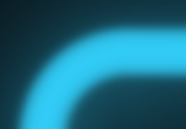 |
| **`filamentFalloff` 0.5** | **`filamentFalloff` 1** | **`filamentFalloff` 4** |
|  | 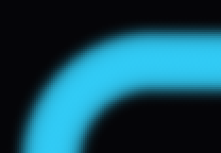 |  |
| **`glowRadius` 3** | **`glowRadius` 10** | **`glowRadius` 30** |
|  |  |  |
| **`bloomStrength` 0** | **`bloomStrength` 0.6** | **`bloomStrength` 1.5** |
|  |  |  |

*One field at a time, around the top-left corner. The first two rows are
magnified 3x: `lineWidth` with `glowRadius` 4 and `bloomStrength` 0.2, and
`filamentFalloff` on a 12 px line with the glow off, from long soft tails (0.5)
through a Gaussian (1) to a flat-topped tube (4). The last two are at 1x:
`glowRadius` with `bloomStrength` 0.4, and `bloomStrength` with `glowRadius`
10.*

All five set `geometryDirty`: they change how far light reaches, so the quad
must be re-sized. The quad margin is
`glowRadius x 48 x (1 + bloomStrength x intensity)` (`GLOW_REACH_RADIUS_FACTOR`
= 48), floored at the filament's reach: 312 px at the defaults. An animation
of any of these rebuilds the quads every frame (cheap: a few dozen vertices).

C ABI: `el_effect_set_line_width`, `el_effect_set_filament_falloff`,
`el_effect_set_intensity`, `el_effect_set_glow_radius`,
`el_effect_set_bloom_strength`. All five are animatable
(`AnimatableField::NEON_LINE_WIDTH`, `..._FILAMENT_FALLOFF`,
`..._INTENSITY`, `..._GLOW_RADIUS`, `..._BLOOM_STRENGTH`).

### 4.4 Which side glows, and how far: `glowSide`, `glowSideSoftness`, cutoffs

**`glowSide`** (`GlowSide`, default `BOTH`; `BOTH`=0, `INSIDE`=1,
`OUTSIDE`=2). `INSIDE` keeps only the light inside the outline, `OUTSIDE` only
outside. Becomes `uGlowSide`. Fragments on the dropped side are discarded,
the quad is shrunk (`INSIDE` caps its outer margin; `OUTSIDE` cuts a hole in
it), and the cut edge is drawn as a mask after the tone map. Sets
`geometryDirty`. C ABI `el_effect_set_glow_side`.

| `BOTH` | `INSIDE` | `OUTSIDE` |
| :-: | :-: | :-: |
|  |  |  |

**`glowSideSoftness`** (float, 0, full-res px). The total width of the cut's
feather, measured into the lit side, floored at one destination pixel. The
feather reaches back across the line by exactly half a pixel, so the glow's
cut edge registers with an opaque fill on the same side. Ignored at `BOTH`.
Becomes `uGlowSideSoftness` (x scale in `neon.frag`, unscaled in the blit).
No narrow dirty flag: it is only a uniform. Animatable
(`NEON_GLOW_SIDE_SOFTNESS`). C ABI `el_effect_set_glow_side_softness`.

**`Cutoff`** is a small struct used four times:

| Field | Meaning |
| ----- | ------- |
| `enable` | whether the cap applies on this side |
| `size` | px from the outline to where the fade **starts** |
| `softness` | px the fade runs **outward from `size`**: full strength at `size`, 50% at `size + softness/2`, gone at `size + softness`. Its width is floored at 1 destination px, so 0 is a pixel-sharp antialiased edge. |

Trap: a bare `Cutoff{}` defaults to **enabled**, size 32, softness 4. All four
`NeonConfig` cutoffs override that to `{false, 0, 0}`.

The shaders never see `enable`. A disabled cutoff is uploaded as the size
`1e6` (`CUTOFF_DISABLED_SIZE`, via `GetCutoffSize`), a sentinel so large that
the fade's `smoothstep` saturates and the code needs no branch.

**`insideCutoff` / `outsideCutoff`** cap the **glow**: how far it reaches
toward the centre and away from the rect. Uniforms `uInsideCutoff`,
`uInsideCutoffSoftness`, `uOutsideCutoff`, `uOutsideCutoffSoftness` (x scale
in `neon.frag`, unscaled in the blit). They also shape geometry: the quad's
hole and outer cap, the ring and blit extents (`GetLitExtent`), and the quad
margin (`GetGlowMargin` caps it at the outside cutoff's end). A cutoff on a
side `glowSide` already removes is **neutralised** (treated as disabled).
Both set `geometryDirty`. C ABI `el_effect_set_inside_cutoff`,
`el_effect_set_outside_cutoff`.

| `insideCutoff` {20, 12} | `outsideCutoff` {24, 16} | both |
| :-: | :-: | :-: |
|  |  |  |

*`{size, softness}` in px, on a wide glow (`glowRadius` 16, `bloomStrength`
1). Inside, the cut follows a contour of `d`, whose corners sharpen with depth
(Part 1.8): the fade here runs 20 to 32 px deep against a corner radius of 32,
so the hole is nearly square. With both, only a band around the line is
lit.*

**`opaqueInsideCutoff` / `opaqueOutsideCutoff`** cap the **opaque fill**
(4.5) and nothing else. They are independent of the glow's pair and of
`glowSide`.

`Cutoff::softness` running outward from `size` is a change from `main`, where
it was centred on `size`; see [`upgrade-notes.md`](upgrade-notes.md).

### 4.5 The opaque fill

| Field | Type, default | What it does |
| ----- | ------------- | ------------ |
| `opaqueMode` | `OpaqueMode`, `NONE` | `NONE` (0) no fill; `OUTSIDE` (1) fills from the outline outward; `INSIDE` (2) fills from the outline inward; `BOTH` (3) fills across the outline in both directions; `ALL` (4) fills the whole viewport. |
| `opaqueColor` | vec4, black | Fill colour; only `.rgb` is used (the fill is always opaque). |
| `opaqueInsideCutoff`, `opaqueOutsideCutoff` | `Cutoff`, disabled | How far the fill reaches inward and outward. Disabled means unbounded: `INSIDE` fills the whole rect, `OUTSIDE` runs to the viewport edge, `BOTH` covers the viewport. |

| `NONE` | `OUTSIDE` | `INSIDE` | `BOTH`, fill cutoffs 24 px |
| :-: | :-: | :-: | :-: |
| 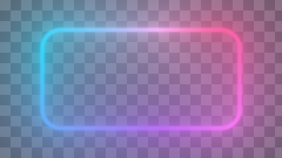 | 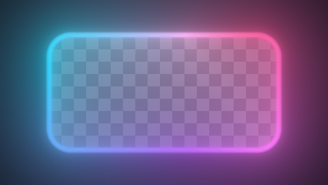 | 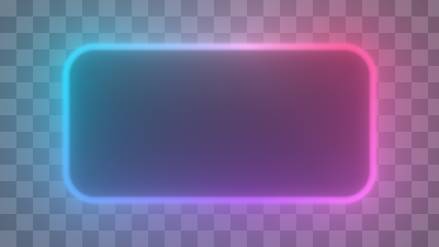 |  |

*Over a checkerboard, so the fill shows as the area it hides; the glow is
drawn on top of it. Without fill cutoffs `OUTSIDE` runs to the viewport's
edge and `INSIDE` covers the whole interior.*

The fill is drawn **under** the glow, at full resolution, on the caller's
framebuffer (P2a), with its own shader (`black-rect.frag`). When the fill
would cover the whole viewport (`ALL`, or `BOTH` with both fill cutoffs off)
and no depth or stencil test is enabled, it is a scissored `glClearBufferfv`
instead of a draw. `opaqueMode` and the fill cutoffs set `fillDirty`
(rebuilds the fill geometry); `opaqueColor` is only a uniform.

C ABI: `el_effect_set_opaque_mode`, `el_effect_set_opaque_color`,
`el_effect_set_opaque_cutoff(fx, EL_CUTOFF_SIDE_INSIDE or _OUTSIDE, enable,
size, softness)`. The old `el_effect_set_opaque_softness` survives as a
deprecated shim. On `main` the fill was bounded by the glow's cutoffs; read
[`upgrade-notes.md`](upgrade-notes.md) before upgrading a host that used one.

### 4.6 Colour

| Field | Type, default | What it does | Travels to |
| ----- | ------------- | ------------ | ---------- |
| `colorStops` | `vector<ColorStop>`, red 0.0 / green 0.25 / blue 0.5 / yellow 0.75 | The base gradient around the ring. Positions are perimeter fractions from `t = 0`; the bake sorts them, so authored order does not matter (except between stops at the same position). Empty means white. | `GradientRingLUT::Bake` -> `uGradientLUT` (unit 0). RGB is read by P0 at the rotated position; alpha is read pointwise by `neon.frag`. |
| `blendSpace` | `BlendSpace`, `RGB` | How the gradient blends between stops: `RGB` (straight mix), `HSV` or `HSL` (shortest way round the hue circle). Alpha always blends linearly. | Bake time only; never a uniform. |
| `hueRotationRate` | float, 0.5 | Revolutions per second the base gradient scrolls around the ring; the sign is the direction; 0 is static. Arcs and segments with their own stops do not rotate. | `uHueRotationRate`: P0 reads the ring at `t - time x rate`; `neon.frag` reads alpha the same way. A non-zero rate re-runs P0 every frame. |
| `colorTransitionDuration` | float, 0.3 s | Cross-fade time when `colorStops` or `blendSpace` change. 0 snaps. Runs on the host's raw `dt`, so it continues while the effect clock is paused. | `GradientRingLUT::Tick`, from `NeonRenderer::Update`; each fade frame re-uploads the ring and re-runs P0. |

| `RGB` | `HSV` | `HSL` |
| :-: | :-: | :-: |
| 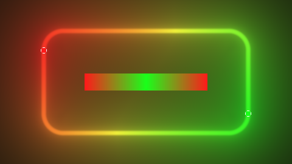 |  | 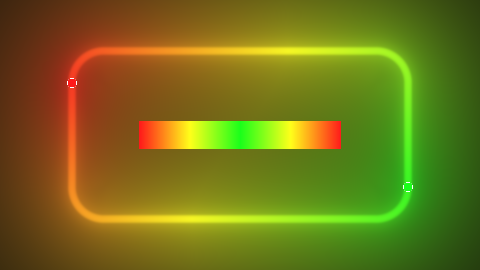 |

*Red at 0 and green at 0.5, in each blend space, with the debug layer's ring
strip (the baked LUT, left to right from `t = 0`) and a disc at each stop.
`RGB` passes through a dull olive; `HSV` and `HSL` go round the hue circle
through yellow, and for these two fully saturated stops they come out
identical.*

**`ColorStop`** is `{ position, color }`. `color.rgb` is in 0..1 (the RGBA8
LUT clamps; it cannot over-drive). `color.a` is an emission scale for the
**filament** (Part 3.6); it does not dim the halo or bloom.

A colour-stop change re-bakes only the LUT it belongs to: the ring's guard
compares stops, blend space and size; each atlas row compares its item's stops
and blend space. Moving an arc or a segment never re-bakes an atlas: start,
length, intensity, position and boost travel in the uniform blocks.

C ABI: `el_effect_set_color_stop_count`, `el_effect_set_color_stop(index,
pos, r, g, b, a)`, `el_effect_clear_color_stops`, `el_effect_set_blend_space`,
`el_effect_set_hue_rotation_rate`, `el_effect_set_color_transition_duration`.
`hueRotationRate` is animatable (`NEON_HUE_ROTATION_RATE`); the base stops
are not (arc and segment stops are, per channel, through `ColorStopField`).

### 4.7 Arcs (`NeonConfig::arcs`, `Arc`)

| Field | Type, default | Units | What it does |
| ----- | ------------- | ----- | ------------ |
| `start` | float, 0 | perimeter fraction | Where the lit stretch begins. Wraps. |
| `length` | float, 1 | perimeter fraction | How much is lit: >= 1 is the whole ring, <= 0 is nothing. |
| `intensity` | float, 1 | multiplier | Brightness of this stretch only; <= 0 is dark. Independent of `NeonConfig::intensity`. |
| `colorStops` | vector, empty | 0..1 across the arc | Own gradient, laid head to tail from `start` to `start + length`. Empty inherits the base gradient. |
| `blendSpace` | `RGB` | | Blend space of the arc's own stops. |

Default: `arcs = { Arc{} }`, one arc covering the whole ring. Up to 8
(`MAX_ARCS`); extras are dropped with one logged error.

Travels to: `ArcBlock` (binding 2), packed by `packLightBlockData` as
`vec4(start, length, intensity, flags)`, where `flags` is a bitmask (bit 0:
has its own stops; bit 1: another arc abuts its start; bit 2: another abuts
its end); and `uArcLUT` (unit 2), one 128-texel row per arc. Read by P0
(winner-take-all colour), the gather (via the table) and pointwise in
`neon.frag` (coverage and alpha). Dirty: `mLightBlocksDirty`, the arc atlas's
own guard, `mEmissionDirty`.

C ABI: `el_effect_set_arc_count`, `el_effect_set_arc(index, start, length,
intensity, blendSpace)`, `el_effect_set_arc_color_stop_count` /
`_color_stop` / `el_effect_clear_arc_color_stops`. Animatable:
`ArcField::START`, `LENGTH`, `INTENSITY`; presets `OutlineTracer`,
`OutlineCollapse` and `ArcWipe` drive `arcs[0]`.

### 4.8 Segments (`segmentBoosts`, `preservedSegmentBoosts`, `SegmentBoost`)

| Field | Type, default | Units | What it does |
| ----- | ------------- | ----- | ------------ |
| `position` | float, 0 | perimeter fraction | Centre of the bright spot. Wraps. |
| `length` | float, 0.15 | perimeter fraction | Width of the spot: the bell is at 37% of its peak at `position +- length/2`. |
| `boost` | float, 0 | absolute brightness | Peak brightness. 0 is invisible. Not scaled by `NeonConfig::intensity`. |
| `colorStops`, `blendSpace` | empty, `RGB` | 0..1 across the spot | Own gradient across `position - length/2 .. + length/2`. Empty takes the winning arc's colour, or the base gradient where no arc covers. |

`preservedSegmentBoosts` holds `PreservedSegment { id, segment }` entries with
stable ids (`SegmentUtils::AcquireSegment`), for spots that must survive a
host replacing the whole `segmentBoosts` vector. The two pools share the 8
slots (`MAX_SEGMENT_BOOSTS`); `SegmentUtils::FillEffectiveSegments` merges
them, preserved first, into `mEffectiveSegments`, which is what the GPU sees.

Travels to: `SegmentBlock` (binding 0) as `vec4(position, 1/(length/2), boost,
hasStops)`; `uSegmentLUT` (unit 1). P0 writes their colour and bell sum into
row 1 of the emission table. Having any segment selects the longer gather loop
and adds a second gather attachment below scale 1.0. Dirty: `segmentsDirty`
(which sets `mLightBlocksDirty`), the segment atlas's guard, `mEmissionDirty`.

C ABI: `el_effect_set_segment_boost_count`, `el_effect_set_segment_boost`,
the `..._segment_color_stop` family, and the preserved family
(`el_effect_acquire_preserved_segment`, `..._set_preserved_segment`, ...).
Animatable: `SegmentField::POSITION`, `LENGTH`, `BOOST`; presets
`SegmentTravel`, `SegmentBounce`.

### 4.9 `DebugConfig::opaqueOnly`

The one debug field the neon reads. When true, `Render` draws the opaque fill
and nothing else, and builds no neon program. Useful for checking the fill's
silhouette against the glow's. C ABI `el_effect_set_debug_opaque_only`.

### 4.10 Quick reference: what a change costs

| You change | The renderer does |
| ---------- | ----------------- |
| geometry, `resolutionScale`, `numSamples` | rebuild the loop samples, the glow quad, the ring/blit/gather geometry and (geometry only) the fill geometry |
| `lineWidth`, `filamentFalloff`, `intensity`, `glowRadius`, `bloomStrength`, `glowSide`, `insideCutoff`, `outsideCutoff` | rebuild the glow quad and the ring/blit/gather geometry |
| `opaqueMode`, the fill cutoffs | rebuild the fill geometry |
| `colorStops`, `blendSpace`, `gradientLutSize` | re-bake the ring LUT (cross-fade, except a size change) |
| an arc's or segment's stops or blend space | re-bake that atlas |
| arcs or segments at all | re-pack the uniform blocks |
| anything | re-run the emission pre-pass (P0) next frame |
| `opaqueColor`, `glowSideSoftness`, `hueRotationRate` | nothing but the uniform upload (plus P0 every frame while the hue rate is non-zero) |

The "anything re-runs P0" rule is deliberately wide: P0 reads a broad slice of
the config, and a missed field would mean a stale ring while a spare re-run
costs one 256-texel pass.

---

## Part 5. The CPU side: NeonRenderer

`NeonRenderer` (`neon-renderer.h`, `neon-renderer.cpp`) turns the config into
GL objects and draw calls. Its job splits cleanly: `OnConfigChanged` rebuilds
data when inputs change, `Update` advances time-based state, `Render` binds
and draws.

### 5.1 The GL objects it owns

**Shader programs.** All share `neon.vert` as the vertex shader.

| Member | Fragment shader | Built | Used by |
| ------ | --------------- | ----- | ------- |
| `mEmissionShader` | `neon-emission.frag` | `Initialize` | P0 |
| `mGlowCoverShader` | `neon-glow-cover.frag` | `Initialize` | P0b |
| `mBlackRectShader` | `black-rect.frag` | `Initialize` | P2a |
| `mNeonShader` | `neon.frag`, no define | first frame at scale 1.0 | P1 (direct) |
| `mNeonGatherShader` | `neon-gather.frag` | first frame below 1.0 | P1a |
| `mNeonShadeShader` | `neon.frag` + `NEON_READS_GATHER` | first frame below 1.0 | P1b |
| `mNeonRingShader` | the same source, a second program object | first frame below 1.0 | P2c |
| `mBlitShader` | `neon-blit.frag` | first frame below 1.0 | P2b |

Programs are built per path on first use (`ensurePathPrograms`), so a host
that stays at 1.0 never compiles the four scaled-path programs and vice versa.
A program that fails to compile is logged once, recorded in
`mFailedPrograms` and never retried; that path then draws the fill only.

**Vertex arrays** (each a VAO plus one VBO of `vec2` positions):

| Member | Space | Holds |
| ------ | ----- | ----- |
| `mGlowVertexArray` | rect-local, scaled px | the glow quad: a rectangle, or a rectangle with a rectangular hole (4 strips) |
| `mFillVertexArray` | rect-local, full-res px | the opaque fill's band |
| `mRingVertexArray` | rect-local, full-res px | the edge ring (scaled path) |
| `mBlitVertexArray` | rect-local, full-res px | the blit area: what can be lit outside the ring (scaled path) |
| `mGatherVertexArray` | rect-local, scaled px | the gather pass's quad (scaled path) |
| `mFullscreenVertexArray` | NDC | a static full-screen quad: the emission and coverage-table passes, and the fill's fallback |

**Uniform buffers:** `mSegmentBlock` (binding 0), `mLoopSamplesBlock`
(binding 1), `mArcBlock` (binding 2). See Part 1.5.

**LUTs:** `mGradientLUT` (`GradientRingLUT`), `mSegmentLUT` and `mArcLUT`
(`SpanAtlasLUT`). See Part 1.4.

**Framebuffers:**

| Member | Size | Format | When |
| ------ | ---- | ------ | ---- |
| `mEmissionBuffer` | 128 x 2 | RGBA16F, else RGBA8 (`EMISSION_FORMATS`) | allocated once in `Initialize` |
| `mGlowCoverBuffer` | 1024 x 128 (`GLOW_COVER_WIDTH` x `GLOW_COVER_HEIGHT`): four bands of `GLOW_COVER_ROWS` rows, each a straight and a corner sharing its columns in proportion to their lengths (`uGlowCoverSplit`) | RGBA16F, else RGBA8 (`GLOW_COVER_FORMATS`), linear filter | allocated once in `Initialize` |
| `mGatherBuffer` | a region around the rect, at the gather scale | RGBA16F, else RGBA8 (`GATHER_FORMATS`); 1 attachment, 2 with segments | scaled path; resized every frame (no-op if unchanged) |
| `mScaledBuffer` | what the blit reads, at `resolutionScale`, never larger than the reduced viewport | RGBA8, 1 attachment | scaled path; resized every frame |

The two scaled-path buffers are released in `OnConfigChanged` when the layer
is disabled or the scale returns to 1.0.

Note: `VertexArray`, `UniformBuffer` and the LUT textures create their GL
names in their constructors, so a GL context must be current when a
`NeonRenderer` is constructed.

### 5.2 `Initialize()`

1. `setupShaders()`: build `mEmissionShader` and `mBlackRectShader`.
2. `resizeEmissionBuffer()`: allocate the 128x2 emission table, RGBA16F or
   RGBA8. Fails `Initialize` only if neither format allocates.
3. Declare the vertex format (attribute 0, two floats) on the five rebuildable
   vertex arrays, once.
4. `rebuildLoopSamples`, `setupGeometry`, `setupFillGeometry`,
   `setupRingGeometry` (in that order: the ring reads values the glow quad
   computes), `FillEffectiveSegments`, `bakeLUTs`, `setupFullscreenQuad`, all
   from the config stored by the `OnConfigChanged` that `AddRenderer` already
   delivered.
5. `mInitialized = true`.

It compiles no `neon.frag` program and allocates no scaled-path buffer.

### 5.3 `OnConfigChanged(config)`: dirty flags

It compares the new config with the previous one (`mCurrentConfig`) field by
field, before overwriting it, and computes:

| Flag | Set when these change | Rebuilds |
| ---- | --------------------- | -------- |
| `samplesDirty` | geometry, `resolutionScale`, `numSamples` | `rebuildLoopSamples` |
| `geometryDirty` | `samplesDirty`, or `glowRadius`, `bloomStrength`, `intensity`, `lineWidth`, `filamentFalloff`, `glowSide`, `insideCutoff`, `outsideCutoff` | `setupGeometry`, then `setupRingGeometry` |
| `fillDirty` | geometry, `opaqueMode`, `opaqueInsideCutoff`, `opaqueOutsideCutoff` | `setupFillGeometry` |
| `segmentsDirty` | `segmentBoosts`, `preservedSegmentBoosts` | `FillEffectiveSegments` |
| `mLightBlocksDirty` | `segmentsDirty`, or `arcs` (accumulated, never cleared here) | `packLightBlockData` on the next `Render` |
| `mEmissionDirty` | **always** | P0 on the next `Render` |
| `mGlowCoverDirty` | **always** | P0b on the next `Render` |

Then, in order: overflow warnings for more than 8 arcs or segments, the
segment merge, the flags above, `mCurrentConfig = config`, release of the
scaled buffers if they are not needed, and, only if `mInitialized`, the
rebuilds. `bakeLUTs` is called every time; each LUT checks its own inputs and
does nothing if they did not move.

Two subtleties worth knowing before you touch this function:

- `mLightBlocksDirty` is accumulated with `||`, not assigned. The very first
  call happens before `Initialize`; an assignment there would clear the
  initial `true`, the uniform blocks would never get a data store, and binding
  them crashed the driver (measured).
- The rebuild gate is `mInitialized`, **not** a program's validity: on a host
  that never draws at 1.0, `mNeonShader` is never valid.

### 5.4 `Update(dt, time, config)`

One line: `mEmissionDirty = mGradientLUT.Tick(dt) || mEmissionDirty;`. A
running colour cross-fade re-uploads the ring texture without any config
change, and P0 bakes from that texture, so the table must be refreshed.

### 5.5 `Render(w, h, time, config)`: the pass schedule

```
Render
 |- return if !neon.enable
 |- scale = clamp(resolutionScale, 0.001, 1);  scaled = (scale < 1)
 |- direct-path transform: mvp = ortho(0, w*scale, 0, h*scale) * translate(centerFull*scale)
 |- if debug.opaqueOnly: [blend over] fill (P2a); restore blend; return
 |- glowReady = ensurePathPrograms(scaled)          // compile on first use
 |- if scaled: prevTarget = RenderTargetState::Capture()
 |
 |  ===== phase 1: offscreen =====
 |- if glowReady:
 |    packLightBlocks()                             // re-pack if dirty; bind blocks 0 and 2
 |    if isEmissionTableStale(): [blend off] P0 emission table
 |    if mGlowCoverDirty:        [blend off] P0b glow coverage table
 |    if scaled:
 |       gatherRegion = GetBufferRegion(mGatherOuter, ..., gatherScale, no cap)
 |       [blend off] P1a gather   -> mGatherBuffer
 |       scaledRegion = GetBufferRegion(mScaledOuter, ..., scale, capped)
 |       [blend off] P1b shade    -> mScaledBuffer
 |       prevTarget.Restore()                       // back to the caller's FBO + viewport
 |
 |  ===== phase 2: the caller's framebuffer =====
 |- [blend ON: GL_ONE, GL_ONE_MINUS_SRC_ALPHA]
 |- if opaqueMode != NONE: P2a fill
 |- if glowReady:
 |    direct: P1 glow, straight onto the target
 |    scaled: P2b blit, then P2c ring
 '- leave GL_BLEND on with GL_SRC_ALPHA, GL_ONE_MINUS_SRC_ALPHA
```

Every offscreen pass runs before anything touches the caller's framebuffer,
so that target is drawn in one unbroken run (Part 1.11). `Render` owns the
blend state; each pass owns its program and restores any target it changes.

`isEmissionTableStale` is true when `mEmissionDirty` is set, or when
`hueRotationRate != 0` and the time changed since the last bake. A still ring
(rate 0, no config change) never re-runs P0.

### 5.6 Geometry builders and the math behind them

**Helpers.**

- `GetCutoffSize(c)`: `c.enable ? c.size : 1e6` (the sentinel).
- `GetCutoffEnd(c, floorPx)`: where a cutoff's fade ends,
  `size + softness/2 + max(softness, floorPx)/2`.
- `GetFilamentExtent(config, scale)`: the filament's `sigma` and `reach`,
  mirroring the shader's expressions.
- `GetGlowMargin(config, scale)`: how far light reaches past the outline,
  `glowRadius x scale x 48 x (1 + bloomStrength x intensity)`, at least the
  filament's reach, capped by the outside cutoff when that applies.
- `CircumscribedBox(hw, hh, d)`: the axis-aligned box that bounds the rounded
  rect grown by `d`. Exact, because a grown rounded box is still a rounded
  box.
- `InscribedBox(hw, hh, r, d)`: the largest axis-aligned box inside the
  rounded rect shrunk by `d`; it touches the corner arc at 45 degrees
  (`CORNER_INSET_FACTOR = 1 - 1/sqrt(2)`).
- `PushAnnulus(verts, outer, inner)`: emits a rectangle with a rectangular
  hole as at most four non-overlapping strips (24 vertices). Two calls that
  share a box share its edges bit for bit.

**`setupGeometry`: the glow quad.** The quad is the rect grown by the glow
margin, in scaled px, with a hole where nothing can be lit: inside an inside
cutoff, or inside the line for `glowSide = OUTSIDE`. It stores `mQuadMargin`
(the shader fades light to 0 over the last part of this margin, so the quad's
edge never shows), `mRingQuadMargin` (the same at scale 1.0, for the ring),
and `mGlowOuter` / `mGlowHole` (full-res half extents, for the ring builder).
With no hole it is 6 vertices; with one, 24.

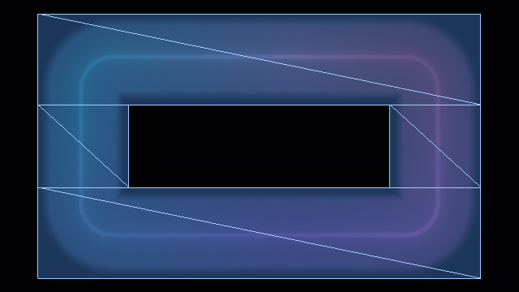

*The glow quad (P1) as drawn, over the dimmed frame: both cutoffs on
(`insideCutoff` {40, 16}, `outsideCutoff` {36, 16}), so it is a box capped
just past the outside cutoff's fade with a hole inside the inside cutoff's -
four strips, eight triangles, 24 vertices. Nothing outside it is shaded at
all.*

**`setupFillGeometry`: the fill band.** A rectangle with a hole, sized by the
fill's own cutoffs plus 3 px of safety, full-res. None when the fill covers
the whole viewport (the clear path draws it instead).

**`setupRingGeometry`: the scaled path's three areas.** At scale 1.0 it
zeroes everything and returns. Below it, in full-res rect-local px:

1. **The ring**: an annulus `GetRingWidth` either side of the outline,
   clipped to where the glow can be lit (`GetRingExtent`, `GetLitExtent`).
2. **The blit**: everything outside the ring that can still be lit, out to the
   glow's fade, as two annuli (outside the ring, and inside its hole).
3. **The partition guarantee**: the ring and the blit are emitted from the
   same floats (`PushAnnulus(ringOuter, ringHole)` versus
   `PushAnnulus(blitOuter, ringOuter) + PushAnnulus(ringHole, blitHole)`), so
   their shared edges are bit-identical and the rasterizer gives every pixel
   on such an edge to exactly one of them. Both blend premultiplied-over, so
   a pixel drawn twice would composite twice. This also depends on both
   passes drawing through one full-res transform, which `Render` builds once
   and hands to both, and on `invariant gl_Position` in `neon.vert` (Part
   7.1). `neon-scale-check partition` (Part 9.3) tests the result.
4. **The gather quad** (scaled px): the union of the glow quad and the ring,
   padded by the gather's bilinear footprint. Stored as `mGatherOuter`.
5. `mScaledOuter`: the blit's outer box plus its footprint, which sizes the
   reduced buffer.

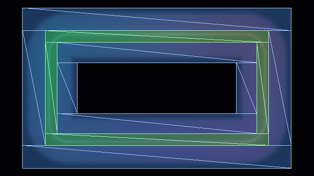

*The same scene at scale 0.5: the ring (P2c, green) and the blit area (P2b,
blue), as drawn. The blit is two annuli, one each side of the ring, and the
three share their edges exactly, so no pixel is drawn twice.*

**`rebuildLoopSamples`: the 128 perimeter points.** For `i < n`:
`sample[i] = GetPointOnRectangle(i / n, geometry) * scale`, packed as
`vec4(x, y, 0, 0)` into `LoopSamplesBlock`. Points are evenly spaced by arc
length, in rect-local scaled px.

**`packLightBlockData`: segments and arcs.** `SegmentBlock` gets
`(position, 1/max(length/2, 0.001), boost, hasStops)` per effective segment;
`ArcBlock` gets `(start, length, intensity, PackArcFlags(...))` per arc. Runs
only when `mLightBlocksDirty`; the blocks are bound every frame.

### 5.7 Worked numbers for the library defaults

An 800x600 rect, corner radius 40, `lineWidth` 4, `filamentFalloff` 1,
`glowRadius` 5, `bloomStrength` 0.3, `intensity` 1, no cutoffs, `glowSide`
`BOTH`:

| Quantity | Value | From |
| -------- | ----- | ---- |
| filament `sigma` | 2 px | `lineWidth / 2` |
| filament reach | 7.1 px | `sigma x 3.54` (`log2(12 / 0.002)^(1/2)`) |
| glow margin | 312 px | `5 x 48 x (1 + 0.3 x 1)` |
| glow quad | 1424 x 1224, no hole | rect + 2 x 312 (bloom reaches the centre) |
| perimeter | about 2731 px | `2 x (800 + 600 - 4 x 40) + 2 x pi x 40` |
| colour kernel `kc` | about 24 px | `perimeter x 0.0088` |
| sample spacing | about 21 px | `perimeter / 128` |
| at scale 0.5: ring half-width | about 9 px | `max(7.1, 3.54 / 0.5) + 1 / 0.5` |
| at scale 0.5: gather scale | about 0.083 | `2 / kc`: one gather texel per 12 full-res px |

---

## Part 6. Every pass: inputs, state, outputs

The neon runs five passes at scale 1.0 and up to eight below it. Each card
below lists what a pass reads, where it draws, with what state, and what it
produces. "Unit N" is the texture unit a sampler is bound to.

```
 scale 1.0 (direct path)                 scale < 1.0 (scaled path)

 P0  emission table   [offscreen]        P0  emission table      [offscreen]
 P0b coverage table   [offscreen]        P0b coverage table      [offscreen]
                                         P1a gather              [offscreen]
                                         P1b shade (reduced)     [offscreen]
 P2a opaque fill      [caller's FB]      P2a opaque fill         [caller's FB]
 P1  glow             [caller's FB]      P2b blit                [caller's FB]
                                         P2c edge ring           [caller's FB]
```

The data flow between them, below scale 1.0:

```
 config --CPU bake--> LUTs (gradient, segment, arc) + UBOs (samples, segments, arcs)
                          |
                          v
 P0 emission table (128 x 2): per-sample colour x weight, segment colour x bell
                          |  texelFetch
                          v
 P1a gather (coarse grid): weighted-mean colour + gathered coverages  -> mGatherBuffer
                          |  textureLod (bilinear)
              .-----------+-----------.
              v                       v
 P1b shade at resolutionScale      P2c edge ring at full res        -> caller's FB
   -> mScaledBuffer                    (the line and every edge near it)
              |  texture (bilinear)
              v
 P2b blit at full res, outside the ring, + one-sided cut + cutoffs  -> caller's FB
```

P0b stands beside P0 rather than in this chain: it reads only the arc block
and a few uniforms, and its table is read by every pass that shades - P1, P1b
and P2c - one linear fetch per piece of the emitter.

### P0: the emission table (`renderEmissionPass`, `neon-emission.frag`)

| | |
| - | - |
| **Purpose** | Pre-compute, once per sample, everything the gather needs that does not depend on the pixel. |
| **Runs** | Both paths, only when `isEmissionTableStale` (config changed, cross-fade running, or the hue rotating). |
| **Target** | `mEmissionBuffer`, 128 x 2 texels, RGBA16F (RGBA8 fallback), `GL_NEAREST`. Its own `RenderTargetState` is captured and restored. |
| **State** | Blend off. Scissor off (`NoScissorScope`: the host's scissor box is in window coordinates). No clear: the quad covers every texel. |
| **Geometry** | `mFullscreenVertexArray`, identity MVP: one fragment per texel. |
| **Uniforms** | `uMVP` (identity), `uTime`, `uHueRotationRate`, `uNumSamples`. |
| **Textures** | unit 0 `uGradientLUT`, unit 1 `uSegmentLUT`, unit 2 `uArcLUT`. |
| **Blocks** | `SegmentBlock` (0), `ArcBlock` (2). |
| **Output** | Texel `(i, 0)`: `rgb` = the winning arc's colour x its weight, `a` = that weight (`arcW` = arc mask x intensity). Texel `(i, 1)`: `rgb` = sum over segments of colour x bell, `a` = sum of bells. |

The pass figures in this part come from one frame at scale 0.5 of a scene
with something in every buffer: an arc over `t` 0 to 0.6 on the base gradient,
a dimmer arc (`intensity` 0.6, its own orange-to-red stops) over 0.65 to 0.95,
dark gaps between them, and a segment at 0.3.
[`neon-shader-outputs.html`](neon-shader-outputs.html) shows the same images
on one page, pass by pass, with each program's target and grid.


*P0's table for that scene, one 5 px column per sample, `t` 0 at the left.
Top to bottom: row 0's colour (arc colour x weight), row 0's alpha (the arc
weight: 1, then 0.6 for the dimmer arc, 0 in the gaps), row 1's colour
(segment colour x bell) and row 1's alpha (the bell, scaled to its peak).*

### P0b: the glow coverage table (`renderGlowCoverPass`, `neon-glow-cover.frag`)

| | |
| - | - |
| **Purpose** | Pre-compute, for each of the eight pieces of the emitter, how lit that piece is as the halo and the bloom see it from any fragment position round it, so each piece can scale its glow by its own coverage (Part 3.6). |
| **Runs** | Both paths, only when `mGlowCoverDirty` (any config change). Never on time - but every frame under an animation that changes the config (0.14-0.27 ms a frame in all on an AMD Radeon Pro 5300M, one arc to three arcs and two segments - about half what V20's table cost). Skipped on a ring lit uniformly - one full arc, no segments - which never reads it (`IsGlowCoverUnread`); its program is built on the first frame that bakes (`ensureGlowCoverProgram`), not in `Initialize`. |
| **Target** | `mGlowCoverBuffer`, 1024 x 128 texels (1.0 MB), RGBA16F (RGBA8 fallback), `GL_LINEAR`. Its own `RenderTargetState` is captured and restored. |
| **State** | Blend off. Scissor off. No clear: the quad covers every texel. |
| **Geometry** | `mFullscreenVertexArray`, identity MVP: one fragment per texel. |
| **Uniforms** | `uMVP` (identity), `uHeadFeather`, `uTailFeather`, `uHaloWidth`, `uBloomWidth`, `uStraightSize`, `uRadius` - all lengths as fractions of the full-res perimeter, which is what lets both resolution paths share the table - `uWinding`, which places each piece on the perimeter, and `uGlowCoverSplit`, each band's split between its straight and its corner. |
| **Blocks** | `SegmentBlock` (0), `ArcBlock` (2). |
| **Output** | One sheet per piece (`neon-pieces.glsl` has the layout and its inverse), two to a band. At a band's left, a straight: across, the fragment's projection along it - uniform over it, then 64 columns past each end, spaced `kh / 4` at the end and wider beyond - and down its distance `a = kh v / (1 - v)`, `v = (j + 0.5) / 32`. At its right, a corner, with a guard texel at each end: across, the direction from the arc's centre as a diamond angle (the arc's own quadrant uniform, then out to the diagonal behind the centre, where the guards join the two sides), and down the distance from the centre - the inside of the arc in the top half, the outside below. The columns between their overhangs go to the two in proportion to their lengths. Each texel holds that piece's coverage over its own extent, weighted by each layer's kernel about the fragment's foot, as a ratio to the kernel's mass over the piece: `r` = the arcs' coverage x intensity under the halo's kernel, `g` under the bloom's (closed form); `b` and `a` the segments' boost x bell under each (Gauss-Legendre, ~1e-3 of the boost). Each encoded `c / (1 + c)`. |


*P0b's table for the same scene, as stored, every fourth column: one panel per
channel - the arcs as the halo and the bloom see them (top), then the
segments the same two ways (bottom). Each panel has four bands, a thin gap
between them. At each band's left is a straight's sheet, the projection along
it across and the distance from the line growing downward: the piece's own
stretch of the arcs is sharp at the top and softens as the kernel widens, and
the columns at either side, past the straight's ends, hold what the piece looks
like from beyond them. At its right is a corner's: the arc's own quadrant in
the middle, the arc itself halfway down, its inside above.*

### P1: the glow, direct path (`renderNeonPass(scaled = false)`, `neon.frag` plain)

| | |
| - | - |
| **Purpose** | Gather, shade and composite the glow in one pass. |
| **Runs** | Scale 1.0 only. |
| **Target** | The caller's framebuffer and viewport, as handed in. The host's scissor applies. |
| **State** | Blend on, premultiplied-over (`GL_ONE, GL_ONE_MINUS_SRC_ALPHA`). Drawn after the fill. |
| **Geometry** | `mGlowVertexArray` with `mvp = ortho(0, w, 0, h) * translate(centerFull)`. |
| **Uniforms** | all of `uploadNeonUniforms` (Part 7.3, table of uniforms) plus `uNumSamples`, `uQuadMargin = mQuadMargin`. |
| **Textures** | units 0-2 the LUTs (alpha reads), unit 3 `uEmission`, unit 5 `uGlowCover`. |
| **Blocks** | `SegmentBlock` (0), `LoopSamplesBlock` (1), `ArcBlock` (2). |
| **Output** | `fragColor`: premultiplied graded colour, alpha = brightest channel. |


*P1's output for the same scene at scale 1.0: one draw, the loop and the
shading together, everything at full resolution. Below 1.0 the next four
passes rebuild this picture.*

### P1a: the gather (`renderGatherPass`, `neon-gather.frag`)

| | |
| - | - |
| **Purpose** | Run the expensive gather loop once, on a coarse grid, and store its results. |
| **Runs** | Below scale 1.0. |
| **Target** | `mGatherBuffer`: a region around the rect clipped to the viewport (`GetBufferRegion`, uncapped), at `GetGatherScale` (about 2 texels per colour kernel `kc`, never finer than `resolutionScale`). RGBA16F (RGBA8 fallback), linear filtering; 1 attachment, 2 when there are segments. Cleared to 0. |
| **State** | Blend off (the attachments are data). Scissor off. Viewport = the buffer. |
| **Geometry** | `mGatherVertexArray` through `RegionProjection(gatherRegion)`. |
| **Uniforms** | only `uploadShapeUniforms`: `uMVP`, `uRectSize`, `uCornerRadius`; plus `uNumSamples`. The program has no other uniform, and setting one logs an error. |
| **Textures** | unit 3 `uEmission`. |
| **Blocks** | `LoopSamplesBlock` (1); `SegmentBlock` (0), whose count selects the loop body. |
| **Output** | location 0 `oGather = (colour, E/(1+E))`; location 1 `oGatherSeg = (segment colour, S/(1+S))`, where `E` and `S` are the gathered arc and segment coverages. `c/(1+c)` squeezes an unbounded coverage into [0, 1) so the RGBA8 fallback can store it; it is exact at 0 and decodes as `e/(1-e)`. |

| attachment 0: hue | attachment 0: arc coverage | attachment 1: segment |
| :-: | :-: | :-: |
| 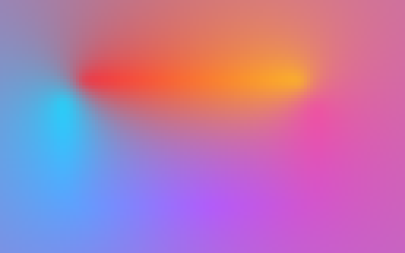 | 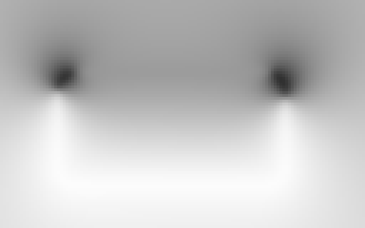 | 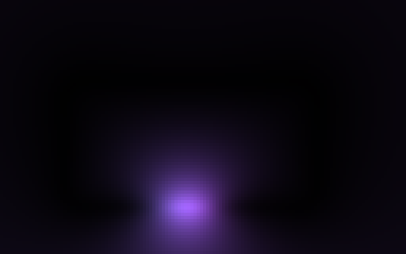 |

*The gather buffer after P1a: 128 x 80 RGBA16F texels for this 640 x 360
frame, magnified 4x. The hue (left) and the decoded arc coverage (centre: white
is 1, darker where the outline near the texel is dim or dark) are smooth
enough that this grid carries them; the right panel is the segment's colour
scaled by its coverage.*

### P1b: shade at the reduced scale (`renderNeonPass(scaled = true)`, `neon.frag` + `NEON_READS_GATHER`)

| | |
| - | - |
| **Purpose** | Shade the glow at `resolutionScale`, reading the gather's results instead of looping. |
| **Runs** | Below scale 1.0. |
| **Target** | `mScaledBuffer`: RGBA8, one attachment, covering what the blit will read (`mScaledOuter`), capped per axis at the reduced viewport size. Cleared to 0. |
| **State** | Blend off: the buffer is fresh and the quad covers each texel once, so blending would only add a destination read. Scissor off. |
| **Geometry** | `mGlowVertexArray` through `RegionProjection(scaledRegion)`. |
| **Uniforms** | all of `uploadNeonUniforms` at the real scale, plus `uQuadMargin = mQuadMargin`, `uGatherUVScale` / `uGatherUVOffset` (the map from this pass's `vPos` to the gather buffer's uv). |
| **Textures** | units 0-2 the LUTs, unit 3 `uGather`, unit 4 `uGatherSeg`, unit 5 `uGlowCover`. |
| **Output** | premultiplied graded colour. The one-sided cut and the cutoffs are **not** applied here (only coarse discards with a 2-texel guard band): the blit applies them at full resolution. |


*The reduced buffer after P1b, 320 x 180 at scale 0.5, magnified 2x: the
glow is fine at this resolution, the line is visibly blocky.*

### P2a: the opaque fill (`renderOpaqueFill`, `black-rect.frag`)

| | |
| - | - |
| **Purpose** | Paint `opaqueColor` over the configured band, under the glow. |
| **Runs** | Both paths, when `opaqueMode != NONE`. Always full resolution. |
| **Target** | The caller's framebuffer. The host's scissor applies. |
| **State** | Blend on, premultiplied-over. |
| **Fast path** | If the fill covers the whole viewport and no depth or stencil test is enabled: intersect the viewport with the host's scissor box, scissor to it, `glClearBufferfv(GL_COLOR, 0, {rgb, 1})`, restore the scissor. No draw. |
| **Geometry** | `mFillVertexArray` (full-res, `ortho * translate(centerFull)`), or the full-screen quad when there is no band. |
| **Uniforms** | `uMVP`, `uRectSize`, `uCornerRadius`, `uRectCenter` (GL window coords), `uOpaqueMode`, the fill's four cutoff values (unscaled), `uOpaqueColor`. |
| **Output** | `vec4(opaqueColor.rgb * coverage, coverage)`. |

### P2b: the blit (`renderBlitPass`, `neon-blit.frag`)

| | |
| - | - |
| **Purpose** | Upsample the reduced buffer onto the caller's framebuffer everywhere outside the ring where the glow can be lit, and draw the one-sided cut and the cutoff edges at full resolution. |
| **Runs** | Below scale 1.0, unless the blit area is empty. |
| **Target** | The caller's framebuffer. |
| **State** | Blend on, premultiplied-over. |
| **Geometry** | `mBlitVertexArray`, full-res, `ortho * translate(centerFull)`. |
| **Uniforms** | `uMVP`, `uUVScale` / `uUVOffset` (the reduced buffer's region map), `uRectSize`, `uCornerRadius`, `uRectCenter`, `uGlowSide`, `uGlowSideSoftness`, the glow's four cutoff values: all **unscaled**, because this pass measures destination pixels. |
| **Textures** | unit 0 `uSource` = `mScaledBuffer`. |
| **Output** | `texture(uSource, uv) * cut`, premultiplied. |

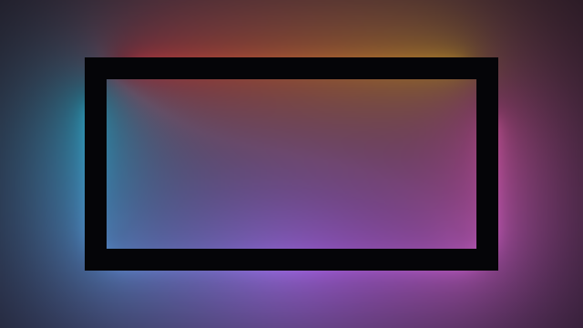

*The caller's framebuffer after P2b: the reduced buffer upsampled everywhere
the glow can reach except the ring. The black band is where the ring will go.*

### P2c: the edge ring (`renderRingPass`, `neon.frag` + `NEON_READS_GATHER`, second object)

| | |
| - | - |
| **Purpose** | Re-shade a thin band around the outline at full resolution, so the line and every edge near it look exactly as at scale 1.0. |
| **Runs** | Below scale 1.0, unless the ring is empty. |
| **Target** | The caller's framebuffer, full resolution. |
| **State** | Blend on, premultiplied-over. |
| **Geometry** | `mRingVertexArray`, full-res, the same transform as the blit; shares its edges with the blit's area exactly. |
| **Uniforms** | `uploadNeonUniforms` **at scale 1.0** (so the shader behaves as the direct path: cut and cutoffs applied, no sampling floor), `uQuadMargin = mRingQuadMargin`, and the gather map from full-res `vPos`. |
| **Textures** | units 0-2 the LUTs, units 3-4 the gather buffer, unit 5 `uGlowCover`. |
| **Output** | premultiplied graded colour, like P1. |


*After P2c, which is the finished frame: the ring filled in at full
resolution.*

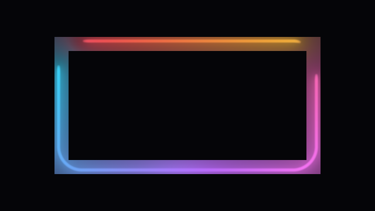

*The ring's own output, with the blit's pixels left out: a band of
axis-aligned strips around the outline, shaded at full resolution from the
gather buffer. It and the after-blit frame above add up to the finished frame,
with no pixel in both.*

Why P1b and P2c are two program objects compiled from the same source: each
then draws one kind of target, in one blend state, every frame. One program
drawing an offscreen buffer unblended and the window blended in the same frame
was measured 93-624x slower on the AMD macOS driver
([`neon-resolution-scale-plan.md`](neon-resolution-scale-plan.md) section 7,
build "AB"). Do not merge them as a cleanup.

---

## Part 7. The shaders, line by line

Read this part next to the source. The shaders are heavily commented with the
measurements behind each choice; this part gives you the skeleton so the
comments make sense.

### 7.1 `neon.vert` (every neon program's vertex shader)

```glsl
invariant gl_Position;
layout(location = 0) in vec2 aPos;
uniform mat4 uMVP;
out vec2 vPos;
void main() { vPos = aPos; gl_Position = uMVP * vec4(aPos, 0.0, 1.0); }
```

It passes the vertex position through unchanged as `vPos` and transforms it
for the rasterizer. What `vPos` means depends on the vertex data the CPU
feeds: rect-local scaled px for the glow and gather quads, rect-local full-res
px for the fill, ring and blit, NDC for the full-screen quad.

**`invariant gl_Position`** matters. GLSL only guarantees two separately
compiled programs compute bit-identical `gl_Position` from the same inputs
when this qualifier is present. The blit and the ring are different programs
whose areas share edges; without the qualifier a 1-pixel seam could be drawn
twice or not at all. Do not remove it as a cleanup.

### 7.2 `neon-emission.frag` (P0)

One fragment per texel of a 128 x 2 target; `gl_FragCoord.x` is the sample
index, `gl_FragCoord.y` picks the row.

```
si = floor(gl_FragCoord.x) / numSamples          // this sample's perimeter position
ti = si - uTime * uHueRotationRate               // rotated position for the base gradient

// Row 0: which arc owns this sample, and its colour
for each arc a:  mask_a = arcInside(si, a) * a.intensity     // smoothstep-feathered by 1 sample
winner = arc with the largest mask (ties keep the lower index); arcW = its mask
colour = winner has stops ? texture(uArcLUT, (position within the arc, row of a)).rgb
                          : texture(uGradientLUT, (ti, 0.5)).rgb       // REPEAT wraps ti
row 0 = vec4(colour * arcW, arcW)

// Row 1: travelling segments
for each segment s:
    rel  = si - s.position, wrapped to [-0.5, 0.5]
    e    = rel * s.invSigma                       // invSigma = 1 / (length/2)
    bell = s.boost * exp(-e*e)                    // skipped below 0.005
    segColour = s has stops ? texture(uSegmentLUT, (0.5 + 0.5*e, row of s)).rgb
                            : the winning arc's colour, or the base gradient if none
    sum += segColour * bell;  bellSum += bell
row 1 = vec4(sum, bellSum)
```

Notes:

- Only `.rgb` of the LUTs is read here. Stop alpha is read pointwise in
  `neon.frag` (Part 3.6).
- Arcs and segments with their own stops have no hue-rotation term: their
  gradient stays put while the base ring turns.
- `uIntensity` is not baked in; it multiplies the gathered colour later.
- Why two rows: the consumer needs two independently normalised colours (the
  arc colour divides by the arc weights, the segment colour by the bell sum),
  so each needs its own numerator and denominator.
- The table is a pure function of (sample index, time, config). That purity
  is what lets the renderer skip the pass on frames where neither input moved.
  The invariant for anyone editing: **a pure function of `(si, uTime, config)`
  goes in the pre-pass; anything that reads `vPos` stays in `neon.frag`.**

### 7.3 `neon.frag`

#### Programs

Three sources make the three neon programs. `neon-common.glsl` is the gather
loop (`gatherPerimeter`) and what it reads, injected ahead of the other two
(Part 2.1). `neon-gather.frag` is short enough to read whole: its `main()` is
the call and the encoded write. Everything else in this section is `neon.frag`.

| | `neon.frag` (scale 1.0) | `neon-gather.frag` (P1a) | `neon.frag` + `NEON_READS_GATHER` (P1b, P2c) |
| - | - | - | - |
| Gather loop, `LoopSamplesBlock`, `uNumSamples`, `uEmission` | yes | yes | no |
| `ArcBlock`, LUTs, shading uniforms | yes | no | yes |
| `uGlowCover` (P0b's table) | yes | no | yes |
| `uGather`, `uGatherSeg`, `uGatherUVScale`, `uGatherUVOffset` | no | no | yes |
| Discards (one-sided cut, cutoffs) | yes | **no** (its texels are read at other resolutions, and a culled texel would feed a black value into their bilinear reads) | yes |
| Shading after the gather | yes | no: it writes the gather results and that is the whole file | yes |
| Outputs | `fragColor` | `oGather` (location 0), `oGatherSeg` (location 1) | `fragColor` |

The same `NEON_READS_GATHER` source behaves differently in P1b and P2c because
of one uniform: `uResolutionScale`. In P1b it is the real scale (< 1), so
`blitOwnsCut` is true: the shader only culls with a guard band and leaves the
cut and the cutoffs to the blit. In P2c it is 1.0, so the shader behaves
exactly like the direct path.

#### Inputs

| Uniform | Type | Units | From |
| ------- | ---- | ----- | ---- |
| `uRectSize` | vec2 | scaled px | `width, height` x scale |
| `uCornerRadius` | float | scaled px | effective corner radius x scale |
| `uLineWidth` | float | scaled px | `lineWidth` x scale |
| `uFilamentFalloff` | float | none | `filamentFalloff` |
| `uIntensity` | float | none | `intensity` |
| `uTime` | float | s | effect clock |
| `uHueRotationRate` | float | rev/s | `hueRotationRate` |
| `uGlowRadius` | float | scaled px | `glowRadius` x scale |
| `uBloomStrength` | float | none | `bloomStrength` |
| `uGlowSide` | int | 0/1/2 | `glowSide` |
| `uGlowSideSoftness` | float | scaled px | `glowSideSoftness` x scale |
| `uInsideCutoff`, `uOutsideCutoff` | float | scaled px | `GetCutoffSize(...)` x scale (1e6 x scale when disabled) |
| `uInsideCutoffSoftness`, `uOutsideCutoffSoftness` | float | scaled px | `softness` x scale |
| `uWinding` | int | 0/1 | `geometry.winding` |
| `uResolutionScale` | float | | clamped scale (1.0 for the ring) |
| `uQuadMargin` | float | scaled px | `mQuadMargin` (`mRingQuadMargin` for the ring) |
| `uNumSamples` | int | | clamped `numSamples` (plain `neon.frag` and `neon-gather.frag`) |
| `uGatherUVScale`, `uGatherUVOffset` | vec2 | | the gather region's map (reads-gather variant) |

Plus the three blocks (Part 1.5), the three LUTs (units 0-2), and either
`uEmission` (unit 3) or `uGather` / `uGatherSeg` (units 3 and 4).

**Units rule.** Every pixel-valued uniform arrives already multiplied by the
scale. Every pixel constant in `neon-tuning.h` is written in full-res px, and
the shader converts it by multiplying by `uResolutionScale` at the point of
use. The exceptions, deliberately in *buffer* px and never converted:
`FILAMENT_NYQUIST_SAMPLE_PX`, `BLIT_SIDE_GUARD_PX`, `BLIT_CUTOFF_GUARD_PX`.
`COLOR_BLEND_PERIM_FRAC` is a fraction, not px.

#### `main()`, stage by stage

The stage numbers follow the source order.

| # | Stage | What it computes |
| - | ----- | ---------------- |
| 1 | **SDF** | `d = sdRoundBox(vPos, uRectSize/2, uCornerRadius)`, `ad = abs(d)`. |
| 2 | **Antialias width** | `sideAA = max(fwidth(d) * uResolutionScale, 1e-6)`: one destination pixel in this pass's units. The only derivative in the shader, computed before every discard (Part 1.10). |
| 3 | **One-sided cut parameters** | `sideSoft = max(uGlowSideSoftness, sideAA)` (feather, floored at 1 px); `blitOwnsCut = uResolutionScale < 1`; `sideBack = 0.5 * sideAA`; `sideCull` = 2 buffer px on the scaled path, else `sideBack`. |
| 4 | **One-sided discards** | `INSIDE` and `d > sideCull`, or `OUTSIDE` and `d < -sideCull`: discard. (`neon-gather.frag` has none.) |
| 5 | **Cutoff ramps** | Each softness floored at `sideAA`; `inHalf`, `outHalf` = half the ramp widths; `inMid = uInsideCutoff + softness/2` and `outMid` likewise, the 50% points of fades that start at the cutoff. |
| 6 | **Band distances** | `dIn = d + inMid`; `dOut = d - outMid` (a per-axis box distance at corner radius 0, so a square rect keeps a square band). A cutoff on a side `glowSide` already removes is neutralised with the 1e6 sentinel. |
| 7 | **Cutoff discards** | Fragments fully past either fade, plus a 2-px guard on the scaled path, are discarded. (`neon-gather.frag` has none.) |
| 8 | **Filament** | `N = 2 * uFilamentFalloff`; `sigma = max(uLineWidth/2, 0.5 px floor, Nyquist floor)`; `core = exp2(-(ad/sigma)^N)`, pedestal-subtracted so it is exactly 0 at its reach; `lineGate` fades the line out as `lineWidth` goes to 0. The Nyquist floor (scaled path only) keeps a line wide enough that a reduced buffer can sample it. |
| 9 | **Perimeter** | `peri = rectPerimeter()` (`neon-common.glsl`) `= 2(W + H - 4r) + 2 pi r`, in this pass's px. |
| 10 | **Kernel widths** | `kh = uGlowRadius` (halo), `bw = 6 * uGlowRadius` (bloom); and inside `gatherPerimeter`, `kc = peri * COLOR_BLEND_PERIM_FRAC` (colour); each floored at 0.001. |
| 11 | **Gather** | Plain `neon.frag` (and `neon-gather.frag`, which does nothing else): `gatherPerimeter(vPos)` from `neon-common.glsl`, the loop of Part 3.3 over `uNumSamples` samples, `g = 1/(dist^2 + kc^2)`, reading the emission table with `texelFetch`, accumulating arc colour, arc weight, segment colour, segment weight and the total weight. `col` = arc colour / arc weight; `segColHue` = segment colour / segment weight. Two loop bodies under one uniform branch: the segment-free body skips one fetch per sample. It returns both hues and the two gathered coverages of stage 14. Reads-gather variant: `textureLod` the gather buffer and decode `e/(1-e)` instead. |
| 12 | **Pointwise position and arc coverage** | `sPos = perimeterPosition(vPos)`; for each arc, `arcCoverContinuous` (feathered by `HEAD_FEATHER_PX`/`TAIL_FEATHER_PX`, outward where arcs abut) x intensity x stop alpha; `emitCover` = the max over arcs. |
| 13 | **Pointwise segment coverage** | `segCoverPt = sum of boost * exp(-e^2) * alpha`; `segCol = segColHue * segCoverPt`. |
| 14 | **Gathered coverage** | `emitCoverGathered = arcWeight / totalWeight`, `segCoverGathered = segWeight / totalWeight` (exactly 1.0 on a fully lit ring), divided at the end of `gatherPerimeter` and arriving with stage 11; `gatheredSeg = segmentGlow(gathered) = segCoverGathered * max(emitCoverGathered, min(segCoverGathered, 1))`. |
| 15 | **Filament gate** | `filamentGate = max(smoothstep(0.5, 1, min(segCoverPt, 1)), emitCover)`: a segment on a dark stretch opens its own core only above half strength. |
| 16 | **Halo and bloom, straights** | For each of the four edges: perpendicular distance and extent, `haloSegment` and `bloomSegmentPedestalled` (Part 3.5), summed. `reach` mirrors the CPU's quad margin. Each edge then calls `addStraightGlowFix`, adding to `glowFix` how far its own halo and bloom move when they take that piece's own coverage instead of the gathered one. It reads that straight's sheet of P0b's table (`glowCoverAt`) at the fragment's projection along the straight - unclamped, since past an end the coverage still changes - and its distance from the line, through `glowCoverStraightUV`: one linear fetch, `.r` / `.b` for the halo's arc and segment coverage, `.g` / `.a` for the bloom's. Skipped - one compare - for a piece whose halo plus bloom is under `GLOW_PIECE_MIN`, and for every piece on a ring lit uniformly. |
| 17 | **Halo and bloom, corner arcs** | If `uCornerRadius > 0` (a uniform branch): each quarter arc is developed onto its tangent line (`arcTangentSegment`) and added with its weight; the four arcs share one bloom pedestal. One arc at a time (`addCornerPiece`): developed, its halo and bloom added, and its correction as in stage 16 (`addCornerGlowFix`), read from that corner's sheet at the fragment's polar position round the arc's centre (`glowCoverCornerUV`). Behind the centre, where the development flips ends across the diagonal, the bake has already blended both, so the read needs nothing special. |
| 18 | **Normalisation** | `halo *= HALO_NORM_FACTOR`; `bloom *= BLOOM_NORM_FACTOR`, then renormalised so the on-line value stays and the tail reaches 0 at `reach`. |
| 19 | **Glow gate** | `glowGate = clamp(uGlowRadius / (2 px), 0, 1)`: at radius 0 the analytic halo would be a full-height sub-pixel spike, so it fades in over the first 2 px. |
| 20 | **Compose** | The formula of Part 3.6. |
| 21 | **Quad-edge fade** | `result *= 1 - smoothstep(-(uQuadMargin - fadeStart), 0, dQuad)`, with `dQuad` the per-axis distance to the quad's edge: light fades to 0 before the quad ends, so its rectangle never shows. Starts no earlier than the outside cutoff's end. |
| 22 | **Grade** | Hue-preserving Reinhard on the peak channel (`TONE_MAP_SHOULDER` 0.6), then `pow(result, 0.85)` (Part 1.9). |
| 23 | **One-sided cut mask** | Direct path and ring only: `INSIDE` `1 - smoothstep(sideBack - sideSoft, sideBack, d)`; `OUTSIDE` `smoothstep(-sideBack, sideSoft - sideBack, d)`. After the grade, because it is coverage. |
| 24 | **Cutoff masks** | Direct path and ring only: `smoothstep(-inHalf, inHalf, dIn) * (1 - smoothstep(-outHalf, outHalf, dOut))`. |
| 25 | **Output** | `fragColor = vec4(result, clamp(max(r, g, b), 0, 1))`, premultiplied. |

Things the source comments flag as load-bearing:

- **Pointwise vs gathered coverage** (stages 12-14, 20): the filament uses the
  pointwise values, the halo and bloom the gathered ones. Swapping them
  brings back hard creases along the corner diagonals on a partly lit ring.
  The halo and bloom's per-piece coverage (stages 16-17) is read at
  coordinates that move continuously with the fragment, so it does not bring
  the creases back - including behind a corner's centre, where the bake blends
  the two developments rather than flipping between them. Do not wrap the
  corrections in an `if (!uniformCover)`: measured, that made every scene
  10-15% slower at scale 1.0. Keep the table's forward maps to divisions and
  the corner block to one arc at a time: an `atan` and `log`s in the maps, or
  all four arcs developed before any is read, made a fully lit ring - which
  reads nothing - 1.08-1.16x slower at 1.0 (V21). And do not evaluate the
  table's integrals in `neon.frag` instead of reading it: 2.0x / 3.3x on a
  partly lit ring.
- **`col` carries no brightness.** It is a weighted mean of colours. All
  brightness (intensity, arc coverage, stop alpha) enters through coverages.
- **Masks after the tone map, the quad fade before it.** Coverage scales the
  final value; the quad fade shapes the emission itself.
- **CPU and GPU mirrors.** The shader re-derives several expressions the CPU
  uses to size geometry: the glow reach, the filament's reach and Nyquist
  floor, the cull distances, the cutoff neutralisation. Change one side and you
  must change the other, or the geometry will clip lit pixels.
- **Uniform-only branches** (`uSegmentCount > 0`, `uCornerRadius > 0.0`,
  `blitOwnsCut`, `uGlowSide`) are safe and deliberate. Even so, a branch's
  register cost is paid when it is not taken: re-time a sharp-corner scene
  after touching the corner block.

#### Helper functions

| Function | Computes |
| -------- | -------- |
| `sdRoundBox(p, b, r)` | the rounded-box SDF (Part 1.8) |
| `haloSegment(a, t1, t2, k)` | closed-form halo of a straight piece; infinite-line limit `2k^2/(a^2+k^2)` |
| `bloomSegment(a, t1, t2, k)` | closed-form bloom of a straight piece; infinite-line limit `pi k / sqrt(a^2+k^2)` |
| `bloomSegmentPedestalled(...)` | the bloom minus its value at `reach`, so the tail ends at 0 |
| `arcTangentSegment(w, r)` | develops a quarter arc onto the tangent at its point nearest the fragment; returns `(distance, t1, t2, weight)` |
| `bandOuterDistance`, `bandInnerDistance` | distances to the outer and inner cutoff boundaries |
| `perimeterPosition(p)` | the inverse of `GetPointOnRectangle`: nearest outline point, which of 8 pieces, fraction of the perimeter |
| `arcHasStops`, `arcTailAbuts`, `arcHeadAbuts` | decode the arc flags bitmask |
| `arcCoverContinuous(...)` | an arc's feathered coverage at `sPos`, wrap-aware |

### 7.4 `neon-blit.frag` (P2b)

```
uv  = vPos * uUVScale + uUVOffset              // rect-local full-res px -> reduced buffer uv
src = texture(uSource, uv)                     // premultiplied, bilinear
cutIn  = glowSide != OUTSIDE && insideCutoff enabled
cutOut = glowSide != INSIDE  && outsideCutoff enabled
if (glowSide != BOTH || cutIn || cutOut) {     // a branch on uniforms only
    d    = sdRoundBox(gl_FragCoord.xy - uRectCenter, halfSize, r)
    aa   = fwidth(d)                           // one destination pixel
    cut  = one-sided cut (the same curve as neon.frag stage 23)
    cut *= cutoff masks (the same curves as neon.frag stage 24)
} else cut = 1
fragColor = src * cut
```

Why the cut lives here and not in the reduced pass: a reduced buffer smears a
hard edge across `1/scale` destination pixels when upsampled. Measured at 0.5
before the move, the dark side of a one-sided glow came back at 59/255; drawn
here at full resolution it is 0. The reduced pass instead keeps a 2-texel lit
guard band past each edge (`BLIT_SIDE_GUARD_PX`, `BLIT_CUTOFF_GUARD_PX`) so the
bilinear read has real data right up to the edge.
[`glow-side-comparison.md`](glow-side-comparison.md) has the before/after
crops.

### 7.5 `black-rect.frag` (P2a)

```
p        = gl_FragCoord.xy - uRectCenter
d        = sdRoundBox(p, halfSize, r)
aa       = max(fwidth(d), 1e-6)
edgeIn   = clamp(0.5 - d/aa, 0, 1)                  // exact 1-px box filter of the edge
edgeOut  = 1 - edgeIn
inBand   = smoothstep(-inHalf, inHalf, d + inMid)   // fill's own inside cutoff
outBand  = 1 - smoothstep(-outHalf, outHalf, dOut)  // fill's own outside cutoff
coverage = ALL ? 1 : OUTSIDE ? edgeOut * outBand : INSIDE ? inBand * edgeIn : BOTH ? inBand * outBand : 0
fragColor = vec4(uOpaqueColor.rgb * coverage, coverage)
```

Written as one straight line with no early return and no `discard`: an early
return above `fwidth` measured about 35% slower, and discard is avoided for
the Mali/Tizen targets. The edge uses an exact box filter rather than a
`smoothstep`: the earlier two-pixel smoothstep let 15.6% of the background
through the outermost ring of a viewport-sized fill.

### 7.6 Tuning constants (`neon-tuning.h`)

| Constant | Value | Meaning |
| -------- | ----- | ------- |
| `NEON_MAX_LOOP_SAMPLES` | 128 | sample ceiling: size of `LoopSamplesBlock` and the emission table |
| `MAX_ARCS`, `MAX_SEGMENT_BOOSTS` | 8, 8 | block array bounds and atlas rows |
| `FILAMENT_GAIN` | 12 | filament core gain |
| `FILAMENT_CUTOFF` | 0.002 | level at which `core x gain` counts as gone (sets the reach) |
| `FILAMENT_MIN_HALF_WIDTH` | 0.5 full-res px | floor on `sigma` |
| `FILAMENT_NYQUIST_SAMPLE_PX`, `..._MIN_SHARE` | 1 buffer px, 0.0625 | the reduced path's sampling floor |
| `HALO_GAIN`, `HALO_NORM_FACTOR` | 0.9, 0.43 | halo gain and calibration |
| `BLOOM_REACH_TO_GLOW`, `BLOOM_NORM_FACTOR` | 6, 0.32 | bloom width = 6 x glowRadius; calibration |
| `GLOW_REACH_RADIUS_FACTOR` | 48 | glow reach = glowRadius x 48 x (1 + bloom x intensity); shared with the CPU |
| `COLOR_BLEND_PERIM_FRAC` | 0.0088 | colour kernel `kc` as a fraction of the perimeter |
| `HEAD_FEATHER_PX`, `TAIL_FEATHER_PX` | 14 full-res px | arc end feathers |
| `ARC_FEATHER_MAX_SHARE` | 0.4 | feather cap as a share of the arc's length |
| `GLOW_GATE_FADE_PX` | 2 full-res px | glow fade-in at small radii |
| `QUAD_FADE_START_FRAC` | 0.8 | the quad-edge fade starts at 80% of the margin |
| `TONE_MAP_SHOULDER`, `GAMMA_EXPONENT` | 0.6, 0.85 | the grade |
| `BLIT_SIDE_GUARD_PX`, `BLIT_CUTOFF_GUARD_PX` | 2 buffer px | the reduced pass's lit guard bands |
| `CUTOFF_NEUTRALISED` | 1e6 | sentinel for a neutralised or disabled cutoff |
| `RING_GUARD_TEXELS` | 1 | CPU: extra ring width, in reduced-buffer texels |
| `GATHER_TEXELS_PER_KERNEL`, `GATHER_MIN_SCALE` | 2, 0.0625 | CPU: the gather's resolution |

Each has a comment in the header with the measurement that chose its value;
read it before changing one.

---

## Part 8. The reduced-resolution path in depth

### 8.1 The idea

Below `resolutionScale` 1.0 the neon splits the picture by how smooth each
part is, and shades each part at the coarsest resolution it survives:

| Part | Smooth? | Shaded at | Pass |
| ---- | ------- | --------- | ---- |
| the gather's results (colour, coverages) | very: they vary over the colour kernel `kc`, tens of px | about 2 texels per `kc`, typically 1/8 to 1/12 of the screen | P1a |
| the halo and bloom away from the line | yes | `resolutionScale` | P1b, then P2b upsamples |
| the filament and every hard edge (the cut, the cutoffs) | no | full resolution | P2c (ring), P2b (masks) |

The gather was about 95% of the cost, so running it on a few thousand texels
instead of per pixel is where most of the saving comes from. On Mesa
llvmpipe at 1280x720 the default scene renders about 13.5x faster at 0.5
than at 1.0, and 19x faster at 0.25. Quality stays within 2/255 of the 1.0
render on the twelve `neon-scale-check` scenes at every scale down to 0.125,
except a small rect.

### 8.2 The buffers and their regions

Neither offscreen buffer covers the whole viewport. `GetBufferRegion` sizes
each to the box its readers can reach, clipped to the viewport:

- **`mScaledBuffer`** (RGBA8) covers `mScaledOuter`, the blit area plus its
  bilinear footprint, and is capped per axis at the reduced viewport's size:
  a full-screen rect gets exactly the buffer it always had.
- **`mGatherBuffer`** (RGBA16F) covers the gather quad's box, and is never
  capped: a gather texel is about 10 px wide, and ending the buffer at the
  viewport edge made the last rows clamp to one value (measured 5/255 off).

Both keep the texel grid anchored to the viewport's corner and size their
texel count from the unsnapped box plus one, rounded up to 16
(`REGION_ALLOC_STEP`), so a moving or resizing rect does not reallocate a
buffer every frame. At 1920x1080 and scale 0.5, a full-screen rect holds
2.15 MB; a 900x540 rect 1.80 MB.

### 8.3 The ring and the blit

The **ring** is an annulus `R` px either side of the outline, where
`R = max(filament reach at full res, filament reach at the scale) + 1 texel`
(`GetRingWidth`), clipped to the band the glow can be lit in. It is re-shaded
at full resolution (P2c) from the gather buffer, so the line looks exactly as
at 1.0. The **blit** covers everything else that can still be lit, out to the
glow's fade, and applies the one-sided cut and the cutoffs at full
resolution. The two areas tile without overlap (Part 5.6), which is why the
blit area can legitimately be empty: drawing anything there would draw over
the ring.

| after the blit (P2b) | after the ring (P2c) |
| :-: | :-: |
|  |  |

*The bottom-left corner of Part 6's frame, magnified 3x, before and after the
ring. The ring's band is axis-aligned boxes, not a rounded shape: it is built
from the same `PushAnnulus` strips as the blit area.*

| the blit alone, at 0.25 | the frame at 0.25 | the frame at 1.0 |
| :-: | :-: | :-: |
|  |  |  |

*Why the ring exists: a 2 px line at scale 0.25, magnified 3x. Left is what the
blit would draw if it covered the line too, rebuilt by the figure tool from
the real reduced buffer through the blit's own uv map: the line comes out
nearly three times as wide. Centre is the real frame at 0.25; right is 1.0.*

### 8.4 When not to lower the scale

The ring, the blit and the extra passes are a fixed cost. A layer already
cheap at 1.0 (a narrow cutoff band, a one-sided glow) can render slower below
it; a rect small enough that its colour kernel is narrower than a reduced
texel gains nothing from the gather split; and a very small rect loses
quality (a 20x17 rect reads 18 / 53 / 93 levels off at 0.5 / 0.25 / 0.125).
Keep small rects at 1.0, and measure on the target GPU.

For the full history and every number:
[`neon-resolution-scale-plan.md`](neon-resolution-scale-plan.md) (sections 7,
12 and 13), [`neon-resolution-scale-perf-comparison.md`](neon-resolution-scale-perf-comparison.md)
and [`neon-resolution-scale-comparison.html`](neon-resolution-scale-comparison.html).

---

## Part 9. Working on the neon

### 9.1 Build, run, and the demo's controls

```bash
cmake -S . -B build -G Ninja            # Release by default
cmake --build build
./build/demo/edge-lighting-demo
```

The demo opens two windows: the effect, and a debug window (ImGui) whose
**Neon** section edits every field in Part 4 live: Res Scale, Samples, LUT
Size, the opaque fill, Line Width, Filament Falloff, Intensity, Glow Radius,
Bloom Strength, Hue Rotation Rate, Glow Side and its softness, both cutoffs,
segment lights, arcs with their own stops, Blend Space, Color Transition and
the colour stop list. Sliders for animatable fields show the animated
(active) value while you drag the base value. Hotkeys in the main window:
R/F line width, I/O intensity, `[`/`]` glow radius, P/L hue rate, Space pause
the clock, N toggle the neon, Shift+O toggle scale 1.0 / 0.5, W toggle
winding.

### 9.2 Seeing what the GPU sees

- **Capture a frame.** The debug window's Capture button renders one frame
  into an `OffscreenCapture` and saves a PNG under `res/`. In code:

  ```cpp
  effect.SetConfig(cfg);
  effect.Update(0.0f);
  OffscreenCapture capture;
  capture.Begin(w, h);                    // binds an RGBA8 FBO and sets the viewport
  glClearColor(0, 0, 0, 1); glClear(GL_COLOR_BUFFER_BIT);
  effect.Render(w, h);
  CaptureUtil::Image img;
  capture.Read(img);                      // top-left origin, RGBA8
  capture.End();
  ```

  Never `glReadPixels` the window's default framebuffer: after a swap its
  contents are undefined.
- **Dump a LUT.** `CaptureUtil::ReadTexture2D(textureId, w, h, image)`
  attaches the texture to a scratch FBO and reads it back.
- **Watch the colour ring.** The Debug section's "Show Gradient LUT" draws the
  baked ring as a strip, and "Show Color Stops" draws a marker per stop.
- **Fill only.** `debug.opaqueOnly` draws just the opaque fill.
- **Colour changes fade.** `colorTransitionDuration` defaults to 0.3 s, so
  the first frame after a stop change still shows the old ring. Set it to 0
  for single-frame captures and A/B comparisons, and set
  `hueRotationRate = 0` so the capture does not depend on time.
- **Watch the passes.** To see what each pass wrote, without touching the
  library: GLAD calls GL through global function pointers, so a tool linked
  against the static library can wrap `glad_glDrawArrays`, let each draw
  through, then name the pass from its program's uniforms and read back its
  target. That is how Parts 5, 6 and 8 got their figures, and how
  `neon-scale-check partition` replays the blit's and the ring's triangles;
  see `PassRecorder` in `tools/common/` and
  [`tools/neon-guide-figures`](../tools/neon-guide-figures/README.md). It does
  not work through the C ABI dylib, which keeps its own copy of GLAD.

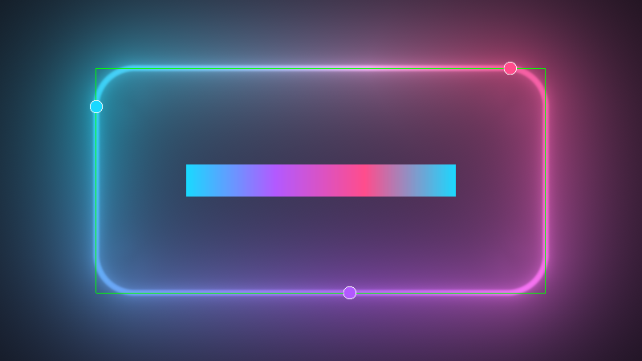

*The debug layer with all three overlays on: the baked ring as a strip (left
to right from `t = 0`), a disc at each colour stop, and the geometry's
bounding box.*

### 9.3 The regression check

```bash
cmake -S . -B build -G Ninja -DEDGE_LIGHTING_BUILD_TOOLS=ON
cmake --build build --target neon-scale-check
./build/tools/neon-scale-check/neon-scale-check check
```

It renders twelve fixed scenes at six resolution scales and fails if scale
1.0 drifts from the committed images, if a reduced scale exceeds its error
bound, or if a moving hairline wanders off its edge. Run it after touching
`neon.frag`, `neon-blit.frag`, `neon.vert` or the scaled path. It runs on a
machine without a GPU through Mesa's llvmpipe. See
[`tools/neon-scale-check/README.md`](../tools/neon-scale-check/README.md).

```bash
./build/tools/neon-scale-check/neon-scale-check partition
```

checks the one thing `check`'s twelve scenes cannot cover in general: that the
blit and the edge ring tile the frame, every pixel drawn by exactly one of
them, across a thousand random configs. A gap shows as a dark crack and an
overlap as a bright seam (Part 8.3). Run it after touching
`setupRingGeometry`, the blit or ring pass, or `neon.vert`, and on each GPU the
scaled path ships to.

### 9.4 Pitfalls, in the order people hit them

1. **Adding a `Config` field without adding it to `operator==`.** Change
   detection silently misses it, and nothing rebuilds.
2. **Declaring a bare uniform array.** Works on desktop, fails on the target.
   Use a std140 block (Part 1.5).
3. **Mixing units.** A new px uniform must be multiplied by the scale on
   upload (`uploadNeonUniforms`), and a new px constant in `neon-tuning.h` must
   be converted with `uResolutionScale` where the shader uses it (Part 7.3).
4. **A derivative after a discard or a per-pixel branch.** Undefined. Put
   `fwidth`/`dFdx` at the top of `main()`; use `textureLod` after branches.
5. **`smoothstep` with reversed edges.** Undefined. Write
   `1.0 - smoothstep(lo, hi, x)`.
6. **Changing a shader expression the CPU mirrors** (the glow reach, the
   filament reach, the cull distances) without changing the CPU side. The
   quad then clips lit pixels.
7. **Binding the default framebuffer after an offscreen pass.** Return to
   what you were handed (`RenderTargetState`).
8. **Forgetting the host's GL state.** The library assumes culling off, a full
   colour mask, `GL_FUNC_ADD` and no depth test (Part 2.3).
9. **"Cleaning up" a load-bearing oddity:** `invariant gl_Position`, the two
   program objects for P1b and P2c, the accumulated `mLightBlocksDirty`, the
   `mInitialized` rebuild gate, or the gather program's narrow uniform set
   (`uploadShapeUniforms`). Each has a comment saying why; each was measured.
10. **Putting per-pixel work in the emission pre-pass**, or per-sample work in
    `neon.frag`. The rule: a pure function of `(si, uTime, config)` goes in the
    pre-pass; anything that reads `vPos` stays in `neon.frag`.

### 9.5 Recipes

**Add a new visual parameter to the neon** (say, a "flicker" amount):

1. `config.h`: add the field to `NeonConfig` with a default and a doc comment,
   **and to `NeonConfig::operator==`**.
2. If it changes how far light reaches, add it to `geometryDirty` in
   `NeonRenderer::OnConfigChanged` and to `GetGlowMargin`.
3. `neon.frag`: declare `uniform float uFlicker;` and use it.
4. `uploadNeonUniforms`: `shader.SetUniform("uFlicker", value)` (times
   `scale` if it is in px). Do not add it to `uploadShapeUniforms`, unless the
   gather needs it - in which case it is declared in `neon-common.glsl`, not
   `neon.frag`, so `neon-gather.frag` sees it too.
5. `demo/src/debug-ui.cpp` and its `demo-capi/` counterpart: a widget.
6. C ABI: a setter in `lib/capi/el-effect.h` / `.cpp`.
7. If it should animate: an `AnimatableField` entry and its `writeScalar` case.
8. Run `neon-scale-check check`. A change at 1.0 fails the 1.0 column by
   design: regenerate the comparison page's images if the change is intended.

**Add a tuning constant:** a `#define` in `neon-tuning.h` (no `f` suffix, no
`constexpr`), with a comment saying its unit and how its value was chosen. It
is visible to `neon.frag`, `neon-gather.frag`, `neon-emission.frag`,
`neon-blit.frag` and the C++ code at once.

**Add a shader file:** `lib/CMakeLists.txt` (both the
`CMAKE_CONFIGURE_DEPENDS` list and the `file(READ ...)` list) and
`lib/shaders/shaders.h.in`. If it needs code another shader has, move that
code into a `.glsl` chunk injected into both (as `neon-common.glsl` is) rather
than copying it.

### 9.6 Exercises

Doing these in the demo, with this guide open, is the fastest way to make the
model stick.

1. Set `glowRadius` to 0 and `lineWidth` to 1. You are looking at the
   filament alone. Raise `filamentFalloff` from 0.5 to 4 and watch the line
   go from soft to a flat-topped tube (stage 8).
2. Set `lineWidth` to 0 and `glowRadius` to 30. You are looking at the halo
   and bloom alone. Note that the inside of the rect is not black: the four
   edges' light sums there (Part 3.5).
3. Set one arc from 0 to 0.5. Watch the glow fade smoothly past the arc's end
   while the filament stops within 14 px: pointwise versus gathered coverage
   (Part 3.6).
4. Add a segment with boost 0.4, then 2.0, on a dark stretch (an arc covering
   only half the ring). Below boost 0.5 it is glow only; above it, it opens a
   core (stage 15).
5. Set `glowSide` to `OUTSIDE`, then add an inside cutoff. The cutoff has no
   effect: the cut already removed that side, so it is neutralised (stage 6).
6. Set `resolutionScale` to 0.25 and toggle it with Shift+O. The line does not
   change (the ring redraws it at full resolution); compare the frame time in
   the debug window.
7. Set `hueRotationRate` to 0 and `colorTransitionDuration` to 2, then change a
   colour stop: the ring cross-fades over two seconds, driven by `Update`
   (Part 5.4).

---

## Glossary

| Term | Meaning here |
| ---- | ------------ |
| **arc** | a lit stretch of the outline, `start` to `start + length` |
| **bilinear filtering** | reading a texture between texels by blending the four nearest |
| **blit** | copying (here: upsampling) one buffer onto another; pass P2b |
| **bloom** | the widest light layer, ~1/distance |
| **colour kernel `kc`** | the width of the gather's weighting, `perimeter x 0.0088` |
| **coverage** | how much of a pixel a layer covers, 0..1; alpha in a premultiplied output |
| **cutoff** | a cap on how far the glow (or the fill) reaches from the outline |
| **direct path** | `resolutionScale` 1.0: one pass straight onto the target |
| **draw call** | one `glDrawArrays`: a batch of triangles through the pipeline |
| **edge ring** | the band around the outline re-shaded at full resolution below scale 1.0 |
| **emission table** | the 128x2 texture P0 writes: per-sample colour and weight |
| **FBO** | framebuffer object: an offscreen render target |
| **filament** | the bright line itself |
| **fragment** | one pixel's worth of fragment-shader work |
| **gather** | the weighted average over perimeter samples that gives colour and gathered coverage |
| **halo** | the tight coloured glow, ~1/distance^2 |
| **LUT** | look-up table: a texture baked on the CPU and read by shaders |
| **MRT** | multiple render targets: one fragment shader writing several attachments |
| **NDC** | normalised device coordinates, -1..1 across the viewport |
| **pedestal** | the value a falloff has at its reach, subtracted so the tail ends at exactly 0 |
| **perimeter fraction** | position or length along the outline, 0..1 |
| **premultiplied alpha** | colour already multiplied by its coverage; blended with `GL_ONE, GL_ONE_MINUS_SRC_ALPHA` |
| **quad (glow quad)** | the rectangle (possibly with a hole) the glow is drawn over |
| **rect-local** | coordinates centred on the rect, +y up |
| **scaled path** | `resolutionScale` below 1.0 |
| **SDF** | signed distance field: distance to an outline, negative inside |
| **segment** | a Gaussian bright spot travelling along the outline |
| **std140** | the memory layout rules for uniform blocks |
| **tone map** | the curve compressing unbounded brightness into 0..1 |
| **UBO** | uniform buffer object: a uniform block's backing buffer |
| **uniform branch** | a branch on a uniform; every pixel takes the same path, so it is safe |
| **varying** | a vertex shader output interpolated across the triangle |
| **winding** | which way perimeter position runs around the rect |
