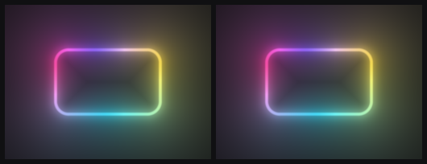
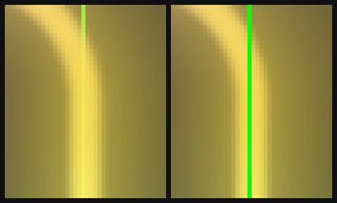
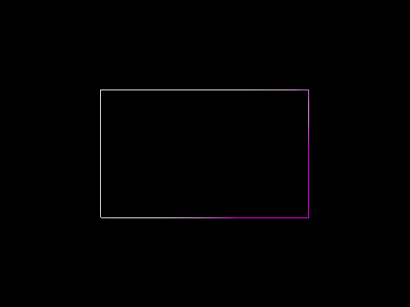
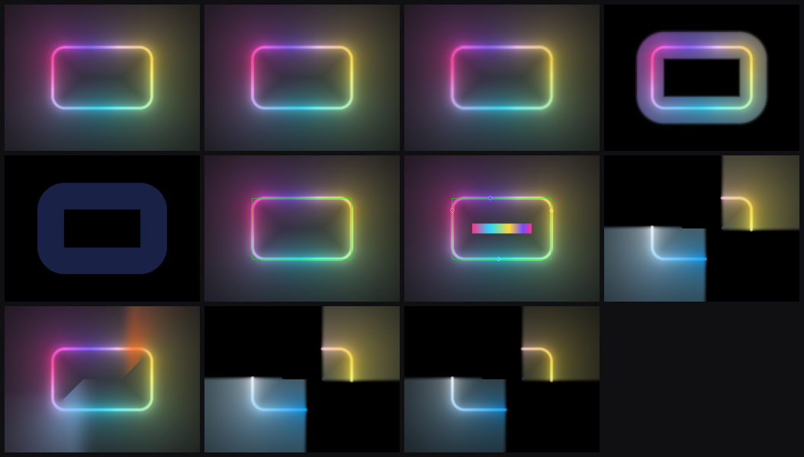
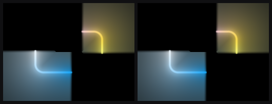

# `unify_neon_renderer` vs `main_v2`: visual parity of the merged neon renderer

Evidence that folding `NeonOptimizedRenderer` into `NeonRenderer` as a
resolution scale, and `WireframeRenderer` into `DebugRenderer`, changed no
pixels that were not meant to change.

[`neon-unification-plan.md`](neon-unification-plan.md) is the plan this
verifies; [`branch-vs-main-comparison.md`](branch-vs-main-comparison.md) asserts
in its superseding note that "the merged renderer's output was verified
byte-identical to each fork at the matching scale" - this document is that
verification.

**Result: nine of eleven scenes are byte-for-byte identical.** The two that
differ do so only on the bounding box's one-pixel outline, which is the one
change the unification intended.

## 1. What is being compared

| side | commit | |
| ---- | ------ | - |
| `main_v2` | `a4ea60b` | "Merge pull request #46 from kudo1902/improve_perf_by_emission_prepass" |
| branch | `49afa8c` | `unify_neon_renderer` |

The merge collapses three renderers into two:

| intent | `main_v2` | branch |
| ------ | --------- | ------ |
| full resolution | `NeonRenderer` | `NeonRenderer`, `resolutionScale 1.0` |
| reduced resolution | `NeonOptimizedRenderer` | `NeonRenderer`, `resolutionScale < 1.0` |
| bounding box | `WireframeRenderer`, registered **first** | `DebugRenderer`, registered **after** the neon |
| LUT strip, stop markers | `NeonConfig` | `DebugConfig` |

The branch's `NeonConfig` defaults - 128 samples, a 256-entry gradient LUT -
reproduce what `main_v2`'s full-res renderer hard-coded, so `fullres` is a
like-for-like test rather than a comparison of two different sample counts.

## 2. Method

One harness source, compiled twice: with `-DBRANCH_V2` against a `main_v2`
worktree and without it against the branch. Every scene is described **once**,
in branch-neutral terms; only the code that writes a scene into a `Config` is
`#ifdef`-ed. A pixel difference is therefore attributable to the renderers, not
to two descriptions of two different pictures.

As with the harness behind `branch-vs-main-comparison.md`, this one is
scaffolding and is not in the tree - it lived only in the working tree and a
throwaway `main_v2` worktree:

```bash
git worktree add /tmp/v2 main_v2
cmake -S /tmp/v2 -B /tmp/v2/build -G Ninja && cmake --build /tmp/v2/build
cmake -S . -B build -G Ninja && cmake --build build
# then compile the harness twice - once against each tree, the older one
# with -DBRANCH_V2 - and compare the two sets of RGBA dumps byte-wise.
```

The harness:

- renders through `OffscreenCapture` at an explicit 512x384, never the window
  backbuffer, so the dump is DPI- and platform-independent
  (see [`capture-util.h`](../lib/include/util/capture-util.h));
- **freezes `hueRotationRate` and `colorTransitionDuration` at zero**, so
  neither run can drift with the clock;
- ticks the clock exactly once before drawing, identically on both sides;
- writes a PNG for eyeballing and a raw RGBA dump per scene, and compares the
  dumps byte-wise, so the comparison never passes through a PNG decoder.

One scene needed care: `opaque_fill` and `opaque_only` originally used the
default black fill on the black clear colour, which renders an all-zero frame.
That compares equal between any two branches and proves nothing, so the fill is
tinted (`0.10, 0.13, 0.28`) and both scenes now carry real signal.

## 3. Result

Every RGB byte of all 196,608 pixels per frame, alpha excluded.

| scene | result | max delta | mean delta | px differing | luma `main_v2` | luma branch |
| ----- | ------ | --------- | ---------- | ------------ | -------------- | ----------- |
| `fullres` | identical | 0 | 0.0000 | 0 | 70.265 | 70.265 |
| `scaled_50` | identical | 0 | 0.0000 | 0 | 70.297 | 70.297 |
| `scaled_25` | identical | 0 | 0.0000 | 0 | 70.308 | 70.308 |
| `opaque_fill` | identical | 0 | 0.0000 | 0 | 35.999 | 35.999 |
| `opaque_only` | identical | 0 | 0.0000 | 0 | 10.243 | 10.243 |
| `wireframe` | **differs** | **245** | 0.6091 | **839** | 70.332 | 70.158 |
| `overlays` | **differs** | **245** | 0.5803 | **802** | 72.372 | 72.202 |
| `arcs` | identical | 0 | 0.0000 | 0 | 45.800 | 45.800 |
| `segments` | identical | 0 | 0.0000 | 0 | 76.071 | 76.071 |
| `arcs_scaled_50` | identical | 0 | 0.0000 | 0 | 45.706 | 45.706 |
| `arcs_base_int` | identical | 0 | 0.0000 | 0 | 33.888 | 33.888 |

### 3.1 The resolution scale changes nothing

In every image below the panels are **left: `main_v2`, right: branch**.



`fullres` - max difference 0. The unified renderer at `resolutionScale 1.0` is
not merely close to the renderer it replaced; it is the same output.

`scaled_50` and `scaled_25` are likewise identical to what
`NeonOptimizedRenderer` produced at those scales, as are `arcs_scaled_50` and,
at full resolution, `opaque_fill`, `opaque_only`, `arcs` and `segments`. The
scaled path's buffer allocation, blit and pixel-uniform scaling all survive the
merge unchanged.

### 3.2 The bounding box now draws over the glow (scenes `wireframe`, `overlays`)

`WireframeRenderer` was registered before the neon and drew underneath it, so
the glow painted over the box wherever the two crossed. `DebugRenderer` is
registered after the neon - it annotates what that layer drew - so the box now
sits on top.



A 5x zoom of the rectangle's right edge. Left: the green line is swallowed
where the bright filament crosses it. Right: it runs unbroken. At pixel
(385, 142) `main_v2` reads `rgb(245, 228, 86)` - the glow - and the branch reads
`rgb(0, 255, 0)`, the box. On 662 of the 839 differing pixels the branch is the
greener of the two, which is the box winning.



The difference, amplified 6x. Every differing pixel falls on the one-pixel box
ring; **none** lies strictly inside it. 839 pixels against a box perimeter of
exactly 2 x (260 + 160) = 840.

`overlays` differs for the same reason and by the same amount - 802 px, where
the LUT strip and stop markers cover part of the ring.

This is a deliberate change, recorded in `CLAUDE.md`: "the box now draws **over**
the glow - `WireframeRenderer` was registered first and drew under it, and the
overlays that annotate the glow have to follow it."

### 3.3 Every scene



Branch output, in table order: `fullres`, `scaled_50`, `scaled_25`,
`opaque_fill` / `opaque_only`, `wireframe`, `overlays`, `arcs` / `segments`,
`arcs_scaled_50`, `arcs_base_int`.

## 4. Noticed while testing, not caused by this merge

**The arc bloom is clipped into hard rectangular blocks.** The `arcs` scene
shows abrupt rectangular discontinuities in the halo around each lit span
rather than a smooth fade.



It reproduces **byte-for-byte on both branches**, so the unification neither
caused nor changed it, and it does not affect the parity result above.

`setupGeometry` derives the glow quad's margin from `config.neon.intensity` and
never reads the per-arc intensities, so an arc at `1.8` could plausibly outrun
the quad it is rasterised into. That explanation is **wrong**: re-rendering the
same arcs at the base intensity the quad *is* sized for leaves the blocks
unchanged; that probe is the `arcs_base_int` scene in the table above. The real
cause is unknown, and this is not among the items in
[`review-findings.md`](review-findings.md).

## 5. Conclusion

The renderer merge is visually lossless. Both resolution paths, the opaque
fill, arcs, segment boosts and arcs under a reduced scale all reproduce their
pre-merge output exactly. The only difference the merge introduces is the
bounding box's compositing order, it is confined to 839 pixels on the box
outline itself, and it is the documented intent of moving the overlays behind
the layer they annotate.
