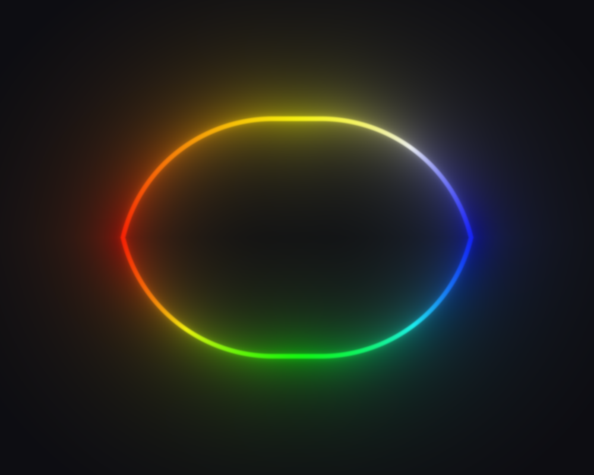
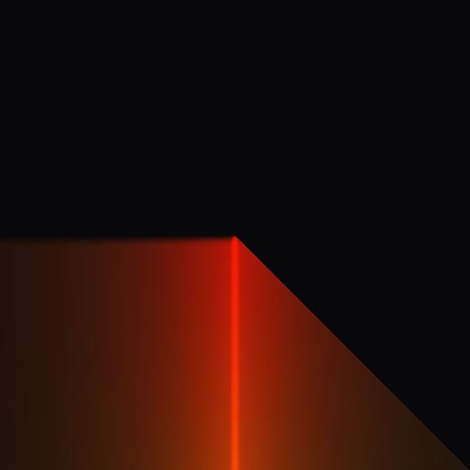
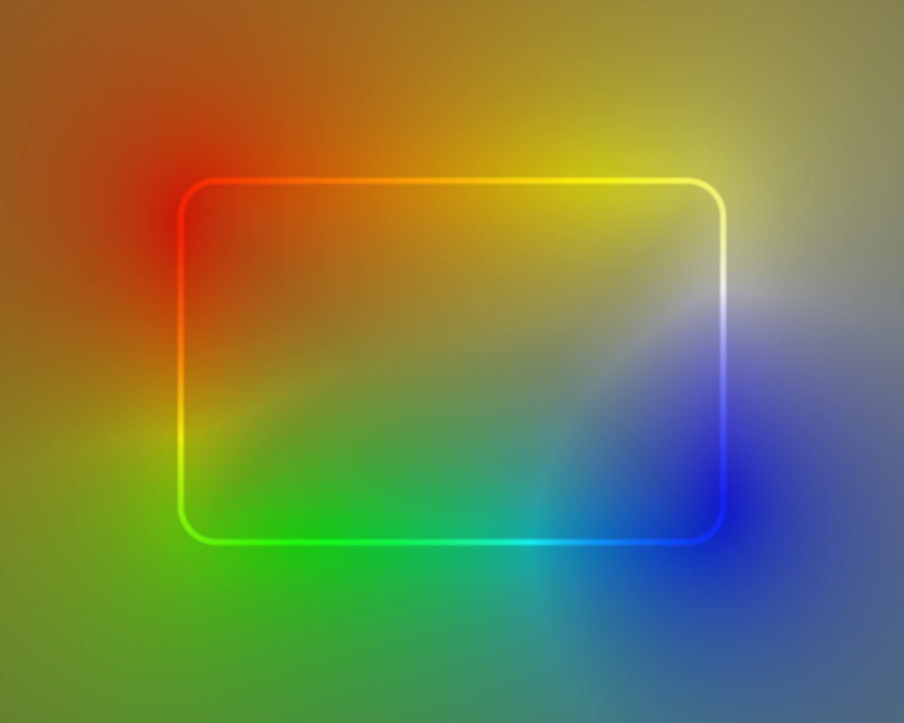
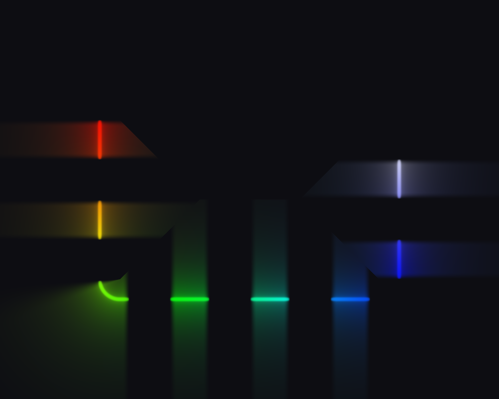

# Review findings

Open defects and rough edges found in a full read of the tree at
`improve_perf_by_emission_prepass` (`bbdba62`), with the visual ones
reproduced offscreen rather than argued from the source.

Items marked FIXED have landed and carry a note on what was changed and how it
was verified; the rest are still open. Each fixed item keeps its original
description, so the reasoning that led to the change stays readable next to it.

| | fixed | open |
| - | ----- | ---- |
| visual | V1, V2, V3, V6, V7 | V4, V5 (both closed as documented limitations) |
| implementation | I1, I4, I6, I7 | I2 (declined), I3 (partly), I5 (documented), I8 (audited) |
| second pass | - | R1, R2, R3, R4, R5, R6 |

The R items come from a re-read after the V and I fixes landed - see
[Second pass](#second-pass-after-bbdba62). They are open.

## How the visual items were reproduced

A throwaway harness linked against `build/lib/libedge-lighting.a`: a hidden
GLFW window, an `OffscreenCapture` at 1000x800, one `SetConfig` / `Update` /
`Render` per case, `CaptureUtil::WritePNG` out. Every case starts from the
same base config:

```
geometry: 600 x 400 at (200, 200), cornerRadius 40, winding CCW (the default)
neon.enable = true, everything else at its Config default
neon.colorTransitionDuration = 0   // no cross-fade, so one frame settles
neon.hueRotationRate = 0           // except where the case is about rotation
```

Two notes for anyone re-running this. `hueRotationRate` defaults to `0.5`, so
leaving it on makes every capture time-dependent and A/B comparisons drift by a
few LSB per frame. And `colorTransitionDuration` defaults above zero, so the
first frame after a colour-stop change still shows the **old** ring - a
single-frame capture of a new gradient is the cross-fade's start, not its end.

Checked and found correct, for the record: stop sorting (unsorted and sorted
inputs render bit-identical), CW/CCW agreement between
`GeometryUtils::GetPointOnRectangle` and the shader's `perimeterPosition`
across all eight perimeter spans, colour-stop alpha gating filament, halo and
bloom together at the right position, `operator==` coverage on every `Config`
sub-struct, `NeonRenderer` vs `NeonOptimizedRenderer` agreement (mean
|diff| 0.16/255, max 7 at `glowRadius` 30), and no beading at
`optimizedNeon.numSamples = 16`.

---

## Visual

### V1. `cornerRadius` is never clamped against the rect's half-extent - FIXED

**Was confirmed.** `cornerRadius` 260 and 500 on a 600x400 rect (valid maximum:
200).

| `cornerRadius` 260 | `cornerRadius` 500 |
| ------------------ | ------------------ |
|  |  |

Three of the four places that consume the radius clamp it and one does not:

| consumer | clamps? |
| -------- | ------- |
| `perimeterPosition` ([`neon.frag:171`](../lib/shaders/neon.frag)) | yes, to `min(halfW, halfH)` |
| `peri` (perimeter length, same shader) | yes |
| `GeometryUtils::GetPointOnRectangle` | yes |
| `sdRoundBox(vPos, halfSize, uCornerRadius)` ([`neon.frag:351`](../lib/shaders/neon.frag), [`neon-optimized.frag:342`](../lib/shaders/neon-optimized.frag), [`black-rect.frag:85`](../lib/shaders/black-rect.frag)) | **no** |

Past the half-extent the unclamped SDF stops describing a rounded box - it
becomes a lens with cusps - while the gather samples still sit on the correctly
clamped stadium. So the filament draws the wrong shape *and* the colour ring
smears, because the samples it gathers from are nowhere near the fragments
being lit.

Reachable from the demo in one drag: the Corner Radius slider runs to 1080
([`demo/src/debug-ui.cpp:543`](../demo/src/debug-ui.cpp)) against a default
800x600 rect.

**Fixed** by `GeometryUtils::EffectiveCornerRadius`
([`geometry-utils.h`](../lib/include/util/geometry-utils.h)), a single clamp to
`[0, min(w, h) / 2]` that every consumer now routes through: the perimeter walk,
the lens-flare sun's offset rect, and all five `uCornerRadius` uploads across
the two neon renderers and the droplets renderer. Clamping at the upload rather
than inside each `main()` keeps one definition shared by CPU and GPU; the
uniform declaration in all four shaders now says so.

`RectGeometry::cornerRadius` is deliberately left alone - it is host data read
back through `GetConfig`, so silently rewriting it would surprise a caller. The
demo's 0-1080 slider likewise stays: any value it produces now renders as the
nearest valid stadium.

Verified: radius 200 (the exact maximum), 260 and 500 on a 600x400 rect all
render bit-identical, and the result is a correct stadium with a sharp filament
and an unsmeared colour ring.

### V2. Abutting arcs render a hard dark notch at every seam - FIXED

**Was confirmed.** Two arcs, `{start 0, length 0.5}` and `{start 0.5, length
0.5}`, each with its own solid colour stops.

| before | after |
| ------ | ----- |
|  |  |

`arcCoverContinuous`
([`neon.frag:325-345`](../lib/shaders/neon.frag)) feathers **inward**:
`tailIn` is 0 at `rel = 0` and `headIn` is 0 at `rel = length`. `emitCover`
combines arcs with `max` ([`neon.frag:587`](../lib/shaders/neon.frag)). At a
shared endpoint that is `max(0, 0) = 0` - not a dip, a hole - and it stays
below full brightness for `TAIL_FEATHER_PX + HEAD_FEATHER_PX` = 28 px. Because
`emitCover` also scales the halo and the bloom, the hole is punched radially
outward as a dark wedge, which is what makes it so visible.

The hue does *not* notch: the pre-pass's `arcInside`
([`neon-emission.frag`](../lib/shaders/neon-emission.frag)) uses an **outward**
feather, so colour crosses the seam smoothly. The two halves of the same arc
disagree by construction.

This is the documented multi-arc recipe, not an exotic case - see the `arcs`
examples in [`config.h:426-432`](../lib/include/core/config.h).

**Fixed**, but not on the first attempt - and the failed attempt is the useful
part of this entry.

A soft union instead of `max` cannot work on its own: at a shared endpoint
*both* inputs are exactly 0, and no operator recovers a signal from `(0, 0)`.
The feather geometry has to change too.

**First attempt (wrong): a straddling feather.** Centre both ramps on their
endpoints so coverage is 0.5 there, and combine with a saturating sum. That
fixes the seam - and breaks single arcs at sharp corners, badly. The
inverse-SDF map is **degenerate** at a `cornerRadius 0` corner: the entire
90-degree exterior wedge has that corner as its nearest perimeter point, so
every fragment in the quadrant shares ONE `sPos`. Coverage is a function of
`sPos` alone, so 0.5 at a corner is painted across the whole quadrant. An arc
starting at `0` on a square rect - the default corner, and the reported case -
lit its entire top-left exterior quadrant at half brightness, bounded by two
hard edges where neighbouring fragments mapped to uncovered perimeter:

> a point 60 px above the corner read `(84, 19, 10)`; the mirrored point 60 px
> past the corner along the top edge read background `(8, 8, 10)`.

**A 7 px bleed in perimeter space is not a 7 px bleed on screen.** That is the
property the original inward feather was really protecting, and why its author
called it hard-won.

**Second attempt (correct): decide the feather direction per endpoint.**

| endpoint | ramp | coverage at the endpoint |
| -------- | ---- | ------------------------ |
| free (no other arc takes over) | INWARD | 0 - nothing outside the span is ever lit |
| abutting another arc | OUTWARD, past the endpoint | 1 - `max` hands over at full brightness |

An abutting endpoint's bleed lands inside a neighbour that is already lit, so
it cannot reach unlit geometry however degenerate the map is there. A free
endpoint keeps the original no-bleed guarantee exactly. The combination goes
back to plain `max` - winner-take-all, as documented for overlap - because the
ramps now reach a full 1.0 at a seam, and because they overlap the handover
stays smooth even when the two arcs carry different intensities.

Abutment is a pure function of the arc set, so it is resolved once per frame in
`PackArcFlags` on the CPU rather than by an O(arcs^2) scan in every fragment.
`uArcs[].w` becomes a 3-bit mask (bit 0 `hasStops`, bit 1 tail abuts, bit 2
head abuts); all three shaders decode it, including the pre-pass, which
previously tested the whole component against 0.5.

Two subtleties in the abutment test, both covered by probes: arcs that merely
*share a start* must not suppress each other's tails (the test requires the
neighbour to cover strictly *before* the start), and an arc ending exactly
where this one ends does not extend past it, so it does not suppress the head.

| before | after |
| ------ | ----- |
|  |  |

The corner case that the straddling attempt broke, now correct - the arc starts
at the corner and the exterior wedge stays dark:



Verified: seams tile flat at equal and unequal intensities; an arc starting at
a sharp corner and one ending at a sharp corner both leave the wedge at exact
background; partial overlap suppresses only the interior boundaries; shared
starts still ramp; a `length = 0.02` arc still reaches full peak; the full-ring
case still short-circuits to 1.0; and base vs optimized agreement is untouched
(mean |diff| 0.161, max 7 - identical throughout).

Known residual, not introduced here: when a seam lands exactly on a sharp
corner and the two arcs have different intensities, the wedge takes the
brighter one, so that quadrant is brighter than the dimmer arc's edge beside
it. That is the same degenerate-corner map as above and it has no fix that
keeps coverage a function of `sPos` - the previous inward-feather code put a
black quadrant there instead, which is worse.

### V3. Arc-local gradients wrap under hue rotation, producing a travelling seam - FIXED

**Was confirmed.** One full-perimeter arc with stops white (head) to red
(tail), `hueRotationRate = 0.5`.

| t = 0 | after ~0.6 s, before | after ~0.6 s, fixed |
| ----- | -------------------- | ------------------- |
|  |  |  |

All three shaders subtract `uTime * uHueRotationRate` from `uArc`
([`neon.frag:582`](../lib/shaders/neon.frag),
[`neon-optimized.frag:516`](../lib/shaders/neon-optimized.frag),
[`neon-emission.frag:137`](../lib/shaders/neon-emission.frag)), but `uArc` is an
**arc-local** coordinate on a head-to-tail gradient, not a cyclic perimeter
coordinate. The arc atlas is `GL_REPEAT` on U
([`neon-renderer.cpp:861`](../lib/src/renderer/neon-renderer.cpp),
[`neon-optimized-renderer.cpp:790`](../lib/src/renderer/neon-optimized-renderer.cpp)),
so the scroll eventually wraps and the tail colour butts straight into the head
colour, mid-edge, with no geometric feature to hide it.

Segments do not have this: their atlas is `CLAMP` and their LUT coordinate
carries no time term.

**Fixed** by doing both, because they address different halves:

- The `uTime * uHueRotationRate` term is gone from all three arc-local reads
  (the pre-pass's colour fetch and both main shaders' alpha fetch). There is
  nothing for a rotation to rotate in a head-to-tail coordinate; an arc's
  gradient moves by moving `Arc::start`, or by animating its stops. Segments
  never carried the term, so arcs now match them. The `hasStops = false` path
  is untouched - it reads the base gradient in perimeter space, where the
  rotation is the point.
- The arc atlas is now `CLAMP_TO_EDGE` on U as well as V, matching the segment
  atlas. Its `REPEAT` was justified as "colours cycle around the perimeter",
  but this atlas is only sampled when the arc has its **own** stops, which are
  laid across the arc's span rather than the ring. With the time term gone the
  only out-of-range reads are the few px the straddling feather (V2) extends
  past each end, and `CLAMP` holds the end colour there instead of fetching
  the opposite end's.

Verified: the frame after 0.6 s of rotation is now bit-identical to the frame
at t = 0 - the arc's own gradient is stationary. Base vs optimized agreement
unchanged (mean |diff| 0.161, max 7).

### V4. The interior glow has visible medial-axis creases - DOCUMENTED, NOT FIXED

**Confirmed.** `glowRadius` 60, `bloomStrength` 1.0.



`halo` and `bloom` are closed forms of `ad = abs(d)`
([`neon.frag:648-649`](../lib/shaders/neon.frag)). Inside the rect the
rounded-box SDF's *gradient* is discontinuous along the medial axis (the
diagonals from each corner plus the central spine), so both terms inherit a C1
crease there. The gather this replaced summed over perimeter samples and was
smooth; a nearest-distance profile cannot be.

Subtle at the default `glowRadius` 5, unmistakable at 30 and above, and it is
what produces the "mitred picture frame" look in the interior of most captures
in this document.

The trade that bought it - geometry-independent glow width, no beading at any
radius, no sample-spacing floor - is worth keeping, and softening `ad` near the
axis would need a second distance field whose blend would reintroduce exactly
the rect-size dependence the analytic form removed.

**Left as-is, but no longer undocumented**: the halo block in
[`neon-tuning.h`](../lib/include/renderer/neon-tuning.h) now carries a KNOWN
LIMITATION note naming the artifact, where it happens, at what `glowRadius` it
becomes visible, and why it is accepted. The next person to look at a creased
interior will find the answer next to the constants rather than rediscovering
it.

### V5. An arc's lit span is inset, but its colour is not - MOSTLY RESOLVED BY V2

The magnitude comes from `arcCoverContinuous`: pixel-based, read pointwise at
the fragment's own perimeter position. The hue comes from the pre-pass's
`arcInside`: outward feather, one sample wide, quantised to the gather points.
The two halves of the same arc use different feather shapes.

The **inset** half of this is gone with V2: the magnitude feather now straddles
its endpoints instead of sitting inside them, so an arc lights up at `start`
rather than `start + TAIL_FEATHER_PX`, and its hue and its brightness now begin
in the same place.

What remains is that the two feathers scale differently. The magnitude feather
is a fixed pixel span (14 px); the colour feather is one gather sample, which is
`perimeter / NEON_MAX_LOOP_SAMPLES`:

| geometry | perimeter | colour feather | magnitude feather |
| -------- | --------- | -------------- | ----------------- |
| 200x150 r20 | 666 px | 5.2 px | 14 px |
| 600x400 r40 | 1931 px | 15.1 px | 14 px |
| 1920x1080 r40 | 5931 px | 46.3 px | 14 px |
| 2800x2200 r40 | 9931 px | 77.6 px | 14 px |

They happen to agree almost exactly at the mid-size geometry the constants were
tuned on, and diverge either side: on a large rect an arc's colour hands over
across ~46 px while its brightness hands over across 14, so the endpoint reads
as a brightness edge with a much softer colour transition through it.

Not fixed, because closing it means giving the pre-pass the pixel-space feather
(it currently has no `uRectSize`, only perimeter-fraction inputs) and that is a
uniform-plumbing change on the hot path for an effect nobody has reported. Left
here so the next person tuning `HEAD_FEATHER_PX` knows the two are not coupled.

### V6. The stop sampler was cyclic, but the segment and arc atlases are head-to-tail - FIXED

`ColorUtils::SampleStops` (as it was then named) wraps from the last stop
back to the first
([`color-utils.h:273-285`](../lib/include/util/color-utils.h)). That is right
for the base ring, which is genuinely circular and sampled `REPEAT`.

`rebuildSegmentLUT` and `rebuildArcLUT` bake the same function over
`t = x / (W - 1)` into a row that the shader samples as a head-to-tail span.
For stops that do not reach both 0 and 1 - say 0.2 and 0.8 - the head of the
span (`t = 0`) lands inside the wrap interval and shows a blend of the *last*
and *first* colours rather than the first stop, and the tail ramps back toward
the head colour instead of holding.

[`config.h:106`](../lib/include/core/config.h) calls this layout
"head-to-tail", so the bake has to clamp at the ends.

**Fixed** in [`color-utils.h`](../lib/include/util/color-utils.h) by splitting
the sampler in two and naming both for the data shape they describe:

| function | domain | wrap behaviour | baked into |
| -------- | ------ | -------------- | ---------- |
| `SampleRing` | `NeonConfig::colorStops` - genuinely circular | last stop wraps to first | `GL_REPEAT` texture |
| `SampleSpan` | a per-arc / per-segment row, head-to-tail | holds the end colours | `CLAMP_TO_EDGE` row |

`rebuildSegmentLUT` and `rebuildArcLUT` in both renderers now call `SampleSpan`;
the base ring keeps `SampleRing`, which is correct there and behaviourally
unchanged.

Renaming both mattered as much as adding the second one. The original pair was
`SampleStops` and `SampleStopsClamped` - one unmarked, one marked - which
implies the ring is the normal case and the span is a variant. That is exactly
how the bug arose: `rebuildArcLUT` reached for `SampleStops` because it was
*the* function. Neither is the default, so neither is unmarked now, and a
mismatch is visible at the call site.

A white-to-red gradient authored at stops 0.2 and 0.8, sampled across the row:

| t | cyclic (before) | clamped (after) |
| - | --------------- | --------------- |
| 0.00 | 1.00 0.50 0.50 (pink) | 1.00 1.00 1.00 (white) |
| 0.10 | 1.00 0.75 0.75 | 1.00 1.00 1.00 |
| 0.20 | 1.00 1.00 1.00 | 1.00 1.00 1.00 |
| 0.50 | 1.00 0.50 0.50 | 1.00 0.50 0.50 |
| 0.80 | 1.00 0.00 0.00 (red) | 1.00 0.00 0.00 |
| 0.90 | 1.00 0.25 0.25 | 1.00 0.00 0.00 |
| 1.00 | 1.00 0.50 0.50 (pink) | 1.00 0.00 0.00 (red) |

So the head and the tail both used to come out pink - the authored white and
red only ever appeared 20% in from each end, and the gradient reversed after
0.8.

| before | after |
| ------ | ----- |
|  |  |

Note the midpoint agrees between the two samplers, which is why this is easy to
miss on a quick look - the error lives at the ends, where the emission is
already dimmest.

### V7. Arcs and segments past the caps are dropped silently - FIXED



Twelve arcs authored, eight rendered. `packLightBlocks` did
`std::min(size(), MAX_ARCS)` with no diagnostic on either renderer. The demo UI
enforces `MAX_ARCS_CAP` / `MAX_SEGMENT_BOOSTS_CAP` so it never bit there, but a
library or C-ABI host got no signal at all - not a log line, not a result code.

**Fixed** with a `WarnOnOverflow` helper in both renderers' anonymous
namespaces, called from `packLightBlocks` for arcs and for effective segments:

```
NeonRenderer: 12 arcs configured but only 8 fit - the rest are ignored.
```

The warning latches on a per-renderer flag so it lands once per overflow rather
than once per frame, and the flag clears when the count drops back under the
cap, so a host that overflows, fixes it, then overflows again is told both
times.

Deliberately a warning and not a hard error: truncating is still the documented
behaviour and a host may reasonably not care. Verified against the 12-arc case
- one line, and silence from the other 18 probe cases.

---

## Implementation

### I1. Shader sources contain non-ASCII, against the project's own rule - FIXED

| file | lines with non-ASCII |
| ---- | -------------------- |
| `lib/shaders/neon.frag` | 11 |
| `lib/shaders/neon-optimized.frag` | 10 |
| `lib/shaders/neon-stop-marker.frag` | 3 |
| `lib/shaders/shaders.h.in` | 2 |

All in comments: U+2192 arrows, U+00D7 multiplication signs, a U+2211
summation sign and a U+2026 ellipsis. `AGENTS.md` and `CLAUDE.md` require
ASCII-only shaders precisely because these strings are handed verbatim to the
GLSL ES compiler on Mali / Tizen, where non-ASCII bytes can be rejected even
inside a comment. `neon-emission.frag` and `neon-tuning.h` were clean, so the
rule was being followed unevenly rather than dropped.

**Fixed** in two parts:

- Transliterated to `->`, `x`, `SUM` and `...`. Comments only, so the emitted
  GLSL is otherwise untouched - re-embedded from scratch (`rm -rf
  build/lib/generated`) and re-verified: same link, same pixels.
- Added a configure-time guard in [`lib/CMakeLists.txt`](../lib/CMakeLists.txt)
  that fails with a `FATAL_ERROR` naming the offending file if any shader source
  or `neon-tuning.h` contains a byte outside printable ASCII, tab, CR or LF.

The guard is the more important half. This is not something review catches: an
arrow is invisible next to `->` in a diff, which is exactly how four files
accumulated them. Configure time is the right place because that is when the
sources are read and embedded, so the failure lands on whoever introduced the
character rather than on whoever next builds for a GLES target. Verified by
appending a U+2192 to `neon-blit.frag` and confirming the configure fails with
the file named.

### I2. The emission pre-pass re-bakes unconditionally every frame - DECLINED FOR NOW

The table is a pure function of `(si, uTime, config)` - the pass's own stated
invariant. When `hueRotationRate` is 0 and no animation is attached, `uTime`
does not change the result, yet `renderEmissionPass` still resizes, binds,
uploads two UBOs and draws, in both renderers, every frame.

A dirty flag over (the config fields the pass reads, plus the effective time
term) would skip the pass outright in the static case, which is the common one
for a settled UI.

**Not done, deliberately.** The work being repeated is small in absolute terms:
`Framebuffer::Resize` is already a no-op at an unchanged size, the two UBO
uploads are 144 bytes each, and the draw covers `NEON_MAX_LOOP_SAMPLES * 2` =
256 fragments. Set against the gather it feeds - a multi-million-fragment
full-viewport pass - the saving is structurally negligible, and I did not
measure it, so I am not going to claim a number.

The correctness risk on the other side is real: the cache would have to track
not just the arcs and segments and the time term but every LUT re-bake, since
the pass samples all three atlases. A missed invalidation there shows up as a
frame of stale colour, which is exactly the class of bug that is hard to
attribute later.

Worth revisiting if a profile ever puts the pass on the critical path - the
invalidation inputs are all already tracked by the existing dirty flags, so it
is a contained change when there is evidence for it.

### I3. Registering both neon renderers doubles the CPU-side work - PARTLY FIXED

Each owns its own gradient / segment / arc LUTs, its own three UBOs and its own
128x2 emission FBO, and `OnConfigChanged` bakes both regardless of `enable`. On
top of that `SegmentUtils::FillEffectiveSegments` runs three times per frame
per renderer: once in `OnConfigChanged`, once in `packLightBlocks`, once in
`rebuildSegmentLUT`.

The demo registers both, so this is the default path, not a corner case.

**Partly fixed**: the per-frame half. `packLightBlocks` no longer refills
`mEffectiveSegments` - `OnConfigChanged` already does that on every composited
change, and `Update` runs before `Render`, so on any frame the merged view is
already current. That takes the steady state from three merges per renderer per
frame to zero, and a config-change frame from three to two. The precondition is
now stated on both `packLightBlocks` declarations so the coupling is not
accidental.

Still open: the structural half. Each renderer owns a full private set of LUT
textures, UBOs and an emission FBO, and bakes them regardless of its own
`enable` flag. That follows from the two renderers being near-forks rather than
sharing a base, so it is not a local fix - it is the same underlying issue as
I8.

### I4. `WireframeRenderer` does not follow the conventions the others do - FIXED

Two deviations in [`wireframe-renderer.cpp`](../lib/src/renderer/wireframe-renderer.cpp):

- `OnConfigChanged` re-uploads its VBO on **any** config change, which with an
  animation attached is every frame. The neon renderers gate the equivalent
  rebuild on `geometry` alone.
- `Render` re-enables `GL_BLEND` but never restores `glBlendFunc` to the
  `SRC_ALPHA` convention every other renderer hands back. Harmless only because
  it happens to be registered first.

It also ignores `cornerRadius` entirely, so the debug box is a sharp rectangle
around a rounded one. Defensible for a bounding box; worth a comment saying so.

**Fixed**, all three:

- `OnConfigChanged` gates `buildGeometry` on `config.geometry` alone, matching
  the neon renderers.
- `Render` restores `glBlendFunc(GL_SRC_ALPHA, GL_ONE_MINUS_SRC_ALPHA)` as well
  as re-enabling `GL_BLEND`, so the renderer's correctness no longer depends on
  being registered first.
- `buildGeometry` now says the sharp box is deliberate: it shows the extent the
  config asked for rather than tracing the rounded outline the neon draws.

Verified by counting lit pixels across a resize and a non-geometry change: the
box tracks 200x140 (678 px lit) then 400x300 (1399), and a pure
`neon.intensity` change leaves it at 1399.

### I5. `Framebuffer::GetBoundId()` is a `glGetIntegerv` on the hot path - DOCUMENTED, NOT CHANGED

Called once per frame per multi-pass renderer
([`neon-renderer.cpp:220`](../lib/src/renderer/neon-renderer.cpp),
[`neon-optimized-renderer.cpp:167,377`](../lib/src/renderer/neon-optimized-renderer.cpp),
[`lens-flare-optimized-renderer.cpp:40`](../lib/src/renderer/lens-flare-optimized-renderer.cpp)).
It is the *correct* fix for the `OffscreenCapture` case and should not be
reverted to `BindDefault`, but a GL state query can sync the driver on a tiler.
Threading the target through `BaseRenderer::Render` would give the same
guarantee with no query.

**Left as-is.** The query-free version is a breaking change to the renderer
plugin API - the `Render` signature on `BaseRenderer`, all six renderers and
both demos - and the cost it removes is one or two queries per frame, never
measured on this project's actual concern (a Mali / Tizen tiler; the machine
here is desktop GL on macOS, where a measurement would not transfer).

Instead the trade is now recorded on `GetBoundId` itself in
[`framebuffer.h`](../lib/include/gl/framebuffer.h): why the query exists, the
explicit warning not to "optimise" it back to `BindDefault` (which silently
breaks frame capture), and what the query-free alternative would cost. That
puts the reasoning where someone tempted to change it will actually read it.

### I6. `AddRenderer` after `Initialize` yields a live, uninitialized renderer - FIXED

[`EdgeLightingEffect::AddRenderer`](../lib/src/core/edge-lighting.cpp) calls
`OnConfigChanged` but never `Initialize`, and `Initialize()` walks the list
exactly once. A renderer registered later has no shaders, and its `Render` runs
with program 0.

**Fixed.** `EdgeLightingEffect` now carries an `mInitialized` flag, set at the
end of `Initialize`. `AddRenderer` initialises a renderer registered after that
point and drops it if that fails - the same contract `Initialize` applies to the
batch. Registration before `Initialize` is unchanged.

`Initialize` is also now documented as safe to call again, and both methods say
what they do with a failure. Verified with an effect that calls `Initialize`
with an empty list, then registers a `NeonRenderer` and renders: it draws (it
previously drew nothing at all, since `OnConfigChanged` bails on an invalid
shader program, so neither the shaders nor the quad geometry ever existed).

### I7. The emission pass's total-failure path leaves the gather reading texture 0 - FIXED

If both the `GL_RGBA16F` and the `GL_RGBA8` `Resize` fail,
`renderEmissionPass` returns early
([`neon-renderer.cpp:239`](../lib/src/renderer/neon-renderer.cpp)) - but
`Framebuffer::Resize` has already called `destroy()` on the failure path, so
`mEmissionBuffer.BindTexture(3)` in `renderNeonPass` binds 0 and the gather
samples undefined data in core profile.

The comment there said the gather "reads a stale table". There is no stale
table left at that point.

**Fixed** by making `renderEmissionPass` return a `bool` in both renderers and
having `Render` act on it:

- `NeonRenderer` skips `renderNeonPass`, so the frame degrades to the opaque
  fill (which has already landed) instead of to undefined data.
- `NeonOptimizedRenderer` skips both Pass 1 and Pass 2b together, tracked as a
  single `drawNeon`. Skipping only Pass 1 would have left Pass 2b compositing
  whatever the half-res FBO held from an earlier frame, trading undefined data
  for a stale image - no better.

The comments now say what is actually true: `Framebuffer::Resize` destroys the
attachment on its failure path, so there is nothing to fall back on and the
caller has to skip.

This path needs a driver that refuses both `GL_RGBA16F` and `GL_RGBA8` as
colour attachments, so it is a latent hazard rather than an observed one - it
cannot be exercised from the probe harness on this machine.

### I8. `demo/` and `demo-capi/` have drifted apart - AUDITED

My original wording here was too alarming, and the audit corrects it.

**The C ABI has no gaps.** Every `Config` field the C++ demo mutates is
reachable through `el_effect_set_*`. The three that looked missing on a
name-match are covered by bundled setters (`el_effect_set_geometry` for
`cornerRadius` and `height`, `el_effect_set_arc` / `_count` for `arcs`,
`el_effect_set_segment_boost` / `_count` for `segmentBoosts`). The single true
omission is `neon.opaqueOnly`, which `config.h:258` already documents as "Not
exposed through the C API" - a debug-only flag, deliberately left out.

So the guarantee in `CLAUDE.md` holds. What is weaker than it looks is the
**coverage of the guard**: a regression is only caught if `demo-capi` actually
calls the entry point.

Effect surface - 67 setters, 8 with no widget driving them:

| unexercised setter | note |
| ------------------ | ---- |
| `el_effect_set_droplets_band_width` | ABI has it, `demo-capi` has 6 of the 8 droplet controls |
| `el_effect_set_droplets_band_offset` | same |
| `el_effect_set_optimized_lens_flare_renderer_enabled` | whole renderer un-exposed |
| `el_effect_set_optimized_lens_flare_resolution_scale` | same |
| `el_effect_set_preserved_segment` | whole `PreservedSegment` feature un-exposed |
| `el_effect_set_preserved_segment_blend_space` | same |
| `el_effect_set_preserved_segment_color_stop` | same |
| `el_effect_set_preserved_segment_color_stop_count` | same |

Animation and modulator surface - and this is the real hole. Of 55 declared
functions `demo-capi` exercises **16**, all of them lifecycle
(`create` / `destroy` / `play` / `pause` / `speed` / `duration`). Not one of the
20 constructors is called:

- all 13 `el_animation_create_*` presets (`intensity_pulse`, `arc_wipe`,
  `outline_tracer`, `segment_travel`, `field_bound`, ...)
- the entire `el_modulator_*` API - all 7 constructors plus `evaluate`,
  `destroy` and `sequence_append`
- the `field_bound` binding surface (`el_animation_add_*_field`)
- the callback surface (`on_completed` / `on_state_changed`)

`demo/` drives all of this through
[`animation-presets.h`](../demo/src/animation-presets.h). So the animation half
of the C ABI compiles, but nothing proves it *works* from a UI-shaped host -
which is precisely the guarantee the fork exists to provide.

No UI was written (that was the scope decision). If this is worth closing, the
ranking is: the animation constructors and the modulator API first, since that
is a whole subsystem with zero end-to-end coverage; then `PreservedSegment`;
then the four stragglers, which are two sliders and a renderer toggle.

---

## Second pass (after `bbdba62`)

A re-read of the tree at `17745a9`, after the V and I fixes above landed.

Re-checked and confirmed correct, so they need no further attention: the
abutment bitmask (V2) - `PackArcFlags` against the shader's decode, for the
tiling, gap, overlap and shared-endpoint cases, including the `rel -= 1.0`
wrap threshold at `0.5 * (1 + length)`; the ring/span sampler split (V6) at
all six bake sites; the removal of the hue-rotation term from the arc-local
coordinate (V3), which agrees between the pre-pass and the main shader's alpha
read; the `cornerRadius` clamp (V1) at all five upload sites; and fork parity
between `neon.frag` and `neon-optimized.frag`, whose normalised diff shows only
the intended `uResolutionScale` corrections. `PackArcFlags` and
`WarnOnOverflow` are byte-identical between the two renderer translation units.

What follows is what the pass turned up. All six are open.

### R1. `Initialize()` promises a re-entry guarantee it does not implement

[`edge-lighting.h`](../lib/include/core/edge-lighting.h) now says:

> Safe to call again after registering more renderers: renderers already
> initialised are skipped.

Nothing skips them. `mInitialized` is a single bool on the *effect*, and
[`Initialize`](../lib/src/core/edge-lighting.cpp) calls `(*it)->Initialize()`
unconditionally on every renderer in the list. A second call recompiles every
shader and reallocates every VAO, VBO, texture, UBO and FBO across all six
renderers. The RAII wrappers make that leak-free, not free, and `BaseRenderer`
has no per-renderer flag to gate on.

The sentence is also redundant: `AddRenderer` self-initialises late
registrations, which is the whole point of the I6 fix. Deleting the claim is
cheaper and more honest than adding the flag. It matters because it is in a
header, which `CLAUDE.md` designates the source of truth.

### R2. Two `Framebuffer::Resize` calls are still unchecked

I7 fixed exactly this hazard for `mEmissionBuffer` in both neon renderers and
left the two siblings alone:

| site | buffer |
| ---- | ------ |
| [`neon-optimized-renderer.cpp:326`](../lib/src/renderer/neon-optimized-renderer.cpp) | `mHalfResBuffer` |
| [`lens-flare-optimized-renderer.cpp:43`](../lib/src/renderer/lens-flare-optimized-renderer.cpp) | `mScaledBuffer` |

`Resize` calls `destroy()` on its failure path, so `mFbo` is 0; `Bind()` then
binds the *caller's* framebuffer, and the `glClear` that follows is not clipped
by the viewport, so it erases everything already drawn that frame. Under an
`OffscreenCapture` that is the capture target. Same one-line fix I7 used.

### R3. The arc and segment atlases re-bake every frame under animation

Not the same thing as I2, which is about the emission pre-pass, and the
"structurally negligible" argument there does not carry over.

The gate is a whole-struct compare in both renderers
([`neon-renderer.cpp:636`](../lib/src/renderer/neon-renderer.cpp),
[`neon-optimized-renderer.cpp:573`](../lib/src/renderer/neon-optimized-renderer.cpp)):

```cpp
const bool segLutDirty = mEffectiveSegments != mBakedSegments;
const bool arcLutDirty = config.neon.arcs != mBakedArcs;
```

`Arc::operator==` includes `start`, `length` and `intensity`;
`SegmentBoost::operator==` includes `position`. `ArcWipe`, `OutlineTracer` and
`SegmentTravel` all write those every frame. So every frame runs 1024
`SampleSpan` calls with HSV conversion plus a full `glTexImage2D`, per atlas,
per renderer - while the comment directly above says position, length and
intensity "don't" affect the atlas, which is true and is the point. The gate
should compare a projection of `colorStops` + `blendSpace`, not the whole
struct.

### R4. LUT quantisation truncates instead of rounding

Eighteen sites across the two renderers, all of the form:

```cpp
static_cast<unsigned char>(std::clamp(c.r * 255.0f, 0.0f, 255.0f))
```

No `+ 0.5f`, so every baked texel is biased down by up to 1 LSB and by ~0.5 LSB
on average, in all three LUTs, in both renderers.

### R5. GL state left modified after a pass

- `glClearColor(0, 0, 0, 0)` is set and never restored, in
  [`neon-optimized-renderer.cpp:329`](../lib/src/renderer/neon-optimized-renderer.cpp)
  and [`lens-flare-optimized-renderer.cpp:46`](../lib/src/renderer/lens-flare-optimized-renderer.cpp).
- `renderBlitPass` calls raw `glBindTexture` on whatever texture unit happens
  to be active
  ([`neon-optimized-renderer.cpp:444`](../lib/src/renderer/neon-optimized-renderer.cpp)),
  leaving the half-res texture bound there, and sets the texture's filter
  directly - so `Framebuffer::mFilter`, the field that exists so a filter change
  forces a reallocation, no longer describes the texture. `CLAUDE.md` also asks
  renderer code to go through the RAII wrappers rather than raw GL.

### R6. Nothing stops both neon renderers being enabled at once

The lens-flare pair warns at
[`debug-ui.cpp:1105`](../demo/src/debug-ui.cpp). The neon pair has no
equivalent guard at [`debug-ui.cpp:706`](../demo/src/debug-ui.cpp), and
`Shift+O` in [`main.cpp`](../demo/src/main.cpp) toggles `optimizedNeon.enable`
without touching `neon.enable`, so the glow draws twice - brighter, with
half-res edges over full-res ones. This is the visible half of I3, whose fix
addressed the CPU-work half.

---

## What is left

Everything the first pass found that is user-visible is closed. Six items from
that pass remain deliberately open, each with the reasoning recorded next to
the code rather than only here, and the second pass added six more that are
open pending a fix:

| item | state | why |
| ---- | ----- | --- |
| V4 | documented limitation | closing it needs a second distance field, which reintroduces the rect-size dependence the analytic profile removed |
| V5 | residual, documented | closing it means plumbing pixel-space feathers into the pre-pass for an effect nobody has reported |
| I2 | declined | negligible measured-by-structure win against a real staleness-bug risk |
| I3 | structural half open | follows from the two neon renderers being near-forks; same root as I8 |
| I5 | documented | the alternative is a breaking renderer-API change for an unmeasured cost |
| I8 | audited, no UI written | the C ABI itself is complete; what is missing is `demo-capi` coverage, ranked in the section above |

| R1 - R6 | open, not yet actioned | found on the second pass; R1 is a one-line doc correction, R2 is the highest-severity of the group |

If any of these comes back, the fastest way to reproduce is the harness
described at the top of this document - the configs for every case are given
inline with each finding.
