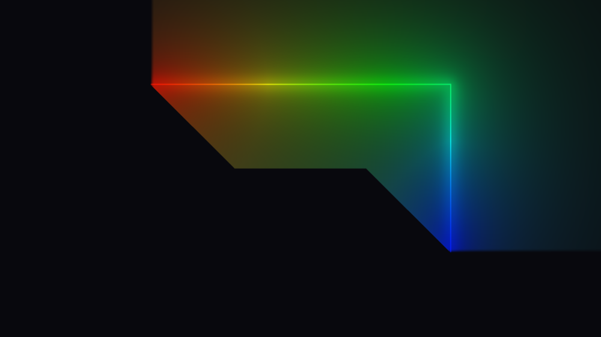

# Review findings

Open defects and rough edges found in a full read of the tree at
`improve_perf_by_emission_prepass` (`bbdba62`), with the visual ones
reproduced offscreen rather than argued from the source.

Items marked FIXED have landed and carry a note on what was changed and how it
was verified; the rest are still open.

> **Written before the neon unification.** Findings here describe a tree with
> two neon renderers, `NeonRenderer` and the half-res `NeonOptimizedRenderer`,
> plus the debug overlays living inside the first. Those are now one renderer
> drawing at `NeonConfig::resolutionScale`, with the overlays in a separate
> `DebugRenderer`. Two findings changed state as a result - **I3** is now fixed
> outright and **R6** is moot - and both say so in place. The rest are
> unaffected: the merge was verified byte-identical to each fork at the
> matching scale, so every pixel measurement below still holds. See
> `neon-unification-plan.md`.

Code references here name a **file and symbol**, never a line number. Line
anchors in this document had already drifted twice - once when the fixes below
landed and again when the helpers they added shifted everything under them -
and a wrong line number is worse than none, because it reads as precise. Each fixed item keeps its original
description, so the reasoning that led to the change stays readable next to it.

**A reference that is not a link names a file that no longer exists.** Keeping
the original descriptions means keeping references to `neon-optimized.frag`,
`neon-optimized-renderer.cpp` and `lens-flare-optimized-renderer.cpp`, all
deleted by the unification and the lens-flare merge. Those are written as plain
code spans rather than links, because a link to a deleted path is a 404 dressed
up as a citation. Everything still linked still exists, so in a list that mixes
the two - and several below do - the formatting tells you which halves of the
old fork survived.

| | fixed | open |
| - | ----- | ---- |
| visual | V1, V2, V3, V4, V6, V7 | V5 (closed as a documented limitation) |
| implementation | I1, I3, I4, I6, I7 | I2 (declined), I5 (documented), I8 (audited) |
| second pass | R1, R2, R3, R4, R5, R6, R7 | - |
| third pass | V8, I9, I10, I11, I12 (partly) | V9, I12's two stale design docs |
| fourth pass | I14 | I13 |
| fifth pass | I15 | - |
| sixth pass | I16, I17, I19, I20 | I18 |
| eighth pass | V11 | - |
| twelfth pass | I21, I22, I23, I24 | - |

The R items come from a re-read after the V and I fixes landed - see
[Second pass](#second-pass-after-bbdba62). V8 and V9 come from a later read of
`improve_renderer_by_LUT`, the branch that moved the LUTs behind
`BaseLUT` / `GradientRingLUT` / `SpanAtlasLUT` - see
[Third pass](#third-pass-after-7380710). They continue the visual numbering
because both are visual; neither is caused by that refactor.

I13 and I14 come from a performance review of `LensFlareRenderer` - see
[Fourth pass](#fourth-pass-the-lens-flare-performance-review). That review's
own measurements and reasoning live in `lens-flare-perf-review.md`; only the
defects it turned up are recorded here.

I16 to I20 come from a read of the spotlight layer on
`add_spotlight_renderer` - see
[Sixth pass](#sixth-pass-the-spotlight-renderer-review). That pass found no
visual defect, so it adds no V item: the solved strip bound the whole renderer
rests on was verified offscreen and holds. Its design and the verification
behind it live in `spotlight-renderer-plan.md`.

V11 comes from a spotlight artefact reported from a render - see
[Eighth pass](#eighth-pass-the-spotlight-banding-report). It is the visual item
the sixth pass did not find, and it is worth noting WHY that pass missed it:
the sixth pass verified the strip bound, and the strip bound was never the
problem. The reported symptom points straight at the geometry, which is what
makes this one interesting.

V12 comes from a spotlight render like V10 and V11 - see
[Thirteenth pass](#thirteenth-pass-the-spotlight-intensity-report). Half of what
was reported turned out to be designed behaviour and half a real defect, and the
first fix for the real half was worse than the defect; both are recorded there,
the second because the failed attempt is the useful part. V12a is its open
remainder. V12b is the follow-up report that the fix had not actually landed -
it had, for the defect it was measured against, and the measurement was the
wrong one; read it before trusting any "no pixels clipped" result in this layer.

I21 to I24 come from a read of the spotlight CLIP AREA on
`add_clipping_area_for_spotlight` - see
[Twelfth pass](#twelfth-pass-the-spotlight-clip-area). The clip landed after the
sixth pass, so none of it had been reviewed. All four are fixed. They add no V
item, but I21 was a genuine visual defect rather than a rough edge - it is
recorded as an I because it is gated on a non-default `resolutionScale`, so no
render ever showed it.

## How the visual items were reproduced

A throwaway harness linked against `build/lib/libedge-lighting.a`: a hidden
GLFW window, an `OffscreenCapture` at 1000x800, one `SetConfig` / `Update` /
`Render` per case, `CaptureUtil::WritePNG` out. Every case starts from the
same base config:

```
geometry: 600 x 400 at (200, 200), cornerRadius 40, winding CCW (the default)
neon.enable = true, everything else at its Config default
neon.colorTransitionDuration = 0   // no cross-fade, so one frame settles
neon.hueRotationRate = 0           // except where the case is about rotation
```

Two notes for anyone re-running this. `hueRotationRate` defaults to `0.5`, so
leaving it on makes every capture time-dependent and A/B comparisons drift by a
few LSB per frame. And `colorTransitionDuration` defaults above zero, so the
first frame after a colour-stop change still shows the **old** ring - a
single-frame capture of a new gradient is the cross-fade's start, not its end.

Checked and found correct, for the record: stop sorting (unsorted and sorted
inputs render bit-identical), CW/CCW agreement between
`GeometryUtils::GetPointOnRectangle` and the shader's `perimeterPosition`
across all eight perimeter spans, colour-stop alpha gating filament, halo and
bloom together at the right position, `operator==` coverage on every `Config`
sub-struct, `NeonRenderer` vs `NeonOptimizedRenderer` agreement (mean
|diff| 0.16/255, max 7 at `glowRadius` 30), and no beading at
`optimizedNeon.numSamples = 16`.

---

## Visual

### V1. `cornerRadius` is never clamped against the rect's half-extent - FIXED

**Was confirmed.** `cornerRadius` 260 and 500 on a 600x400 rect (valid maximum:
200).

| `cornerRadius` 260 | `cornerRadius` 500 |
| ------------------ | ------------------ |
|  |  |

Three of the four places that consume the radius clamp it and one does not:

| consumer | clamps? |
| -------- | ------- |
| `perimeterPosition` ([`neon.frag` perimeterPosition](../lib/shaders/neon.frag)) | yes, to `min(halfW, halfH)` |
| `peri` (perimeter length, same shader) | yes |
| `GeometryUtils::GetPointOnRectangle` | yes |
| `sdRoundBox(vPos, halfSize, uCornerRadius)` ([`neon.frag` main](../lib/shaders/neon.frag), `neon-optimized.frag` main, [`black-rect.frag` main](../lib/shaders/black-rect.frag)) | **no** |

Past the half-extent the unclamped SDF stops describing a rounded box - it
becomes a lens with cusps - while the gather samples still sit on the correctly
clamped stadium. So the filament draws the wrong shape *and* the colour ring
smears, because the samples it gathers from are nowhere near the fragments
being lit.

Reachable from the demo in one drag: the Corner Radius slider runs to 1080
([`debug-ui.cpp` buildGeometrySection](../demo/src/debug-ui.cpp)) against a default
800x600 rect.

**Fixed** by `GeometryUtils::EffectiveCornerRadius`
([`geometry-utils.h`](../lib/include/util/geometry-utils.h)), a single clamp to
`[0, min(w, h) / 2]` that every consumer now routes through: the perimeter walk,
the lens-flare sun's offset rect, and all five `uCornerRadius` uploads across
the two neon renderers and the droplets renderer. Clamping at the upload rather
than inside each `main()` keeps one definition shared by CPU and GPU; the
uniform declaration in all four shaders now says so.

`RectGeometry::cornerRadius` is deliberately left alone - it is host data read
back through `GetConfig`, so silently rewriting it would surprise a caller. The
demo's 0-1080 slider likewise stays: any value it produces now renders as the
nearest valid stadium.

Verified: radius 200 (the exact maximum), 260 and 500 on a 600x400 rect all
render bit-identical, and the result is a correct stadium with a sharp filament
and an unsmeared colour ring.

### V2. Abutting arcs render a hard dark notch at every seam - FIXED

**Was confirmed.** Two arcs, `{start 0, length 0.5}` and `{start 0.5, length
0.5}`, each with its own solid colour stops.

| before | after |
| ------ | ----- |
|  |  |

`arcCoverContinuous`
([`neon.frag` arcCoverContinuous](../lib/shaders/neon.frag)) feathers **inward**:
`tailIn` is 0 at `rel = 0` and `headIn` is 0 at `rel = length`. `emitCover`
combines arcs with `max` ([`neon.frag` emitCover loop](../lib/shaders/neon.frag)). At a
shared endpoint that is `max(0, 0) = 0` - not a dip, a hole - and it stays
below full brightness for `TAIL_FEATHER_PX + HEAD_FEATHER_PX` = 28 px. Because
`emitCover` also scales the halo and the bloom, the hole is punched radially
outward as a dark wedge, which is what makes it so visible.

The hue does *not* notch: the pre-pass's `arcInside`
([`neon-emission.frag`](../lib/shaders/neon-emission.frag)) uses an **outward**
feather, so colour crosses the seam smoothly. The two halves of the same arc
disagree by construction.

This is the documented multi-arc recipe, not an exotic case - see the `arcs`
examples in [`config.h` NeonConfig::arcs](../lib/include/core/config.h).

**Fixed**, but not on the first attempt - and the failed attempt is the useful
part of this entry.

A soft union instead of `max` cannot work on its own: at a shared endpoint
*both* inputs are exactly 0, and no operator recovers a signal from `(0, 0)`.
The feather geometry has to change too.

**First attempt (wrong): a straddling feather.** Centre both ramps on their
endpoints so coverage is 0.5 there, and combine with a saturating sum. That
fixes the seam - and breaks single arcs at sharp corners, badly. The
inverse-SDF map is **degenerate** at a `cornerRadius 0` corner: the entire
90-degree exterior wedge has that corner as its nearest perimeter point, so
every fragment in the quadrant shares ONE `sPos`. Coverage is a function of
`sPos` alone, so 0.5 at a corner is painted across the whole quadrant. An arc
starting at `0` on a square rect - the default corner, and the reported case -
lit its entire top-left exterior quadrant at half brightness, bounded by two
hard edges where neighbouring fragments mapped to uncovered perimeter:

> a point 60 px above the corner read `(84, 19, 10)`; the mirrored point 60 px
> past the corner along the top edge read background `(8, 8, 10)`.

**A 7 px bleed in perimeter space is not a 7 px bleed on screen.** That is the
property the original inward feather was really protecting, and why its author
called it hard-won.

**Second attempt (correct): decide the feather direction per endpoint.**

| endpoint | ramp | coverage at the endpoint |
| -------- | ---- | ------------------------ |
| free (no other arc takes over) | INWARD | 0 - nothing outside the span is ever lit |
| abutting another arc | OUTWARD, past the endpoint | 1 - `max` hands over at full brightness |

An abutting endpoint's bleed lands inside a neighbour that is already lit, so
it cannot reach unlit geometry however degenerate the map is there. A free
endpoint keeps the original no-bleed guarantee exactly. The combination goes
back to plain `max` - winner-take-all, as documented for overlap - because the
ramps now reach a full 1.0 at a seam, and because they overlap the handover
stays smooth even when the two arcs carry different intensities.

Abutment is a pure function of the arc set, so it is resolved once per frame in
`PackArcFlags` on the CPU rather than by an O(arcs^2) scan in every fragment.
`uArcs[].w` becomes a 3-bit mask (bit 0 `hasStops`, bit 1 tail abuts, bit 2
head abuts); all three shaders decode it, including the pre-pass, which
previously tested the whole component against 0.5.

Two subtleties in the abutment test, both covered by probes: arcs that merely
*share a start* must not suppress each other's tails (the test requires the
neighbour to cover strictly *before* the start), and an arc ending exactly
where this one ends does not extend past it, so it does not suppress the head.

| before | after |
| ------ | ----- |
|  |  |

The corner case that the straddling attempt broke, now correct - the arc starts
at the corner and the exterior wedge stays dark:


Verified: seams tile flat at equal and unequal intensities; an arc starting at
a sharp corner and one ending at a sharp corner both leave the wedge at exact
background; partial overlap suppresses only the interior boundaries; shared
starts still ramp; a `length = 0.02` arc still reaches full peak; the full-ring
case still short-circuits to 1.0; and base vs optimized agreement is untouched
(mean |diff| 0.161, max 7 - identical throughout).

Known residual, not introduced here: when a seam lands exactly on a sharp
corner and the two arcs have different intensities, the wedge takes the
brighter one, so that quadrant is brighter than the dimmer arc's edge beside
it. That is the same degenerate-corner map as above and it has no fix that
keeps coverage a function of `sPos` - the previous inward-feather code put a
black quadrant there instead, which is worse.

### V3. Arc-local gradients wrap under hue rotation, producing a travelling seam - FIXED

**Was confirmed.** One full-perimeter arc with stops white (head) to red
(tail), `hueRotationRate = 0.5`.

| t = 0 | after ~0.6 s, before | after ~0.6 s, fixed |
| ----- | -------------------- | ------------------- |
|  |  |  |

All three shaders subtract `uTime * uHueRotationRate` from `uArc`
([`neon.frag`](../lib/shaders/neon.frag),
`neon-optimized.frag`,
[`neon-emission.frag`](../lib/shaders/neon-emission.frag)), but `uArc` is an
**arc-local** coordinate on a head-to-tail gradient, not a cyclic perimeter
coordinate. The arc atlas is `GL_REPEAT` on U
([`neon-renderer.cpp` rebuildArcLUT](../lib/src/renderer/neon-renderer.cpp),
`neon-optimized-renderer.cpp` rebuildArcLUT),
so the scroll eventually wraps and the tail colour butts straight into the head
colour, mid-edge, with no geometric feature to hide it.

Segments do not have this: their atlas is `CLAMP` and their LUT coordinate
carries no time term.

**Fixed** by doing both, because they address different halves:

- The `uTime * uHueRotationRate` term is gone from all three arc-local reads
  (the pre-pass's colour fetch and both main shaders' alpha fetch). There is
  nothing for a rotation to rotate in a head-to-tail coordinate; an arc's
  gradient moves by moving `Arc::start`, or by animating its stops. Segments
  never carried the term, so arcs now match them. The `hasStops = false` path
  is untouched - it reads the base gradient in perimeter space, where the
  rotation is the point.
- The arc atlas is now `CLAMP_TO_EDGE` on U as well as V, matching the segment
  atlas. Its `REPEAT` was justified as "colours cycle around the perimeter",
  but this atlas is only sampled when the arc has its **own** stops, which are
  laid across the arc's span rather than the ring. With the time term gone the
  only out-of-range reads are the few px the straddling feather (V2) extends
  past each end, and `CLAMP` holds the end colour there instead of fetching
  the opposite end's.

Verified: the frame after 0.6 s of rotation is now bit-identical to the frame
at t = 0 - the arc's own gradient is stationary. Base vs optimized agreement
unchanged (mean |diff| 0.161, max 7).

### V4. The interior glow has visible medial-axis creases - FIXED

**Confirmed.** `glowRadius` 60, `bloomStrength` 1.0.


`halo` and `bloom` are closed forms of `ad = abs(d)`
([`neon.frag` halo + bloom](../lib/shaders/neon.frag)). Inside the rect the
rounded-box SDF's *gradient* is discontinuous along the medial axis (the
diagonals from each corner plus the central spine), so both terms inherit a C1
crease there. The gather this replaced summed over perimeter samples and was
smooth; a nearest-distance profile cannot be.

Subtle at the default `glowRadius` 5, unmistakable at 30 and above, and it is
what produces the "mitred picture frame" look in the interior of most captures
in this document.

The trade that bought it - geometry-independent glow width, no beading at any
radius, no sample-spacing floor - is worth keeping, and softening `ad` near the
axis would need a second distance field whose blend would reintroduce exactly
the rect-size dependence the analytic form removed.

**That last sentence is what kept this open, and it was answering the wrong
question.** `ad` never needed softening. The defect is that ONE term was being
evaluated where FOUR belong: both expressions are the field of an *infinite*
line, so a fragment on a corner diagonal with two edges equally near was lit by
exactly one of them. Measured on a flat white ring against a fragment with a
single edge at the same distance, the ratio was **1.000 at every distance
tested** - two edges delivering the light of one, where physics says roughly
two. No second distance field is involved in seeing that, or in fixing it.

**Fixed** in [`neon.frag`](../lib/shaders/neon.frag) by replacing each
infinite-line term with the **finite-segment** form of the same integral,
summed over the four straight edges (`haloSegment` / `bloomSegment`). Both have
elementary antiderivatives and both reduce to exactly the old expressions as the
segment goes to infinity, so this is a strict generalisation: `HALO_NORM_FACTOR`
and `BLOOM_NORM_FACTOR` keep their calibration and the peak on a long edge does
not move.

| | before | after |
| --- | ------ | ----- |
| corner sweep at r=160, 0 / 45 / 90 deg | 192 / **177** / 192 | 201 / **190** / 202 |
| equal-`ad` ratio, one edge vs two | 1.000 | 1.011 - 1.021 |
| neon frame cost, 1280x720 | 1.67 ms | 1.88 ms (**1.13x**) |

The kinked V at exactly 45 degrees is now a smooth basin, and what remains of
it is genuine falloff - that point really is eight times further from the
nearest edge than the sample beside it.

Three further things, all recorded at the call site:

- The four segments ran to the **sharp** corner, the quarter-arc emitter above
  `cornerRadius` 0 being omitted for want of an elementary closed form. That
  omission turned out to be a defect of its own and is **V10** below, now
  fixed. Exact at `cornerRadius` 0 throughout.
- A **small rect now glows less**, which is the point of the change rather than
  a side effect of it: an edge shorter than a few multiples of `bw` subtends
  less than the infinite line the old form assumed. Measured at the default
  `glowRadius` 5, 30 px off the middle of the top edge: 20 px wide rect 62 ->
  35, 40 px 67 -> 54, 80 px 72 -> 71, 320 px and above within 2/255. The old
  behaviour gave a 20 px rect 87% of the glow of a 1200 px one.
- **The interior fills**, and this is the largest change of the three - it was
  reported from a render afterwards as "the halo got bigger", which is exactly
  what it looks like. The old terms were functions of `ad` alone, so a fragment
  120 px inside the edge was lit identically to one 120 px outside, by
  construction. Inside, the emitter wraps around the fragment instead of
  receding from it, so the interior now settles on a floor rather than decaying:
  centre of the rect 162 -> 186 on the probe above, 81 -> 113 at `glowRadius`
  30 on 800x400. The exterior mean goes slightly DOWN in the same captures.
  Intended physics rather than a regression, and capped by `insideCutoff` or
  `glowSide` rather than by a gain, which would dim the line too. Measured in
  [`corner-crease-and-filament-nyquist.md`](corner-crease-and-filament-nyquist.md)
  section 1.5.2.

Full measurements and the probes in
[`corner-crease-and-filament-nyquist.md`](corner-crease-and-filament-nyquist.md).

### V5. An arc's lit span is inset, but its colour is not - MOSTLY RESOLVED BY V2

The magnitude comes from `arcCoverContinuous`: pixel-based, read pointwise at
the fragment's own perimeter position. The hue comes from the pre-pass's
`arcInside`: outward feather, one sample wide, quantised to the gather points.
The two halves of the same arc use different feather shapes.

The **inset** half of this is gone with V2: the magnitude feather now straddles
its endpoints instead of sitting inside them, so an arc lights up at `start`
rather than `start + TAIL_FEATHER_PX`, and its hue and its brightness now begin
in the same place.

What remains is that the two feathers scale differently. The magnitude feather
is a fixed pixel span (14 px); the colour feather is one gather sample, which is
`perimeter / NEON_MAX_LOOP_SAMPLES`:

| geometry | perimeter | colour feather | magnitude feather |
| -------- | --------- | -------------- | ----------------- |
| 200x150 r20 | 666 px | 5.2 px | 14 px |
| 600x400 r40 | 1931 px | 15.1 px | 14 px |
| 1920x1080 r40 | 5931 px | 46.3 px | 14 px |
| 2800x2200 r40 | 9931 px | 77.6 px | 14 px |

They happen to agree almost exactly at the mid-size geometry the constants were
tuned on, and diverge either side: on a large rect an arc's colour hands over
across ~46 px while its brightness hands over across 14, so the endpoint reads
as a brightness edge with a much softer colour transition through it.

Not fixed, because closing it means giving the pre-pass the pixel-space feather
(it currently has no `uRectSize`, only perimeter-fraction inputs) and that is a
uniform-plumbing change on the hot path for an effect nobody has reported. Left
here so the next person tuning `HEAD_FEATHER_PX` knows the two are not coupled.

**Amended by [V9](#v9-an-arcs-own-gradient-quantises-to-the-gather-grid-and-a-reduced-sample-count-makes-it-visible---open).**
The sentence above about "an effect nobody has reported" is weaker than it
looked. The same sample-grid quantisation also makes the two neon renderers
disagree by up to 100/255 at arc endpoints whenever an arc carries its own
stops, because `OptimizedNeonConfig::numSamples` defaults to 64 against the base
renderer's 128. That is measured in V9, along with why the obvious fixes are
each worse than they sound.

### V6. The stop sampler was cyclic, but the segment and arc atlases are head-to-tail - FIXED

`ColorUtils::SampleStops` (as it was then named) wraps from the last stop
back to the first
([`color-utils.h` SampleRing](../lib/include/util/color-utils.h)). That is right
for the base ring, which is genuinely circular and sampled `REPEAT`.

`rebuildSegmentLUT` and `rebuildArcLUT` bake the same function over
`t = x / (W - 1)` into a row that the shader samples as a head-to-tail span.
For stops that do not reach both 0 and 1 - say 0.2 and 0.8 - the head of the
span (`t = 0`) lands inside the wrap interval and shows a blend of the *last*
and *first* colours rather than the first stop, and the tail ramps back toward
the head colour instead of holding.

[`config.h` SegmentBoost](../lib/include/core/config.h) calls this layout
"head-to-tail", so the bake has to clamp at the ends.

**Fixed** in [`color-utils.h`](../lib/include/util/color-utils.h) by splitting
the sampler in two and naming both for the data shape they describe:

| function | domain | wrap behaviour | baked into |
| -------- | ------ | -------------- | ---------- |
| `SampleRing` | `NeonConfig::colorStops` - genuinely circular | last stop wraps to first | `GL_REPEAT` texture |
| `SampleSpan` | a per-arc / per-segment row, head-to-tail | holds the end colours | `CLAMP_TO_EDGE` row |

`rebuildSegmentLUT` and `rebuildArcLUT` in both renderers now call `SampleSpan`;
the base ring keeps `SampleRing`, which is correct there and behaviourally
unchanged.

Renaming both mattered as much as adding the second one. The original pair was
`SampleStops` and `SampleStopsClamped` - one unmarked, one marked - which
implies the ring is the normal case and the span is a variant. That is exactly
how the bug arose: `rebuildArcLUT` reached for `SampleStops` because it was
*the* function. Neither is the default, so neither is unmarked now, and a
mismatch is visible at the call site.

A white-to-red gradient authored at stops 0.2 and 0.8, sampled across the row:

| t | cyclic (before) | clamped (after) |
| - | --------------- | --------------- |
| 0.00 | 1.00 0.50 0.50 (pink) | 1.00 1.00 1.00 (white) |
| 0.10 | 1.00 0.75 0.75 | 1.00 1.00 1.00 |
| 0.20 | 1.00 1.00 1.00 | 1.00 1.00 1.00 |
| 0.50 | 1.00 0.50 0.50 | 1.00 0.50 0.50 |
| 0.80 | 1.00 0.00 0.00 (red) | 1.00 0.00 0.00 |
| 0.90 | 1.00 0.25 0.25 | 1.00 0.00 0.00 |
| 1.00 | 1.00 0.50 0.50 (pink) | 1.00 0.00 0.00 (red) |

So the head and the tail both used to come out pink - the authored white and
red only ever appeared 20% in from each end, and the gradient reversed after
0.8.

| before | after |
| ------ | ----- |
|  |  |

Note the midpoint agrees between the two samplers, which is why this is easy to
miss on a quick look - the error lives at the ends, where the emission is
already dimmest.

### V7. Arcs and segments past the caps are dropped silently - FIXED


Twelve arcs authored, eight rendered. `packLightBlocks` did
`std::min(size(), MAX_ARCS)` with no diagnostic on either renderer. The demo UI
enforces `MAX_ARCS_CAP` / `MAX_SEGMENT_BOOSTS_CAP` so it never bit there, but a
library or C-ABI host got no signal at all - not a log line, not a result code.

**Fixed** with a `WarnOnOverflow` helper in both renderers' anonymous
namespaces, called from `packLightBlocks` for arcs and for effective segments:

```
NeonRenderer: 12 arcs configured but only 8 fit - the rest are ignored.
```

The warning latches on a per-renderer flag so it lands once per overflow rather
than once per frame, and the flag clears when the count drops back under the
cap, so a host that overflows, fixes it, then overflows again is told both
times.

> **Reworked, and the segment half was dead.** The two latch flags are gone:
> the warning now fires from `OnConfigChanged` on the TRANSITION into overflow
> (previous count at or under the cap, new count above it), which gives the same
> once-per-overflow behaviour with no flag to store, and takes the check off the
> per-frame path - `OnConfigChanged` is the only place either count can change.
>
> Rewriting it surfaced a bug in the original: the segment warning measured
> `mEffectiveSegments.size()`, but `SegmentUtils::FillEffectiveSegments` stops
> merging at `MAX_SEGMENT_BOOSTS_CAP`, so that value is already clamped to the
> cap and `requested <= cap` always held. **It could never fire.** It now counts
> what the host asked for - `segmentBoosts` + `preservedSegmentBoosts`, which
> share the slots - and reports the dropped entries as intended. Verified across
> eight transitions for arcs and segments.

Deliberately a warning and not a hard error: truncating is still the documented
behaviour and a host may reasonably not care. Verified against the 12-arc case
- one line, and silence from the other 18 probe cases.

---

## Implementation

### I1. Shader sources contain non-ASCII, against the project's own rule - FIXED

| file | lines with non-ASCII |
| ---- | -------------------- |
| `lib/shaders/neon.frag` | 11 |
| `lib/shaders/neon-optimized.frag` | 10 |
| `lib/shaders/neon-stop-marker.frag` | 3 |
| `lib/shaders/shaders.h.in` | 2 |

All in comments: U+2192 arrows, U+00D7 multiplication signs, a U+2211
summation sign and a U+2026 ellipsis. `AGENTS.md` and `CLAUDE.md` require
ASCII-only shaders precisely because these strings are handed verbatim to the
GLSL ES compiler on Mali / Tizen, where non-ASCII bytes can be rejected even
inside a comment. `neon-emission.frag` and `neon-tuning.h` were clean, so the
rule was being followed unevenly rather than dropped.

**Fixed** in two parts:

- Transliterated to `->`, `x`, `SUM` and `...`. Comments only, so the emitted
  GLSL is otherwise untouched - re-embedded from scratch (`rm -rf
  build/lib/generated`) and re-verified: same link, same pixels.
- Added a configure-time guard in [`lib/CMakeLists.txt`](../lib/CMakeLists.txt)
  that fails with a `FATAL_ERROR` naming the offending file if any shader source
  or `neon-tuning.h` contains a byte outside printable ASCII, tab, CR or LF.

The guard is the more important half. This is not something review catches: an
arrow is invisible next to `->` in a diff, which is exactly how four files
accumulated them. Configure time is the right place because that is when the
sources are read and embedded, so the failure lands on whoever introduced the
character rather than on whoever next builds for a GLES target. Verified by
appending a U+2192 to `neon-blit.frag` and confirming the configure fails with
the file named.

### I2. The emission pre-pass re-bakes unconditionally every frame - DECLINED FOR NOW

The table is a pure function of `(si, uTime, config)` - the pass's own stated
invariant. When `hueRotationRate` is 0 and no animation is attached, `uTime`
does not change the result, yet `renderEmissionPass` still resizes, binds,
uploads two UBOs and draws, in both renderers, every frame.

A dirty flag over (the config fields the pass reads, plus the effective time
term) would skip the pass outright in the static case, which is the common one
for a settled UI.

**Not done, deliberately.** The work being repeated is small in absolute terms:
`Framebuffer::Resize` is already a no-op at an unchanged size, the two UBO
uploads are 144 bytes each, and the draw covers `NEON_MAX_LOOP_SAMPLES * 2` =
256 fragments. Set against the gather it feeds - a multi-million-fragment
full-viewport pass - the saving is structurally negligible, and I did not
measure it, so I am not going to claim a number.

The correctness risk on the other side is real: the cache would have to track
not just the arcs and segments and the time term but every LUT re-bake, since
the pass samples all three atlases. A missed invalidation there shows up as a
frame of stale colour, which is exactly the class of bug that is hard to
attribute later.

Worth revisiting if a profile ever puts the pass on the critical path - the
invalidation inputs are all already tracked by the existing dirty flags, so it
is a contained change when there is evidence for it.

### I3. Registering both neon renderers doubles the CPU-side work - FIXED

Each owns its own gradient / segment / arc LUTs, its own three UBOs and its own
128x2 emission FBO, and `OnConfigChanged` bakes both regardless of `enable`. On
top of that `SegmentUtils::FillEffectiveSegments` runs three times per frame
per renderer: once in `OnConfigChanged`, once in `packLightBlocks`, once in
`rebuildSegmentLUT`.

The demo registers both, so this is the default path, not a corner case.

**Partly fixed**: the per-frame half. `packLightBlocks` no longer refills
`mEffectiveSegments` - `OnConfigChanged` already does that on every composited
change, and `Update` runs before `Render`, so on any frame the merged view is
already current. That takes the steady state from three merges per renderer per
frame to zero, and a config-change frame from three to two. The precondition is
now stated on both `packLightBlocks` declarations so the coupling is not
accidental.

**Now fixed outright**: the structural half went with the fork. The two
renderers were folded into one drawing at `NeonConfig::resolutionScale`, so
there is a single set of LUT textures, a single set of UBOs and a single
emission FBO - not because the duplication was optimised away, but because
there is no second renderer to own a second copy. The scaled buffer is the only
resource the reduced-resolution path adds, and at scale 1.0 it is never
allocated. See `neon-unification-plan.md`.

### I4. `WireframeRenderer` does not follow the conventions the others do - FIXED, THEN ABSORBED

Two deviations in `wireframe-renderer.cpp` (since deleted - see the note at the
end of this item):

- `OnConfigChanged` re-uploads its VBO on **any** config change, which with an
  animation attached is every frame. The neon renderers gate the equivalent
  rebuild on `geometry` alone.
- `Render` re-enables `GL_BLEND` but never restores `glBlendFunc` to the
  `SRC_ALPHA` convention every other renderer hands back. Harmless only because
  it happens to be registered first.

It also ignores `cornerRadius` entirely, so the debug box is a sharp rectangle
around a rounded one. Defensible for a bounding box; worth a comment saying so.

**Fixed**, all three:

- `OnConfigChanged` gates `buildGeometry` on `config.geometry` alone, matching
  the neon renderers.
- `Render` restores `glBlendFunc(GL_SRC_ALPHA, GL_ONE_MINUS_SRC_ALPHA)` as well
  as re-enabling `GL_BLEND`, so the renderer's correctness no longer depends on
  being registered first.
- `buildGeometry` now says the sharp box is deliberate: it shows the extent the
  config asked for rather than tracing the rounded outline the neon draws.

**Since absorbed.** `WireframeRenderer` no longer exists: the box is an overlay
of `DebugRenderer`, behind `DebugConfig::showWireframe`, and all three fixes
above travelled with it (geometry-gated rebuild, blend restored by the shared
`Render`, the sharp-box rationale kept at the vertex build). The second one is
now genuinely load-bearing rather than defensive - the debug layer is registered
LAST of the overlay-drawing renderers, so what it hands back is what the next
frame starts from. One behaviour change came with the move: the box draws over
the glow instead of under it, because the layer that owns it must follow the
neon for the strip and markers to annotate anything.

Verified by counting lit pixels across a resize and a non-geometry change: the
box tracks 200x140 (678 px lit) then 400x300 (1399), and a pure
`neon.intensity` change leaves it at 1399.

### I5. `Framebuffer::GetBoundId()` is a `glGetIntegerv` on the hot path - DOCUMENTED, NOT CHANGED

Called once per frame per multi-pass renderer
([`NeonRenderer::renderEmissionPass`](../lib/src/renderer/neon-renderer.cpp),
`NeonOptimizedRenderer::Render` + `renderEmissionPass`,
`LensFlareOptimizedRenderer::Render`).
It is the *correct* fix for the `OffscreenCapture` case and should not be
reverted to `BindDefault`, but a GL state query can sync the driver on a tiler.
Threading the target through `BaseRenderer::Render` would give the same
guarantee with no query.

**Left as-is.** The query-free version is a breaking change to the renderer
plugin API - the `Render` signature on `BaseRenderer`, all six renderers and
both demos - and the cost it removes is one or two queries per frame, never
measured on this project's actual concern (a Mali / Tizen tiler; the machine
here is desktop GL on macOS, where a measurement would not transfer).

Instead the trade is now recorded on `GetBoundId` itself in
[`framebuffer.h`](../lib/include/gl/framebuffer.h): why the query exists, the
explicit warning not to "optimise" it back to `BindDefault` (which silently
breaks frame capture), and what the query-free alternative would cost. That
puts the reasoning where someone tempted to change it will actually read it.

### I6. `AddRenderer` after `Initialize` yields a live, uninitialized renderer - FIXED

[`EdgeLightingEffect::AddRenderer`](../lib/src/core/edge-lighting.cpp) calls
`OnConfigChanged` but never `Initialize`, and `Initialize()` walks the list
exactly once. A renderer registered later has no shaders, and its `Render` runs
with program 0.

**Fixed.** `EdgeLightingEffect` now carries an `mInitialized` flag, set at the
end of `Initialize`. `AddRenderer` initialises a renderer registered after that
point and drops it if that fails - the same contract `Initialize` applies to the
batch. Registration before `Initialize` is unchanged.

`Initialize` is also now documented as safe to call again, and both methods say
what they do with a failure. Verified with an effect that calls `Initialize`
with an empty list, then registers a `NeonRenderer` and renders: it draws (it
previously drew nothing at all, since `OnConfigChanged` bails on an invalid
shader program, so neither the shaders nor the quad geometry ever existed).

### I7. The emission pass's total-failure path leaves the gather reading texture 0 - FIXED

If both the `GL_RGBA16F` and the `GL_RGBA8` `Resize` fail,
`renderEmissionPass` returns early
([`NeonRenderer::renderEmissionPass`](../lib/src/renderer/neon-renderer.cpp)) - but
`Framebuffer::Resize` has already called `destroy()` on the failure path, so
`mEmissionBuffer.BindTexture(3)` in `renderNeonPass` binds 0 and the gather
samples undefined data in core profile.

The comment there said the gather "reads a stale table". There is no stale
table left at that point.

> **Superseded.** The `bool` return described below no longer exists: the
> emission target is allocated once in `Initialize`, which fails outright if no
> candidate format works, so `renderEmissionPass` cannot reach this state and is
> now `void`. The defect and its original fix are kept for the reasoning.

**Fixed** by making `renderEmissionPass` return a `bool` in both renderers and
having `Render` act on it:

- `NeonRenderer` skips `renderNeonPass`, so the frame degrades to the opaque
  fill (which has already landed) instead of to undefined data.
- `NeonOptimizedRenderer` skips both Pass 1 and Pass 2b together, tracked as a
  single `drawNeon`. Skipping only Pass 1 would have left Pass 2b compositing
  whatever the half-res FBO held from an earlier frame, trading undefined data
  for a stale image - no better.

The comments now say what is actually true: `Framebuffer::Resize` destroys the
attachment on its failure path, so there is nothing to fall back on and the
caller has to skip.

This path needs a driver that refuses both `GL_RGBA16F` and `GL_RGBA8` as
colour attachments, so it is a latent hazard rather than an observed one - it
cannot be exercised from the probe harness on this machine.

### I8. `demo/` and `demo-capi/` have drifted apart - AUDITED

My original wording here was too alarming, and the audit corrects it.

**The C ABI has no gaps.** Every `Config` field the C++ demo mutates is
reachable through `el_effect_set_*`. The three that looked missing on a
name-match are covered by bundled setters (`el_effect_set_geometry` for
`cornerRadius` and `height`, `el_effect_set_arc` / `_count` for `arcs`,
`el_effect_set_segment_boost` / `_count` for `segmentBoosts`). The single true
omission is `opaqueOnly` (since moved to `DebugConfig`), which `config.h`
already documents as "Not exposed through the C API" - a debug-only flag,
deliberately left out.

So the guarantee in `CLAUDE.md` holds. What is weaker than it looks is the
**coverage of the guard**: a regression is only caught if `demo-capi` actually
calls the entry point.

Effect surface - 67 setters, 8 with no widget driving them:

| unexercised setter | note |
| ------------------ | ---- |
| `el_effect_set_droplets_band_width` | ABI has it, `demo-capi` has 6 of the 8 droplet controls |
| `el_effect_set_droplets_band_offset` | same |
| `el_effect_set_optimized_lens_flare_renderer_enabled` | whole renderer un-exposed |
| `el_effect_set_optimized_lens_flare_resolution_scale` | same |
| `el_effect_set_preserved_segment` | whole `PreservedSegment` feature un-exposed |
| `el_effect_set_preserved_segment_blend_space` | same |
| `el_effect_set_preserved_segment_color_stop` | same |
| `el_effect_set_preserved_segment_color_stop_count` | same |

Animation and modulator surface - and this is the real hole. Of 55 declared
functions `demo-capi` exercises **16**, all of them lifecycle
(`create` / `destroy` / `play` / `pause` / `speed` / `duration`). Not one of the
20 constructors is called:

- all 13 `el_animation_create_*` presets (`intensity_pulse`, `arc_wipe`,
  `outline_tracer`, `segment_travel`, `field_bound`, ...)
- the entire `el_modulator_*` API - all 7 constructors plus `evaluate`,
  `destroy` and `sequence_append`
- the `field_bound` binding surface (`el_animation_add_*_field`)
- the callback surface (`on_completed` / `on_state_changed`)

`demo/` drives all of this through
[`animation-presets.h`](../demo/src/animation-presets.h). So the animation half
of the C ABI compiles, but nothing proves it *works* from a UI-shaped host -
which is precisely the guarantee the fork exists to provide.

No UI was written (that was the scope decision). If this is worth closing, the
ranking is: the animation constructors and the modulator API first, since that
is a whole subsystem with zero end-to-end coverage; then `PreservedSegment`;
then the four stragglers, which are two sliders and a renderer toggle.

---

## Second pass (after `bbdba62`)

A re-read of the tree at `17745a9`, after the V and I fixes above landed.

Re-checked and confirmed correct, so they need no further attention: the
abutment bitmask (V2) - `PackArcFlags` against the shader's decode, for the
tiling, gap, overlap and shared-endpoint cases, including the `rel -= 1.0`
wrap threshold at `0.5 * (1 + length)`; the ring/span sampler split (V6) at
all six bake sites; the removal of the hue-rotation term from the arc-local
coordinate (V3), which agrees between the pre-pass and the main shader's alpha
read; the `cornerRadius` clamp (V1) at all five upload sites; and fork parity
between `neon.frag` and `neon-optimized.frag`, whose normalised diff shows only
the intended `uResolutionScale` corrections. `PackArcFlags` and
`WarnOnOverflow` are byte-identical between the two renderer translation units.

What follows is what the pass turned up. R1 to R6 have since been fixed, each
keeping its original description so the reasoning stays readable next to the
change. R7 is open.

### R1. `Initialize()` promises a re-entry guarantee it does not implement - FIXED

[`edge-lighting.h`](../lib/include/core/edge-lighting.h) now says:

> Safe to call again after registering more renderers: renderers already
> initialised are skipped.

Nothing skips them. `mInitialized` is a single bool on the *effect*, and
[`Initialize`](../lib/src/core/edge-lighting.cpp) calls `(*it)->Initialize()`
unconditionally on every renderer in the list. A second call recompiles every
shader and reallocates every VAO, VBO, texture, UBO and FBO across all six
renderers. The RAII wrappers make that leak-free, not free, and `BaseRenderer`
has no per-renderer flag to gate on.

The sentence is also redundant: `AddRenderer` self-initialises late
registrations, which is the whole point of the I6 fix. Deleting the claim is
cheaper and more honest than adding the flag. It matters because it is in a
header, which `CLAUDE.md` designates the source of truth.

**Fixed** by correcting the claim rather than adding the flag: the doc now says
to call it once, states what a second call actually costs (every renderer
re-initialised, shaders recompiled, GL objects reallocated - leak-free but not
free), and points at `AddRenderer` for the late-registration case it was
reaching for.

### R2. Two `Framebuffer::Resize` calls are still unchecked - FIXED

I7 fixed exactly this hazard for `mEmissionBuffer` in both neon renderers and
left the two siblings alone:

| site | buffer |
| ---- | ------ |
| `NeonOptimizedRenderer::renderHalfResNeonPass` | `mHalfResBuffer` |
| `LensFlareOptimizedRenderer::Render` | `mScaledBuffer` |

`Resize` calls `destroy()` on its failure path, so `mFbo` is 0; `Bind()` then
binds the *caller's* framebuffer, and the `glClear` that follows is not clipped
by the viewport, so it erases everything already drawn that frame. Under an
`OffscreenCapture` that is the capture target. Same one-line fix I7 used.

**Fixed**, following I7's shape exactly. `renderHalfResNeonPass` now returns
`bool` and bails before `Bind()`; `Render` folds that into the same `drawNeon`
flag pass 0 already feeds, so Pass 2b is skipped with it rather than
compositing a stale half-res frame. `LensFlareOptimizedRenderer::Render`
returns early - at that point it has drawn nothing and changed no state, so the
frame is left exactly as it was handed over.

Like I7 this needs a driver that refuses the allocation, so it stays a latent
hazard closed by inspection rather than one reproduced here.

### R3. The arc and segment atlases re-bake every frame under animation - FIXED

Not the same thing as I2, which is about the emission pre-pass, and the
"structurally negligible" argument there does not carry over.

The gate is a whole-struct compare in both renderers
([`NeonRenderer::OnConfigChanged`](../lib/src/renderer/neon-renderer.cpp),
`NeonOptimizedRenderer::OnConfigChanged`):

```cpp
const bool segLutDirty = mEffectiveSegments != mBakedSegments;
const bool arcLutDirty = config.neon.arcs != mBakedArcs;
```

`Arc::operator==` includes `start`, `length` and `intensity`;
`SegmentBoost::operator==` includes `position`. `ArcWipe`, `OutlineTracer` and
`SegmentTravel` all write those every frame. So every frame runs 1024
`SampleSpan` calls with HSV conversion plus a full `glTexImage2D`, per atlas,
per renderer - while the comment directly above says position, length and
intensity "don't" affect the atlas, which is true and is the point. The gate
should compare a projection of `colorStops` + `blendSpace`, not the whole
struct.

**Fixed** with `IsAtlasDirty` overloads in both renderers: a
positional compare of `colorStops` + `blendSpace` only, which is exactly what
`rebuildArcLUT` / `rebuildSegmentLUT` read. Positional matters - the atlas is
indexed by arc index, so swapping two arcs swaps their rows even though the
collection of stops is unchanged.

Verified with a throwaway harness (same shape as the one at the top of this
document) counting bakes, driving 120 frames of the position/length sweep
`ArcWipe` and `OutlineTracer` perform:

| | before | after |
| - | ------ | ----- |
| arc-atlas bakes over 120 animated frames | 120 | **0** |
| segment-atlas bakes over 120 animated frames | 120 | **0** |
| bakes on a `colorStops` change | 1 | 1 |
| bakes on a `blendSpace` change | 1 | 1 |
| bakes on swapping two arcs | 1 | 1 |

So every genuine invalidation still fires and the per-frame churn is gone. The
five rendered configurations come out **byte-identical** between the old gate
and the new one, which is the check that matters: no stale atlas.

One note for anyone re-running it. An early version of the blend-space case
appeared to show the change having no visual effect. It was the test, not the
gate: it set `blendSpace` after the 120-frame sweep had left both arcs starting
within 0.005 of each other, so the edited arc lost winner-take-all almost
everywhere. Re-run on a single full-perimeter arc, RGB against HSV differs by
mean 6.1 / max 126 per byte.

### R4. LUT quantisation truncates instead of rounding - FIXED

Eighteen sites across the two renderers, all of the form:

```cpp
static_cast<unsigned char>(std::clamp(c.r * 255.0f, 0.0f, 255.0f))
```

No `+ 0.5f`, so every baked texel is biased down by up to 1 LSB and by ~0.5 LSB
on average, in all three LUTs, in both renderers.

**Fixed** with a `ToByte` helper in both renderers, replacing all 18 sites. The
clamp comes after the bias so 1.0 still maps to 255. GL's own float-to-unorm
conversion rounds, so the bake now agrees with the hardware it feeds.

Measured against the truncating build on the stock rect at `glowRadius` 20:
10.01% of output bytes change, every one of them within `-1..+2`. Mostly `+1`,
recovering the truncated LSB; the occasional `+2` and `-1` are that shift
carried through the gather's normalisation and the tone map / gamma grade.

### R5. GL state left modified after a pass - FIXED

- `glClearColor(0, 0, 0, 0)` is set and never restored, in
  `NeonOptimizedRenderer::renderHalfResNeonPass` and
  `LensFlareOptimizedRenderer::Render`.
- `renderBlitPass` calls raw `glBindTexture` on whatever texture unit happens
  to be active (`NeonOptimizedRenderer::renderBlitPass`), leaving the half-res
  texture bound there, and sets the texture's filter
  directly - so `Framebuffer::mFilter`, the field that exists so a filter change
  forces a reallocation, no longer describes the texture. `CLAUDE.md` also asks
  renderer code to go through the RAII wrappers rather than raw GL.

**Fixed**, both halves:

- Each pass now saves `GL_COLOR_CLEAR_VALUE` and puts it back immediately after
  its `glClear`. That is one more state query per frame per renderer, the same
  cost and the same justification as the `GetBoundId` call discussed in I5:
  this renderer does not own the context it draws into.

  **Superseded, and the second fix is better than the first.** All three clears
  in the library now use `glClearBufferfv(GL_COLOR, 0, rgba)`, which takes the
  colour as an *argument* instead of staging it through context state -
  `NeonRenderer`'s scaled-path clear and its coverage-1 opaque fill, and
  `LensFlareRenderer`'s scaled-path clear. The `glGetFloatv` and both
  `glClearColor` calls are gone from each, so there is no query to pay, no
  restore to get wrong on an early return, and no window in which a host
  reading its own `GL_COLOR_CLEAR_VALUE` could observe it as transparent black.
  The clipping semantics are identical (scissor and colour mask apply, depth
  and stencil do not), and clearing only draw buffer 0 rather than every
  enabled one is the same thing on these single-attachment targets.
  `glClearBufferfv` is GL 3.0 / GLES 3.0 core, so it is available on both of
  this project's version lines. The right shape for this class of problem is
  *not touching the state*, not saving and restoring it.

  The two scaled-path clears then moved into `Framebuffer::ClearBuffer`, which
  is where they belonged - the class owns the attachment, so it should own how
  the attachment is cleared. Call sites pair it with an explicit `Bind`,
  keeping the two GL steps visible as two calls rather than folding them into
  one `BindAndClear`. It takes four scalars and builds the four-float local
  `glClearBufferfv` wants a pointer to. A `glm::vec4` parameter plus
  `glm::value_ptr` removes that local - `ShaderProgram::SetUniform` does
  exactly that, correctly, since uploading glm types is its job - but it was
  tried here and reverted: the local is a stack slot the compiler already has,
  and buying its removal costs the lowest-level wrapper in the tree a
  dependency on all of glm, in every translation unit that touches a
  framebuffer. A clear colour is four floats, not a math type.

  That leaves a precondition to defend, because a clear acts on whatever is
  *bound* rather than on the object it is called through. `ClearBuffer` carries
  the `@pre`, and it early-outs when there is no attachment - which closes the
  one failure that actually occurs here: "`Resize` fails, leaves id 0, `Bind`
  binds the caller's framebuffer, `ClearBuffer` erases the frame". Both
  renderers still bail on that `Resize` before reaching either call, so the
  guard makes the hazard unreachable rather than merely unreached. A missing
  `Bind` with a live attachment stays undetectable without a `glGetIntegerv`
  per clear, which is the same trade I5 declines for the same reason; the
  mitigation is keeping the two calls adjacent.

  `renderOpaqueFill`'s clear stays raw, correctly - it clears the caller's
  framebuffer under a scissor deliberately intersected with the host's, and
  there is no `Framebuffer` object involved.
- `renderBlitPass` now only calls `BindTexture(0)`. It sets no texture
  parameters at all: the `showHalfRes` filter is requested through
  `Resize` in pass 1, which is the **only** writer of the tracked `mFilter`, so
  the two cannot drift. The stray bind on whatever unit the previous pass left
  active is gone with it.

  **The first attempt at this was wrong and is worth recording.** It added a
  `Framebuffer::SetFilter` that applied the filter and updated `mFilter`,
  reasoning that the tracked value should describe the texture. But `Resize`
  treats a filter mismatch as grounds for reallocation, and
  `renderHalfResNeonPass` calls `Resize(bufW, bufH)` with the default
  `GL_LINEAR` every frame. So `SetFilter(GL_NEAREST)` made the next frame's
  `Resize` see `GL_NEAREST != GL_LINEAR` and destroy and recreate the texture
  and FBO - every frame, for as long as the toggle was on:

  | | before the fix | with `SetFilter` | with `Resize` owning it |
  | - | -------------- | ---------------- | ----------------------- |
  | `showHalfRes` off, 30 frames | 1 allocation | 1 | 1 |
  | `showHalfRes` on, 30 frames | 1 allocation | **30** | 1 |

  That is the same failure `emission-prepass.md` section 5 records for the
  RGBA16F fallback, reintroduced somewhere else. The original stale `mFilter`
  was a latent invariant violation with no observable consequence - the blit
  re-set the filter every frame regardless - and "fixing" it created a real
  per-frame cost. Letting `Resize` own the filter closes both: the invariant
  holds, and a change costs one reallocation on the frame the toggle moves.
  The debug toggle still works (nearest vs bilinear blit differs on 171462
  bytes, max 25).

### R6. Nothing stops both neon renderers being enabled at once - FIXED, THEN MOOT

The lens-flare pair warns at
[`DebugUI::buildLensFlareSection`](../demo/src/debug-ui.cpp). The neon pair has no
equivalent guard at [`DebugUI::buildOptimizedNeonSection`](../demo/src/debug-ui.cpp), and
`Shift+O` in [`main.cpp`](../demo/src/main.cpp) toggles `optimizedNeon.enable`
without touching `neon.enable`, so the glow draws twice - brighter, with
half-res edges over full-res ones. This is the visible half of I3, whose fix
addressed the CPU-work half.

**Fixed** by mirroring the lens-flare precedent rather than inventing a new
one: a `BothNeonPathsWarning` helper, shown in **both** the Neon and Optimized
Neon sections, since the two checkboxes sit in separate collapsing headers and
either is where the user might be looking. Added to `demo/` and to its
`demo-capi/` counterpart, as `CLAUDE.md` requires for a UI change.

Deliberately a warning, not enforced exclusivity: that is what the lens-flare
pair does, and forcing the flag would take a documented-but-legal
configuration away from a host. `Shift+O` still toggles `optimizedNeon.enable`
on its own for the same reason - the warning is visible in the debug window the
moment it does. Making the hotkey swap the two instead is a one-line change if
that is preferred.

**Since made moot.** The neon fork was folded into one renderer with a
`resolutionScale`, so there is no second flag to contradict the first and the
state this finding describes is unrepresentable. `BothNeonPathsWarning` was
removed from both demos - it had to be, not merely as dead code: through the C
ABI it compared `get_neon_renderer_enabled` against
`get_optimized_renderer_enabled`, and the latter is now "enabled and below full
resolution", so the warning would have fired on every scaled frame. `Shift+O`
now toggles the scale between 1.0 and 0.5. The lens-flare pair still warns, and
still needs to.

### R7. The halo and bloom band into 8-bit contours - FIXED

Both wide layers are smooth, very low-slope gradients - the bloom falls as
`1/D` - so over most of their reach they cross an 8-bit quantisation step only
every several pixels. The output is therefore a series of constant-value
plateaus separated by 1 LSB, which is the classic recipe for concentric contour
rings around the rect.

Measured with a scanline harness: 200x150 rect centred in a 1000x800 capture,
sampling the peak channel along the rect's centre row from just outside the
right edge outward (398 px). "Far half" is the outer 199 px, where the falloff
is flattest and plateaus are widest.

| config | levels / 398 px | mean plateau | widest plateau | far-half levels |
| ------ | --------------- | ------------ | -------------- | --------------- |
| `glowRadius` 5 (default) | 140 | 2.8 px | 14 px | 21 |
| `glowRadius` 30 | 115 | 3.5 px | 9 px | 29 |
| `glowRadius` 60, `bloomStrength` 2 | 64 | 6.2 px | **24 px** | 16 |

A 24 px band of one constant value, bounded by a 1 LSB step, is a contour ring
by any definition. Re-running with a temporary 1 LSB interleaved-gradient-noise
dither added just before the write confirms both the diagnosis and the cure:

| config | levels / 398 px | mean plateau | widest plateau | far-half levels |
| ------ | --------------- | ------------ | -------------- | --------------- |
| `glowRadius` 5 + dither | 140 -> **244** | 2.8 -> **1.6 px** | 14 -> 10 px | 21 -> **111** |
| `glowRadius` 30 + dither | 115 -> **226** | 3.5 -> **1.8 px** | 9 -> 8 px | 29 -> **108** |
| `glowRadius` 60 b2 + dither | 64 -> **202** | 6.2 -> **2.0 px** | 24 -> **10 px** | 16 -> **92** |

**Honest limit on this finding.** The plateaus are measured, not disputed - but
I did not confirm the rings are *objectionable* by eye at the default settings,
and there is a reason to think they are mild there. The configuration with the
widest plateaus (`glowRadius` 60, `bloomStrength` 2) is also the one whose
bloom fills the frame at values 164-229, where a 1 LSB step is under 1% of the
local level and least visible. The perceptually dangerous case is the opposite
one - the dark tail, where 1 LSB against a value of 7 is a 14% step - and there
the plateaus are 14 px at default `glowRadius`. No image is attached because a
1 LSB step does not survive being looked at in a scaled document view; the
plateau statistics are the evidence.

So: a real quantisation defect with a known, cheap cure, of unproven visual
severity. Worth doing when someone is in the shader anyway; not worth a
dedicated pass on this evidence alone.

**If it is taken on, one design note that the measurement already settled.**
The full-res path is three lines before the premultiplied write in `neon.frag`.
The half-res path is not the same change: in the table above the half-res
renderer's row does not move at all when the dither is added to `neon.frag`
only, and adding it to `neon-optimized.frag` instead would put the noise in the
half-res FBO, where the blit's bilinear upscale averages it back down and the
final full-res write re-quantises with no dither at all. For
`NeonOptimizedRenderer` the dither belongs in `neon-blit.frag`, at the actual
final write.

Note also that a 1 LSB dither everywhere would put every future frame-diff
comparison at a 1 LSB noise floor - including the methodology
`emission-prepass-comparison.md` uses, whose headline correctness result is
"max delta 1 LSB". Interleaved gradient noise is a pure function of
`gl_FragCoord` with no time term, so captures stay reproducible frame to frame,
but a dithered build and an undithered one are no longer comparable at that
precision.

**History**, since it explains why this is not already recorded: a working
implementation of exactly this existed in the working tree before the pull that
brought `17745a9` in, as an `OUTPUT_DITHER_LSB` constant in `neon-tuning.h`
plus the shader blocks. It is not in the tree now. Whether that was deliberate
or lost is not something I can tell from here, so nothing has been re-applied.

---

**FIXED**, on a report from a render rather than from this document: "banding
issue at the end of glowing". That phrasing is worth keeping, because it names
the half of the defect the measurement above ranked as the dangerous one - not
the wide plateaus in the bright wash, but the last few steps of the dark tail,
where the glow ends. At the default `glowRadius` 5 the tail steps
6 -> 5 -> 4 -> 3 -> 2 -> 1 -> 0 over runs of 18, 18, 23, 18, 14 and 17 px, and
the final run is a 17 px band of value 1 ending in a hard step to black. The
glow does not fade out; it stops.

**Fixed** by an interleaved-gradient-noise dither of half a step, added just
before each 8-bit write. `NEON_DITHER_STEPS` in
[`neon-tuning.h`](../lib/include/renderer/neon-tuning.h) carries the amplitude
and the derivation; the same rectangular +/- half a step, for the same reason,
as `SPOT_DITHER_STEPS` in V11 - `fract` returns strictly under 1, so a fragment
the falloff left at zero cannot be rounded up, and the glow quad is mostly dark.

**The design note above is half right, and the half it gets wrong is the
interesting part.** It says the scaled path's dither belongs in
`neon-blit.frag` rather than in the gather, because noise put in the reduced
buffer is averaged back down by the bilinear upsample. Both halves of that are
true and the conclusion does not follow: the scaled path quantises **twice**,
once into the RGBA8 buffer and once at the blit's write, and a dither belongs
at each. Dithering only the blit leaves the buffer's own rounding to lay the
plateaus down first, and two texels of one plateau bilinearly average to that
same value - so the second dither has no sub-step signal left to act on. That
is measurable, and it is why the shipped fix dithers in both shaders:

| scale 0.5, tail scanline | levels / 398 px | mean plateau | far-half levels |
| ------------------------ | --------------- | ------------ | --------------- |
| undithered | 84 | 4.68 px | 6 |
| `neon-blit.frag` only | 91 | 4.33 px | 6 |
| `neon.frag` only | 134 | 2.95 px | 36 |
| **both (shipped)** | **182** | **2.17 px** | **62** |
| direct path, for scale | 178 | 2.22 px | 61 |

The noise coordinate was settled the same way. `neon.frag` feeds the hash
`vPos` raw rather than `vPos * uResolutionScale`, which would put the pattern
on the destination's lattice instead of the buffer's; what the blit's filter
averages is neighbouring BUFFER texels, and the raw coordinate decorrelates
them harder. Far-half levels, scaled lattice against raw: 36 / 62 at scale 0.5,
27 / 42 at 0.25, 56 / 60 at `glowRadius` 30, 65 / 92 at the same radius and
scale 0.25. Raw is ahead in five of the six scaled scenes measured, including
every dark-tail one.

Verified after the change, on the harness this finding describes (200x150 rect
in a 1000x800 capture, peak channel along the centre row, trailing black
trimmed - the widest-plateau column above counted it, which is why the
undithered numbers here read 23 px rather than 14):

| check | before | after |
| ----- | ------ | ----- |
| `glowRadius` 5, levels / mean plateau / widest | 83 / 3.49 px / 23 px | **177 / 1.69 px / 10 px** |
| `glowRadius` 5, far-half levels | 9 | **81** |
| `glowRadius` 30, far-half levels | 18 | **89** |
| `glowRadius` 60 `bloomStrength` 2, far-half levels | 31 | **99** |
| scale 0.5 / 0.25, far-half levels at `glowRadius` 5 | 9 / 9 | **84 / 67** |
| deviation from the undithered reference | - | max **1** LSB direct, **2** scaled (two roundings, one dither each) |
| column mean over a 60 px strip, 20 to 310 px out | - | tracks the undithered mean within **0.4** LSB |
| noise, same columns | - | **0.33 to 0.49** LSB, i.e. under half a step everywhere in the tail |
| `NEON_DITHER_STEPS 0.0` | - | **byte-identical** to the pre-change build, all five scenes, both paths |
| `spotlight_half` / `flare_half` through the shared blit | - | **byte-identical** to the original `neon-blit.frag` |

The column-mean row is the one that answers "does dither just make it
brighter": where the undithered readout is a flat integer - 5.000, 3.000, 1.000
across a plateau - the dithered mean reads 4.617, 2.750 and 0.683, which is the
sub-step truth the rounding had been discarding. The glow also now ends where
it actually ends: 300 px out the undithered image is exactly 0 and the dithered
one averages 0.217, a sparse stipple carrying a real sub-step value, instead of
a 17 px plateau with a wall at the end of it.

**`neon-blit.frag` is shared by three renderers**, so the dither there is a
`uDitherSteps` uniform rather than a `#define`: `NeonRenderer` uploads
`NEON_DITHER_STEPS`, `SpotlightRenderer` and `LensFlareRenderer` upload 0
explicitly - the spotlight because `spotlight.frag` has already dithered its
own writes into that buffer and its scaled path was measured band-free with
that alone (V11), the flare because nothing has asked it to. Explicitly, and
not by relying on GL's zero-initialised uniforms, on the same terms as I23.

The note above about frame-diff methodology stands and is now live: a build
with this on is no longer comparable at 1 LSB to one without. Set
`NEON_DITHER_STEPS` to 0.0 to take such a comparison - that is verified
byte-identical to the pre-dither renderer, which is the row above.

---

## Third pass (after `7380710`)

A read of the tree at `7380710`, on `improve_renderer_by_LUT` - the branch that
moved all three LUTs behind `BaseLUT` / `GradientRingLUT` / `SpanAtlasLUT<T>`.

**The LUT refactor is behaviourally clean**, which is worth recording because it
is the bulk of the branch. Checked against the pre-refactor semantics and found
equivalent: the renderer is bit-stationary frame to frame with
`hueRotationRate` 0 and no config change; the cross-fade lands exactly on its
duration boundary (frame 60 of a 1.0 s fade at 60 fps) and settles
bit-identical to a `colorTransitionDuration = 0` reference; the atlas dirty
check still fires on every genuine invalidation; and base vs optimized
agreement is unchanged at mean 0.110 / max 7. `SpanAtlasLUT::isDirty` is a
strict improvement on the `IsAtlasDirty` free functions it replaced, because it
caps both sides at `maxRows` - editing a 9th arc when 8 fit is correctly no
longer a re-bake.

What the pass turned up splits in two.

The **visual** items, V8 and V9, are about the per-arc gradient atlas rather
than the refactor: V8 predates it and V9 is a consequence of a default. V8 is
fixed; V9 is open.

The **implementation** items, I9 to I12, are all in the new wrapper layer. None
of them changes a pixel in any configuration the renderers actually produce -
every capture in this document is byte-identical across them - which is exactly
why they are worth recording: each is a gap between what the new classes claim
and what they do, and the claims are in headers, which `CLAUDE.md` designates
the source of truth. They were found by reading the abstraction against its own
doc comments, not by looking at output.

One methodology note before re-running anything here. `OffscreenCapture::Begin`
deliberately does **not** clear, so a harness that omits its own `glClear`
accumulates every frame it draws and shows a smooth decaying frame-to-frame
delta that looks exactly like a settling animation. It is not one. The first
version of this pass's harness had that bug and briefly "found" a 200-frame
settling transient in a renderer that is in fact bit-stationary.

### V8. An arc's own gradient does not wrap at the perimeter seam - FIXED

**Was confirmed.** One arc, `{start 0.8, length 0.4}`, white head to red tail.
The reference is the same arc at `{start 0.1, length 0.4}`, which does not
cross the seam.

| reference (no wrap) | before | after |
| ------------------- | ------ | ----- |
|  |  |  |

`Arc::start` is documented as `[0, 1)` and `Arc::length` as a fraction of the
perimeter ([`config.h` Arc](../lib/include/core/config.h)), so an arc whose span
runs past 1.0 and back through 0.0 is an ordinary configuration, not an abuse.
Coverage already knew that: `arcCoverContinuous`
([`neon.frag` arcCoverContinuous](../lib/shaders/neon.frag)) wraps its own
`rel` with `rel -= floor(rel)`, and the pre-pass's `arcInside`
([`neon-emission.frag` arcInside](../lib/shaders/neon-emission.frag)) covers the
same case by testing `si` and `si + 1.0` against the unwrapped span. So a
straddling arc lit up correctly over its whole length.

The arc-LUT coordinate did not wrap. All three reads recomputed a raw
difference and threw the wrap away:

```glsl
float uArc = (sPos - arc.x) / max(arc.y, 1e-4);
```

| site | what it feeds |
| ---- | ------------- |
| [`neon.frag` emitCover loop](../lib/shaders/neon.frag) | the arc's colour-stop ALPHA |
| `neon-optimized.frag` emitCover loop | the same, half-res fork |
| [`neon-emission.frag` main](../lib/shaders/neon-emission.frag) | the winning arc's COLOUR |

Past the seam `uArc` goes negative, and the atlas is `CLAMP_TO_EDGE` on U (as
V6 and V3 between them established it must be), so the entire wrapped remainder
pinned to texel 0 - the arc's **head** colour and head alpha. The arc stayed
lit over its full span and simply stopped advancing through its own gradient
partway along, with no geometric feature at the transition.

Segments never had this: the pre-pass's segment loop wraps with
`rel -= floor(rel + 0.5)` two dozen lines below the arc read that does not.

**This is on the default animation path, not a corner case.**
`ArcWipe::ApplyAt` ([`neon-animations.h` ArcWipe](../lib/include/animation/neon-animations.h))
ends by folding `arcStart` back into `[0, 1)`, with the comment:

> the shader's `arcInside` handles the wrap-around at start+length, but the raw
> arcStart itself must live in `[0, 1)`

which is true of coverage and false of the LUT coordinate. Any `ArcWipe` or
`OutlineTracer` driving an arc that carries its own stops therefore spends part
of every cycle mis-coloured. It is also reachable in one drag of the demo's own
controls, where Start and Len are independent 0-1 sliders
([`debug-ui.cpp` DrawArcRow](../demo/src/debug-ui.cpp)).

**Fixed** by wrapping the LUT coordinate with the same expression
`arcCoverContinuous` already uses for its own `rel`, at all three sites:

```glsl
float rel = sPos - arc.x;
rel       -= floor(rel);                       // wrap to [0, 1)
if (rel > 0.5 * (1.0 + arc.y)) { rel -= 1.0; } // behind the start, not past the head
float uArc = rel / max(arc.y, 1e-4);
```

The midpoint split is the half that is easy to drop, and dropping it trades one
bug for another. An outward tail feather reaches BEHIND the arc's start (that is
V2's fix), and those fragments want a small NEGATIVE `rel`, clamping to the head
colour. A plain `floor` wrap sends them to `rel` near 1.0 instead, which clamps
to the **tail** colour - so the ~14 px band behind every abutting seam would
have flipped from the head colour to the tail colour. Splitting the gap at
`0.5 * (1 + length)`, exactly as the coverage feather does, keeps that band
negative while still wrapping the far side. Using the same threshold as
coverage is also what stops the two drifting apart later.

The split is applied unconditionally rather than gated on `tailAbuts` as it is
inside `arcCoverContinuous`. It has to be, because the pre-pass does not decode
the abutment bits at all, and the standing invariant on this read is that the
consumer's alpha and the pre-pass's colour must come from the SAME texel of the
same row. Gating on one side only would break that. The unconditional form is
harmless where the gate would have been off: `emitCover` skips an arc at
`c <= 0.0` before reaching the LUT read, and the pre-pass leaves `bestIdx` at
-1, so a fragment behind an inward tail never performs this fetch.

**Verified** on a SQUARE rect, where `start` values 0.25 apart are the same
picture rotated by 90 degrees and total luminance must therefore match across
them. Only `start 0.80` straddles the seam at `length 0.40`:

| start | colour ramp, before | colour ramp, after | alpha ramp, before | alpha ramp, after |
| ----- | ------------------- | ------------------ | ------------------ | ----------------- |
| 0.05 | 0.00% | 0.00% | 0.00% | 0.00% |
| 0.30 | +0.03% | +0.03% | +0.02% | +0.02% |
| 0.55 | +0.03% | +0.03% | +0.03% | +0.03% |
| **0.80 (wraps)** | **+35.51%** | **+0.00%** | **+47.67%** | **+0.01%** |

So the straddling arc now agrees with its own rotations to within the 0.03%
spread the non-straddling ones show among themselves. The half-res renderer
moves with it: +47.60% before, +0.03% after.

Also verified: every non-wrapping capture in this document's harness comes back
**byte-identical** to the pre-fix build, so the change is a strict no-op unless
an arc actually crosses the seam; V2's abutting seams still tile flat (peak
filament along 200 perimeter samples dips at most 2.3%, and at t = 0.170 rather
than at either seam, matching the 2.5% the no-stops control shows); and base vs
optimized agreement is unchanged.

### V9. An arc's own gradient quantises to the gather grid, and a reduced sample count makes it visible - OPEN

**Confirmed.** The two neon renderers agree everywhere at max 7 - except when
arcs carry their own colour stops, where they diverge by up to 100/255 in tight
clusters at each arc's gradient endpoints. Sweeping
`OptimizedNeonConfig::numSamples` isolates the cause exactly:

| config | mean | max | px with diff >= 30 |
| ------ | ---- | --- | ------------------ |
| 2 arcs, own stops, `numSamples` 64 (**the default**) | 0.677 | **100** | 389 |
| 2 arcs, own stops, `numSamples` 96 | 0.441 | 38 | 32 |
| 2 arcs, own stops, `numSamples` 128 | 0.359 | 10 | 0 |
| 2 arcs, no own stops, `numSamples` 64 | 0.337 | 7 | 0 |
| 2 arcs, no own stops, `numSamples` 128 | 0.331 | 7 | 0 |

The pre-pass evaluates the arc-local coordinate at the gather samples -
`si = floor(gl_FragCoord.x) * invNumSamples`, then `uArc = rel / length` - so an
arc's own gradient is resolved to `numSamples * length` distinct levels rather
than the atlas row's full width. `NeonRenderer` always walks
`NEON_MAX_LOOP_SAMPLES` = 128; `OptimizedNeonConfig::numSamples`
([`config.h` OptimizedNeonConfig](../lib/include/core/config.h)) defaults to 64.
At `length 0.5` that is 32 levels across a 128-texel row.

It shows at the endpoints rather than mid-span because that is where the gather
has fewest contributing samples to average across, so the quantisation is not
smoothed by neighbours. The clusters sit exactly on the arc endpoints: a single
full-perimeter arc with its own stops produces one cluster at its head/tail
junction, and two abutting arcs produce one at each seam.

This is the same mechanism V5 records, seen from the other side. V5 framed it as
the arc's colour feather and its magnitude feather scaling differently, and
closed it as a residual on the grounds that nobody had reported an effect. The
sweep above shows it also produces a hard disagreement between the two
renderers, which the parity check in the second pass did not catch because its
cases used arcs WITHOUT their own stops - exactly the row of the table that
reads max 7 at every sample count. **V5's entry should be read with this
alongside it**: the two feathers are not merely uncoupled, the colour one also
loses resolution against the half-res renderer's default.

**Not fixed**, and the options are not equally good:

- Raising the `numSamples` default to 128 closes the divergence but discards the
  knob's whole purpose - it is the optimized renderer's main performance dial,
  and 64 was presumably chosen deliberately.
- Evaluating the arc-local coordinate pointwise instead of at the samples is
  the correct fix, but that is what the emission pre-pass exists to avoid: the
  invariant stated at the top of `neon-emission.frag` is that a pure function of
  `(si, uTime, config)` belongs in the pre-pass. Moving the arc colour out of it
  would put a per-fragment LUT fetch and winner search back on the hot path, at
  which point the pre-pass has given up most of what it bought.
- Interpolating between adjacent samples' arc colours in the consumer would
  recover most of the resolution for one extra texelFetch, without moving
  anything back. This looks like the right trade, but it changes the gather's
  arithmetic and would want measuring against `emission-prepass-comparison.md`'s
  numbers before it lands.

Left open with the mechanism recorded, because the third option is a real design
decision rather than a patch, and because the visible symptom is confined to a
few hundred pixels at arc endpoints in a configuration (per-arc stops on the
half-res path) that may well have no user today.

### I9. `BaseLUT`'s public surface does not describe what it owns - FIXED

Four things, all in [`base-lut.h`](../lib/include/renderer/base-lut.h), and they
share a root: the class documents invariants it does not actually hold.

**`IsValid()` was true before anything was baked.** It forwarded straight to
`Texture2D::IsValid`, which is `mId != 0` - and `Texture`'s constructor calls
`glGenTextures`, so the name exists from the moment a LUT is *constructed*. A
caller asking "is there anything here worth sampling" got yes while the texture
had no image at all, which in core profile samples as undefined data rather
than failing loudly. The class even documented the real signal two screens
below, as a subclass member.

**Both subclasses tracked that signal privately, in duplicate.**
`GradientRingLUT::mHasBaked` gated snap-versus-fade; `SpanAtlasLUT::mHasBaked`
made a never-baked atlas dirty by definition. Those are the same event - "has
`Upload` run" - held in two places, in the two classes whose common ground
`BaseLUT` exists to be.

**`GetId()` had no stated purpose**, which in a class whose whole design is
"the texture is a derived value, callers may only `Bind`" reads like an
accidental leak of the handle. It is not: it is the way a baked LUT is read
back through `CaptureUtil::ReadTexture2D`, which
[`capture-util.h`](../lib/include/util/capture-util.h) names LUT dumps as its
reason for existing. Nothing in the tree calls it, so the intent was recoverable
only by reading the other header.

**Two claims in the class comment were false.**

| claim | reality |
| ----- | ------- |
| RGBA8 is "asserted once, in `Upload`" | there is no assert, and nothing to assert - `Upload` is the single call site and passes the format literally, so a LUT cannot ask for anything else |
| "no virtuals to pay for" | `Texture` has a virtual destructor, so the `Texture2D` member drags in a vptr: `sizeof(Texture2D)` is 16 for a 4-byte handle, and `std::is_polymorphic<Texture2D>` is true |

**Fixed** by hoisting the flag and correcting the claims. `mUploaded` now lives
in `BaseLUT`, set by `Upload`; `IsValid()` is `mTexture.IsValid() && mUploaded`;
subclasses read `HasUploaded()` and both `mHasBaked` members are gone. `GetId()`
carries its readback purpose. The RGBA8 note says the format is fixed at the
single call site rather than asserted.

The polymorphism note is the one that stayed a note rather than a change. The
"deliberately NOT polymorphic" half is true of `BaseLUT` itself
(`std::is_polymorphic<BaseLUT>` is false, and the protected non-virtual
destructor does turn polymorphic deletion into a compile error). What is false
is that it costs nothing, and the cost comes from a member whose base is a
shared GL wrapper used well outside the LUTs. Nothing in the tree deletes
through a `Texture *`, so that virtual is currently unearned - but removing it
is a change to `gl/texture.h` with a blast radius across the droplets and
lens-flare image textures, and it is not this class's call to make. The comment
now says so, including the measurement, so the next person who reads "no
virtuals" does not have to re-derive that it is wrong.

### I10. A LUT bake silently steals texture unit 0 - FIXED

`BaseLUT::Upload` calls `Texture2D::SetData` and `SetParams`, and both begin
with `Bind()`, which is `glActiveTexture(GL_TEXTURE0)` followed by
`glBindTexture`. So every bake overwrote whatever was bound to unit 0 and left
unit 0 active, with nothing in the signature or the doc comment saying so.

Nothing observes it today. Bakes run from `OnConfigChanged` and from
`GradientRingLUT::Tick` in `Update`, never between a pass's texture binds and
its draw, and the neon passes rebind units 0 to 2 immediately before drawing
anyway. That is a property of the current call sites, not of the class - and
the entire point of moving the upload behind a wrapper is that a caller should
not have to know it.

This is the same defect R5 removed from `renderBlitPass`, where a raw
`glBindTexture` on "whatever unit the previous pass left active" was deleted
rather than documented. It came back in a new place because the upload genuinely
has to bind something.

**Fixed** by making `Upload` leave texture-unit state as it found it: save
`GL_ACTIVE_TEXTURE`, activate unit 0 and save its `GL_TEXTURE_BINDING_2D`, do
the upload, then restore both. Two state queries, on a path that only runs when
a bake is actually dirty - which is the cheap end of the trade R5 first accepted
for the clear colour, and the only end left: R5's own per-frame query has since
been deleted outright by moving to `glClearBufferfv`. Texture-unit state has no
equivalent escape - there is no way to upload without binding - so save/restore
on a dirty-only path is the floor here, not a stopgap.

### I11. `SpanAtlasLUT::Bake` does not guard its dimensions - FIXED

`GradientRingLUT::Bake` opens with `size = std::max(size, 4)` and says why:
a guard against a nonsense value reaching `glTexImage2D`. `SpanAtlasLUT::Bake`
clamped nothing, though its row walk divides by `width - 1`:

```cpp
float t = static_cast<float>(x) / static_cast<float>(width - 1);
```

At `width == 1` that is `0 / 0`. It does not crash and it does not produce a
visibly broken texture - the NaN propagates into `ColorUtils::SampleSpan`, where
every ordered comparison against it is false, so the walk falls out of its loop
and returns the **last** stop. A one-texel row therefore bakes the arc's tail
colour where its head belongs, silently. Measured on a red-to-blue span: the
row came back `(0, 0, 255)` where `(255, 0, 0)` was authored. At `width <= 0`
the atlas buffer is empty and `glTexImage2D` gets a zero-sized image.

Latent today, because both call sites pass a compile-time constant of 128. It
is recorded as a real defect rather than a hypothetical one because
`OptimizedNeonConfig::gradientLutSize` is proof that these widths do become
host-settable, and because the sibling class already guards - an asymmetry
between two classes in the same layer is exactly the kind of thing that gets
copied in the wrong direction later.

**Fixed** with `width = std::max(width, 2)` and `maxRows = std::max(maxRows, 1)`,
mirroring the ring's guard and its rationale. The clamp runs BEFORE the dirty
check, so the snapshot `isDirty` compares against always describes the texture
that was actually uploaded rather than the arguments that were asked for -
otherwise a caller repeatedly passing `width = 1` would re-bake every frame,
because the stored `mBakedWidth` (2) would never match the request.

### I12. Comments still name the functions the LUT refactor removed - PARTLY FIXED

The refactor deleted `rebuildGradientLUT`, `rebuildSegmentLUT`, `rebuildArcLUT`,
`uploadGradientLUT`, `IsAtlasDirty`, `mBakedArcs` and `mBakedSegments`. Several
comments and documents still referred to them by name.

The one that mattered is in [`neon.frag`](../lib/shaders/neon.frag), on the
`uArcLUT` declaration, because it is the comment that explains why non-winning
atlas rows cannot be left stale:

> `rebuildArcLUT` zero-fills the whole atlas on every bake, which is what
> currently keeps that true.

A reader who goes looking for `rebuildArcLUT` to check that guarantee finds
nothing. **Fixed**: it now names `SpanAtlasLUT::Bake` and points at the specific
line that carries the guarantee (`mAtlas.assign`, deliberately not `resize`,
which would leave a shrunken atlas's tail in place).

Deliberately left: the `arcs != mBakedArcs` mention in
[`span-atlas-lut.h`](../lib/include/renderer/span-atlas-lut.h), which is
explicitly past tense - it records what the old gate did and why the new one is
narrower, the same way the fixed items in this document keep their original
descriptions.

**Still open**, and not touched here because they are prose rather than code
comments:

| file | stale reference |
| ---- | --------------- |
| [`architecture-design.md`](architecture-design.md) | `if (lutDirty) { rebuildGradientLUT(config); }` in the `OnConfigChanged` pseudo-code |
| [`multiple-arcs-design.md`](multiple-arcs-design.md) | `mBakedArcs` and `rebuildArcLUT` in the design sketch and the file-by-file change list |

`architecture-design.md` is already flagged in `CLAUDE.md` as predating the
droplets and lens-flare renderers, and `multiple-arcs-design.md` is a design
document describing an implementation as it was proposed, so neither is quite
the same class of problem as a wrong comment sitting next to live code.
`neon-renderer-reference.html` was updated with the refactor and correctly
describes `GradientRingLUT`.

### How the implementation items were verified

Unlike the visual items, these do not show up in a capture. A separate check
harness exercises the wrapper classes directly - construct, bake, inspect GL
state - and each check was run against both the pre-fix and post-fix headers to
confirm it actually discriminates:

| check | pre-fix | post-fix |
| ----- | ------- | -------- |
| fresh `GradientRingLUT`: `GetId() != 0` | pass | pass |
| fresh `GradientRingLUT`: `IsValid() == false` | **fail** | pass |
| after `Bake`: `IsValid() == true` | pass | pass |
| fresh `SpanAtlasLUT`: `IsValid() == false` | **fail** | pass |
| after `Bake`: `IsValid() == true` | pass | pass |
| active unit unchanged across a bake | **fail** | pass |
| unit 0's binding unchanged across a bake | **fail** | pass |
| `width = 1` still yields a valid texture | pass | pass |
| readback at the clamped 2 x 8 succeeds | pass | pass |
| `width = 1` row 0 holds the HEAD colour | **fail** `(0,0,255)` | pass `(255,0,0)` |
| `width = 0`, `maxRows = 0` survives | pass | pass |
| guarded re-`Bake` with identical inputs is a no-op | pass | pass |
| moving `Arc::start` does not dirty the atlas | pass | pass |

Five of thirteen fail before the fixes and all pass after. The `width = 1` row is
read back through `GetId()` and `CaptureUtil::ReadTexture2D`, which exercises
I9's documented readback path at the same time.

Alongside that, every pixel measurement in this document was re-run and is
unchanged to the byte: stationarity 0.0000, fade settling bit-identical to the
no-fade reference, base vs optimized 0.1101 / max 7, V8's wrapping arc within
0.03%, and the abutting seams still flat at a 2.3% worst dip away from either
seam. That is the result these items want: a wrapper layer that now says true
things about itself, and an output nobody can tell apart.

## Fourth pass (the lens flare performance review)

A read of `LensFlareRenderer` and `lens-flare.frag` driven by cost rather than
correctness: the flare measured 9.94 ms at 3840x2160, against 6.21 ms for the
neon and 0.37 ms for the droplets. Five changes followed and are documented in
`lens-flare-perf-review.md`. Two defects came out of it, one fixed in passing
and one left open because closing it is a behaviour decision.

### I13. `pow()` takes a negative base in the ghost ring term - OPEN

`circle()` in `lens-flare.frag` evaluates

```glsl
c1 = max(FLARE_RING_BIAS - pow(l - FLARE_RING_SHIFT, FLARE_RING_EXP) + sl, 0.0) * 3.0;
```

where `l = length(...) + size * FLARE_RING_L_BIAS` and `size` is
`LensFlareConfig::ghostSize`. With `FLARE_RING_L_BIAS` 0.5 and
`FLARE_RING_SHIFT` 0.3, any `ghostSize` below 0.6 lets `l - FLARE_RING_SHIFT`
go negative near the ghost centre, and `pow` of a negative base is **undefined
in GLSL** - not merely inaccurate. What comes back is a driver's choice: a NaN
that then propagates through the accumulated `color`, or a silently wrong
finite value.

Not reachable from either demo: both `SliderWithInput("Ghost Size##Lens", ...)`
in `DebugUI` and its `demo-capi` twin start at 1.0. It is reachable from the C
ABI, where `el_effect_set_lens_flare_ghost_size` stores the float it is given
with no clamp, as does `LensFlareConfig` itself.

Captured at `ghostSize` 0.5 and 0.0 on this machine's GPU, the frames are
well-formed - so this driver returns something finite - which is exactly why it
is recorded rather than assumed benign. The CPU side is already guarded:
`GetGhostRingFloor` clamps its own `pow` base to zero, so the gate it derives
stays correct in that range and simply stays open. The shader expression is
untouched.

Closing it means either clamping in the shader (`max(l - FLARE_RING_SHIFT,
0.0)`, which is exact wherever the current expression is defined and makes the
term defined everywhere else) or clamping `ghostSize` at the config boundary,
which changes what the C ABI accepts. The first is the smaller change; the
second is the one that also protects the bloom term's `pow` exponent. Neither
was taken, because both are behaviour decisions rather than repairs.

### I14. `LensFlareRenderer::mCurrentConfig` was assigned and never read - FIXED

`OnConfigChanged` stored a full `Config` copy into `mCurrentConfig`, which no
other member function referenced. Every value the renderer draws from is read
out of the `Config` that `Render` is handed, so the member was a per-config-
change copy of a struct nobody consulted.

**Fixed** by deleting the member and emptying `OnConfigChanged`, which now
carries a comment saying why there is nothing to cache - the uniform setters'
own value caching already skips unchanged uploads, so a cached config would not
have saved work even if something read it. Verified byte-identical across the
eight-scene sweep in `lens-flare-perf-review.md`.

---

## Fifth pass (the redundant-call review)

### I15. A host scissor corrupts every offscreen pass - FIXED

`Framebuffer::Bind()` sets the framebuffer and the viewport and *not* the
scissor, which is right - the scissor is the host's state. But three passes
render into a buffer of their own while a host's `GL_SCISSOR_TEST` is still
enabled, and a scissor box is in the **caller's window coordinates**. An
internal buffer is not in that space, so the box does not clip those passes,
it lands on unrelated texels of them:

- `NeonRenderer::renderNeonPass` (scaled path) and `LensFlareRenderer::Render`
  (scaled path) draw into a reduced-size copy of the viewport. At
  `resolutionScale` 0.5 with a host box of `(100, 100, 200, 200)`, the clear
  and the draw write only that box *in the scaled buffer*, while the composite
  reads the region the box maps down to - `(50, 50, 100, 100)` - which nothing
  wrote this frame. The result is last frame's pixels blitted back inside the
  host's clip, or garbage on the first frame.
- `NeonRenderer::renderEmissionPass` is worse, because the emission table's
  axes are sample index and row rather than pixels, and it is **two texels
  tall**. Any box with a y origin above 1 discards the entire bake, and the
  gather reads whatever the buffer held before.

The inconsistency is the tell, and it is what makes this a defect rather than
an unsupported configuration. `BaseRenderer::Render`'s `@pre` rules out a
sub-viewport outright, so a scissor box **is** the supported way for a host to
clip the effect to a sub-rect - and `renderOpaqueFill` supports exactly that,
intersecting its clear box with the host's rather than replacing it, off the
back of a real report ("a host clipping the effect to a sub-rect saw the whole
surface go opaque"). Three passes next door were silently broken by the one
clipping mechanism the library actually offers.

**Fixed** with `GLUtils::NoScissorScope`, an RAII guard that disables the test
for the duration of an offscreen excursion and restores the host's setting
after. One `glIsEnabled` and, when the host had no scissor, nothing else; the
box is never written, so there is none to put back. Constructed with `false` on
the paths that do not retarget, which short-circuits even the query.

The host's clip is not lost. It still applies to the draw that composites the
buffer back onto the caller's framebuffer, which is the one draw in the
caller's coordinate space and so the only place the box means what it says. In
`NeonRenderer` the scope ends when `renderNeonPass` returns, which is before
`Render` calls `renderBlitPass`; in `LensFlareRenderer` the composite is in the
same function, so the guard is ended explicitly with `Restore()` immediately
before it. Passes that draw straight onto the caller's framebuffer - the opaque
fill, the unscaled gather and flare, the droplets, every debug overlay - are
deliberately untouched: their clipping is exactly what the host asked for.

No visual change without a host scissor, which is why this survived: the demos
never set one outside `renderOpaqueFill`'s own clear.

---

## Sixth pass (the spotlight renderer review)

A read of `SpotlightRenderer`, `spotlight.vert`, `spotlight.frag`,
`spotlight-tuning.h` and the config, animation, C ABI and demo surfaces that
arrived with them, at `add_spotlight_renderer` (`8ec8ea1`).

The design's central claim - that the strip bound is SOLVED rather than
guessed, so the geometry can hug the lit region without clipping it - was
checked offscreen rather than argued from the source, and it holds: see
[How this pass was verified](#how-this-pass-was-verified) below, which also
closes one of the two verification items
[`spotlight-renderer-plan.md`](spotlight-renderer-plan.md) left unrun. Nothing
here is a visual defect, which is why the numbering continues the
implementation series and not the visual one.

The findings are all edges around that solve: a diagnostic that was dropped on
the way over from the neon layer, two unstated assumptions the solve rests on,
a cost comment an order of magnitude low, and three documents that still
describe a four-renderer library. **All but I18 have since been fixed**, and
I18 is open because closing it is a design decision rather than a repair.

Two naming regressions came out of the same read and are recorded where the
rest of their kind live, in [`naming-review.md`](naming-review.md): the branch
added three structs to **N2** and reopened **N3**. Both have since been fixed,
which returns each item to the state the naming pass left it in.

### I16. Lamps past `SPOT_MAX_LIGHTS` are dropped silently - FIXED

`SpotlightRenderer::buildStrips` clamps the lamp list with

```cpp
const int lampCount = std::min(static_cast<int>(spotlight.lights.size()),
                               static_cast<int>(SPOT_MAX_LIGHTS));
```

and says nothing about the entries it drops. The whole translation unit
contains exactly one `LOG_` call, on the shader-compile failure path.

This is **V7 one layer later**, and V7's own wording transfers without
editing: *"The demo UI enforces the cap so it never bit there, but a library or
C-ABI host got no signal at all - not a log line, not a result code."* Both
demo UIs guard their Add button against `SPOT_MAX_LIGHTS`, so the truncation is
unreachable from either of them. It is reachable from the C ABI, where
`el_effect_set_spotlight_count` resizes to whatever it is handed, and from
`SpotlightConfig::lights` directly, which `config.h` documents as accepting a
longer list on purpose: *"Entries past `SPOT_MAX_LIGHTS` are ignored at draw
time rather than rejected here, so a host can keep a longer list around and
enable a subset."* That is a reasonable contract; it is the silence about which
end of the list wins that is not.

The cure already exists in this tree. `NeonRenderer`'s anonymous namespace
carries `WarnOnOverflow`, called from `OnConfigChanged` on the TRANSITION into
overflow so it lands once per overflow rather than once per frame, with no latch
to store. `SpotlightRenderer::OnConfigChanged` is the same place - the only
point at which the lamp count can change - and the helper takes the same four
arguments.

**Fixed** with `WarnOnLampOverflow` in `spotlight-renderer.cpp`'s anonymous
namespace, called from `SpotlightRenderer::OnConfigChanged`:

```
SpotlightRenderer: 12 lamps configured but only 8 fit - the rest are ignored.
```

Two deliberate differences from the neon helper it copies. It takes **two
arguments rather than four**, because there is one cap and one kind of entry
here, so the `what` string and the `cap` parameter would both be constants at
the single call site. And it counts the **whole list, not the enabled lamps**:
`buildStrips` clamps by INDEX, so a disabled entry at slot 3 still occupies
slot 3 and a rig of two enabled lamps at slots 8 and 9 draws nothing. Counting
enabled lamps would stay silent on exactly that case.

Placed ahead of the rebuild gate rather than behind it, so the diagnostic is
not coupled to whether a rebuild happens. An unchanged config cannot be a
transition, so the placement costs one `size_t` comparison on config changes
that move nothing here.

Verified across seven transitions: silent at 4 and at 8 (the cap itself),
**one line** at 12, silent when held at 12 and when grown to 20, silent back at
3, **one line** again at 9, and silent when `resolutionScale` moves while still
over. The truncation behaviour is unchanged - this only says which end of the
list wins.

### I17. The strip solve bounds a different expression than the shader evaluates - FIXED

`SolveConeAcross` inverts

```
intensity * exp(-a / thr) * (nearW / halfW) * exp(-lat^2 * softK) >= SPOT_VISIBILITY_FLOOR
```

and `spotlight.frag` writes

```glsl
fragColor = vec4(vColor * vP0.w * (cone + bloom), 0.0);
```

Two factors of the second expression are missing from the first. Both are
currently harmless, and neither is stated anywhere.

**The colour multiply.** The solve bounds `intensity * cone`; the shader
multiplies by `vColor`, the blackbody colour `KelvinToRgb` bakes from
`SpotLight::colorTemp`. It is exact only because every row of `KELVIN_TABLE`
carries a channel at exactly 1.00 - red below 6500 K, blue from 6500 K up - and
linear interpolation between two rows that share that property preserves it, so
the brightest channel of any lamp is always `intensity * (cone + bloom)`
exactly. Add an anchor whose three channels are all below 1.0, or swap the
table for a real Planckian fit normalised any other way, and the strip starts
cutting the brightest channel above the floor it was solved against. One line
beside `KELVIN_TABLE` records the dependency; nothing else is needed while the
table holds.

**The sum.** `SupportAt` returns `max(coneSupport, bloomDisc)` - the UNION of
the two terms' supports - but the shader ADDS them. Where the two boundaries
cross, both terms can sit just below the floor while their sum is above it, so
"exact, not conservative" in `DeriveLamp`'s comment is a shade stronger than
what is proved. Unreachable in practice for two independent reasons: the `+
1.0f` rasterisation margin in `SupportAt` already buys roughly a factor of two
of headroom at the cone boundary, and where the bloom is window-limited rather
than floor-limited its term is exactly zero at `S` rather than near the floor,
so the two boundaries do not meet near-tangentially there. Measured over
fourteen single-lamp scenes it costs nothing: at most five clipped channels per
scene out of 2.76 million, every one at value 1.

**Fixed, differently for each half.**

The colour multiply was first closed as a **compile-time invariant**:
`KelvinTableKeepsAFullChannel`, a `constexpr` predicate over `KELVIN_TABLE`
asserted at namespace scope, pinning the precise condition rather than the
obvious one - *every adjacent pair must share a channel that is exactly 1.0*.
("each row's brightest channel is 1" would not do: the interpolation is per
channel, so two rows peaking on different channels blend to a colour whose
brightest channel dips below 1 in between.) All seven pairs satisfied it, and
it was verified to bite - moving the 8000 K row's blue to 0.98 failed the build
with a message naming the consequence.

> **Superseded, by the fork in the road that assert's own comment described.**
> `SpotLight::tint` - an arbitrary linear RGB multiplier, added so a lamp can
> be a colour blackbody cannot reach - breaks the table invariant by
> construction, so the alternative the comment recorded was taken instead:
> `LampSolve` gained a `solveIntensity` carrying
> `intensity * max(color.r, color.g, color.b)`, and everything that bounds
> geometry reads that rather than `intensity`. The predicate and the assert are
> gone; `KELVIN_TABLE`'s comment records what they were for.
>
> The fold subsumes the assert and is strictly stronger - it is exact for the
> brightest channel whatever the colour, where the assert only held while the
> colour came from that one table. Measured with the CPU-model harness at
> 1280x720, over saturated, dim and boosted tints: **at most 2 clipped channels
> per scene, all at value 1** - the same residue as an untinted lamp. Removing
> just the fold (one line) and re-running the same scenes clips **18,236
> channels at tint 2.5x and 157,133 at 8x, up to 4/255**, which is what the
> assert had been standing in for. A dim tint moves the other way: the strip
> shrinks to 51% of its untinted area, because the solve now knows the lamp is
> dimmer than its `intensity` suggests. An A/B of the two libraries, runs
> interleaved, put the fold's own cost at nothing measurable (29.7 us against
> 29.5 us for a one-lamp rebuild).

The sum is fixed as a **correction to what is claimed**, not to the geometry.
`SupportAt`'s comment now says it bounds each term separately, names the thin
region where the two boundaries cross, and gives the two reasons that covers it
in practice along with the measurement. `DeriveLamp`'s "exact, not
conservative" now reads "right for this TERM. Not for the fragment, which also
carries the cone", and points at `SupportAt`.

Solving each term against `floor / 2` would close it exactly and costs one
character, and it was deliberately not taken: it widens every strip everywhere
to buy a guarantee **I18** argues the 8-bit blend already cannot deliver. Doing
it would be moving further in the direction I18 says is wrong. If I18 is ever
resolved by dropping the lamp-count division, the halving becomes nearly free
and should be revisited then.

### I18. The visibility floor is divided by a lamp count the blend path cannot honour - OPEN

`SPOT_VISIBILITY_FLOOR` is documented as *"HALF an 8-bit step"*, and
`buildStrips` divides it by the number of enabled lamps before solving, so that
*"the whole rig's clipped remainder stays inside one half step however many
lamps overlap: N lamps each under floor/N sum to under floor."*

The arithmetic is right and the guarantee is real, but it is finer than the
render path's own precision, so nothing downstream can observe it. All lamps go
out in one `glDrawArrays`, but they are still separate fragments: each one's
premultiplied add is blended into the RGBA8 target and rounded to eight bits
before the next arrives. Eight lamps that each contribute 0.4 of a step to a
pixel therefore write zero eight times, where an exact float sum would have
reached 3.2 steps.

Measured on an eight-lamp fan at 1280x720, against a CPU evaluation of
`spotlight.frag` that sums in float and quantises once:

| rendering | channels below the model, all at value 1 | max deviation |
| --------- | --------------------------------------- | ------------- |
| each lamp alone, eight runs | 0, 1, 1, 1, 1, 2, 2, 5 | 1 |
| all eight together, one run | 36,853 | 3 |

The per-lamp rows are the strip bound doing its job. The 36,853 is entirely the
eight-bit accumulation, and dividing the floor did not prevent any of it.

What the division does cost is fragments. Headroom grows by `ln(N)` and the
solved half-width goes as its square root, so at eight lamps every strip is
about 15% wider than a shared-floor solve would make it - paid to guarantee a
sub-half-step total that the blend then discards. Whether to drop the division,
keep it and say what it does and does not cover, or move the whole rig into a
higher-precision accumulation buffer is a design call, which is why this is
recorded rather than changed. Note the third option is not free here: this layer
composites straight onto the caller's target at `resolutionScale` 1.0, which is
the default and the path the measurements above use.

Related, and already recorded: **R7** measures the same eight-bit ceiling from
the other side, on the neon halo and bloom.

### I19. `SpotlightRenderer`'s rebuild-cost comment is an order of magnitude low - FIXED

The `buildStrips` doc comment tells the next reader where to look first:

> Under an animation driving any lamp scalar it therefore runs every frame:
> that is ~100 transcendental calls and a <= 34 KB `glBufferSubData`, which is
> the number to look at first if this layer ever shows up in a profile.

The 34 KB is right - `SPOT_MAX_LIGHTS * SPOT_STRIP_SEGMENTS * 6 * 60` is 34,560
bytes. The other number is not. Counted by replicating the solve exactly
(`DeriveLamp`, `SolveConeReach`'s doubling and bisection, the
`SPOT_STRIP_SEGMENTS + 1` sampling pass and the `WIDEN_SUBSAMPLES` widening
pass) with instrumented `log` and `sqrt`:

| lamps | `log` | `sqrt` | `sin`/`cos`/`tan` | total |
| ----- | ----- | ------ | ----------------- | ----- |
| 1 | 705 | 290 | 3 | **998** |
| 8 | 5,688 | 2,168 | 24 | **7,880** |

Ten times the stated figure for one lamp and seventy-nine times for a full rig.

The comment also points at the wrong term. **Eighty-eight percent of those calls
are the widening pass** - 208 `SupportAt` evaluations per lamp, against 13 for
the sampling it corrects - and the loop's own comment says of it: *"Measured: it
changed no pixel in any verification scene, so this is a guarantee being made
true rather than a bug being fixed."* Anyone following the doc comment into a
profile will find the cost in a loop the code has already recorded as buying
nothing measurable.

None of this is a performance problem today. Timed over 2,000 rebuilds with one
lamp moving every call, a full `OnConfigChanged` rebuild costs **29.8 us at one
lamp and 33.4 us at eight** - 0.2% of a 16.7 ms frame. The flatness across lamp
counts is the tell: the transcendentals are a few microseconds of it and the
rest is fixed overhead, of which one avoidable piece is visible in the source -
`buildStrips` constructs a fresh `std::vector<StripVertex>` and reserves the
ceiling on every call, so the staging buffer is reallocated per frame under
exactly the animation the comment is warning about. Hoisting it to a member and
calling `clear()` is free and is the same argument `ensureBuffer` already makes
one line later for the VBO.

**Fixed**, all three parts.

The number is now measured rather than guessed: `buildStrips`' comment gives
**~20 us for one lamp and ~32 us for eight** (2,000 rebuilds, best of nine
runs) and the transcendental counts beside them, and draws the conclusion the
old comment did not - eight lamps do eight times the arithmetic for 1.6x the
time, so what a profile finds here is far more likely to be the driver than the
solve.

The widening pass is named in both places someone would land. Its constant's
comment used to open "CPU-only and cheap"; it now says it is **88% of the
method's transcendental calls** and is the first thing to lower if the solve
ever matters, while still noting it is a few microseconds of a ~20 us rebuild.
The loop comment keeps its original "a guarantee being made true rather than a
bug being fixed" and adds that it is also where most of the arithmetic goes.

The staging vector is hoisted to `mStripVerts`, cleared rather than
reconstructed, so its 34 KB ceiling is allocated exactly once instead of per
rebuild. That required moving `StripVertex` into the class as a private nested
type so the member could be typed - which also moved the packing
`static_assert` next to the struct it guards.

**Worth saying plainly: the hoist is not where the time was.** One lamp went
from ~30 us to ~20 us and eight barely moved, against run-to-run spread of
several microseconds. It removes a real per-frame `malloc`/`free` and it is the
right shape for a method that runs every frame under an animation, but the
fixed cost this finding noticed is the GL upload and the call, not the
allocation. The corrected comment says so, which is the part that will save
someone the measurement.

### I20. Three documents still describe a four-renderer library - FIXED

`CLAUDE.md` was updated with the new layer. Nothing else was.

| document | says | should say |
| -------- | ---- | ---------- |
| [`implementation.md`](implementation.md) | "Four renderers ship", with a four-row table | five, with `SpotlightRenderer` in it |
| [`effect-reference.md`](effect-reference.md) | "one of four renderers", naming the four | five |
| [`README.md`](../README.md) | "Six visual layers", listing `WireframeRenderer`, `NeonOptimizedRenderer` and `LensFlareOptimizedRenderer` | five, none of those three among them |

`implementation.md` is the one that matters most, because `CLAUDE.md` sends
every new reader there first: *"brief: how the library is put together on the
C++ side and how a frame runs. Start here."*

The `README.md` row is not this branch's doing - it has described the pre-
unification tree since `NeonOptimizedRenderer` and `LensFlareOptimizedRenderer`
were folded in and `WireframeRenderer` was absorbed into `DebugRenderer`
(**I4**), and it also omits `DebugRenderer`. It is listed here because it is the
same edit and because a reader arriving at the repository front page currently
meets three renderers that do not exist and misses two that do.

Also missing: `docs/spotlight-renderer.md`, the per-parameter reference Part 8
of [`spotlight-renderer-plan.md`](spotlight-renderer-plan.md) calls for.

**Fixed**, all four. [`spotlight-renderer.md`](spotlight-renderer.md) is
written, in the shape `effect-reference.md` uses: what the layer is, what a
default `SpotLight` renders, the app-coordinate convention, field-by-field, the
animatable surface and what driving each field costs, the measured resolution-
scale table, the C ABI surface, and an interaction cheatsheet. It is linked from
`CLAUDE.md`'s reading list, from `effect-reference.md`'s renderer list and from
the `README.md` bullet.

Two errors turned up in the same tables while fixing them, neither of which this
finding had noticed:

- `implementation.md`'s table was **wrong about the registration order it
  claimed to state**, not just short a row. It listed `DebugRenderer` second,
  where the demo registers it last - which is the one position in that list that
  is load-bearing, since the overlays have to draw above the layers they
  annotate. The rebuilt table is in the real order and says why the last slot
  matters.
- `README.md`'s hotkey table was missing `D` (toggle droplets) and `Shift`+`O`
  (toggle the neon resolution scale), and its Debug UI section still listed an
  "Optimized Neon (1/2-res)" panel that no longer exists as its own section -
  those knobs moved into the Neon section with the unification. It also had no
  Debug, Spotlights or `demo-capi/` entries at all. All corrected against the
  live `CollapsingHeader` labels and `OnKey`.

### How this pass was verified

A throwaway harness linked against `build/lib/libedge-lighting.a`, in the shape
[How the implementation items were verified](#how-the-implementation-items-were-verified)
describes: a hidden GLFW window, an `OffscreenCapture` at 1280x720, one
`OnConfigChanged` / `Render` per case. Three things it does that the earlier
harnesses do not:

1. **A CPU model of `spotlight.frag`.** The fragment program is short, reads no
   texture and reads no `gl_FragCoord`, so it can be reimplemented on the CPU
   exactly - including the `SPOT_*` constants, which the harness gets by
   including `spotlight-tuning.h`, the same file CMake injects into the shader.
   Evaluating it at every pixel centre and comparing against the captured frame
   measures the strip bound directly: a pixel the model lights and the capture
   leaves at zero is a pixel the geometry clipped.

   This is a different test from the plan's, and an independent one. The plan
   renders each scene again with every strip scaled 4x and requires that no
   pixel the larger strip lights is dark in the shipped one - a comparison
   between two strips, both built by the same solve. The model is built from the
   shader instead and depends on no geometry at all, so it also catches a bound
   that is wrong in a way both strips would share.

2. **GL state read back around `Render`.** Framebuffer binding, viewport,
   `GL_BLEND` and its function, `GL_SCISSOR_TEST` and its box, captured before
   and after, on both resolution paths.

3. **A host scissor set before the call**, to check **I15**'s rule holds on the
   new layer: the offscreen work must not be clipped by a box in the caller's
   coordinates, and the composite must be.

### Checked and found correct, for the record

- **The strip bound.** Fourteen single-lamp scenes - the default lamp, a 110
  degree beam at softness 1, a 4 degree beam on an 800 px throw, a lamp whose
  bloom rather than whose cone sets the bound, a bloom small enough to be
  floor-limited rather than window-limited, a degenerate lamp at beam angle 0
  and intensity 0.001, and the eight lamps of a fan rendered one at a time -
  clip **at most 5 channels out of 2.76 million, every one at value 1/255**.
  That residue is the rounding coin-flip at the boundary, not missing coverage.
  It matches the plan's own result by a different route.
- **GL state hygiene.** Framebuffer, viewport, blend enable, blend function,
  scissor enable and scissor box all come back exactly as handed, at
  `resolutionScale` 1.0 and 0.5.
- **The host scissor.** With `GL_SCISSOR_TEST` on and a box of
  `(100, 50, 600, 400)`, both paths put **68,377 lit pixels inside the box and
  zero outside it**. The `NoScissorScope` plus early `Restore()` before the
  composite behaves exactly as I15 requires.
- **Resize invariance** - verification item 4 of the plan, recorded there as
  specified but not run. Rendering 1280x720, then 800x600, then 1280x720 again
  returns a **byte-identical** first and third frame, and the app-space region
  the two sizes share differs by **1 channel in 1,440,000, by one LSB**. The
  VBO cannot be re-uploaded on a resize by construction, since `Render` never
  calls `buildStrips` and the buffer holds app coordinates.
- **Config change detection.** `SpotLight::operator==` and
  `SpotlightConfig::operator==` cover every field of each, and
  `Config::operator==` includes the new member.
- **C ABI enum parity.** All eleven `SpotlightField` values are pinned by
  `static_assert` in `capi-internal.h`, and `EL_RENDERER_SPOTLIGHT` takes the
  next dense bit above `EL_RENDERER_LENS_FLARE`, leaving the debug layer's top
  bit alone exactly as `el_renderer_flags_e` documents.
- **Registration order.** The demo, and `el_effect_init_with_renderers`, both
  place the spotlight after the lens flare and before `DebugRenderer`.
- **ASCII and em-dashes.** The new shaders, tuning header, renderer and config
  additions are ASCII-clean, and no U+2014 appears anywhere in the branch.
- **The scaled path's projection.** It is immune, by construction, to the
  truncation bug `NeonRenderer::Render`'s transform comment records at length.
  The ortho there spans the exact scaled viewport because the gather has already
  pre-scaled its coordinates; here the ortho spans the FULL app extent and only
  the GL viewport shrinks, so the blit's round trip is the identity whatever
  `floor(viewport * scale)` does. No compensation is needed and none is present.

Not run: verification item 5 of the plan, the C-only program that builds the
same rig through `libedge-lighting-c` and diffs its capture against the C++
path. It is still open there.

### Minor, recorded rather than itemised

- `buildStrips`'s `if (a1 <= a0) { continue; }` is unreachable. `a0` is
  `-max(2 * nearW, bloomBound)` with `nearW` floored at 1, so it is at most -2;
  `a1` is `max(SolveConeReach(s), s.bloomBound)`, so it is at least 0.
- A lamp whose cone and bloom are both below the floor still emits
  `SPOT_STRIP_SEGMENTS` quads over `[-2 * nearW, 0]`, roughly two aperture
  widths of geometry that shades nothing. `DeriveLamp` returning false when both
  bounds come out zero would skip it.
- `DeriveLamp`'s `float floor` parameter shadows `::floor` from `<cmath>`
  inside that function. Legal, and the file qualifies every call as `std::`, so
  nothing resolves wrongly; `LampSolve::floor` is a member and shadows nothing,
  but reads the same way at every use site.
- `buildSpotlightSection` in `demo-capi/src/debug-ui.cpp` has an unbraced
  `if (!en) return;`, against `AGENTS.md`'s bracing rule. It matches four
  pre-existing cases in the same file, all of which predate this branch.
- Deleting a lamp below the selected one in either demo's lamp list shifts the
  selection by one rather than following the lamp. Cosmetic; the index is
  re-clamped every frame, so nothing dangles.

---

## Seventh pass (the corner over-extension)

One finding, reported from a render the way the first pass's visual items were:
after `b2fead5` the glow just outside each rounded corner was too bright and
the corner read **square**. It is a defect in V4's own fix - in the one part of
it that fix recorded as unmodelled - so it continues the visual numbering.

### V10. The halo and bloom straights run past the corner tangent point - FIXED

**Confirmed.** `glowRadius` 5, `cornerRadius` 40, 800x400.

V4 replaced each infinite-line term with a sum of four finite segments, and
those segments run from `-halfSize` to `+halfSize` on each axis - to the SHARP
corner. Above `cornerRadius` 0 that is `cornerRadius` px further than the tube
actually goes on each end, and the over-extension was written up as roughly
standing in for the quarter arc that has no elementary closed form.

It does not stand in for it. The over-extension is a phantom emitter sitting a
few px from a fragment that is tens of px from the real tube: at the point 20 px
outside the arc on the diagonal, 2.4 px from EACH of the two phantom straights
against 20 px from the emitter. Measured against a numerically integrated
rounded-rect perimeter, on the corner diagonal with `R` from the arc centre so
the tube is at `R = 40`:

| R | 30 | **40** | 45 | **50** | **60** | 80 | 120 |
| - | -- | ------ | -- | ------ | ------ | -- | --- |
| exact | 130 | **175** | 147 | **119** | **93** | 67 | 42 |
| shipped | 120 | **135** | 149 | **170** | **147** | 80 | 47 |

Forty levels too dark ON the tube, fifty too bright just outside it. On the
renderer itself the same point went 98 -> 146 across `b2fead5`.

**Fixed** in [`neon.frag`](../lib/shaders/neon.frag) by trimming the straights
to their tangent points and giving each corner arc a segment of its own:
`arcTangentSegment` **develops** the arc onto its tangent at whichever arc point
is nearest the fragment, carrying the full arc length and split about that
point, so the perpendicular distance is the true distance to the arc and the
developed arc abuts the trimmed straights in arclength - no gap, no overlap.

| | before | after |
| --- | ------ | ----- |
| worst error vs integrated truth, 800x400 r=40, gr 5 | 76 levels | **6** |
| the same at `cornerRadius` 200 | 130 | **8** |
| a circle (`cornerRadius == halfMin`) | 109 | **18** |
| corner diagonal at R=60, gr 5 | 159 (exact 93) | **96** |
| neon pass, `cornerRadius` 0 | 8.83 ms | 8.84 ms (**1.00x**) |
| neon pass, `cornerRadius` 40 | 8.85 ms | 10.52 ms (1.19x) |

A sharp-cornered rect pays nothing: `uCornerRadius` is a uniform, so the block
branches uniformly. Nine `cornerRadius` 0 scenes - both glow sides, an outside
cutoff, an opaque fill, `resolutionScale` 1.0 / 0.5 / 0.25, `glowRadius` 0, a
wide glow - are byte-identical to `b2fead5`, checked with `cmp` rather than
argued.

Two things worth carrying forward, both recorded at the call site:

- That 1.00x is a register-pressure result, not a structural one. With a
  per-arc bloom pedestal the block was heavy enough to cost the SHARP path
  1.14x for code it never runs; one shared centred pedestal for the four arcs
  is what returned it to parity. **Re-time a `cornerRadius` 0 scene as well as
  a rounded one** after any change here.
- A **circle** is the residual case at 18 to 23 levels, because its perimeter
  is four developed arcs and no straights at all. Everything between a sharp
  rect and a circle is single digits.

Full derivation, the alternatives that were measured and rejected (one, two and
three fixed tangent stubs), and the pedestal trade in
[`corner-crease-and-filament-nyquist.md`](corner-crease-and-filament-nyquist.md)
sections 1.7 and 1.8.

---

## Eighth pass (the spotlight banding report)

One finding, reported the way V10 was - from a render, not from a read. The
report was that the spotlight "is not smooth blending with the layer below, it
created strip shape", which names the strip geometry; the cause turned out to
be somewhere else entirely, and the first half of this item is the evidence
that cleared the geometry.

### V11. The spotlight's outer falloff quantises into wide, straight-edged bands - FIXED

**Confirmed.** One lamp at (640, 200), `angle` 90, `beamAngle` 90,
`throwLength` 600, `intensity` 4, everything else default; 1280x720 over a
black clear. Also visible at every default-ish setting - the eight-lamp fan
below shows it plainly.

**First, what it is NOT.** The strip was cleared before anything was changed,
because the symptom - a straight edge where light meets the layer below - is
exactly what a strip that cuts lit pixels would produce. Two independent
checks:

- **Against the shader's own falloff.** `spotlight.frag` was re-evaluated on
  the CPU at every pixel centre and diffed against the render. Max deviation
  **1/255**, `d >= 2` on **zero** pixels, and only **56** pixels of 921,600
  where the reference rounds to 1 and the render is 0 - the coin-flip at the
  boundary that `SupportAt`'s comment already predicts. The strip is not
  clipping.
- **Across the parameter space.** Sixteen scenes - intensity to 12, beam to
  160 degrees, throw to 900, softness at both ends, `bloomRadius` 120, an
  `apertureWidth` of 80, a tint of 3, `resolutionScale` 0.5 - scanned for any
  lit pixel of value >= 2 with a zero 4-neighbour. **Zero** in every scene,
  before and after the fix.

**What it is.** The cone's outer falloff is the flattest gradient in this
library. Measured along one row at 1280x720 with the default lamp, it crosses
one 8-bit step every **13 to 50 px**:

```
row y=500:  [526..554]=77  [555..571]=78  [572..585]=79  [586..598]=80
            [599..614]=81  [615..664]=82  [665..680]=81  ...
```

Those runs are the artefact. RGBA8 turns a gradient that flat into a handful
of very wide bands, and because a cone's iso-contours are near-straight rays,
each band edge is a long straight line - which is what reads as a hard-edged
strip laid over the layer behind, and why the report named the geometry. The
same picture amplified 24x shows the bands as concentric contours with a
polygonal-looking outer silhouette; none of it is geometry.

**Fixed** by dithering `spotlight.frag`'s output half a step before the
framebuffer rounds it: `SPOT_DITHER_STEPS` in
[`spotlight-tuning.h`](../lib/include/renderer/spotlight-tuning.h), applied
through `spotDither`, an interleaved-gradient-noise offset added to all three
channels and to the coverage alpha alike. It reads `vLocal` rather than
`gl_FragCoord`, so the shader keeps its "never reads `gl_FragCoord`" property
and the pattern travels with the lamp instead of crawling across it under an
animation.

Rectangular +/- half a step, not triangular +/- one step: `fract` returns
strictly under 1, so the offset is strictly under the rounding threshold and a
fragment the falloff left at zero cannot be rounded up. That matters on a pass
whose strip is mostly dark - speckle across all of it would be worse than the
banding.

Verified after the change:

| check | before | after |
| ----- | ------ | ----- |
| same row, run lengths | 13 to 50 px of one value | 1 to 3 px, values interleaved |
| deviation from the undithered reference | - | max **1**, `d >= 2` on **0** px |
| hard edges, sixteen scenes | 0 | 0 |
| local noise, eight overlapping lamps at level 35-44 | 0.269 LSB | **0.812** LSB |

The last row is the cost. Each lamp dithers its own fragment and the pass is
additive, so the noise accumulates over the rig - and even at the
`SPOT_MAX_LIGHTS` ceiling it stays under one destination step, which is the
bound that matters.

`resolutionScale` 0.5 was checked separately, because the blit's bilinear
filter could in principle average the dither away and bring the bands back. It
does not: the half-res path is band-free as well.

---

## Ninth pass (re-reviewing the two neon commits)

A re-review of `b2fead5` and `65c95d8`, asked for after the pair had landed.
Both commits' own claims were re-measured and hold - the interior creases are
gone, the half-res 1 px filament tracks its full-res reference (peak swing
28 -> 6 over sub-pixel phase, against a reference that holds 235-244), and
`cornerRadius` 0 is `cmp`-equal across `65c95d8`. One finding, which continues
the visual numbering because it is a defect in V10's fix, exactly as V10 was a
defect in V4's.

### V12. The developed corner arc creases at its own centre of curvature - FIXED

**Confirmed.** 400x400 at (200, 200), `cornerRadius` 200 (a circle),
`glowRadius` 20, `hueRotationRate` 0, 1000x800 over a black clear. Visible
without amplification; a contrast stretch over the interior's own range makes
it unmistakable.

A dark **cross** sits at the middle of the shape. On a rounded rect the same
thing is four L-shaped seams, one per corner, each meeting at that corner
arc's centre of curvature - `(+/-(halfW - r), +/-(halfH - r))`.

`arcTangentSegment` developed each arc at its own arclength: one unit of
tangent per unit of arc. That is only correct for a fragment ON the arc, and it
fails two ways at once.

**It under-counts at the centre of curvature.** A fragment there is at distance
`r` from every point of the arc, so the answer is `f(r) * PI*r/2`. The nearest
arc point is degenerate there, the fallback picks an endpoint, and the whole
arc develops to ONE side of the foot. Both kernels peak at `t = 0`, so a
one-sided range collects less than a straddling one: on a circle, where all
four arc centres coincide, the sum came to **54%** of the true value.

**And it creases.** Crossing `w.y = 0` the arc's endpoints slide at `-r/w.x` on
the facing side of the `max(w, 0)` clamp and at `-1` on the clamped side. Those
agree only at `w.x == r`. Everywhere else on the two lines through an arc
centre there is a C1 kink, growing without bound towards the centre.

The clamp itself is correct - it picks the genuinely nearest endpoint, and that
derivation checks out. What is wrong is the rate.

**Fix.** Develop at `lam = sqrt(rho * min(rho, r))` instead of `r`, with the
arclength measure restored by scaling the segment by `r/lam`. The outer branch
is the true linearisation of the exact distance
`D^2 = a^2 + (2*sqrt(rho*r)*sin(dphi/2))^2`; the inner branch has to be `rho`
for the clamp to join smoothly. They meet at `rho == r`, where the rate is `r`
and the weight is 1, so a fragment on the tube is bit-identical to the form
this replaces and the NORM calibration is untouched. At `rho -> 0` the segment
collapses against an unbounded weight and the limit is the exact
`f(r) * PI*r/2`.

**Measured.** Spurious curvature (the second difference of `model - truth`,
zero for any smooth model) along the crease ray: **19.9% -> 0.5%** of the local
value. Rendered, the vertical second difference over 8 px walking out from the
arc centre: `4, 3, 2, 2` -> `0, 0, 0, 0` on the circle. Worst error against a
numerically integrated perimeter falls on every geometry tested - 16.5 -> 9.8%
on a 600x400 r=40, 37.3 -> 26.3% on a circle - and the interior value the
under-count was eating comes back (circle centre pixel 53 -> 66, interior mean
62.2 -> 78.7). `cornerRadius` 0 stays `cmp`-equal to both `65c95d8` and
`b2fead5`. Cost is 1.03x of the neon pass, including 1.026x on the sharp path
that never executes it - register pressure, as V10's own note warned.

Full derivation, tables and probes in
[corner-crease-and-filament-nyquist.md](corner-crease-and-filament-nyquist.md)
section 1.9.

**The doc had this at the wrong altitude, which is why it shipped.** Section
1.8.4 recorded the circle as "the residual case, at 18 to 23 levels" and left
it. That is the right order of magnitude and the wrong shape of claim: twenty
levels of SMOOTH error is invisible, and what was actually there was four
levels shaped like a cross. When a residual is recorded as a magnitude, record
whether it is structured.

---

## Tenth pass (the soft-falloff filament report)

One finding, reported as a configuration rather than a symptom -
"`lineWidth` 1, `filamentFalloff` 0.27" - and it turned out to be a defect in
`b2fead5`'s half of the seventh pass, the way V10 was a defect in V4's and V12
in V10's.

### V13. The Nyquist floor is a fixed half width, so a soft falloff renders twice as wide - FIXED

**Confirmed.** 600x400 at (200, 200), `lineWidth` 1, `filamentFalloff` 0.27,
`hueRotationRate` 0, 1000x800 over a black clear. At `resolutionScale` 1.0 all
four commits render it identically and nothing is wrong. At 0.5 the filament is
**twice as wide**; at 0.25, about four times.

`filamentFalloff` 0.27 is N = 0.54, so `reachSigmas` clamps at
`FILAMENT_REACH_MAX_SIGMAS` and the filament's tail is 64 sigmas. `sigma` sets
the core AND, through that factor, the whole tail - so holding it at a flat
0.5 buffer px stretches a 31 px filament to 61 px at scale 0.5 and past 120 px
at 0.25.

The floor exists to stop the peak swinging with sub-pixel phase, and at the
default falloff it is doing essential work: unfloored, the peak collapses to
153 against a 235 reference, and at `filamentFalloff` 1.5 to 24. At 0.27 it
buys five levels of peak accuracy (max per-phase error 13 -> 8) for a doubled
filament. The reason is that a soft profile is already many buffer pixels wide:
one buffer px out it is still at 22% of its peak, where an N = 2 profile of the
same sigma is at 2e-8. The neighbouring texel carries the line, so the bilinear
filter rebuilds the peak without any help.

**Fix.** State the floor as what actually decides whether the blit can rebuild
the peak - how much signal the neighbouring texel carries - and invert it for
sigma:

```
sigma >= FILAMENT_NYQUIST_SAMPLE_PX / pow(log2(1 / FILAMENT_NYQUIST_MIN_SHARE), 1/N)
```

`SAMPLE_PX` 1.0 and `MIN_SHARE` 0.0625 are the old behaviour restated, not a
retune: at N = 2 the expression is exactly 0.5, the constant it replaces. Gated
to `resolutionScale < 1.0` in both the shader and `setupGeometry`, because the
flat constant was a no-op at 1.0 only by arithmetic coincidence and this one
would not be above N = 2.

**Measured.** Tail extent at `lineWidth` 1, `glowRadius` 0, scale 0.5, against
the 1.0 reference: `filamentFalloff` 0.27 goes 61 -> **31** (reference 31), 0.40
goes 22 -> **12** (11), 0.50 goes 13 -> **8** (7). The default falloff is
unchanged at 6, and `filamentFalloff` 1.5 keeps its floor. Over the 47-scene
capture set, **34 scenes are byte-identical and all 13 that changed are at a
reduced resolution scale with a non-default falloff** - no `resolutionScale`
1.0 scene moves, and neither does any default-falloff scene.

**Known, and deliberate.** Around `filamentFalloff` 0.4 to 0.5 the floor now
stops engaging while the unfloored peak error is still 12 to 18 levels.
Covering that band means lowering `MIN_SHARE`, which raises the floor at N = 2
as well and stops the default case being bit-identical. A bounded-extent
variant that covers both was measured and recorded in section 2.8.6 rather than
taken, because it needs two constants and a clamp where this needs one inverted
equation.

Derivation, the full falloff sweep and the blast radius in
[corner-crease-and-filament-nyquist.md](corner-crease-and-filament-nyquist.md)
section 2.8.

**What let this through**, in the same vein as V12's note: the floor was
verified at the default falloff and at four `lineWidth` values, and
`filamentFalloff` was never swept. A constant whose job depends on a shape
parameter has to be measured across that parameter, not only across the widths
it is expressed in.

---

## Eleventh pass (the shape-cut report)

One finding, reported as a configuration dump plus a capture - "there is shape
cut in this case" - and like V10, V12 and V13 it is a defect in an earlier
pass's own fix. V4 made the halo and bloom a sum over the emitter's pieces so
the FIELD had no medial-axis crease. What SCALES that field stayed a
nearest-point read, so the crease came straight back through the magnitude
whenever part of the perimeter was dark.

### V14. The glow's magnitude is a nearest-point read, so a partly lit perimeter cuts it along the medial axis - FIXED

**Confirmed, from the reported config.** 1920x1080 at (960, 540),
`cornerRadius` 0, CW, `lineWidth` 2, `glowRadius` 11, `bloomStrength` 0.3,
`glowSide` BOTH, both cutoffs off, **no arcs**, one segment boost at position
0.14, length 0.17, boost 4 with its own single white stop. Captured at
3840x2160.

The interior glow is a trapezoid with hard 45-degree sides running in from the
top corners and a flat bottom at the half-height line - exactly the Voronoi
cell of the top edge. Down the rect's centre column the glow decays smoothly
from 224 just inside the edge to **41 at y = 1079**, and is **8 (background) at
y = 1081**. Left, right and bottom carry nothing at all.

It is not specific to segments, and it is not specific to a ring with no arcs.
A plain half-ring arc renders its whole glow as a hard-edged polygon, and a
segment on a fully lit ring - the ordinary "tracer on a lit ring" case - cuts a
pentagon out of the interior:

| before | after |
| ------ | ----- |
|  |  |
|  |  |

**Mechanism.** `emitGlow` scaled the analytic halo and bloom by `emitCover` /
`emitCoverAll`, and both are functions of `sPos = perimeterPosition(vPos)` -
the fragment's NEAREST perimeter point. That map JUMPS across the medial axis,
where the nearest edge changes: directly under the segment `sPos` flips from
the top edge to the bottom edge over one pixel, and the coverage read there
flips with it. A smooth field times a jumping scalar is a jumping field.

The pointwise read is right for the FILAMENT, which lives on the perimeter and
needs coverage exact at its own position - that is what V2's corner wedge and
V9's tracer quantisation are about. It is wrong for the halo and bloom, which
are integrals over the WHOLE emitter. What belongs there is the coverage
averaged over that same integral:

```
INTEGRAL cover(s) * K(|p - P(s)|) ds  ~=  cover_mean(p) * INTEGRAL K ds
```

**Fix.** Accumulate `wsumAll = SUM g` in the colour gather - one add per
iteration, no extra fetch - and take the two ratios the loop already has the
numerators for:

```
emitCoverGathered = wsumLit  / wsumAll     // arc coverage x intensity
segCoverGathered  = wsumSegW / wsumAll     // segment boost x bell
```

Each is the g-weighted mean of that coverage over the perimeter, so it is
smooth by construction: every sample contributes at every fragment and nothing
switches. `emitGlow` takes the gathered pair; `emitFil` keeps the pointwise
one. Two divides rather than a shared reciprocal, so the fully lit ring lands
on exactly 1.0.

**Measured**, ten scenes, before against after:

| scene | changed px | mean abs diff | max |
| ----- | ---------- | ------------- | --- |
| full-ring | 1 of 2,073,600 | 0.000 | 1 |
| full-ring-rounded | 8 | 0.000 | 1 |
| small-rect | 1 | 0.000 | 1 |
| inside-cutoff | 5 | 0.000 | 1 |
| scale-half | **0** | 0.000 | 0 |
| reported-segment | 79.11% | 4.074 | 33 |
| quarter-arc | 99.92% | 13.127 | 130 |
| half-ring | 99.80% | 12.816 | 145 |
| two-arcs | 99.23% | 15.168 | 146 |
| ring-plus-segment | 99.72% | 6.193 | 72 |

**Every full-ring scene is unchanged** - at most 8 pixels of 2 million move, all
by 1/255 in one channel, which is the compiler re-associating the surrounding
expression and not the ratio. That is the invariant the fix rests on: a fully
lit ring carries `arcW = 1` at every sample, so `wsumLit` and `wsumAll` are the
same sum term for term and the ratio is exactly the 1.0 the pointwise read
returned. The two only diverge where the perimeter is partly dark.

The filament is untouched (252 at the line, 246 one pixel off it, before and
after) and the near-field halo moves by single levels (184 -> 176 forty pixels
out). The change grows with distance, which is the point: on the reported
config the centre column now reads 94, 33, 22, 20, 18, 18, 17, 14, 13, 12, 10,
9 from y = 700 to the bottom edge - monotone, with no step anywhere. On the
`ring-plus-segment` column through the segment it goes 146, 137, 125, 110, 97,
85, 76, 69, 59 where before it sat flat at 105 to 150 and then stepped to 44.

**Cost.** 6.508 -> 6.625 ms, **+1.8%**, on the rounded 960x540 / `glowRadius`
60 / one-segment scene at 1920x1080, nine rounds of 60 frames, medians.

**Known limit, deliberate.** Colour-stop ALPHA is not in the gathered pair.
`neon-emission.frag`'s two alpha channels carry `arcW` and `bellSum` without
it, and adding it needs a third table row and so a third `texelFetch` in the
hottest loop in the pipeline - the same loop where the sixth pass measured a
per-iteration branch costing as much as the fetch it skipped. The pointwise
alpha still gates the filament exactly and still reaches the glow through the
emission colour; what an alpha-faded stretch keeps is its share of the
halo/bloom pedestal. An alpha ramp therefore fades the glow's magnitude less
completely than an arc gate does. Nobody has reported it, and the cure is a
measurable 20-30% on the layer.

**What let this through**: V4 was verified on a FULLY LIT ring, where the
gathered and pointwise coverages are both identically 1.0 and no amount of
probing can tell them apart. The scene set it was measured on had no partial
arc in it. A fix that changes how a field is built has to be re-probed against
the gating that scales it, not only against the geometry it was built for.

---

## Twelfth pass (the spotlight clip area)

A read of `SpotlightConfig::clipArea`, `SpotLight::clipped`, `SolveClip`, the
strip narrowing in `buildStrips` and the `spotClipSDF` / `spotClipMask` block in
`spotlight.frag`, on `add_clipping_area_for_spotlight` (`5fe440f`). The clip
arrived after the sixth pass, so nothing here had been reviewed.

The geometry is sound, and that is the part worth verifying rather than reading:
the corner transform is the exact transpose of the forward rotation, the sharp
box contains the rounded one, the symmetric `acrossCap` is conservative on both
sides of the axis, and `margin = softness / 2 + 1` matches the shader's
`h = softness / 2` plus the rasterisation slack. Evaluating the shader's own
term stack times `spotClipMask` on a 1 px grid over sixteen clip scenes (both
modes, rotated lamps, offset and tiny and zero-size areas, rounded and sharp,
softness 0 to 40, areas behind the lamp and off to one side) found **zero**
fragments above the visibility floor outside the narrowed strip.

Three findings, one of them a real visual defect.

### I21. The clip is resolved inside the reduced-resolution buffer - FIXED

`spotlight.frag` evaluates `spotClipMask(vApp)` in the same pass that rasterises
into `mScaledBuffer`. Reading app space rather than `gl_FragCoord` keeps the
mask's GEOMETRY identical at any scale - which is what the renderer's comments
claimed, and it is true - but the mask is still resolved one fragment at a time,
so a reduced buffer resolves its BOUNDARY at that buffer's texel pitch and the
blit bilinearly smears the result back.

This is the failure [`neon-blit.frag`](../lib/shaders/neon-blit.frag) records at
length. The neon made a one-sided geometric cut inside its own reduced buffer,
measured a 59/255 wash on the dark side of the line, and moved the cut into the
full-res blit; `glow-side-comparison.md` is the evidence. The spotlight's clip
repeated the pattern in a layer whose comments asserted the opposite.

Simulated across a `KEEP_INSIDE` boundary crossing bright light, in 1/255, by
destination pixel from the boundary:

| offset | scale 1.0 | scale 0.5 | scale 0.25 |
| ------ | --------- | --------- | ---------- |
| -1 | 255 | 255 | 191 |
| 0 | 183 | 128 | 128 |
| +1 | 0 | 0 | 64 |
| +2 (softness 4) | 0 | 28 | 0 |

Three things wrong at once: the boundary moves by up to a destination pixel,
light leaks up to 64/255 OUTSIDE an area whose whole job is to stop it, and
`ClipArea::edgeSoftness` stops meaning anything below one buffer texel - at 0.25
softness 1 and softness 4 render identically, the same range collapse the neon
blit comment records as *"a softness of 0, 2 and 4 rendered BYTE-IDENTICAL"*.

Confirmed on-device at 640x360 on a two-lamp rig with one lamp clipped and one
not, through `OffscreenCapture`:

| requested scale | channels differing from 1.0 | max delta |
| --------------- | --------------------------- | --------- |
| 0.5, a lamp clipped | 252,887 | **65** |
| 0.25, a lamp clipped | 232,405 | **101** |
| 0.5, no lamp clipped | 285,954 | 11 |

The last row is the control: 11 is what ordinary resolution loss costs on this
scene. 65 and 101 are the clip edge.

**The neon's fix does not transfer.** `SpotLight::clipped` is per lamp, while the
buffer this pass blits holds every lamp's light summed together, so a mask
applied at blit time would cut the lamps that opted out along with the ones that
opted in. Separating them needs a second buffer and a second blit - and the blit
is already the fixed full-viewport cost that makes this scale a marginal bargain
at all (`spotlight-renderer.md` section 6), so paying it twice would leave
nothing to win.

**Fixed** by pinning instead: `GetClampedSpotScale` returns 1.0 whenever
`HasClippedLamp` finds an enabled, non-zero-intensity lamp with the bit set. The
pin flows through `UsesScaledBuffer` for free, because that predicate already
goes through the same function - the "one predicate for two questions" property
the renderer insisted on for its own reasons pays for itself here. The configured
value is kept rather than rewritten, so dropping the clip brings the scale back,
and `LogOnClipPinTransition` logs both directions on the transition (the same
shape as `WarnOnLampOverflow`, so an animated rig does not print per frame).
Both demo UIs say so beside the slider: a knob that moves and changes nothing
otherwise reads as broken.

Re-measured after the fix: requesting 0.5 or 0.25 with a lamp clipped is now
**byte-identical** to 1.0, and the unclipped 0.5-vs-1.0 row is untouched at
285,954 / 11 - so the scaled path itself still works and the pin is not quietly
disabling the feature.

The trade is explicit: a host loses speed it was unlikely to be gaining, because
this layer's scale only wins above roughly six lamps, and keeps the edge it asked
for. If a large clipped rig ever needs the scale back, the two-buffer split is
the design to price.

### I22. The widening pass does not prove what its comment claims - FIXED (comment)

`buildStrips` stated the strip's correctness as settled:

> A straight chord between two samples can then only bulge OUTSIDE the true
> support, never cut inside it - which is the whole correctness argument for
> approximating a curve with `SPOT_STRIP_SEGMENTS` quads.

Widening each sample to the maximum over its half-intervals bounds the chord
wherever the widened curve is CONVEX. It does not where that curve is concave,
and there is one such place by construction: `SolveConeAcross` reads
`max(a, 0)`, so the support is flat for `a < 0` and decreasing after - a corner
at `a = 0` that a long first segment cuts straight across. Measured against the
solve itself, `throwLength` 900 cuts **1.52 px** inside it at `a = -7.4`, and
intensity 50 under a 4x tint cuts **1.66 px**. Neither is covered by the +1 px
margin `SupportAt` adds.

**No fragment is lost, and the reason is not the one the comment gives.** Every
cut lands at negative `a`, where the near-end fade the solve deliberately does
not invert is still closing: `smoothstep(-nearW, SPOT_NEAR_FADE * nearW, a)` is
about 0.33 at `a = 0` and 0.07 at `a = -7.4`, so over exactly the span where the
chord cuts, the bound is 3x to 13x more conservative than the shader it bounds.
Verified by grid evaluation across twelve parameter sets - throws to 4000 px,
beams from 2 to 150 degrees, large apertures, large blooms, boosted tints, an
eight-lamp floor - with zero fragments above the floor outside the strip.

So the guarantee stands on two legs, not one, and the second leg was undocumented.
That matters because it makes `SPOT_NEAR_FADE` load bearing beyond the `a0` bound
its own comment describes, and because `SPOT_STRIP_SEGMENTS` separately promised
*"the drawn image is identical at any value"* on the strength of the argument
above - fewer, longer chords eat the same margin from the other side.

**Fixed** as comments in three places, with the numbers and the grid check
recorded: the widening block in `buildStrips`, and `SPOT_NEAR_FADE` and
`SPOT_STRIP_SEGMENTS` in `spotlight-tuning.h`. No code changed; the strip is
correct as it stands.

### I23. Two blits depend on a uniform default nothing states - FIXED

`SpotlightRenderer` and `LensFlareRenderer` both compile `neon-blit.frag` for
their scaled paths and set only `uMVP` and `uSource`. That shader carries the
neon's one-sided glow cut, gated on `uGlowSide != GLOW_SIDE_BOTH`.

It worked, by luck twice over: `GlowSide::BOTH` happens to be the enum's zero,
and GL happens to zero-initialise uniforms. Renumbering `GlowSide` - or adding a
term to that shader outside the branch - would have redirected both blits
through a rounded-box SDF built from uniforms nobody uploads, silently, in two
layers at once. Nothing at either call site or in the shader said so.

**Fixed** by uploading `static_cast<int>(GlowSide::BOTH)` explicitly at both call
sites, which tracks a renumber on the same terms `neon-renderer.cpp` already
relies on, plus a note at the top of `neon-blit.frag` recording that three
renderers compile it and only one wants the cut. Pre-existing, not introduced by
the clip work.

### I24. The beam clamp comment states the wrong limit - FIXED

`DeriveLamp`'s comment read *"Clamped below 180 so the half-angle stays under
90"*; the code clamps to 170. Harmless, but the 10 degrees of headroom is
deliberate - it keeps `tan` away from the knee where it stops being a useful
number rather than merely finite - and the comment gave the impression the limit
was the degenerate case. **Fixed** in `spotlight-renderer.cpp` and in
`spotlight-renderer.md` section 4.3.

---

## Thirteenth pass (the spotlight intensity report)

One finding, reported from a render like V10 and V11: *"when i increasing
intensity, the lighting area is increased, the root of light source is
overbrightness"*. Two symptoms, and only one of them is a defect - separating
them is most of this item.

### V12. A bright lamp's core clips per channel, so it changes HUE rather than brightness - FIXED

**The half that is not a defect.** The lit area growing with `intensity` is
designed behaviour, documented in `spotlight-renderer.md` section 4.4:
`LampSolve::solveIntensity` is what `SolveConeAcross` inverts to find where the
falloff drops below half an 8-bit step, so a brighter lamp reaches further
before it becomes invisible. A lamp that got brighter without getting bigger
would be the bug. Nothing here changes it, and the measurements below confirm
nothing did - the lit-pixel count is identical before and after the fix at
every intensity.

**The half that is.** `spotlight.frag` wrote `vColor * intensity * (cone +
bloom)` with nothing bounding it. At the lamp `cone` is ~1 and `bloom` is
~`bloomStrength`, so the core peaks near `intensity * (1 + bloom)` - past full
scale for any lamp much above 0.7 at the default `bloom` of 0.4. RGBA8 then
clips each channel independently, and independent clipping is not a brightness
change but a HUE change: the brightest channel pins first, the next one catches
up, and the core walks up the ramp amber -> yellow -> white while the disc doing
it grows with `intensity`.

**Confirmed**, offscreen at 640x480 over a black clear: one lamp at (320, 100),
`angle` 90, `colorTemp` 2700 (amber, so a per-channel clip is visible as a
colour rather than as white-on-white), everything else default.

| `intensity` | lit px | px with a channel at 255 | px at full white | core RGB |
| ----------- | ------ | ------------------------ | ---------------- | -------- |
| 1.15 (default) | 102,421 | 90 | 0 | (219, 155, 94) |
| 2.0 | 108,804 | 876 | 0 | (255, 255, 164) |
| 3.0 (slider max) | 113,015 | 1,923 | 219 | (255, 255, 245) |

The core RGB column is the report in one line: an amber lamp renders a white
core, and 219 pixels of it are *exactly* white.

**The first fix was worse than the defect, and is worth recording.** Scaling
the vector by its own peak whenever that peak exceeded 1 fixed the hue exactly
- 0 white pixels at every intensity, core held at (255, 181, 110) - and looked
wrong: a hard knee is a C1 discontinuity, so the core became a flat lozenge
with a visible edge around it. That is the same artefact `SPOT_DITHER_STEPS`
exists to remove - a straight contour in a shallow gradient - arriving by
another route, and in a layer whose whole premise is that no beam has a visible
edge anywhere.

**Fixed** with a Reinhard shoulder on the peak channel instead, folded back
onto the whole vector so the hue survives, starting at `SPOT_HIGHLIGHT_KNEE` in
`spotlight-tuning.h`. It is C1 continuous at the knee - its derivative there is
exactly 1, so it joins the untouched region with no contour - and asymptotic
above it, so the core approaches full scale without arriving. Same scene, at the
shipped knee of 0.30 (V12b below is why it is 0.30 and not the 0.75 this
started at):

| `intensity` | lit px | px with a channel at 255 | px at full white | core RGB |
| ----------- | ------ | ------------------------ | ---------------- | -------- |
| 1.15 | 102,421 | 0 | 0 | (156, 111, 67) |
| 2.0 | 108,804 | 0 | 0 | (189, 134, 81) |
| 3.0 | 113,015 | 0 | 0 | (208, 147, 89) |

Nothing clips at any intensity, the hue holds, the core still brightens with
`intensity`, and the lit area is unchanged to the pixel - which is the check
that matters for the strip bound. The shoulder only ever scales a fragment DOWN
and only above the knee, three orders of magnitude above
`SPOT_VISIBILITY_FLOOR`, so `SolveConeAcross` stays conservative without knowing
it exists.

**What it costs a lamp that was never blowing out**: at the default 1.15, 2,479
of 307,200 pixels differ from the old output (0.8%), peak deviation 90/255, all
of it in and around the core. At 2.0 it is 5,646 px / 123 max, at 3.0 9,371 px /
165 max.

**It is applied BEFORE the clip mask**, which is what keeps the promise in
`spotlight.frag`'s own header that a clipped beam is the same beam with part of
it missing. After the mask, a half-covered fragment would sit lower on the
shoulder and be compressed less, so moving the clip area would change the shape
of the shading it is only meant to reveal.

### V12a. Overlapping lamps still clip per channel - OPEN

The shoulder is per lamp, because a fragment shader in an additive pass is the
only place it can run. Two lamps that each stay under full scale still SUM past
it in the framebuffer. Measured with the same scene and a second lamp stacked on
the first:

| `intensity` (each) | px with a channel at 255 | core RGB |
| ------------------ | ------------------------ | -------- |
| 1.15 | 1,171 | (255, 255, 182) |
| 2.0 | 3,080 | (255, 255, 206) |
| 3.0 | 5,530 | (255, 255, 212) |

No fully white pixels at any of them, so it is milder than V12 was, but the hue
shift is back wherever beams overlap brightly.

The honest cure is not another per-fragment term: it is for the layer to
composite into its own buffer and put the shoulder on the SUM, at blit time.
That is a real design change - it would give the layer a mandatory offscreen
buffer at `resolutionScale` 1.0, where it currently has none, and it interacts
with the clip pinning in `GetClampedSpotScale`. Left open deliberately rather
than patched, and recorded here so the next person to see a yellow-white overlap
knows it is this and not V12 coming back.

### V12b. The shoulder stopped the core going white but not the EMITTER going fat - FIXED

A follow-up report on the same layer: *"raising intensity causes overbrightness
at source emitter"* - after V12 had supposedly fixed exactly that.

**Both things were true, and the measurement that cleared V12 was the wrong
one.** V12 tracked the peak VALUE at the core, which the shoulder does hold
(211 to 250 across a 7x intensity range, nothing clipped, nothing white). What
it does not hold is the number of fragments ARRIVING at the top of the curve.
Raising `intensity` multiplies the whole field, the cone's near field is already
~1 at the lamp, so a wider and wider region lands in the shoulder's compressed
band - and a 200 px white streak down the beam reads as "overbright emitter"
whether or not any single pixel clipped. Measured at 1920x1080, `throwLength`
3000, counting pixels at or above 240:

| `intensity` | >=240 px | streak length |
| ----------- | -------- | ------------- |
| 1.15 | 0 | 0 |
| 3 | 1,099 | 61 px |
| 5 | 3,410 | 124 px |
| 8 | 8,577 | 221 px |

**It is the cone, not the bloom.** The obvious suspect was the aperture bloom,
being the term that exists to glow at the lamp. Taking `bloom` to 0 entirely at
`intensity` 5 removed only 27% of the blob (3,410 -> 2,500 px). Widening
`apertureWidth` made it dramatically worse (30 -> 12,187 px, 60 -> 42,444 px),
because a wider mouth keeps `apertureWidth / halfW` near 1 for longer. No
combination of per-lamp fields reaches the look; the near field is ~`intensity`
by construction.

**Fixed** by lowering `SPOT_HIGHLIGHT_KNEE` from 0.75 to 0.30 - i.e. by
compressing earlier rather than by changing the falloff. Same scene at
`intensity` 8:

| knee | >=240 px | streak | 400 px | 700 px | 1200 px |
| ---- | -------- | ------ | ------ | ------ | ------- |
| 0.75 | 8,577 | 221 px | 211 | 120 | 61 |
| 0.50 | 1,076 | 61 px | 181 | 120 | 61 |
| **0.30** | **29** | **18 px** | 156 | 112 | **61** |
| 0.15 | 0 | 0 | 137 | 98 | 59 |

The far field does not move at all - 1200 px out reads 61 at every knee,
because those values are below it and pass through linearly. So the knee buys
intensity headroom almost for free: at knee 0.30 and `intensity` 8 the emitter
is 117x smaller than at knee 0.75 and `intensity` 5, while the beam is BRIGHTER
at every distance (700 px: 112 vs 75; 1200 px: 61 vs 38).

**What it costs**, and it is narrower than it looks: on a default lamp only the
core's peak dims, 211 to 156. At 100 px out and beyond the two knees are
byte-identical (70 / 25 / 6 at 100 / 200 / 400 px). The pinpoint hotspot at low
intensity is the whole price, and raising `intensity` - now safe - buys it back.

0.15 flattens the emitter completely but is where the near beam finally moves
(100 px out goes 70 -> 66), which is why the value stops at 0.30.

---

## What is left

The second pass's R1 to R7 have all landed, and so have the third pass's V8,
I9, I10 and I11. I3's structural half - the last thing on this list that was
open rather than declined - closed with the neon unification, which deleted the
fork it followed from. The fifth pass's I15 landed with it. The seventh through
tenth passes are one item each and all four are fixed, as are the eleventh's one
and the twelfth's four. Five items from the
first pass remain deliberately open, each with the reasoning recorded next to
the code rather than only here, plus V9 and I12's remainder from the third,
I13 from the fourth, and I18 from the sixth:

| item | state | why |
| ---- | ----- | --- |
| V4 | fixed | the premise was wrong: `ad` never needed softening, one infinite-line term was being evaluated where four finite-segment ones belong |
| V10 | fixed | V4's own unmodelled corner: the straights ran past the tangent point, so a phantom emitter lit the outside of every rounded corner |
| V12 | fixed | V10's own unmodelled centre: the developed arc ran at rate `r`, which is right only on the arc, so it creased and under-counted at each arc's centre of curvature |
| V14 | fixed | V4's third half: the halo/bloom FIELD lost its medial-axis crease, but the nearest-point coverage that SCALES it kept one, so any partly lit perimeter cut the glow to a hard-edged polygon |
| V13 | fixed | V4's other half: the sampling floor was a fixed half width, so at a soft falloff - where sigma multiplies a 64-sigma tail - it doubled the filament to buy five levels of peak |
| V5 | residual, documented | closing it means plumbing pixel-space feathers into the pre-pass for an effect nobody has reported; read V9 alongside it, which measures the other half of the same mechanism |
| I2 | declined | negligible measured-by-structure win against a real staleness-bug risk |
| I5 | documented | the alternative is a breaking renderer-API change for an unmeasured cost |
| I8 | audited, no UI written | the C ABI itself is complete; what is missing is `demo-capi` coverage, ranked in the section above |
| R7 | fixed | the visual severity stopped being unproven the moment it was reported from a render; the cure is the cheap one, applied at BOTH of the scaled path's roundings rather than only the last |
| V9 | open | the honest fix is a design decision (interpolate the arc colour between adjacent samples in the consumer), not a patch; the three options are ranked in the section |
| I12 | partly fixed | the live shader comment is corrected; `architecture-design.md` and `multiple-arcs-design.md` still name the removed LUT functions, and both are design prose rather than comments beside live code |
| I13 | open | undefined `pow` reachable only through the C ABI; both cures change what the boundary accepts or what the term computes below `ghostSize` 0.6, so it is a behaviour decision rather than a repair |
| I18 | open | the division guarantees something the 8-bit blend discards, and the three ways out - drop it, document its limit, or accumulate at higher precision - are a design call, not a fix |
| V12a | open | per-lamp shouldering cannot bound a SUM; the cure is an offscreen composite for the whole layer, which the layer does not currently need at `resolutionScale` 1.0 |

One item that is deliberately NOT on this list, so nobody adds it: `Texture`'s
virtual destructor, measured in I9. It costs every LUT a vptr for a dispatch
nothing uses, but it lives in a shared GL wrapper with a blast radius well
outside the LUTs. It is recorded at the point where someone would trip over it
rather than tracked as a defect here.

If any of these comes back, the fastest way to reproduce a VISUAL item is the
harness described at the top of this document - the configs for every case are
given inline with each finding. The implementation items in the third pass need
a different harness, described in
[How the implementation items were verified](#how-the-implementation-items-were-verified):
it drives the wrapper classes directly and reads GL state back, because none of
those items changes a pixel.
