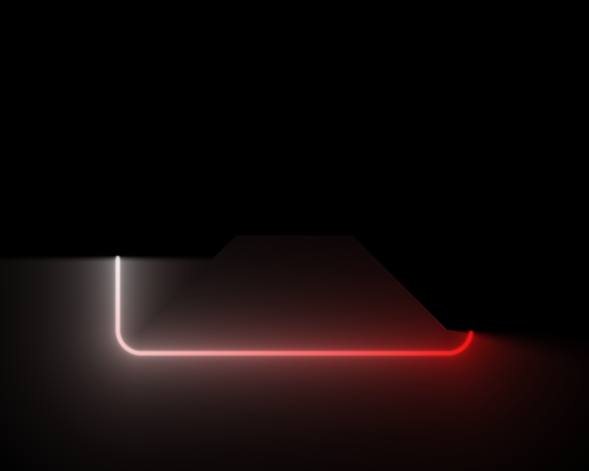

# Review findings

Open defects and rough edges found in a full read of the tree at
`improve_perf_by_emission_prepass` (`bbdba62`), with the visual ones
reproduced offscreen rather than argued from the source.

Items marked FIXED have landed and carry a note on what was changed and how it
was verified; the rest are still open.

Code references here name a **file and symbol**, never a line number. Line
anchors in this document had already drifted twice - once when the fixes below
landed and again when the helpers they added shifted everything under them -
and a wrong line number is worse than none, because it reads as precise. Each fixed item keeps its original
description, so the reasoning that led to the change stays readable next to it.

| | fixed | open |
| - | ----- | ---- |
| visual | V1, V2, V3, V6, V7 | V4, V5 (both closed as documented limitations) |
| implementation | I1, I4, I6, I7 | I2 (declined), I3 (partly), I5 (documented), I8 (audited) |
| second pass | R1, R2, R3, R4, R5, R6 | R7 |
| third pass | V8, I9, I10, I11, I12 (partly) | V9, I12's two stale design docs |

The R items come from a re-read after the V and I fixes landed - see
[Second pass](#second-pass-after-bbdba62). V8 and V9 come from a later read of
`improve_renderer_by_LUT`, the branch that moved the LUTs behind
`BaseLUT` / `GradientRingLUT` / `SpanAtlasLUT` - see
[Third pass](#third-pass-after-7380710). They continue the visual numbering
because both are visual; neither is caused by that refactor.

## How the visual items were reproduced

A throwaway harness linked against `build/lib/libedge-lighting.a`: a hidden
GLFW window, an `OffscreenCapture` at 1000x800, one `SetConfig` / `Update` /
`Render` per case, `CaptureUtil::WritePNG` out. Every case starts from the
same base config:

```
geometry: 600 x 400 at (200, 200), cornerRadius 40, winding CCW (the default)
neon.enable = true, everything else at its Config default
neon.colorTransitionDuration = 0   // no cross-fade, so one frame settles
neon.hueRotationRate = 0           // except where the case is about rotation
```

Two notes for anyone re-running this. `hueRotationRate` defaults to `0.5`, so
leaving it on makes every capture time-dependent and A/B comparisons drift by a
few LSB per frame. And `colorTransitionDuration` defaults above zero, so the
first frame after a colour-stop change still shows the **old** ring - a
single-frame capture of a new gradient is the cross-fade's start, not its end.

Checked and found correct, for the record: stop sorting (unsorted and sorted
inputs render bit-identical), CW/CCW agreement between
`GeometryUtils::GetPointOnRectangle` and the shader's `perimeterPosition`
across all eight perimeter spans, colour-stop alpha gating filament, halo and
bloom together at the right position, `operator==` coverage on every `Config`
sub-struct, `NeonRenderer` vs `NeonOptimizedRenderer` agreement (mean
|diff| 0.16/255, max 7 at `glowRadius` 30), and no beading at
`optimizedNeon.numSamples = 16`.

---

## Visual

### V1. `cornerRadius` is never clamped against the rect's half-extent - FIXED

**Was confirmed.** `cornerRadius` 260 and 500 on a 600x400 rect (valid maximum:
200).

| `cornerRadius` 260 | `cornerRadius` 500 |
| ------------------ | ------------------ |
|  |  |

Three of the four places that consume the radius clamp it and one does not:

| consumer | clamps? |
| -------- | ------- |
| `perimeterPosition` ([`neon.frag` perimeterPosition](../lib/shaders/neon.frag)) | yes, to `min(halfW, halfH)` |
| `peri` (perimeter length, same shader) | yes |
| `GeometryUtils::GetPointOnRectangle` | yes |
| `sdRoundBox(vPos, halfSize, uCornerRadius)` ([`neon.frag` main](../lib/shaders/neon.frag), [`neon-optimized.frag` main](../lib/shaders/neon-optimized.frag), [`black-rect.frag` main](../lib/shaders/black-rect.frag)) | **no** |

Past the half-extent the unclamped SDF stops describing a rounded box - it
becomes a lens with cusps - while the gather samples still sit on the correctly
clamped stadium. So the filament draws the wrong shape *and* the colour ring
smears, because the samples it gathers from are nowhere near the fragments
being lit.

Reachable from the demo in one drag: the Corner Radius slider runs to 1080
([`debug-ui.cpp` buildGeometrySection](../demo/src/debug-ui.cpp)) against a default
800x600 rect.

**Fixed** by `GeometryUtils::EffectiveCornerRadius`
([`geometry-utils.h`](../lib/include/util/geometry-utils.h)), a single clamp to
`[0, min(w, h) / 2]` that every consumer now routes through: the perimeter walk,
the lens-flare sun's offset rect, and all five `uCornerRadius` uploads across
the two neon renderers and the droplets renderer. Clamping at the upload rather
than inside each `main()` keeps one definition shared by CPU and GPU; the
uniform declaration in all four shaders now says so.

`RectGeometry::cornerRadius` is deliberately left alone - it is host data read
back through `GetConfig`, so silently rewriting it would surprise a caller. The
demo's 0-1080 slider likewise stays: any value it produces now renders as the
nearest valid stadium.

Verified: radius 200 (the exact maximum), 260 and 500 on a 600x400 rect all
render bit-identical, and the result is a correct stadium with a sharp filament
and an unsmeared colour ring.

### V2. Abutting arcs render a hard dark notch at every seam - FIXED

**Was confirmed.** Two arcs, `{start 0, length 0.5}` and `{start 0.5, length
0.5}`, each with its own solid colour stops.

| before | after |
| ------ | ----- |
|  |  |

`arcCoverContinuous`
([`neon.frag` arcCoverContinuous](../lib/shaders/neon.frag)) feathers **inward**:
`tailIn` is 0 at `rel = 0` and `headIn` is 0 at `rel = length`. `emitCover`
combines arcs with `max` ([`neon.frag` emitCover loop](../lib/shaders/neon.frag)). At a
shared endpoint that is `max(0, 0) = 0` - not a dip, a hole - and it stays
below full brightness for `TAIL_FEATHER_PX + HEAD_FEATHER_PX` = 28 px. Because
`emitCover` also scales the halo and the bloom, the hole is punched radially
outward as a dark wedge, which is what makes it so visible.

The hue does *not* notch: the pre-pass's `arcInside`
([`neon-emission.frag`](../lib/shaders/neon-emission.frag)) uses an **outward**
feather, so colour crosses the seam smoothly. The two halves of the same arc
disagree by construction.

This is the documented multi-arc recipe, not an exotic case - see the `arcs`
examples in [`config.h` NeonConfig::arcs](../lib/include/core/config.h).

**Fixed**, but not on the first attempt - and the failed attempt is the useful
part of this entry.

A soft union instead of `max` cannot work on its own: at a shared endpoint
*both* inputs are exactly 0, and no operator recovers a signal from `(0, 0)`.
The feather geometry has to change too.

**First attempt (wrong): a straddling feather.** Centre both ramps on their
endpoints so coverage is 0.5 there, and combine with a saturating sum. That
fixes the seam - and breaks single arcs at sharp corners, badly. The
inverse-SDF map is **degenerate** at a `cornerRadius 0` corner: the entire
90-degree exterior wedge has that corner as its nearest perimeter point, so
every fragment in the quadrant shares ONE `sPos`. Coverage is a function of
`sPos` alone, so 0.5 at a corner is painted across the whole quadrant. An arc
starting at `0` on a square rect - the default corner, and the reported case -
lit its entire top-left exterior quadrant at half brightness, bounded by two
hard edges where neighbouring fragments mapped to uncovered perimeter:

> a point 60 px above the corner read `(84, 19, 10)`; the mirrored point 60 px
> past the corner along the top edge read background `(8, 8, 10)`.

**A 7 px bleed in perimeter space is not a 7 px bleed on screen.** That is the
property the original inward feather was really protecting, and why its author
called it hard-won.

**Second attempt (correct): decide the feather direction per endpoint.**

| endpoint | ramp | coverage at the endpoint |
| -------- | ---- | ------------------------ |
| free (no other arc takes over) | INWARD | 0 - nothing outside the span is ever lit |
| abutting another arc | OUTWARD, past the endpoint | 1 - `max` hands over at full brightness |

An abutting endpoint's bleed lands inside a neighbour that is already lit, so
it cannot reach unlit geometry however degenerate the map is there. A free
endpoint keeps the original no-bleed guarantee exactly. The combination goes
back to plain `max` - winner-take-all, as documented for overlap - because the
ramps now reach a full 1.0 at a seam, and because they overlap the handover
stays smooth even when the two arcs carry different intensities.

Abutment is a pure function of the arc set, so it is resolved once per frame in
`PackArcFlags` on the CPU rather than by an O(arcs^2) scan in every fragment.
`uArcs[].w` becomes a 3-bit mask (bit 0 `hasStops`, bit 1 tail abuts, bit 2
head abuts); all three shaders decode it, including the pre-pass, which
previously tested the whole component against 0.5.

Two subtleties in the abutment test, both covered by probes: arcs that merely
*share a start* must not suppress each other's tails (the test requires the
neighbour to cover strictly *before* the start), and an arc ending exactly
where this one ends does not extend past it, so it does not suppress the head.

| before | after |
| ------ | ----- |
|  |  |

The corner case that the straddling attempt broke, now correct - the arc starts
at the corner and the exterior wedge stays dark:


Verified: seams tile flat at equal and unequal intensities; an arc starting at
a sharp corner and one ending at a sharp corner both leave the wedge at exact
background; partial overlap suppresses only the interior boundaries; shared
starts still ramp; a `length = 0.02` arc still reaches full peak; the full-ring
case still short-circuits to 1.0; and base vs optimized agreement is untouched
(mean |diff| 0.161, max 7 - identical throughout).

Known residual, not introduced here: when a seam lands exactly on a sharp
corner and the two arcs have different intensities, the wedge takes the
brighter one, so that quadrant is brighter than the dimmer arc's edge beside
it. That is the same degenerate-corner map as above and it has no fix that
keeps coverage a function of `sPos` - the previous inward-feather code put a
black quadrant there instead, which is worse.

### V3. Arc-local gradients wrap under hue rotation, producing a travelling seam - FIXED

**Was confirmed.** One full-perimeter arc with stops white (head) to red
(tail), `hueRotationRate = 0.5`.

| t = 0 | after ~0.6 s, before | after ~0.6 s, fixed |
| ----- | -------------------- | ------------------- |
|  |  |  |

All three shaders subtract `uTime * uHueRotationRate` from `uArc`
([`neon.frag`](../lib/shaders/neon.frag),
[`neon-optimized.frag`](../lib/shaders/neon-optimized.frag),
[`neon-emission.frag`](../lib/shaders/neon-emission.frag)), but `uArc` is an
**arc-local** coordinate on a head-to-tail gradient, not a cyclic perimeter
coordinate. The arc atlas is `GL_REPEAT` on U
([`neon-renderer.cpp` rebuildArcLUT](../lib/src/renderer/neon-renderer.cpp),
[`neon-optimized-renderer.cpp` rebuildArcLUT](../lib/src/renderer/neon-optimized-renderer.cpp)),
so the scroll eventually wraps and the tail colour butts straight into the head
colour, mid-edge, with no geometric feature to hide it.

Segments do not have this: their atlas is `CLAMP` and their LUT coordinate
carries no time term.

**Fixed** by doing both, because they address different halves:

- The `uTime * uHueRotationRate` term is gone from all three arc-local reads
  (the pre-pass's colour fetch and both main shaders' alpha fetch). There is
  nothing for a rotation to rotate in a head-to-tail coordinate; an arc's
  gradient moves by moving `Arc::start`, or by animating its stops. Segments
  never carried the term, so arcs now match them. The `hasStops = false` path
  is untouched - it reads the base gradient in perimeter space, where the
  rotation is the point.
- The arc atlas is now `CLAMP_TO_EDGE` on U as well as V, matching the segment
  atlas. Its `REPEAT` was justified as "colours cycle around the perimeter",
  but this atlas is only sampled when the arc has its **own** stops, which are
  laid across the arc's span rather than the ring. With the time term gone the
  only out-of-range reads are the few px the straddling feather (V2) extends
  past each end, and `CLAMP` holds the end colour there instead of fetching
  the opposite end's.

Verified: the frame after 0.6 s of rotation is now bit-identical to the frame
at t = 0 - the arc's own gradient is stationary. Base vs optimized agreement
unchanged (mean |diff| 0.161, max 7).

### V4. The interior glow has visible medial-axis creases - DOCUMENTED, NOT FIXED

**Confirmed.** `glowRadius` 60, `bloomStrength` 1.0.


`halo` and `bloom` are closed forms of `ad = abs(d)`
([`neon.frag` halo + bloom](../lib/shaders/neon.frag)). Inside the rect the
rounded-box SDF's *gradient* is discontinuous along the medial axis (the
diagonals from each corner plus the central spine), so both terms inherit a C1
crease there. The gather this replaced summed over perimeter samples and was
smooth; a nearest-distance profile cannot be.

Subtle at the default `glowRadius` 5, unmistakable at 30 and above, and it is
what produces the "mitred picture frame" look in the interior of most captures
in this document.

The trade that bought it - geometry-independent glow width, no beading at any
radius, no sample-spacing floor - is worth keeping, and softening `ad` near the
axis would need a second distance field whose blend would reintroduce exactly
the rect-size dependence the analytic form removed.

**Left as-is, but no longer undocumented**: the halo block in
[`neon-tuning.h`](../lib/include/renderer/neon-tuning.h) now carries a KNOWN
LIMITATION note naming the artifact, where it happens, at what `glowRadius` it
becomes visible, and why it is accepted. The next person to look at a creased
interior will find the answer next to the constants rather than rediscovering
it.

### V5. An arc's lit span is inset, but its colour is not - MOSTLY RESOLVED BY V2

The magnitude comes from `arcCoverContinuous`: pixel-based, read pointwise at
the fragment's own perimeter position. The hue comes from the pre-pass's
`arcInside`: outward feather, one sample wide, quantised to the gather points.
The two halves of the same arc use different feather shapes.

The **inset** half of this is gone with V2: the magnitude feather now straddles
its endpoints instead of sitting inside them, so an arc lights up at `start`
rather than `start + TAIL_FEATHER_PX`, and its hue and its brightness now begin
in the same place.

What remains is that the two feathers scale differently. The magnitude feather
is a fixed pixel span (14 px); the colour feather is one gather sample, which is
`perimeter / NEON_MAX_LOOP_SAMPLES`:

| geometry | perimeter | colour feather | magnitude feather |
| -------- | --------- | -------------- | ----------------- |
| 200x150 r20 | 666 px | 5.2 px | 14 px |
| 600x400 r40 | 1931 px | 15.1 px | 14 px |
| 1920x1080 r40 | 5931 px | 46.3 px | 14 px |
| 2800x2200 r40 | 9931 px | 77.6 px | 14 px |

They happen to agree almost exactly at the mid-size geometry the constants were
tuned on, and diverge either side: on a large rect an arc's colour hands over
across ~46 px while its brightness hands over across 14, so the endpoint reads
as a brightness edge with a much softer colour transition through it.

Not fixed, because closing it means giving the pre-pass the pixel-space feather
(it currently has no `uRectSize`, only perimeter-fraction inputs) and that is a
uniform-plumbing change on the hot path for an effect nobody has reported. Left
here so the next person tuning `HEAD_FEATHER_PX` knows the two are not coupled.

**Amended by [V9](#v9-an-arcs-own-gradient-quantises-to-the-gather-grid-and-the-half-res-default-makes-it-visible---open).**
The sentence above about "an effect nobody has reported" is weaker than it
looked. The same sample-grid quantisation also makes the two neon renderers
disagree by up to 100/255 at arc endpoints whenever an arc carries its own
stops, because `OptimizedNeonConfig::numSamples` defaults to 64 against the base
renderer's 128. That is measured in V9, along with why the obvious fixes are
each worse than they sound.

### V6. The stop sampler was cyclic, but the segment and arc atlases are head-to-tail - FIXED

`ColorUtils::SampleStops` (as it was then named) wraps from the last stop
back to the first
([`color-utils.h` SampleRing](../lib/include/util/color-utils.h)). That is right
for the base ring, which is genuinely circular and sampled `REPEAT`.

`rebuildSegmentLUT` and `rebuildArcLUT` bake the same function over
`t = x / (W - 1)` into a row that the shader samples as a head-to-tail span.
For stops that do not reach both 0 and 1 - say 0.2 and 0.8 - the head of the
span (`t = 0`) lands inside the wrap interval and shows a blend of the *last*
and *first* colours rather than the first stop, and the tail ramps back toward
the head colour instead of holding.

[`config.h` SegmentBoost](../lib/include/core/config.h) calls this layout
"head-to-tail", so the bake has to clamp at the ends.

**Fixed** in [`color-utils.h`](../lib/include/util/color-utils.h) by splitting
the sampler in two and naming both for the data shape they describe:

| function | domain | wrap behaviour | baked into |
| -------- | ------ | -------------- | ---------- |
| `SampleRing` | `NeonConfig::colorStops` - genuinely circular | last stop wraps to first | `GL_REPEAT` texture |
| `SampleSpan` | a per-arc / per-segment row, head-to-tail | holds the end colours | `CLAMP_TO_EDGE` row |

`rebuildSegmentLUT` and `rebuildArcLUT` in both renderers now call `SampleSpan`;
the base ring keeps `SampleRing`, which is correct there and behaviourally
unchanged.

Renaming both mattered as much as adding the second one. The original pair was
`SampleStops` and `SampleStopsClamped` - one unmarked, one marked - which
implies the ring is the normal case and the span is a variant. That is exactly
how the bug arose: `rebuildArcLUT` reached for `SampleStops` because it was
*the* function. Neither is the default, so neither is unmarked now, and a
mismatch is visible at the call site.

A white-to-red gradient authored at stops 0.2 and 0.8, sampled across the row:

| t | cyclic (before) | clamped (after) |
| - | --------------- | --------------- |
| 0.00 | 1.00 0.50 0.50 (pink) | 1.00 1.00 1.00 (white) |
| 0.10 | 1.00 0.75 0.75 | 1.00 1.00 1.00 |
| 0.20 | 1.00 1.00 1.00 | 1.00 1.00 1.00 |
| 0.50 | 1.00 0.50 0.50 | 1.00 0.50 0.50 |
| 0.80 | 1.00 0.00 0.00 (red) | 1.00 0.00 0.00 |
| 0.90 | 1.00 0.25 0.25 | 1.00 0.00 0.00 |
| 1.00 | 1.00 0.50 0.50 (pink) | 1.00 0.00 0.00 (red) |

So the head and the tail both used to come out pink - the authored white and
red only ever appeared 20% in from each end, and the gradient reversed after
0.8.

| before | after |
| ------ | ----- |
|  |  |

Note the midpoint agrees between the two samplers, which is why this is easy to
miss on a quick look - the error lives at the ends, where the emission is
already dimmest.

### V7. Arcs and segments past the caps are dropped silently - FIXED


Twelve arcs authored, eight rendered. `packLightBlocks` did
`std::min(size(), MAX_ARCS)` with no diagnostic on either renderer. The demo UI
enforces `MAX_ARCS_CAP` / `MAX_SEGMENT_BOOSTS_CAP` so it never bit there, but a
library or C-ABI host got no signal at all - not a log line, not a result code.

**Fixed** with a `WarnOnOverflow` helper in both renderers' anonymous
namespaces, called from `packLightBlocks` for arcs and for effective segments:

```
NeonRenderer: 12 arcs configured but only 8 fit - the rest are ignored.
```

The warning latches on a per-renderer flag so it lands once per overflow rather
than once per frame, and the flag clears when the count drops back under the
cap, so a host that overflows, fixes it, then overflows again is told both
times.

Deliberately a warning and not a hard error: truncating is still the documented
behaviour and a host may reasonably not care. Verified against the 12-arc case
- one line, and silence from the other 18 probe cases.

---

## Implementation

### I1. Shader sources contain non-ASCII, against the project's own rule - FIXED

| file | lines with non-ASCII |
| ---- | -------------------- |
| `lib/shaders/neon.frag` | 11 |
| `lib/shaders/neon-optimized.frag` | 10 |
| `lib/shaders/neon-stop-marker.frag` | 3 |
| `lib/shaders/shaders.h.in` | 2 |

All in comments: U+2192 arrows, U+00D7 multiplication signs, a U+2211
summation sign and a U+2026 ellipsis. `AGENTS.md` and `CLAUDE.md` require
ASCII-only shaders precisely because these strings are handed verbatim to the
GLSL ES compiler on Mali / Tizen, where non-ASCII bytes can be rejected even
inside a comment. `neon-emission.frag` and `neon-tuning.h` were clean, so the
rule was being followed unevenly rather than dropped.

**Fixed** in two parts:

- Transliterated to `->`, `x`, `SUM` and `...`. Comments only, so the emitted
  GLSL is otherwise untouched - re-embedded from scratch (`rm -rf
  build/lib/generated`) and re-verified: same link, same pixels.
- Added a configure-time guard in [`lib/CMakeLists.txt`](../lib/CMakeLists.txt)
  that fails with a `FATAL_ERROR` naming the offending file if any shader source
  or `neon-tuning.h` contains a byte outside printable ASCII, tab, CR or LF.

The guard is the more important half. This is not something review catches: an
arrow is invisible next to `->` in a diff, which is exactly how four files
accumulated them. Configure time is the right place because that is when the
sources are read and embedded, so the failure lands on whoever introduced the
character rather than on whoever next builds for a GLES target. Verified by
appending a U+2192 to `neon-blit.frag` and confirming the configure fails with
the file named.

### I2. The emission pre-pass re-bakes unconditionally every frame - DECLINED FOR NOW

The table is a pure function of `(si, uTime, config)` - the pass's own stated
invariant. When `hueRotationRate` is 0 and no animation is attached, `uTime`
does not change the result, yet `renderEmissionPass` still resizes, binds,
uploads two UBOs and draws, in both renderers, every frame.

A dirty flag over (the config fields the pass reads, plus the effective time
term) would skip the pass outright in the static case, which is the common one
for a settled UI.

**Not done, deliberately.** The work being repeated is small in absolute terms:
`Framebuffer::Resize` is already a no-op at an unchanged size, the two UBO
uploads are 144 bytes each, and the draw covers `NEON_MAX_LOOP_SAMPLES * 2` =
256 fragments. Set against the gather it feeds - a multi-million-fragment
full-viewport pass - the saving is structurally negligible, and I did not
measure it, so I am not going to claim a number.

The correctness risk on the other side is real: the cache would have to track
not just the arcs and segments and the time term but every LUT re-bake, since
the pass samples all three atlases. A missed invalidation there shows up as a
frame of stale colour, which is exactly the class of bug that is hard to
attribute later.

Worth revisiting if a profile ever puts the pass on the critical path - the
invalidation inputs are all already tracked by the existing dirty flags, so it
is a contained change when there is evidence for it.

### I3. Registering both neon renderers doubles the CPU-side work - PARTLY FIXED

Each owns its own gradient / segment / arc LUTs, its own three UBOs and its own
128x2 emission FBO, and `OnConfigChanged` bakes both regardless of `enable`. On
top of that `SegmentUtils::FillEffectiveSegments` runs three times per frame
per renderer: once in `OnConfigChanged`, once in `packLightBlocks`, once in
`rebuildSegmentLUT`.

The demo registers both, so this is the default path, not a corner case.

**Partly fixed**: the per-frame half. `packLightBlocks` no longer refills
`mEffectiveSegments` - `OnConfigChanged` already does that on every composited
change, and `Update` runs before `Render`, so on any frame the merged view is
already current. That takes the steady state from three merges per renderer per
frame to zero, and a config-change frame from three to two. The precondition is
now stated on both `packLightBlocks` declarations so the coupling is not
accidental.

Still open: the structural half. Each renderer owns a full private set of LUT
textures, UBOs and an emission FBO, and bakes them regardless of its own
`enable` flag. That follows from the two renderers being near-forks rather than
sharing a base, so it is not a local fix - it is the same underlying issue as
I8.

### I4. `WireframeRenderer` does not follow the conventions the others do - FIXED

Two deviations in [`wireframe-renderer.cpp`](../lib/src/renderer/wireframe-renderer.cpp):

- `OnConfigChanged` re-uploads its VBO on **any** config change, which with an
  animation attached is every frame. The neon renderers gate the equivalent
  rebuild on `geometry` alone.
- `Render` re-enables `GL_BLEND` but never restores `glBlendFunc` to the
  `SRC_ALPHA` convention every other renderer hands back. Harmless only because
  it happens to be registered first.

It also ignores `cornerRadius` entirely, so the debug box is a sharp rectangle
around a rounded one. Defensible for a bounding box; worth a comment saying so.

**Fixed**, all three:

- `OnConfigChanged` gates `buildGeometry` on `config.geometry` alone, matching
  the neon renderers.
- `Render` restores `glBlendFunc(GL_SRC_ALPHA, GL_ONE_MINUS_SRC_ALPHA)` as well
  as re-enabling `GL_BLEND`, so the renderer's correctness no longer depends on
  being registered first.
- `buildGeometry` now says the sharp box is deliberate: it shows the extent the
  config asked for rather than tracing the rounded outline the neon draws.

Verified by counting lit pixels across a resize and a non-geometry change: the
box tracks 200x140 (678 px lit) then 400x300 (1399), and a pure
`neon.intensity` change leaves it at 1399.

### I5. `Framebuffer::GetBoundId()` is a `glGetIntegerv` on the hot path - DOCUMENTED, NOT CHANGED

Called once per frame per multi-pass renderer
([`NeonRenderer::renderEmissionPass`](../lib/src/renderer/neon-renderer.cpp),
[`NeonOptimizedRenderer::Render` + `renderEmissionPass`](../lib/src/renderer/neon-optimized-renderer.cpp),
[`LensFlareOptimizedRenderer::Render`](../lib/src/renderer/lens-flare-optimized-renderer.cpp)).
It is the *correct* fix for the `OffscreenCapture` case and should not be
reverted to `BindDefault`, but a GL state query can sync the driver on a tiler.
Threading the target through `BaseRenderer::Render` would give the same
guarantee with no query.

**Left as-is.** The query-free version is a breaking change to the renderer
plugin API - the `Render` signature on `BaseRenderer`, all six renderers and
both demos - and the cost it removes is one or two queries per frame, never
measured on this project's actual concern (a Mali / Tizen tiler; the machine
here is desktop GL on macOS, where a measurement would not transfer).

Instead the trade is now recorded on `GetBoundId` itself in
[`framebuffer.h`](../lib/include/gl/framebuffer.h): why the query exists, the
explicit warning not to "optimise" it back to `BindDefault` (which silently
breaks frame capture), and what the query-free alternative would cost. That
puts the reasoning where someone tempted to change it will actually read it.

### I6. `AddRenderer` after `Initialize` yields a live, uninitialized renderer - FIXED

[`EdgeLightingEffect::AddRenderer`](../lib/src/core/edge-lighting.cpp) calls
`OnConfigChanged` but never `Initialize`, and `Initialize()` walks the list
exactly once. A renderer registered later has no shaders, and its `Render` runs
with program 0.

**Fixed.** `EdgeLightingEffect` now carries an `mInitialized` flag, set at the
end of `Initialize`. `AddRenderer` initialises a renderer registered after that
point and drops it if that fails - the same contract `Initialize` applies to the
batch. Registration before `Initialize` is unchanged.

`Initialize` is also now documented as safe to call again, and both methods say
what they do with a failure. Verified with an effect that calls `Initialize`
with an empty list, then registers a `NeonRenderer` and renders: it draws (it
previously drew nothing at all, since `OnConfigChanged` bails on an invalid
shader program, so neither the shaders nor the quad geometry ever existed).

### I7. The emission pass's total-failure path leaves the gather reading texture 0 - FIXED

If both the `GL_RGBA16F` and the `GL_RGBA8` `Resize` fail,
`renderEmissionPass` returns early
([`NeonRenderer::renderEmissionPass`](../lib/src/renderer/neon-renderer.cpp)) - but
`Framebuffer::Resize` has already called `destroy()` on the failure path, so
`mEmissionBuffer.BindTexture(3)` in `renderNeonPass` binds 0 and the gather
samples undefined data in core profile.

The comment there said the gather "reads a stale table". There is no stale
table left at that point.

**Fixed** by making `renderEmissionPass` return a `bool` in both renderers and
having `Render` act on it:

- `NeonRenderer` skips `renderNeonPass`, so the frame degrades to the opaque
  fill (which has already landed) instead of to undefined data.
- `NeonOptimizedRenderer` skips both Pass 1 and Pass 2b together, tracked as a
  single `drawNeon`. Skipping only Pass 1 would have left Pass 2b compositing
  whatever the half-res FBO held from an earlier frame, trading undefined data
  for a stale image - no better.

The comments now say what is actually true: `Framebuffer::Resize` destroys the
attachment on its failure path, so there is nothing to fall back on and the
caller has to skip.

This path needs a driver that refuses both `GL_RGBA16F` and `GL_RGBA8` as
colour attachments, so it is a latent hazard rather than an observed one - it
cannot be exercised from the probe harness on this machine.

### I8. `demo/` and `demo-capi/` have drifted apart - AUDITED

My original wording here was too alarming, and the audit corrects it.

**The C ABI has no gaps.** Every `Config` field the C++ demo mutates is
reachable through `el_effect_set_*`. The three that looked missing on a
name-match are covered by bundled setters (`el_effect_set_geometry` for
`cornerRadius` and `height`, `el_effect_set_arc` / `_count` for `arcs`,
`el_effect_set_segment_boost` / `_count` for `segmentBoosts`). The single true
omission is `neon.opaqueOnly`, which `config.h:258` already documents as "Not
exposed through the C API" - a debug-only flag, deliberately left out.

So the guarantee in `CLAUDE.md` holds. What is weaker than it looks is the
**coverage of the guard**: a regression is only caught if `demo-capi` actually
calls the entry point.

Effect surface - 67 setters, 8 with no widget driving them:

| unexercised setter | note |
| ------------------ | ---- |
| `el_effect_set_droplets_band_width` | ABI has it, `demo-capi` has 6 of the 8 droplet controls |
| `el_effect_set_droplets_band_offset` | same |
| `el_effect_set_optimized_lens_flare_renderer_enabled` | whole renderer un-exposed |
| `el_effect_set_optimized_lens_flare_resolution_scale` | same |
| `el_effect_set_preserved_segment` | whole `PreservedSegment` feature un-exposed |
| `el_effect_set_preserved_segment_blend_space` | same |
| `el_effect_set_preserved_segment_color_stop` | same |
| `el_effect_set_preserved_segment_color_stop_count` | same |

Animation and modulator surface - and this is the real hole. Of 55 declared
functions `demo-capi` exercises **16**, all of them lifecycle
(`create` / `destroy` / `play` / `pause` / `speed` / `duration`). Not one of the
20 constructors is called:

- all 13 `el_animation_create_*` presets (`intensity_pulse`, `arc_wipe`,
  `outline_tracer`, `segment_travel`, `field_bound`, ...)
- the entire `el_modulator_*` API - all 7 constructors plus `evaluate`,
  `destroy` and `sequence_append`
- the `field_bound` binding surface (`el_animation_add_*_field`)
- the callback surface (`on_completed` / `on_state_changed`)

`demo/` drives all of this through
[`animation-presets.h`](../demo/src/animation-presets.h). So the animation half
of the C ABI compiles, but nothing proves it *works* from a UI-shaped host -
which is precisely the guarantee the fork exists to provide.

No UI was written (that was the scope decision). If this is worth closing, the
ranking is: the animation constructors and the modulator API first, since that
is a whole subsystem with zero end-to-end coverage; then `PreservedSegment`;
then the four stragglers, which are two sliders and a renderer toggle.

---

## Second pass (after `bbdba62`)

A re-read of the tree at `17745a9`, after the V and I fixes above landed.

Re-checked and confirmed correct, so they need no further attention: the
abutment bitmask (V2) - `PackArcFlags` against the shader's decode, for the
tiling, gap, overlap and shared-endpoint cases, including the `rel -= 1.0`
wrap threshold at `0.5 * (1 + length)`; the ring/span sampler split (V6) at
all six bake sites; the removal of the hue-rotation term from the arc-local
coordinate (V3), which agrees between the pre-pass and the main shader's alpha
read; the `cornerRadius` clamp (V1) at all five upload sites; and fork parity
between `neon.frag` and `neon-optimized.frag`, whose normalised diff shows only
the intended `uResolutionScale` corrections. `PackArcFlags` and
`WarnOnOverflow` are byte-identical between the two renderer translation units.

What follows is what the pass turned up. R1 to R6 have since been fixed, each
keeping its original description so the reasoning stays readable next to the
change. R7 is open.

### R1. `Initialize()` promises a re-entry guarantee it does not implement - FIXED

[`edge-lighting.h`](../lib/include/core/edge-lighting.h) now says:

> Safe to call again after registering more renderers: renderers already
> initialised are skipped.

Nothing skips them. `mInitialized` is a single bool on the *effect*, and
[`Initialize`](../lib/src/core/edge-lighting.cpp) calls `(*it)->Initialize()`
unconditionally on every renderer in the list. A second call recompiles every
shader and reallocates every VAO, VBO, texture, UBO and FBO across all six
renderers. The RAII wrappers make that leak-free, not free, and `BaseRenderer`
has no per-renderer flag to gate on.

The sentence is also redundant: `AddRenderer` self-initialises late
registrations, which is the whole point of the I6 fix. Deleting the claim is
cheaper and more honest than adding the flag. It matters because it is in a
header, which `CLAUDE.md` designates the source of truth.

**Fixed** by correcting the claim rather than adding the flag: the doc now says
to call it once, states what a second call actually costs (every renderer
re-initialised, shaders recompiled, GL objects reallocated - leak-free but not
free), and points at `AddRenderer` for the late-registration case it was
reaching for.

### R2. Two `Framebuffer::Resize` calls are still unchecked - FIXED

I7 fixed exactly this hazard for `mEmissionBuffer` in both neon renderers and
left the two siblings alone:

| site | buffer |
| ---- | ------ |
| [`NeonOptimizedRenderer::renderHalfResNeonPass`](../lib/src/renderer/neon-optimized-renderer.cpp) | `mHalfResBuffer` |
| [`LensFlareOptimizedRenderer::Render`](../lib/src/renderer/lens-flare-optimized-renderer.cpp) | `mScaledBuffer` |

`Resize` calls `destroy()` on its failure path, so `mFbo` is 0; `Bind()` then
binds the *caller's* framebuffer, and the `glClear` that follows is not clipped
by the viewport, so it erases everything already drawn that frame. Under an
`OffscreenCapture` that is the capture target. Same one-line fix I7 used.

**Fixed**, following I7's shape exactly. `renderHalfResNeonPass` now returns
`bool` and bails before `Bind()`; `Render` folds that into the same `drawNeon`
flag pass 0 already feeds, so Pass 2b is skipped with it rather than
compositing a stale half-res frame. `LensFlareOptimizedRenderer::Render`
returns early - at that point it has drawn nothing and changed no state, so the
frame is left exactly as it was handed over.

Like I7 this needs a driver that refuses the allocation, so it stays a latent
hazard closed by inspection rather than one reproduced here.

### R3. The arc and segment atlases re-bake every frame under animation - FIXED

Not the same thing as I2, which is about the emission pre-pass, and the
"structurally negligible" argument there does not carry over.

The gate is a whole-struct compare in both renderers
([`NeonRenderer::OnConfigChanged`](../lib/src/renderer/neon-renderer.cpp),
[`NeonOptimizedRenderer::OnConfigChanged`](../lib/src/renderer/neon-optimized-renderer.cpp)):

```cpp
const bool segLutDirty = mEffectiveSegments != mBakedSegments;
const bool arcLutDirty = config.neon.arcs != mBakedArcs;
```

`Arc::operator==` includes `start`, `length` and `intensity`;
`SegmentBoost::operator==` includes `position`. `ArcWipe`, `OutlineTracer` and
`SegmentTravel` all write those every frame. So every frame runs 1024
`SampleSpan` calls with HSV conversion plus a full `glTexImage2D`, per atlas,
per renderer - while the comment directly above says position, length and
intensity "don't" affect the atlas, which is true and is the point. The gate
should compare a projection of `colorStops` + `blendSpace`, not the whole
struct.

**Fixed** with `IsAtlasDirty` overloads in both renderers: a
positional compare of `colorStops` + `blendSpace` only, which is exactly what
`rebuildArcLUT` / `rebuildSegmentLUT` read. Positional matters - the atlas is
indexed by arc index, so swapping two arcs swaps their rows even though the
collection of stops is unchanged.

Verified with a throwaway harness (same shape as the one at the top of this
document) counting bakes, driving 120 frames of the position/length sweep
`ArcWipe` and `OutlineTracer` perform:

| | before | after |
| - | ------ | ----- |
| arc-atlas bakes over 120 animated frames | 120 | **0** |
| segment-atlas bakes over 120 animated frames | 120 | **0** |
| bakes on a `colorStops` change | 1 | 1 |
| bakes on a `blendSpace` change | 1 | 1 |
| bakes on swapping two arcs | 1 | 1 |

So every genuine invalidation still fires and the per-frame churn is gone. The
five rendered configurations come out **byte-identical** between the old gate
and the new one, which is the check that matters: no stale atlas.

One note for anyone re-running it. An early version of the blend-space case
appeared to show the change having no visual effect. It was the test, not the
gate: it set `blendSpace` after the 120-frame sweep had left both arcs starting
within 0.005 of each other, so the edited arc lost winner-take-all almost
everywhere. Re-run on a single full-perimeter arc, RGB against HSV differs by
mean 6.1 / max 126 per byte.

### R4. LUT quantisation truncates instead of rounding - FIXED

Eighteen sites across the two renderers, all of the form:

```cpp
static_cast<unsigned char>(std::clamp(c.r * 255.0f, 0.0f, 255.0f))
```

No `+ 0.5f`, so every baked texel is biased down by up to 1 LSB and by ~0.5 LSB
on average, in all three LUTs, in both renderers.

**Fixed** with a `ToByte` helper in both renderers, replacing all 18 sites. The
clamp comes after the bias so 1.0 still maps to 255. GL's own float-to-unorm
conversion rounds, so the bake now agrees with the hardware it feeds.

Measured against the truncating build on the stock rect at `glowRadius` 20:
10.01% of output bytes change, every one of them within `-1..+2`. Mostly `+1`,
recovering the truncated LSB; the occasional `+2` and `-1` are that shift
carried through the gather's normalisation and the tone map / gamma grade.

### R5. GL state left modified after a pass - FIXED

- `glClearColor(0, 0, 0, 0)` is set and never restored, in
  [`NeonOptimizedRenderer::renderHalfResNeonPass`](../lib/src/renderer/neon-optimized-renderer.cpp)
  and [`LensFlareOptimizedRenderer::Render`](../lib/src/renderer/lens-flare-optimized-renderer.cpp).
- `renderBlitPass` calls raw `glBindTexture` on whatever texture unit happens
  to be active
  ([`NeonOptimizedRenderer::renderBlitPass`](../lib/src/renderer/neon-optimized-renderer.cpp)),
  leaving the half-res texture bound there, and sets the texture's filter
  directly - so `Framebuffer::mFilter`, the field that exists so a filter change
  forces a reallocation, no longer describes the texture. `CLAUDE.md` also asks
  renderer code to go through the RAII wrappers rather than raw GL.

**Fixed**, both halves:

- Each pass now saves `GL_COLOR_CLEAR_VALUE` and puts it back immediately after
  its `glClear`. That is one more state query per frame per renderer, the same
  cost and the same justification as the `GetBoundId` call discussed in I5:
  this renderer does not own the context it draws into.
- `renderBlitPass` now only calls `BindTexture(0)`. It sets no texture
  parameters at all: the `showHalfRes` filter is requested through
  `Resize` in pass 1, which is the **only** writer of the tracked `mFilter`, so
  the two cannot drift. The stray bind on whatever unit the previous pass left
  active is gone with it.

  **The first attempt at this was wrong and is worth recording.** It added a
  `Framebuffer::SetFilter` that applied the filter and updated `mFilter`,
  reasoning that the tracked value should describe the texture. But `Resize`
  treats a filter mismatch as grounds for reallocation, and
  `renderHalfResNeonPass` calls `Resize(bufW, bufH)` with the default
  `GL_LINEAR` every frame. So `SetFilter(GL_NEAREST)` made the next frame's
  `Resize` see `GL_NEAREST != GL_LINEAR` and destroy and recreate the texture
  and FBO - every frame, for as long as the toggle was on:

  | | before the fix | with `SetFilter` | with `Resize` owning it |
  | - | -------------- | ---------------- | ----------------------- |
  | `showHalfRes` off, 30 frames | 1 allocation | 1 | 1 |
  | `showHalfRes` on, 30 frames | 1 allocation | **30** | 1 |

  That is the same failure `emission-prepass.md` section 5 records for the
  RGBA16F fallback, reintroduced somewhere else. The original stale `mFilter`
  was a latent invariant violation with no observable consequence - the blit
  re-set the filter every frame regardless - and "fixing" it created a real
  per-frame cost. Letting `Resize` own the filter closes both: the invariant
  holds, and a change costs one reallocation on the frame the toggle moves.
  The debug toggle still works (nearest vs bilinear blit differs on 171462
  bytes, max 25).

### R6. Nothing stops both neon renderers being enabled at once - FIXED

The lens-flare pair warns at
[`DebugUI::buildLensFlareSection`](../demo/src/debug-ui.cpp). The neon pair has no
equivalent guard at [`DebugUI::buildOptimizedNeonSection`](../demo/src/debug-ui.cpp), and
`Shift+O` in [`main.cpp`](../demo/src/main.cpp) toggles `optimizedNeon.enable`
without touching `neon.enable`, so the glow draws twice - brighter, with
half-res edges over full-res ones. This is the visible half of I3, whose fix
addressed the CPU-work half.

**Fixed** by mirroring the lens-flare precedent rather than inventing a new
one: a `BothNeonPathsWarning` helper, shown in **both** the Neon and Optimized
Neon sections, since the two checkboxes sit in separate collapsing headers and
either is where the user might be looking. Added to `demo/` and to its
`demo-capi/` counterpart, as `CLAUDE.md` requires for a UI change.

Deliberately a warning, not enforced exclusivity: that is what the lens-flare
pair does, and forcing the flag would take a documented-but-legal
configuration away from a host. `Shift+O` still toggles `optimizedNeon.enable`
on its own for the same reason - the warning is visible in the debug window the
moment it does. Making the hotkey swap the two instead is a one-line change if
that is preferred.

### R7. The halo and bloom band into 8-bit contours - OPEN

Both wide layers are smooth, very low-slope gradients - the bloom falls as
`1/D` - so over most of their reach they cross an 8-bit quantisation step only
every several pixels. The output is therefore a series of constant-value
plateaus separated by 1 LSB, which is the classic recipe for concentric contour
rings around the rect.

Measured with a scanline harness: 200x150 rect centred in a 1000x800 capture,
sampling the peak channel along the rect's centre row from just outside the
right edge outward (398 px). "Far half" is the outer 199 px, where the falloff
is flattest and plateaus are widest.

| config | levels / 398 px | mean plateau | widest plateau | far-half levels |
| ------ | --------------- | ------------ | -------------- | --------------- |
| `glowRadius` 5 (default) | 140 | 2.8 px | 14 px | 21 |
| `glowRadius` 30 | 115 | 3.5 px | 9 px | 29 |
| `glowRadius` 60, `bloomStrength` 2 | 64 | 6.2 px | **24 px** | 16 |

A 24 px band of one constant value, bounded by a 1 LSB step, is a contour ring
by any definition. Re-running with a temporary 1 LSB interleaved-gradient-noise
dither added just before the write confirms both the diagnosis and the cure:

| config | levels / 398 px | mean plateau | widest plateau | far-half levels |
| ------ | --------------- | ------------ | -------------- | --------------- |
| `glowRadius` 5 + dither | 140 -> **244** | 2.8 -> **1.6 px** | 14 -> 10 px | 21 -> **111** |
| `glowRadius` 30 + dither | 115 -> **226** | 3.5 -> **1.8 px** | 9 -> 8 px | 29 -> **108** |
| `glowRadius` 60 b2 + dither | 64 -> **202** | 6.2 -> **2.0 px** | 24 -> **10 px** | 16 -> **92** |

**Honest limit on this finding.** The plateaus are measured, not disputed - but
I did not confirm the rings are *objectionable* by eye at the default settings,
and there is a reason to think they are mild there. The configuration with the
widest plateaus (`glowRadius` 60, `bloomStrength` 2) is also the one whose
bloom fills the frame at values 164-229, where a 1 LSB step is under 1% of the
local level and least visible. The perceptually dangerous case is the opposite
one - the dark tail, where 1 LSB against a value of 7 is a 14% step - and there
the plateaus are 14 px at default `glowRadius`. No image is attached because a
1 LSB step does not survive being looked at in a scaled document view; the
plateau statistics are the evidence.

So: a real quantisation defect with a known, cheap cure, of unproven visual
severity. Worth doing when someone is in the shader anyway; not worth a
dedicated pass on this evidence alone.

**If it is taken on, one design note that the measurement already settled.**
The full-res path is three lines before the premultiplied write in `neon.frag`.
The half-res path is not the same change: in the table above the half-res
renderer's row does not move at all when the dither is added to `neon.frag`
only, and adding it to `neon-optimized.frag` instead would put the noise in the
half-res FBO, where the blit's bilinear upscale averages it back down and the
final full-res write re-quantises with no dither at all. For
`NeonOptimizedRenderer` the dither belongs in `neon-blit.frag`, at the actual
final write.

Note also that a 1 LSB dither everywhere would put every future frame-diff
comparison at a 1 LSB noise floor - including the methodology
`emission-prepass-comparison.md` uses, whose headline correctness result is
"max delta 1 LSB". Interleaved gradient noise is a pure function of
`gl_FragCoord` with no time term, so captures stay reproducible frame to frame,
but a dithered build and an undithered one are no longer comparable at that
precision.

**History**, since it explains why this is not already recorded: a working
implementation of exactly this existed in the working tree before the pull that
brought `17745a9` in, as an `OUTPUT_DITHER_LSB` constant in `neon-tuning.h`
plus the shader blocks. It is not in the tree now. Whether that was deliberate
or lost is not something I can tell from here, so nothing has been re-applied.

---

## Third pass (after `7380710`)

A read of the tree at `7380710`, on `improve_renderer_by_LUT` - the branch that
moved all three LUTs behind `BaseLUT` / `GradientRingLUT` / `SpanAtlasLUT<T>`.

**The LUT refactor is behaviourally clean**, which is worth recording because it
is the bulk of the branch. Checked against the pre-refactor semantics and found
equivalent: the renderer is bit-stationary frame to frame with
`hueRotationRate` 0 and no config change; the cross-fade lands exactly on its
duration boundary (frame 60 of a 1.0 s fade at 60 fps) and settles
bit-identical to a `colorTransitionDuration = 0` reference; the atlas dirty
check still fires on every genuine invalidation; and base vs optimized
agreement is unchanged at mean 0.110 / max 7. `SpanAtlasLUT::isDirty` is a
strict improvement on the `IsAtlasDirty` free functions it replaced, because it
caps both sides at `maxRows` - editing a 9th arc when 8 fit is correctly no
longer a re-bake.

What the pass turned up splits in two.

The **visual** items, V8 and V9, are about the per-arc gradient atlas rather
than the refactor: V8 predates it and V9 is a consequence of a default. V8 is
fixed; V9 is open.

The **implementation** items, I9 to I12, are all in the new wrapper layer. None
of them changes a pixel in any configuration the renderers actually produce -
every capture in this document is byte-identical across them - which is exactly
why they are worth recording: each is a gap between what the new classes claim
and what they do, and the claims are in headers, which `CLAUDE.md` designates
the source of truth. They were found by reading the abstraction against its own
doc comments, not by looking at output.

One methodology note before re-running anything here. `OffscreenCapture::Begin`
deliberately does **not** clear, so a harness that omits its own `glClear`
accumulates every frame it draws and shows a smooth decaying frame-to-frame
delta that looks exactly like a settling animation. It is not one. The first
version of this pass's harness had that bug and briefly "found" a 200-frame
settling transient in a renderer that is in fact bit-stationary.

### V8. An arc's own gradient does not wrap at the perimeter seam - FIXED

**Was confirmed.** One arc, `{start 0.8, length 0.4}`, white head to red tail.
The reference is the same arc at `{start 0.1, length 0.4}`, which does not
cross the seam.

| reference (no wrap) | before | after |
| ------------------- | ------ | ----- |
|  |  |  |

`Arc::start` is documented as `[0, 1)` and `Arc::length` as a fraction of the
perimeter ([`config.h` Arc](../lib/include/core/config.h)), so an arc whose span
runs past 1.0 and back through 0.0 is an ordinary configuration, not an abuse.
Coverage already knew that: `arcCoverContinuous`
([`neon.frag` arcCoverContinuous](../lib/shaders/neon.frag)) wraps its own
`rel` with `rel -= floor(rel)`, and the pre-pass's `arcInside`
([`neon-emission.frag` arcInside](../lib/shaders/neon-emission.frag)) covers the
same case by testing `si` and `si + 1.0` against the unwrapped span. So a
straddling arc lit up correctly over its whole length.

The arc-LUT coordinate did not wrap. All three reads recomputed a raw
difference and threw the wrap away:

```glsl
float uArc = (sPos - arc.x) / max(arc.y, 1e-4);
```

| site | what it feeds |
| ---- | ------------- |
| [`neon.frag` emitCover loop](../lib/shaders/neon.frag) | the arc's colour-stop ALPHA |
| [`neon-optimized.frag` emitCover loop](../lib/shaders/neon-optimized.frag) | the same, half-res fork |
| [`neon-emission.frag` main](../lib/shaders/neon-emission.frag) | the winning arc's COLOUR |

Past the seam `uArc` goes negative, and the atlas is `CLAMP_TO_EDGE` on U (as
V6 and V3 between them established it must be), so the entire wrapped remainder
pinned to texel 0 - the arc's **head** colour and head alpha. The arc stayed
lit over its full span and simply stopped advancing through its own gradient
partway along, with no geometric feature at the transition.

Segments never had this: the pre-pass's segment loop wraps with
`rel -= floor(rel + 0.5)` two dozen lines below the arc read that does not.

**This is on the default animation path, not a corner case.**
`ArcWipe::ApplyAt` ([`neon-animations.h` ArcWipe](../lib/include/animation/neon-animations.h))
ends by folding `arcStart` back into `[0, 1)`, with the comment:

> the shader's `arcInside` handles the wrap-around at start+length, but the raw
> arcStart itself must live in `[0, 1)`

which is true of coverage and false of the LUT coordinate. Any `ArcWipe` or
`OutlineTracer` driving an arc that carries its own stops therefore spends part
of every cycle mis-coloured. It is also reachable in one drag of the demo's own
controls, where Start and Len are independent 0-1 sliders
([`debug-ui.cpp` DrawArcRow](../demo/src/debug-ui.cpp)).

**Fixed** by wrapping the LUT coordinate with the same expression
`arcCoverContinuous` already uses for its own `rel`, at all three sites:

```glsl
float rel = sPos - arc.x;
rel       -= floor(rel);                       // wrap to [0, 1)
if (rel > 0.5 * (1.0 + arc.y)) { rel -= 1.0; } // behind the start, not past the head
float uArc = rel / max(arc.y, 1e-4);
```

The midpoint split is the half that is easy to drop, and dropping it trades one
bug for another. An outward tail feather reaches BEHIND the arc's start (that is
V2's fix), and those fragments want a small NEGATIVE `rel`, clamping to the head
colour. A plain `floor` wrap sends them to `rel` near 1.0 instead, which clamps
to the **tail** colour - so the ~14 px band behind every abutting seam would
have flipped from the head colour to the tail colour. Splitting the gap at
`0.5 * (1 + length)`, exactly as the coverage feather does, keeps that band
negative while still wrapping the far side. Using the same threshold as
coverage is also what stops the two drifting apart later.

The split is applied unconditionally rather than gated on `tailAbuts` as it is
inside `arcCoverContinuous`. It has to be, because the pre-pass does not decode
the abutment bits at all, and the standing invariant on this read is that the
consumer's alpha and the pre-pass's colour must come from the SAME texel of the
same row. Gating on one side only would break that. The unconditional form is
harmless where the gate would have been off: `emitCover` skips an arc at
`c <= 0.0` before reaching the LUT read, and the pre-pass leaves `bestIdx` at
-1, so a fragment behind an inward tail never performs this fetch.

**Verified** on a SQUARE rect, where `start` values 0.25 apart are the same
picture rotated by 90 degrees and total luminance must therefore match across
them. Only `start 0.80` straddles the seam at `length 0.40`:

| start | colour ramp, before | colour ramp, after | alpha ramp, before | alpha ramp, after |
| ----- | ------------------- | ------------------ | ------------------ | ----------------- |
| 0.05 | 0.00% | 0.00% | 0.00% | 0.00% |
| 0.30 | +0.03% | +0.03% | +0.02% | +0.02% |
| 0.55 | +0.03% | +0.03% | +0.03% | +0.03% |
| **0.80 (wraps)** | **+35.51%** | **+0.00%** | **+47.67%** | **+0.01%** |

So the straddling arc now agrees with its own rotations to within the 0.03%
spread the non-straddling ones show among themselves. The half-res renderer
moves with it: +47.60% before, +0.03% after.

Also verified: every non-wrapping capture in this document's harness comes back
**byte-identical** to the pre-fix build, so the change is a strict no-op unless
an arc actually crosses the seam; V2's abutting seams still tile flat (peak
filament along 200 perimeter samples dips at most 2.3%, and at t = 0.170 rather
than at either seam, matching the 2.5% the no-stops control shows); and base vs
optimized agreement is unchanged.

### V9. An arc's own gradient quantises to the gather grid, and the half-res default makes it visible - OPEN

**Confirmed.** The two neon renderers agree everywhere at max 7 - except when
arcs carry their own colour stops, where they diverge by up to 100/255 in tight
clusters at each arc's gradient endpoints. Sweeping
`OptimizedNeonConfig::numSamples` isolates the cause exactly:

| config | mean | max | px with diff >= 30 |
| ------ | ---- | --- | ------------------ |
| 2 arcs, own stops, `numSamples` 64 (**the default**) | 0.677 | **100** | 389 |
| 2 arcs, own stops, `numSamples` 96 | 0.441 | 38 | 32 |
| 2 arcs, own stops, `numSamples` 128 | 0.359 | 10 | 0 |
| 2 arcs, no own stops, `numSamples` 64 | 0.337 | 7 | 0 |
| 2 arcs, no own stops, `numSamples` 128 | 0.331 | 7 | 0 |

The pre-pass evaluates the arc-local coordinate at the gather samples -
`si = floor(gl_FragCoord.x) * invNumSamples`, then `uArc = rel / length` - so an
arc's own gradient is resolved to `numSamples * length` distinct levels rather
than the atlas row's full width. `NeonRenderer` always walks
`NEON_MAX_LOOP_SAMPLES` = 128; `OptimizedNeonConfig::numSamples`
([`config.h` OptimizedNeonConfig](../lib/include/core/config.h)) defaults to 64.
At `length 0.5` that is 32 levels across a 128-texel row.

It shows at the endpoints rather than mid-span because that is where the gather
has fewest contributing samples to average across, so the quantisation is not
smoothed by neighbours. The clusters sit exactly on the arc endpoints: a single
full-perimeter arc with its own stops produces one cluster at its head/tail
junction, and two abutting arcs produce one at each seam.

This is the same mechanism V5 records, seen from the other side. V5 framed it as
the arc's colour feather and its magnitude feather scaling differently, and
closed it as a residual on the grounds that nobody had reported an effect. The
sweep above shows it also produces a hard disagreement between the two
renderers, which the parity check in the second pass did not catch because its
cases used arcs WITHOUT their own stops - exactly the row of the table that
reads max 7 at every sample count. **V5's entry should be read with this
alongside it**: the two feathers are not merely uncoupled, the colour one also
loses resolution against the half-res renderer's default.

**Not fixed**, and the options are not equally good:

- Raising the `numSamples` default to 128 closes the divergence but discards the
  knob's whole purpose - it is the optimized renderer's main performance dial,
  and 64 was presumably chosen deliberately.
- Evaluating the arc-local coordinate pointwise instead of at the samples is
  the correct fix, but that is what the emission pre-pass exists to avoid: the
  invariant stated at the top of `neon-emission.frag` is that a pure function of
  `(si, uTime, config)` belongs in the pre-pass. Moving the arc colour out of it
  would put a per-fragment LUT fetch and winner search back on the hot path, at
  which point the pre-pass has given up most of what it bought.
- Interpolating between adjacent samples' arc colours in the consumer would
  recover most of the resolution for one extra texelFetch, without moving
  anything back. This looks like the right trade, but it changes the gather's
  arithmetic and would want measuring against `emission-prepass-comparison.md`'s
  numbers before it lands.

Left open with the mechanism recorded, because the third option is a real design
decision rather than a patch, and because the visible symptom is confined to a
few hundred pixels at arc endpoints in a configuration (per-arc stops on the
half-res path) that may well have no user today.

### I9. `BaseLUT`'s public surface does not describe what it owns - FIXED

Four things, all in [`base-lut.h`](../lib/include/renderer/base-lut.h), and they
share a root: the class documents invariants it does not actually hold.

**`IsValid()` was true before anything was baked.** It forwarded straight to
`Texture2D::IsValid`, which is `mId != 0` - and `Texture`'s constructor calls
`glGenTextures`, so the name exists from the moment a LUT is *constructed*. A
caller asking "is there anything here worth sampling" got yes while the texture
had no image at all, which in core profile samples as undefined data rather
than failing loudly. The class even documented the real signal two screens
below, as a subclass member.

**Both subclasses tracked that signal privately, in duplicate.**
`GradientRingLUT::mHasBaked` gated snap-versus-fade; `SpanAtlasLUT::mHasBaked`
made a never-baked atlas dirty by definition. Those are the same event - "has
`Upload` run" - held in two places, in the two classes whose common ground
`BaseLUT` exists to be.

**`GetId()` had no stated purpose**, which in a class whose whole design is
"the texture is a derived value, callers may only `Bind`" reads like an
accidental leak of the handle. It is not: it is the way a baked LUT is read
back through `CaptureUtil::ReadTexture2D`, which
[`capture-util.h`](../lib/include/util/capture-util.h) names LUT dumps as its
reason for existing. Nothing in the tree calls it, so the intent was recoverable
only by reading the other header.

**Two claims in the class comment were false.**

| claim | reality |
| ----- | ------- |
| RGBA8 is "asserted once, in `Upload`" | there is no assert, and nothing to assert - `Upload` is the single call site and passes the format literally, so a LUT cannot ask for anything else |
| "no virtuals to pay for" | `Texture` has a virtual destructor, so the `Texture2D` member drags in a vptr: `sizeof(Texture2D)` is 16 for a 4-byte handle, and `std::is_polymorphic<Texture2D>` is true |

**Fixed** by hoisting the flag and correcting the claims. `mUploaded` now lives
in `BaseLUT`, set by `Upload`; `IsValid()` is `mTexture.IsValid() && mUploaded`;
subclasses read `HasUploaded()` and both `mHasBaked` members are gone. `GetId()`
carries its readback purpose. The RGBA8 note says the format is fixed at the
single call site rather than asserted.

The polymorphism note is the one that stayed a note rather than a change. The
"deliberately NOT polymorphic" half is true of `BaseLUT` itself
(`std::is_polymorphic<BaseLUT>` is false, and the protected non-virtual
destructor does turn polymorphic deletion into a compile error). What is false
is that it costs nothing, and the cost comes from a member whose base is a
shared GL wrapper used well outside the LUTs. Nothing in the tree deletes
through a `Texture *`, so that virtual is currently unearned - but removing it
is a change to `gl/texture.h` with a blast radius across the droplets and
lens-flare image textures, and it is not this class's call to make. The comment
now says so, including the measurement, so the next person who reads "no
virtuals" does not have to re-derive that it is wrong.

### I10. A LUT bake silently steals texture unit 0 - FIXED

`BaseLUT::Upload` calls `Texture2D::SetData` and `SetParams`, and both begin
with `Bind()`, which is `glActiveTexture(GL_TEXTURE0)` followed by
`glBindTexture`. So every bake overwrote whatever was bound to unit 0 and left
unit 0 active, with nothing in the signature or the doc comment saying so.

Nothing observes it today. Bakes run from `OnConfigChanged` and from
`GradientRingLUT::Tick` in `Update`, never between a pass's texture binds and
its draw, and the neon passes rebind units 0 to 2 immediately before drawing
anyway. That is a property of the current call sites, not of the class - and
the entire point of moving the upload behind a wrapper is that a caller should
not have to know it.

This is the same defect R5 removed from `renderBlitPass`, where a raw
`glBindTexture` on "whatever unit the previous pass left active" was deleted
rather than documented. It came back in a new place because the upload genuinely
has to bind something.

**Fixed** by making `Upload` leave texture-unit state as it found it: save
`GL_ACTIVE_TEXTURE`, activate unit 0 and save its `GL_TEXTURE_BINDING_2D`, do
the upload, then restore both. Two state queries, on a path that only runs when
a bake is actually dirty - a strictly cheaper version of the trade R5 already
accepted for the clear colour, which pays a query every frame.

### I11. `SpanAtlasLUT::Bake` does not guard its dimensions - FIXED

`GradientRingLUT::Bake` opens with `size = std::max(size, 4)` and says why:
a guard against a nonsense value reaching `glTexImage2D`. `SpanAtlasLUT::Bake`
clamped nothing, though its row walk divides by `width - 1`:

```cpp
float t = static_cast<float>(x) / static_cast<float>(width - 1);
```

At `width == 1` that is `0 / 0`. It does not crash and it does not produce a
visibly broken texture - the NaN propagates into `ColorUtils::SampleSpan`, where
every ordered comparison against it is false, so the walk falls out of its loop
and returns the **last** stop. A one-texel row therefore bakes the arc's tail
colour where its head belongs, silently. Measured on a red-to-blue span: the
row came back `(0, 0, 255)` where `(255, 0, 0)` was authored. At `width <= 0`
the atlas buffer is empty and `glTexImage2D` gets a zero-sized image.

Latent today, because both call sites pass a compile-time constant of 128. It
is recorded as a real defect rather than a hypothetical one because
`OptimizedNeonConfig::gradientLutSize` is proof that these widths do become
host-settable, and because the sibling class already guards - an asymmetry
between two classes in the same layer is exactly the kind of thing that gets
copied in the wrong direction later.

**Fixed** with `width = std::max(width, 2)` and `maxRows = std::max(maxRows, 1)`,
mirroring the ring's guard and its rationale. The clamp runs BEFORE the dirty
check, so the snapshot `isDirty` compares against always describes the texture
that was actually uploaded rather than the arguments that were asked for -
otherwise a caller repeatedly passing `width = 1` would re-bake every frame,
because the stored `mBakedWidth` (2) would never match the request.

### I12. Comments still name the functions the LUT refactor removed - PARTLY FIXED

The refactor deleted `rebuildGradientLUT`, `rebuildSegmentLUT`, `rebuildArcLUT`,
`uploadGradientLUT`, `IsAtlasDirty`, `mBakedArcs` and `mBakedSegments`. Several
comments and documents still referred to them by name.

The one that mattered is in [`neon.frag`](../lib/shaders/neon.frag), on the
`uArcLUT` declaration, because it is the comment that explains why non-winning
atlas rows cannot be left stale:

> `rebuildArcLUT` zero-fills the whole atlas on every bake, which is what
> currently keeps that true.

A reader who goes looking for `rebuildArcLUT` to check that guarantee finds
nothing. **Fixed**: it now names `SpanAtlasLUT::Bake` and points at the specific
line that carries the guarantee (`mAtlas.assign`, deliberately not `resize`,
which would leave a shrunken atlas's tail in place).

Deliberately left: the `arcs != mBakedArcs` mention in
[`span-atlas-lut.h`](../lib/include/renderer/span-atlas-lut.h), which is
explicitly past tense - it records what the old gate did and why the new one is
narrower, the same way the fixed items in this document keep their original
descriptions.

**Still open**, and not touched here because they are prose rather than code
comments:

| file | stale reference |
| ---- | --------------- |
| [`architecture-design.md`](architecture-design.md) | `if (lutDirty) { rebuildGradientLUT(config); }` in the `OnConfigChanged` pseudo-code |
| [`multiple-arcs-design.md`](multiple-arcs-design.md) | `mBakedArcs` and `rebuildArcLUT` in the design sketch and the file-by-file change list |

`architecture-design.md` is already flagged in `CLAUDE.md` as predating the
droplets and lens-flare renderers, and `multiple-arcs-design.md` is a design
document describing an implementation as it was proposed, so neither is quite
the same class of problem as a wrong comment sitting next to live code.
`neon-renderer-reference.html` was updated with the refactor and correctly
describes `GradientRingLUT`.

### How the implementation items were verified

Unlike the visual items, these do not show up in a capture. A separate check
harness exercises the wrapper classes directly - construct, bake, inspect GL
state - and each check was run against both the pre-fix and post-fix headers to
confirm it actually discriminates:

| check | pre-fix | post-fix |
| ----- | ------- | -------- |
| fresh `GradientRingLUT`: `GetId() != 0` | pass | pass |
| fresh `GradientRingLUT`: `IsValid() == false` | **fail** | pass |
| after `Bake`: `IsValid() == true` | pass | pass |
| fresh `SpanAtlasLUT`: `IsValid() == false` | **fail** | pass |
| after `Bake`: `IsValid() == true` | pass | pass |
| active unit unchanged across a bake | **fail** | pass |
| unit 0's binding unchanged across a bake | **fail** | pass |
| `width = 1` still yields a valid texture | pass | pass |
| readback at the clamped 2 x 8 succeeds | pass | pass |
| `width = 1` row 0 holds the HEAD colour | **fail** `(0,0,255)` | pass `(255,0,0)` |
| `width = 0`, `maxRows = 0` survives | pass | pass |
| guarded re-`Bake` with identical inputs is a no-op | pass | pass |
| moving `Arc::start` does not dirty the atlas | pass | pass |

Five of thirteen fail before the fixes and all pass after. The `width = 1` row is
read back through `GetId()` and `CaptureUtil::ReadTexture2D`, which exercises
I9's documented readback path at the same time.

Alongside that, every pixel measurement in this document was re-run and is
unchanged to the byte: stationarity 0.0000, fade settling bit-identical to the
no-fade reference, base vs optimized 0.1101 / max 7, V8's wrapping arc within
0.03%, and the abutting seams still flat at a 2.3% worst dip away from either
seam. That is the result these items want: a wrapper layer that now says true
things about itself, and an output nobody can tell apart.

---

## What is left

The second pass's R1 to R6 have all landed, and so have the third pass's V8,
I9, I10 and I11. Six items from the first pass remain deliberately open, each
with the reasoning recorded next to the code rather than only here, plus R7 from
the second pass and V9 and I12's remainder from the third:

| item | state | why |
| ---- | ----- | --- |
| V4 | documented limitation | closing it needs a second distance field, which reintroduces the rect-size dependence the analytic profile removed |
| V5 | residual, documented | closing it means plumbing pixel-space feathers into the pre-pass for an effect nobody has reported; read V9 alongside it, which measures the other half of the same mechanism |
| I2 | declined | negligible measured-by-structure win against a real staleness-bug risk |
| I3 | structural half open | follows from the two neon renderers being near-forks; same root as I8 |
| I5 | documented | the alternative is a breaking renderer-API change for an unmeasured cost |
| I8 | audited, no UI written | the C ABI itself is complete; what is missing is `demo-capi` coverage, ranked in the section above |
| R7 | open | a measured quantisation defect with a cheap cure, but unproven visual severity; see the note there before starting |
| V9 | open | the honest fix is a design decision (interpolate the arc colour between adjacent samples in the consumer), not a patch; the three options are ranked in the section |
| I12 | partly fixed | the live shader comment is corrected; `architecture-design.md` and `multiple-arcs-design.md` still name the removed LUT functions, and both are design prose rather than comments beside live code |

One item that is deliberately NOT on this list, so nobody adds it: `Texture`'s
virtual destructor, measured in I9. It costs every LUT a vptr for a dispatch
nothing uses, but it lives in a shared GL wrapper with a blast radius well
outside the LUTs. It is recorded at the point where someone would trip over it
rather than tracked as a defect here.

If any of these comes back, the fastest way to reproduce a VISUAL item is the
harness described at the top of this document - the configs for every case are
given inline with each finding. The implementation items in the third pass need
a different harness, described in
[How the implementation items were verified](#how-the-implementation-items-were-verified):
it drives the wrapper classes directly and reads GL state back, because none of
those items changes a pixel.
